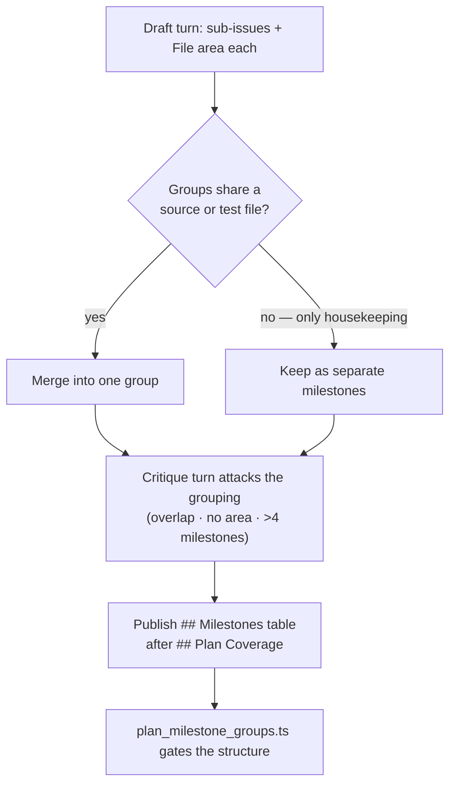

# Teach the planning prompts file-area grouping and the `## Milestones` table

## Summary

The structural gate for the `## Milestones` table landed with #2172, but nothing
told a planner to publish one. This change teaches both planning prompts the
grouping rule the gate reads back. Closes #2174.

- **`prompts/planning/prompt.md`** — a new "Group sub-issues by file area"
  section after "Dependencies between sub-issues": every sub-issue body carries
  a `File area:` line in its `## Context`; groups sharing only housekeeping
  files (`deno.json`, `Cargo.toml`, `*.lock`, `CHANGELOG.md`, `README.md`, plus
  at most one further file named with a reason) split into separate milestones;
  groups sharing a source or test file merge, and an all-merge plan is the
  single milestone of today; shared work becomes a foundation group its
  dependants `Depends on:`; at most 4 milestones, with a group of one written
  `—` and not counted; and the whole split is skipped when the parent already
  owns a milestone. The draft now ends with a `## Milestones` grouping, and two
  worked `<example>`s show the infra/lambdas/PWA split that shares only
  `deno.json` and the two groups that both edit one lambda file and merge.
- **`prompts/planning_critique/prompt.md`** — the Step 1 attack list gains
  **File overlap**, and Step 3 publishes the surviving grouping as a
  `| Milestone | File area | Sub-issues |` table immediately after
  `## Plan Coverage`, with `—` rows for single-sub-issue groups. Milestone
  creation stays with the worker, so `--milestone` is still passed only on the
  inheritance path.
- **`docs/workflows/planning-and-questions.md`** — a new subsection beside
  "Auto-milestone for multi-issue plans" documenting the rule, the housekeeping
  list and the table, and stating plainly that per-group milestone creation is
  **#2175**: today the worker gates the table and still creates the legacy
  single milestone.

No change to `worker/deno/lib/prompt_builder.ts` — the rule is static template
text, keeping clear of #2101. The two edits to `plan_milestone_groups.ts` and
`planning_processor.ts` are comment-only: they said the gate "lands before the
prompts teach the table", which this change falsifies.

## Evidence

Backend/prompt-only change with no web interface to screenshot. The evidence is
the test suite plus the full quality gate:

- `deno test worker/deno/tests/planning_multi_milestone_prompts_test.ts` — 8
  passed, 0 failed. It builds the real prompts through `buildPlanningPrompt()`
  and `buildPlanningCritiquePrompt()` and asserts on the built text, and its
  last test feeds **every** `## Milestones` table the publish prompt teaches to
  the real `extractMilestoneGroups()` / `validateMilestoneGroups()` pair, with a
  negative control proving the validator is live on those groups.
- `deno test worker/deno/tests/planning_processor_test.ts
  tests/plan_milestone_groups_test.ts tests/planning_coverage_prompts_test.ts` —
  183 passed, 0 failed: the sibling gates and the coverage-table prompt tests are
  unaffected.
- `./quality.sh` — PASSED (one skipped check, `config integration`, which needs
  operator config), including `deno fmt`, `deno lint`, `deno check`,
  markdownlint, mermaid and semgrep.

## Acceptance Criteria

<!-- vibe-spec-review inputs="diff+issue-body" -->

- **met** — `buildPlanningPrompt()` output names the five housekeeping files,
  the merge-on-overlap rule, the foundation-group rule and the cap of 4 —
  evidence: `prompts/planning/prompt.md` grouping section, asserted through the
  built prompt by
  `worker/deno/tests/planning_multi_milestone_prompts_test.ts::planning - the draft turn is told which files are housekeeping`
  and `::planning - the draft turn merges overlapping groups and caps the plan at four milestones`
  — reviewer: met
- **met** — `buildPlanningCritiquePrompt()` output instructs a `## Milestones`
  table after `## Plan Coverage`, and its example table round-trips through the
  real parser and validator — evidence:
  `worker/deno/tests/planning_multi_milestone_prompts_test.ts::planning_critique - the publish turn posts a Milestones table after the coverage table`
  and `::planning_critique - every example Milestones table it teaches passes the real gate`
  — reviewer: met
- **met** — neither prompt tells the model to pass `--milestone` when the parent
  has no milestone — evidence: `prompts/planning_critique/prompt.md` keeps
  "Omit `--milestone` only when no milestone instructions appear above", guarded
  by `::planning_critique - \`--milestone\` is still passed only when the parent owns a milestone`;
  the draft prompt runs no `gh issue create` at all — reviewer: met
- **met** — `docs/workflows/planning-and-questions.md` documents the rule;
  `deno test`, `deno lint`, `deno fmt --check` pass — evidence: the new
  "Grouping sub-issues by file area (Issue #2174)" subsection, and `./quality.sh`
  PASSED after the final edit — reviewer: partial — reason: the reviewer read
  the first draft, where the docs said the worker "creates and assigns those
  milestones after publish" although that is #2175; the docs now state the
  interim behaviour explicitly and the checks were run here.
- **unrequested** — the `File area:` line was added to the **critique** prompt's
  sub-issue body template as well as the draft's — reviewer: unrequested —
  reason: the publish turn writes the bodies that actually reach GitHub, so
  without it the rule the issue asks for never survives publication.
- **unrequested** — consistency edits in the critique prompt: the
  "Include the `## Plan Coverage` table … in every summary comment" line, the
  "Do not publish the critique" exception list, and the carrier-plan paragraph —
  reviewer: unrequested — reason: each of those sentences becomes false once the
  second published table exists; leaving them would have the prompt contradict
  itself.
- **unrequested** — comment-only edits in
  `worker/deno/lib/plan_milestone_groups.ts` and
  `worker/deno/lib/planning_processor.ts` — reviewer: unrequested — reason: both
  state "the gate lands before the prompts teach the table (#2174)", which this
  change makes false; a code change owes its docs change.
- **unrequested** — the Mermaid flowchart and the anti-drift paragraph in the
  docs subsection, and two tests beyond the three the issue lists (the
  parent-owns-a-milestone skip and the `--milestone` regression) — reviewer:
  unrequested — reason: the diagram is required by the repo's visual-
  documentation standard, and the two extra tests are what pin acceptance
  criterion 3, which no listed test covered.

## Standards Review

<!-- vibe-standards-review inputs="diff+CODING-STANDARDS.md" -->

- **violation** — the prompt teaches behaviour the worker does not yet have:
  "the worker creates the milestones from this table and assigns the sub-issues
  after you publish", while per-group creation is #2175 — evidence:
  `prompts/planning_critique/prompt.md:180` against
  `worker/deno/lib/planning_processor.ts:2287` — reason: stands in the prompt,
  because the issue mandates that exact statement, but the falsehood is no
  longer propagated: `docs/workflows/planning-and-questions.md` now records that
  until #2175 lands the grouping is gated and recorded while the legacy single
  milestone still ships.
- **violation** — four surfaces still said the gate "lands before the prompts
  teach the table (#2174)" — evidence:
  `worker/deno/lib/plan_milestone_groups.ts:19`, `:90`,
  `worker/deno/lib/planning_processor.ts:2271`,
  `docs/workflows/planning-and-questions.md:628` — reason: all four rewritten in
  this diff; the gate still tolerates a missing table, now for the honest reason
  (a degraded run or an operator's own template may publish none).
- **violation** — the draft prompt's canonical "### Output (draft only)"
  section did not mention the new `## Milestones` grouping, so two instructions
  disagreed about what ends the draft — evidence:
  `prompts/planning/prompt.md:188` — reason: fixed here, and pinned by
  `::planning - the draft turn groups sub-issues by file area`.
- **violation** — the skip-when-the-parent-owns-a-milestone bullet contradicted
  the unconditional `File area:` line in the body template — evidence:
  `prompts/planning/prompt.md:138` — reason: fixed here; the skip now drops only
  the split, keeps the `File area:` line, and makes the plan one group naming
  the inherited milestone.
- **violation** — the zero-sub-issue carrier path named only the coverage table
  while the new rule demands both — evidence:
  `prompts/planning_critique/prompt.md:231` — reason: fixed here; a carrier plan
  publishes a single `—` row.
- **violation** — token economy: the `--milestone` rule was restated at length
  beside an existing one-line statement — evidence:
  `prompts/planning_critique/prompt.md:180` — reason: trimmed to one sentence
  that points at the existing rule.
- **violation** — a test that could not fail for the reason its name gave (both
  strings are present with and without a milestone), and a cap stated in prose
  the suite did not guard — evidence:
  `worker/deno/tests/planning_multi_milestone_prompts_test.ts:103` — reason:
  both fixed; the skip test now asserts on the milestone-instructions fence
  contents, and the cap prose is interpolated from `MAX_MILESTONE_GROUPS`.
- **clean** — Australian English throughout the added lines; commit safety (six
  tracked, non-hidden paths, no `git add -f`, no credential shapes); every
  commit carries the issue reference and `Vibe-Coder-Run-Id`; prompt-template
  conventions (edits in place in `prompts/<type>/prompt.md`, no `vN.md`); test
  classification and manifests (`deno task check:manifests` passes; the suite is
  correctly neither integration nor parallel-unsafe); tests call real builders
  and the real gate rather than grepping source; `MILESTONES_TABLE_REQUIREMENT`
  remains the single source for the in-code fallbacks; the taught table shape
  matches the gate's header and `—` regexes, and the adjacent `## Plan Coverage`
  table cannot be mis-parsed as it.

## Test Plan

Added `worker/deno/tests/planning_multi_milestone_prompts_test.ts` (8 tests):

- `planning - the draft turn groups sub-issues by file area` — the grouping
  section and the `File area:` line are in the built draft prompt, and the
  output contract names the grouping.
- `planning - the draft turn is told which files are housekeeping` — all five
  housekeeping files plus the "at most one further file" allowance.
- `planning - the draft turn merges overlapping groups and caps the plan at four milestones`
  — merge-on-overlap, the foundation group, `Depends on: <working title>`, and
  the cap prose interpolated from `MAX_MILESTONE_GROUPS`.
- `planning - the draft turn skips grouping when the parent owns a milestone` —
  the skip rule, and the milestone-instructions fence is populated with the
  title and empty without one.
- `planning_critique - the attack list covers file overlap between groups` — the
  **File overlap** bullet and its three checks.
- `planning_critique - the publish turn posts a Milestones table after the coverage table`
  — the heading, the column signature, the ordering after `## Plan Coverage`,
  and the worker-owns-milestone-creation statement.
- `planning_critique - \`--milestone\` is still passed only when the parent owns a milestone`
  — acceptance criterion 3.
- `planning_critique - every example Milestones table it teaches passes the real gate`
  — anti-drift: every taught table parses with `extractMilestoneGroups()` and
  returns zero offenders from `validateMilestoneGroups()`, with a negative
  control (an unlisted sub-issue number must be reported) so the check cannot
  pass vacuously.

Existing suites re-run unchanged: `planning_processor_test.ts`,
`plan_milestone_groups_test.ts`, `planning_coverage_prompts_test.ts`,
`planning_critique_v5_test.ts`, `failure_detection_gate_test.ts`,
`custom_prompts_docs_test.ts`. No test was modified or removed.
