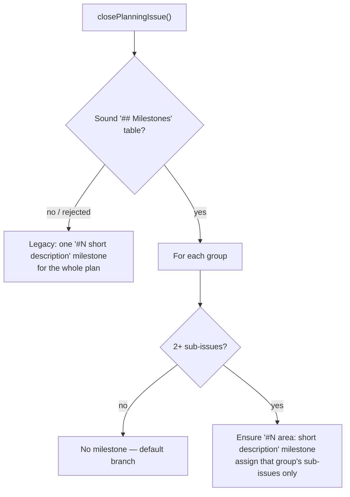

## Summary

Planning now creates **one milestone per file-area group** instead of one
milestone per plan. When the parent's `## Milestones` table passes the
structural gate (Issue #2172), `maybeCreatePlanningMilestone()` ensures a
milestone for every group carrying two or more sub-issues — titled
`#<N> <area>: <short description>`, still capped at 60 characters — and assigns
each sub-issue to its own group's milestone only. A group of a single sub-issue
gets no milestone and keeps the default branch as its PR base. With no groups
the behaviour is byte-for-byte what it was. Closes #2175.

- `buildPlanningMilestoneTitle(parent, title, short?, area?)` renders
  `#<N> <area>: <short description>`. The area runs through the same allowlist
  as the description, is bounded to half of what the prefix leaves (so a verbose
  area can never squeeze the description out), and both halves are cut on word
  boundaries. A blank area yields today's `#<N> <description>`.
- `planningMilestoneMarker(parent, area?)` writes
  `<!-- planning-milestone parent="N" area="infra" -->` — the area is sanitised,
  so a quote or `>` can never break out of the attribute. No area keeps the
  pre-#2175 marker, so existing milestones still match.
- **No cross-adoption, either way.** Every group milestone of one plan leads
  with the same `#<N>`, so the grouped lookup stops at marker-then-exact-title
  and never falls back to that prefix; the legacy `#<N>` fallback runs on the
  ungrouped path only and skips any description carrying an `area=` marker.
- `planning_processor.ts` passes the gate's accepted grouping through and logs
  one line per group — created, or skipped as a default-branch group.
- The 4-milestone cap stays in the gate (#2172) and is deliberately not
  duplicated in the helper.

## Evidence

Backend/CLI change with no web interface, so there is nothing to screenshot. The
evidence is the test suite below plus the flow it implements:



Test output after the final edit:

```
deno test tests/planning_milestone_test.ts   → ok | 41 passed | 0 failed
deno test tests/planning_processor_test.ts   → ok | 128 passed | 0 failed
deno test tests/plan_milestone_groups_test.ts → ok (in the 201-test batch above)
```

## Acceptance Criteria

<!-- vibe-spec-review inputs="diff+issue-body" -->

- **met** — Two groups of 2+ sub-issues yield two open milestones, each titled
  `#<N> <area>: …`, at most 60 characters, with each sub-issue assigned to its
  own group's milestone only — evidence:
  `worker/deno/tests/planning_milestone_test.ts::maybeCreatePlanningMilestone — three groups yield three milestones and per-group assignments`
  and end-to-end
  `worker/deno/tests/planning_processor_test.ts::processIssuePlanning - a sound table creates one milestone per multi-issue group (Issue #2175)`
  — reviewer: met — reason: the reviewer noted two residual caveats. Its
  title-collision caveat is **fixed** in `fde12771` (both the exact-title and
  legacy-prefix rungs now skip a milestone that already belongs to another
  group; regression test
  `…::an identical title is not adopted from another group`). Its same-area
  caveat stands by design: the gate deliberately permits two rows on one file
  area, the sanitised area _is_ the milestone's identity, so those rows share
  one milestone — now warned about by area before any API call rather than
  passed off as two streams.
- **met** — A group of one sub-issue yields no milestone, so that sub-issue
  keeps the default branch as its PR base — evidence:
  `worker/deno/tests/planning_milestone_test.ts::maybeCreatePlanningMilestone — a group of one sub-issue gets no milestone`
  (asserts `#12` is never edited) and `planning_processor_test.ts` (`#105`
  absent from the assignment map) — reviewer: met
- **met** — Re-running planning reuses each group's milestone by marker without
  renaming or creating duplicates; the ungrouped path never adopts a grouped
  sibling — evidence:
  `worker/deno/tests/planning_milestone_test.ts::re-running reuses each group's milestone by marker`
  (second run: 0 POST, 0 PATCH, same numbers),
  `…::a group never adopts a sibling group's milestone`,
  `…::the ungrouped path never adopts a grouped milestone`,
  `…::the ungrouped path still reuses a legacy prefix milestone` — reviewer: met
- **met** — Calls without `groups` behave exactly as before (existing tests
  unchanged and green) — evidence: the grouped path is gated on
  `groups !== undefined && groups.length > 0`
  (`worker/deno/lib/planning_milestone.ts`), a blank area makes the title head
  the bare `#<N>` prefix, the test file's existing 24 cases are untouched (the
  diff is a single append-only hunk), and
  `…::an empty group list falls back to the ungrouped path` guards it —
  reviewer: met
- **met** — Docs updated; `deno test`, `deno lint`, `deno fmt --check` pass —
  evidence: `docs/workflows/planning-and-questions.md`,
  `docs/workflows/milestones.md`, `DESIGN-PRINCIPLES.md`, and a full
  `./quality.sh` run after the final edit — reviewer: partial — reason: the
  reviewer found the "structural gate" link pointing at its own section instead
  of the gate section, and could not finish a full-suite `deno test` in its
  ten-minute budget. The anchor is fixed in `fde12771`; the full gate was run
  here and passed.
- **unrequested** — a `—` / `none` milestone row gets no milestone whatever its
  size, not only at size one — reviewer: unrequested — reason:
  `MilestoneGroup.title` documents `""` as "a group that merges straight to the
  default branch and therefore gets no milestone at all", and
  `MILESTONE_GROUPS_GATE_NEXT_STEP` tells the human the same; inventing a name
  the planner declined to give would have split that contract between producer
  and consumer.
- **unrequested** — a WARNING when two rows sanitise to the same file area —
  reviewer: unrequested — reason: the gate permits file overlap and the area is
  the milestone's identity, so those rows necessarily share one milestone and
  one branch; reporting a partial outcome as two independent streams is the
  silent failure the standards forbid.
- **unrequested** — a WARNING when a sub-issue sits in no group — reviewer:
  unrequested — reason: the grouped path assigns only what the table names, so a
  sub-issue the table missed would silently keep the default branch while its
  siblings move to a milestone branch. It is reported rather than assigned to an
  arbitrary group's milestone, which would be a guess.
- **unrequested** — `skippedReason` on each per-group outcome, beyond the
  `{ area, milestoneTitle, milestoneNumber, assigned }` the issue specifies —
  reviewer: unrequested — reason: it is the discriminator that lets the caller
  tell a deliberate default-branch group from a GitHub failure; without it both
  read identically.
- **unrequested** — the processor logs skipped groups too (`info` for a
  deliberate skip, `warn` for a failure), not only created milestones —
  reviewer: unrequested — reason: same fail-loud rule; a group that lost its
  milestone to an error must not be logged with the words of a design decision.
- **unrequested** — `milestonesReadWith` / `runPlanningWithMilestones` in
  `planning_processor_test.ts` now take the published sub-issue numbers and
  record `--milestone` edits — reviewer: unrequested — reason: the existing
  helper hard-coded two sub-issues, which cannot express two groups of two;
  extending it in place was preferred to a near-duplicate helper (DRY). Existing
  callers keep their defaults and are unchanged.

## Standards Review

<!-- vibe-standards-review inputs="diff+CODING-STANDARDS.md" -->

- **violation** — two rows naming one file area collapsed onto a single
  milestone with the second group reporting a `milestoneNumber` it never
  created, and no warning — evidence:
  `worker/deno/lib/planning_milestone.ts:443` — reason: fixed here in
  `989b4aef`; the colliding areas are now detected before any API call and
  reported with a WARNING naming them, and the three docs surfaces were restated
  to say two same-area rows share one milestone rather than claiming it cannot
  happen.
- **violation** — a `—` / `none` milestone row with two or more sub-issues still
  received a milestone, contradicting `MilestoneGroup.title`'s own contract —
  evidence: `worker/deno/lib/planning_milestone.ts:461` — reason: fixed here in
  `989b4aef` with a `no-milestone-row` skip and a covering test.
- **violation** — a GitHub ensure/naming failure was logged at `info` with text
  asserting the benign "merges straight to the default branch" outcome —
  evidence: `worker/deno/lib/planning_processor.ts:2398` — reason: fixed here in
  `989b4aef`; a deliberate skip stays `info`, a failure is a `warn` with its own
  message.
- **clean** — Australian English throughout code, tests and all three docs;
  tests call real functions through an injected `gh` seam and assert on returned
  values and the API calls actually issued (no source-grepping); happy path,
  error paths and edge cases all covered; no sleeps, wall-clock assertions or
  spawned scripts, so the tests stay unit-fast and parallel-safe;
  `ensureAndAssignGroup` is a single shared extraction rather than a duplicated
  body, and the 4-milestone cap stays with the gate (one rule, one place); no
  hidden or credential paths staged; comments explain why rather than restating
  the code; `groups?` and `milestones?` are purely additive to internal
  interfaces.

## Test Plan

Added to `worker/deno/tests/planning_milestone_test.ts` (24 → 44 cases):

- `buildPlanningMilestoneTitle` with an area: the `#2163 infra: options trading`
  shape; a blank, whitespace-only and wholly-unsafe area falling back to today's
  shape; allowlist sanitisation of the area; a long area and a long description
  each cut on a word boundary with the prefix and colon surviving and the
  60-character cap held.
- `planningMilestoneMarker` with and without an area, and a marker whose area
  cannot break out of the attribute.
- Three groups → three POSTs, three distinct titles, and an exact
  sub-issue→milestone assignment map.
- A group of one sub-issue, and a `—` milestone row of any size, produce no
  milestone and no edit for their sub-issues.
- Re-running over the same listing: zero POSTs, zero PATCHes, same milestone
  numbers and titles.
- No cross-adoption: a sibling group's milestone is not adopted by marker, by
  leading `#<N>`, or by an identical generated title; the ungrouped path does
  not adopt a grouped milestone, but still reuses a legacy `#<N>`-prefixed one.
- Failure isolation: one group's failed POST and one sub-issue's failed edit
  leave every other group and sub-issue assigned.
- Loud reporting: a sub-issue no group names, and two groups on one file area,
  each raise a WARNING.
- The parent-has-milestone gate and an empty group list both keep the pre-#2175
  behaviour.

Added to `worker/deno/tests/planning_processor_test.ts`:

- `processIssuePlanning - a sound table creates one milestone per multi-issue group (Issue #2175)`
  — a five-sub-issue plan with two 2-issue groups and one `—` row produces
  exactly two POSTs with the expected titles and the expected per-group
  assignments, end to end through `closePlanningIssue()`.

Full `./quality.sh` after the final edit: **PASSED** (deno tests, lint, type
check, fmt, markdownlint, mermaid, semgrep and every chokepoint check).
