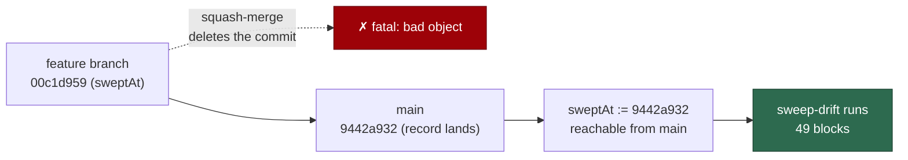

# Make every ledger `sweptAt` reachable from `main`

## Summary

`sweep-drift` could not run against the committed ledger: 38 of the 49 slices
in `docs/audits/lib-sweep-coverage.json` recorded a `sweptAt` that was a
feature-branch commit, and squash-merge deleted every one of them. The first
`git diff <sweptAt> HEAD` died with a bare `fatal: bad object 00c1d959…` that
named no slice, so the whole report — the file list the delta sweeps of #2170
regenerate from — was unobtainable.

Three changes:

- **Repointed 38 `sweptAt` values** to the commit each slice's written record
  landed at on `main`. No slice was skipped: every record has landed.
- **`driftSince` now fails naming the slice** — a non-zero git exit is wrapped
  in a `SweepLedgerError` carrying the chunk, its issue, the `sweptAt` git
  could not resolve, the remedy, and git's own stderr verbatim. Git stays an
  injected runner, so no unit test spawns.
- **Documented the rule** in the "Bounded-sweep visibility" section of
  `docs/SECURITY-SCAN.md`: `sweptAt` is a commit reachable from the default
  branch, never a feature-branch commit.

Closes #2178.

### Landing commit: `--diff-filter=A`, not the last touch

The issue prescribed `git log -1 --format=%H origin/main -- <record>`. That
returns the *most recent* commit touching the record, which for 8 of the 38
slices is a later bulk edit rather than the landing commit — `top-up-1846`
would have moved from its true landing commit `fc2b79b1` (10 Sep) forward to
`50be3b8f` (12 Sep), silently erasing two days of drift. Under-reporting drift
means a rewritten module is never re-read, so this diff takes the commit that
*added* the record (`git log --diff-filter=A -1 --format=%H origin/main --
<record>`), falling back to the plain form. Both are `main`-reachable; the add
commit is the one that can never hide drift.



## Evidence

Backend/CLI change — no web interface to screenshot. Evidence is command
output and tests.

Before (on a full clone of `main`):

```text
[2026-09-16 08:27:36Z] ERROR: Command failed: fatal: bad object 00c1d95924a0adf7eaf419219ade7283b3e11480
```

After:

```text
$ deno run --allow-read --allow-run --allow-env --allow-sys=hostname \
    worker/deno/mod.ts sweep-drift --repo "$(pwd)"
## 12a (#1214) subprocess and argv construction
sweptAt: 9442a93225c2adb41b641a1f021ad99458fb6341
added (0):
modified (8):
  - worker/deno/lib/claude_env.ts
  …
$ echo $?            # 0
$ grep -c '^## '     # 49 blocks for 49 slices
```

Reachability of every entry, after the repointing:

```text
$ for each slice: git merge-base --is-ancestor <sweptAt> origin/main
unreachable: []
```

Full `./quality.sh` gate: **PASSED** (21 checks; `config integration` skipped
as it requires credentials).

## Reproduction

- **symptom** — `sweep-drift --repo "$(pwd)"` aborted on the first slice with
  `fatal: bad object 00c1d95924a0adf7eaf419219ade7283b3e11480`, naming no
  slice, so no drift report could be produced at all
- **status** — `verified` — the command was run against the unfixed tree and
  reproduced the exact `fatal: bad object` abort; the new unit test was
  observed failing against the unwrapped `driftSince` (`Expected actual:
  "fatal: bad object aaaa…" to contain: "12a"`) and passing after the fix, and
  the command now exits 0 with 49 blocks
- **regression test** — `worker/deno/tests/lib_sweep_coverage_test.ts::driftSince - an unreachable sweptAt names the slice, the commit and the remedy (Issue #2178)`

## Acceptance Criteria

<!-- vibe-spec-review inputs="diff+issue-body" -->

- **met** — `sweep-drift --repo "$(pwd)"` completes on a fresh full clone of `main` and prints one block per slice — evidence: exit 0 and `grep -c '^## '` = 49 for 49 slices — reviewer: met
- **met** — every `sweptAt` for a record on `main` satisfies `git merge-base --is-ancestor <sweptAt> origin/main` — evidence: `docs/audits/lib-sweep-coverage.json`, 0 of 49 unreachable after the change (38 of 49 before) — reviewer: met
- **met** — a new unit test proves an unreachable commit produces an error naming the slice's chunk id and commit — evidence: `worker/deno/tests/lib_sweep_coverage_test.ts::driftSince - an unreachable sweptAt names the slice, the commit and the remedy (Issue #2178)` — reviewer: met
- **met** — `deno test`, `deno lint`, `deno fmt --check` pass and `docs/SECURITY-SCAN.md` carries the rule — evidence: full `./quality.sh` gate PASSED; `docs/SECURITY-SCAN.md:766` — reviewer: met
- **unrequested** — the documented repointing command is `git log --diff-filter=A -1 --format=%H origin/main -- <record>` rather than the issue's plain `git log -1 …` — reviewer: unrequested — reason: the plain form returns a later touch for 8 slices and would silently erase drift; the add commit is the record's true landing commit and is equally `main`-reachable
- **unrequested** — `docs/SECURITY-SCAN.md:772-775` adds the "38 of the 49 slices" history and a sentence on `driftSince`'s error — reviewer: unrequested — reason: the rule is unpersuasive without the failure it prevents, and the error sentence tells a reader where the enforcement lives
- **unrequested** — the error also carries the slice's issue number and the `docs/audits/lib-sweep-coverage.json:` prefix — reviewer: unrequested — reason: the ledger prefix is this module's existing error convention, and the issue number is how an operator finds the slice's record
- **unrequested** — `stderr.trim()` replaces `stderr.length > 0`, so whitespace-only stderr now falls through to the synthetic `exited <code>` detail, and the existing `driftSince - a non-zero git exit throws with stderr` assertion was relaxed from `assertEquals` to `assertStringIncludes` — reviewer: unrequested — reason: the relaxation is the documented consequence of wrapping the message (the test still asserts git's stderr survives verbatim); the trim stops a blank message replacing a useful one, and is covered by the new empty-stderr test

## Standards Review

<!-- vibe-standards-review inputs="diff+CODING-STANDARDS.md" -->

- **violation** — the printed remedy omitted `origin/main`, so an operator running it from the feature branch the failure is hit on would record another feature-branch commit — reproducing the defect — evidence: `worker/deno/lib/lib_sweep_coverage.ts:376` — reason: fixed in this diff; the remedy is now `git log --diff-filter=A -1 --format=%H origin/main -- <record>`, matching `docs/SECURITY-SCAN.md` exactly
- **violation** — the new test pinned that unanchored remedy — evidence: `worker/deno/tests/lib_sweep_coverage_test.ts:746` — reason: fixed in this diff; the assertion now pins the anchored command
- **violation** — the modified empty-stderr branch had no test — evidence: `worker/deno/lib/lib_sweep_coverage.ts:368` — reason: fixed in this diff by `driftSince - a non-zero git exit with no stderr still names the slice (Issue #2178)`
- **violation** — the ledger data half of the fix ships with no regression test, so a future slice recorded from a feature branch returns the ledger to unrunnable — evidence: `docs/audits/lib-sweep-coverage.json:63` — reason: stands. The issue states this directly: reachability of the real ledger cannot be asserted in a unit test without spawning git, so `sweep-drift`'s own loud failure is the detection point. Enforcing reachability in `parseCoverageLedger` would make every ledger parse spawn git, which the injected-runner design exists to avoid
- **violation** — `docs/archive/pr-summaries/pr-summary-2178.md` was absent — evidence: repository tree — reason: fixed in this diff; this file. The one existing-test modification (`assertEquals` → `assertStringIncludes`) is documented in the `unrequested` entry above
- **clean** — Australian English throughout; no hidden or credential path staged; tests call `driftSince` through the existing injected `SweepGitRunner` seam rather than grepping source, spawning, or touching the clock; fail-loud preserved (`SweepLedgerError` still thrown, git's stderr kept verbatim); logic stays in `worker/deno/lib/`; `@std/assert` only; commit carries the `Vibe-Coder-Run-Id` trailer; all 38 replaced values were genuinely unreachable, so no reachable `sweptAt` was advanced and no real drift was erased

## Known residual

The three delta records still cite their original feature-branch commits in
prose — `docs/audits/security-sweep-1610-lib-delta-12a-12c.md:11`,
`security-sweep-1611-lib-delta-12d-12f.md:11` and
`security-sweep-1612-commands-setup-delta.md:11`. Those sentences are a
historical statement of the tree the sweep was actually read at, so rewriting
them would falsify the record. `docs/audits/lib-sweep-coverage.json` is the
machine-read source of truth and is now correct.

## Test Plan

- Added `worker/deno/tests/lib_sweep_coverage_test.ts::driftSince - an unreachable sweptAt names the slice, the commit and the remedy (Issue #2178)` — injected runner returns `code: 128, stderr: "fatal: bad object …"`; asserts the message names the chunk (`12a`), the issue, the commit, git's stderr, the reachability rule and the anchored remedy.
- Added `worker/deno/tests/lib_sweep_coverage_test.ts::driftSince - a non-zero git exit with no stderr still names the slice (Issue #2178)` — covers the empty-stderr branch: still throws, still names the slice, falls back to `git diff --diff-filter=A exited 128`.
- Modified `worker/deno/tests/lib_sweep_coverage_test.ts::driftSince - a non-zero git exit throws with stderr (Issue #1609)` — `assertEquals` on the whole message relaxed to `assertStringIncludes`, because the message is now wrapped in the slice's context. Git's stderr is still asserted to survive verbatim.
- Unchanged and still passing: the `driftSince` happy-path and empty-diff tests, plus the ledger-coverage gate that walks the real tree (32 tests in the file, 0 failures).
- Full `./quality.sh` gate: PASSED.
