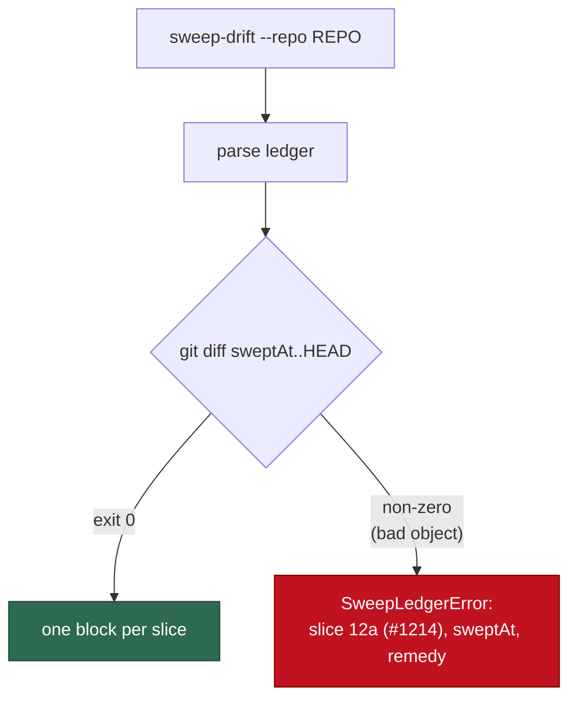

## Summary

`sweep-drift` could not run against the committed coverage ledger: 38 of the 49
slices in `docs/audits/lib-sweep-coverage.json` recorded a `sweptAt` that was a
feature-branch commit, deleted by squash-merge, so `git diff <sweptAt> HEAD`
died with `fatal: bad object …` on a full clone of `main`. Each of those 38 is
repointed to the commit its written record landed at on `origin/main`;
`driftSince` now names the offending slice when a diff fails; and
`docs/SECURITY-SCAN.md` carries the rule that `sweptAt` must be reachable from
the default branch. Closes #2178.

Three parts:

1. **Ledger.** The 38 unreachable `sweptAt` values are repointed to their
   record's landing commit on `main`. The 11 already-reachable slices are
   untouched. No slice was skipped — every record has landed on `main`.
2. **Fail loud, naming the slice.** `driftSince` wraps a non-zero git exit in a
   `SweepLedgerError` carrying the chunk, its issue, its `sweptAt`, git's own
   stderr verbatim, and the remedy.
3. **Docs.** The `sweptAt` reachability rule sits beside the "Bounded-sweep
   visibility" paragraph in `docs/SECURITY-SCAN.md`.

### Landing commit: the adding commit, not the last touch

The issue prescribed `git log -1 --format=%H origin/main -- <record>`. That
returns the _last_ commit to touch the record, which for 8 slices is `50be3b8f`
(#1968/#2020) — a commit that edited those records long after they landed. Using
it would move `sweptAt` forward past real drift and report a security ledger as
clean when it is not. The repoint therefore uses the commit that **added** the
record:

```
git log --diff-filter=A -1 --format=%H origin/main -- <record>
```

Both the documented remedy and the `driftSince` error message name this command,
and it reproduces all 38 committed values exactly (verified). This is the one
deliberate departure from the issue's literal instruction; the values still
satisfy the acceptance criterion, and they never under-report drift.

### Flow



## Evidence

Backend/CLI change — no web interface to screenshot. Evidence is command output
and tests.

**Before** (ledger as committed on the milestone base, full clone of `main`):

```
fatal: bad object 00c1d95924a0adf7eaf419219ade7283b3e11480
```

**After**,
`deno run --allow-read --allow-run --allow-env --allow-sys=hostname
worker/deno/mod.ts sweep-drift --repo "$(pwd)"`
— exit 0, 49 blocks:

```
## 12a (#1214) subprocess and argv construction
sweptAt: 9442a93225c2adb41b641a1f021ad99458fb6341
added (0):
modified (8):
  - worker/deno/lib/claude_env.ts
  - worker/deno/lib/claude_runner.ts
  ...
unowned (0):
```

Reachability, all 49 slices:

```
$ for each slice: git merge-base --is-ancestor <sweptAt> origin/main
unreachable: 0 of 49   (was 38 of 49)
```

`./quality.sh` passed in full (all 21 stages; `config integration` skipped as
usual). It took **6m48s** on this run, not the 4s the run prompt estimated.

## Reproduction

- **symptom** — `sweep-drift --repo "$(pwd)"` aborted with
  `fatal: bad object 00c1d959…` on a non-shallow clone of `main`, because 38
  slices pointed at squash-deleted feature-branch commits; the failure named
  only the commit, never which slice held it
- **status** — `verified` — the worktree was a depth-1 clone, so it was
  unshallowed (`git fetch --unshallow`) to reproduce the reported condition; the
  new `driftSince` test was then observed failing against the unfixed
  `lib_sweep_coverage.ts` (`FAILED | 30 passed | 1 failed`) and passing after
  the fix, and `sweep-drift` itself was run before and after
- **regression test** —
  `worker/deno/tests/lib_sweep_coverage_test.ts::driftSince - an unreachable sweptAt names the slice, the commit and the remedy (Issue #2178)`

## Acceptance Criteria

<!-- vibe-spec-review inputs="diff+issue-body" -->

- **met** — `sweep-drift --repo "$(pwd)"` completes on a fresh full clone of
  `main` and prints one block per slice — evidence: exit 0, 49 `## <chunk>`
  blocks, no `fatal: bad object`; `worker/deno/commands/sweep_drift.ts` —
  reviewer: met
- **met** — every `sweptAt` for a record on `main` satisfies
  `git merge-base --is-ancestor <sweptAt> origin/main` — evidence: 38 values
  repointed in `docs/audits/lib-sweep-coverage.json`, 49/49 now pass — reviewer:
  met
- **met** — a new unit test proves an unreachable commit produces an error
  naming the slice's chunk id and commit — evidence:
  `worker/deno/tests/lib_sweep_coverage_test.ts::driftSince - an unreachable sweptAt names the slice, the commit and the remedy (Issue #2178)`
  — reviewer: met
- **met** — `deno test`, `deno lint`, `deno fmt --check` pass and
  `docs/SECURITY-SCAN.md` carries the rule — evidence: full `./quality.sh` green
  (deno tests / lint / type check / fmt all PASSED); rule at
  `docs/SECURITY-SCAN.md:766` — reviewer: partial — reason: the reviewer ran
  only the two touched suites and scored the test scope partial; the full gate
  was run here and passed
- **unrequested** — the default git runner is now built per repo
  (`defaultSweepGitRunner` → `sweepGitRunnerFor(repoRoot)`, pinning git's cwd) —
  reviewer: unrequested — reason: `driftSince` passes repo-relative pathspecs,
  so run from any directory but the repo root every slice reported an empty
  drift — a clean bill of health for a ledger nobody had diffed, which is
  precisely the silent empty report this issue's Failure Detection forbids
- **unrequested** — a new process-spawning test builds a throwaway git repo —
  reviewer: unrequested — reason: it is the only way to prove the cwd fix;
  `driftSince`'s own tests remain spawn-free as the issue requires, and the file
  header records the carve-out
- **unrequested** — the `SECURITY-SCAN.md` paragraph also documents
  `driftSince`'s error wrapping — reviewer: unrequested — reason: the rule and
  the failure that enforces it are useless apart; three lines

## Standards Review

<!-- vibe-standards-review inputs="diff+CODING-STANDARDS.md" -->

- **violation** — the new test inherited the host's git config, so a developer
  with `commit.gpgsign=true` globally got a red suite — evidence:
  `worker/deno/tests/sweep_drift_command_test.ts:106` — reason: fixed here; the
  fixture now pins `commit.gpgsign false`, matching
  `worktree_progress_test.ts:40`. Re-run under the reviewer's exact repro
  (`GIT_CONFIG_GLOBAL` with `gpgsign = true`): `5 passed | 0 failed`
- **violation** — the fixture's git helper discarded stderr and asserted only on
  the exit code, so a failure reported no reason — evidence:
  `worker/deno/tests/sweep_drift_command_test.ts:100` — reason: fixed here;
  stderr is piped and carried into the assertion message
- **violation** — new public function `sweepGitRunnerFor` had no error-path
  test, leaving the `!result.ok` branch unexercised — evidence:
  `worker/deno/commands/sweep_drift.ts:46` — reason: fixed here; added
  `sweepGitRunnerFor - a spawn failure is reported, never swallowed (Issue #2178)`
- **violation** — no `docs/archive/pr-summaries/pr-summary-2178.md` — evidence:
  absent from commit `53e6cc96` — reason: fixed here; this file
- **violation** — advisory: the new test spawns real `git` in the unit pass,
  which the prose reserves for integration tests — evidence:
  `worker/deno/tests/sweep_drift_command_test.ts:97` — reason: stands. The
  reviewer identified this as a prose-vs-classifier gap affecting five existing
  unit-pass files (`git_timeout_test.ts`, `worktree_progress_test.ts` and three
  others), not this diff; `runGitCommand` offers no injectable seam at this
  layer, and the test costs 0.6s, well inside the 10s target
- **clean** — ledger repoint correct and complete (every value an ancestor of
  `origin/main`, no slice left behind); docs-with-code (renamed export has zero
  stale references, docs included); fail-loud (`describeDriftGitFailure` carries
  git's stderr verbatim, empty-stderr fallback preserved, `driftSince` still
  throws rather than degrading to an empty report); test quality (real code,
  real assertions, explicit fail-direction comments, the #1609 assertion widened
  rather than deleted); parallel safety (no `Deno.env.set`, no `Deno.chdir`,
  uniquely-prefixed temp dir removed in `finally`); commit safety (no hidden or
  credential paths staged, run-id trailer present); Australian English; KISS/DRY
  (a factory replacing a constant, one named helper rather than two inlined
  messages); `deno fmt`/`lint`/`check` clean

## Test Plan

Added:

- `worker/deno/tests/lib_sweep_coverage_test.ts::driftSince - an unreachable sweptAt names the slice, the commit and the remedy (Issue #2178)`
  — injected runner returns `code: 128, stderr: "fatal: bad object …"`; asserts
  the message names the slice label, the commit, the reachability rule and the
  record. Observed red against the unfixed code.
- `worker/deno/tests/sweep_drift_command_test.ts::sweepGitRunnerFor - resolves repo-relative pathspecs against --repo, not the process cwd (Issue #2178)`
  — throwaway repo; observed red with the `cwd` option removed.
- `worker/deno/tests/sweep_drift_command_test.ts::sweepGitRunnerFor - a spawn failure is reported, never swallowed (Issue #2178)`
  — covers the `!result.ok` branch.

Modified (documented, per TDD rule 2):

- `worker/deno/tests/lib_sweep_coverage_test.ts::driftSince - a non-zero git exit throws with stderr (Issue #1609)`
  — the error message is deliberately wider now, so the exact-equality assertion
  on the bare stderr became a containment assertion. The stderr it protected is
  still asserted; the test was not removed, and a code comment at the test
  records why.

Full `./quality.sh`: PASSED (21 stages, `config integration` skipped).
