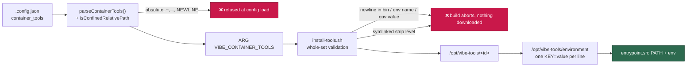

## Summary

Read the container toolchain installer chain end to end —
`container/install-tools.sh`, `container/install-toolchains.sh` and the nine
committed `container/toolchains/*.sh` fragments — against `container/tools.json`
and the `container/Containerfile` lines that invoke them, and recorded the sweep
in `docs/audits/security-sweep-2179-container-toolchains.md`.

Three root causes survived triage, all in `install-tools.sh`, and all three are
fixed here with regression tests rather than filed:

1. **Line injection into the environment hand-off.** `/opt/vibe-tools/environment`
   is one `KEY=value` per line and `container/entrypoint.sh` reads it that way,
   but nothing checked the pieces that become a line for a newline. A `bin`
   entry, an `env` name or an `env` value carrying one wrote a *second* line —
   a well-formed `PATH=` the entrypoint prepends, aimed anywhere on the host.
   Refused now for the whole set before anything downloads, and refused at the
   Deno trust boundary by `isConfinedRelativePath`.
2. **`extract_zip` descended a symlinked strip level.** `[[ -d "${src}" ]]`
   follows a symlink, so a zip whose single top-level name is a link copied the
   *target's* tree into the install prefix. A strip level must now be a real
   directory, which is what `tar --strip-components` already did.
3. **A `jq` failure was reported as a successful install.** The
   environment-recording loops read `jq` through a process substitution whose
   status nothing observed: a `bin` block `jq` could not walk left the file
   empty and the build exited 0, with the tool installed and invisible on PATH.
   The new whole-set check reads the same blocks as a command-substitution
   assignment, so that case aborts under `set -e` before any download.

No `security` issue was filed, because nothing survived unfixed — stated
explicitly in the record rather than implied.

Closes #2179.

## Evidence

Backend/CLI only — no web interface to screenshot. The evidence is the executed
behaviour: every claim in the record was reproduced against the real scripts
before being written down.

Before the fix, a spec with `env: { "DEMO_HOME": "x\nPATH=/tmp/evil" }` produced

```console
$ cat -A prefix/environment
PATH=/tmp/ttest/prefix/demo/bin$
DEMO_HOME=/tmp/ttest/prefix/demo/x$
PATH=/tmp/evil$
```

and after it

```console
$ bash container/install-tools.sh spec.json ; echo "exit=$?"
install-tools: tool "demo" has a bin entry, env name or env value carrying a
newline: …/environment is one KEY=value per line.
exit=1
```

with the prefix left empty. `shellcheck` is clean on all eleven files at the
level CI enforces, and `./quality.sh < /dev/null` passes on the final tree.



## Acceptance Criteria

<!-- vibe-spec-review inputs="diff+issue-body" -->

- **partial** — Record committed naming all twelve files and the Containerfile
  invocation lines read; each of the five cases marked confirmed (issue number)
  or refuted (reason) — evidence:
  `docs/audits/security-sweep-2179-container-toolchains.md` (file table,
  Containerfile table, the five-case verdict table) — reviewer: partial —
  reason: two literal halves of the criterion could not be met as written and
  both are stated in the record — there are **eleven** committed files, not
  twelve (`codegraph.sh` is only on the unmerged `milestone/2145-…` branch, read
  there and recorded as an observation), and case 2 is confirmed with **no issue
  number** because all three of its findings are fixed in this change, so none
  survived to be filed. The reviewer also caught a wrong Containerfile line
  (`:395` → `:399`), a note count (22 → 21) and a `curl` count (14 → 12); all
  three are corrected.
- **met** — An empty result is stated explicitly per category, never implied —
  evidence: `docs/audits/security-sweep-2179-container-toolchains.md`,
  "Categories the issue named that came back empty" (eight categories) plus the
  per-case empties inside case 2 — reviewer: partial — reason: the reviewer
  found one implied empty, the `=`-in-a-value half of case 2, and it is now
  stated explicitly (the entrypoint splits at the first `=`, so an extra `=`
  stays inside the value); I depart from `partial` because the gap it named is
  closed in this diff.
- **met** — `./quality.sh < /dev/null` passes; any in-change fix has a passing
  regression test — evidence: full gate run on the final tree, all stages
  PASSED; five new tests in `worker/deno/tests/install_tools_test.ts` and one in
  `worker/deno/tests/host_path_style_test.ts` — reviewer: met — reason: the
  reviewer's own gate run showed `deno tests: FAILED` from
  `run_ps1_launcher_test.ts` image-tag assertions that drifted because a commit
  landed mid-run; re-run quiescent it is `39 passed | 0 failed`.
- **unrequested** — `worker/deno/lib/host_path_style.ts` rejects `\r`/`\n` in a
  confined relative path, with a case in `host_path_style_test.ts` — reviewer:
  unrequested — reason: same root cause as finding 1 at the layer
  `container_tools_config.ts` calls "the trust boundary", where the docstring
  claimed a confinement the predicate did not enforce; it is one line and it
  also tightens `container_extension_config.ts`, which is outside this sweep.
- **unrequested** — the `container_tools` row in `docs/CONFIGURATION.md` —
  reviewer: unrequested — reason: it states the confinement rule the fix
  changes, and a code change owes a docs change on **every** surface that
  states it, not only the two the issue happened to name.
- **unrequested** — three findings fixed in-change, and no `security` issue
  filed, against the issue's "one one-line defect" allowance — reviewer:
  unrequested — reason: findings 2 and 3 are one-line/no-line (finding 3 is
  closed by finding 1's check), and finding 1's guard is a single `jq`
  assertion in the existing validation loop; filing an issue for a defect
  already fixed and tested would be a suggestion left behind rather than work
  done.

## Standards Review

<!-- vibe-standards-review inputs="diff+CODING-STANDARDS.md" -->

- **violation** — the newline guard covered `bin` entries and `env` values but
  not `env` **names**, so the invariant the same commit published was still
  breakable (`{"A\nPATH=/tmp/evil:x": ""}` wrote a well-formed `PATH=` line) —
  evidence: `container/install-tools.sh:147-152` as first committed — reason:
  fixed in this diff (commit `8aebc403`); the guard now covers all three pieces
  that reach a line, with
  `install_tools_test.ts::install-tools - a newline in an env NAME is refused before any download`
  observed failing against the value-only guard.
- **violation** — Boy Scout Rule: the header reflow left a 117-character
  comment line where the file wraps at ~80 — evidence:
  `container/install-tools.sh:30` — reason: rewrapped in this diff, and the new
  `fail` message shortened to the length of its neighbours.
- **violation** — no `docs/archive/pr-summaries/pr-summary-2179.md` — evidence:
  commit `cf339149` — reason: this file, added before the PR is raised.
- **clean** — Australian English throughout the added lines; the four (now
  five) installer tests spawn the real script and assert exit code, stderr and
  side effects rather than grepping source; `zipSymlinkEntry`/`crc32` build the
  fixture in-process because the image carries no `zip`; fail-loud handling
  (`extract_zip`'s guard returns into the existing `|| { … fail … }`, and the
  `jq` read is an assignment so `set -e` catches it); KISS/DRY (one predicate at
  the boundary, one mirrored check at the sink, each commenting the other); docs
  moved with the code on every surface stating the invariant; commit safety (no
  hidden path, no `git add -f`, no `--no-verify`); run-id trailer present on
  both commits.

## Test Plan

Added to `worker/deno/tests/install_tools_test.ts` (each observed failing
against the code it fixes, then passing):

- `install-tools - a newline in an env value is refused before any download`
- `install-tools - a newline in a bin entry is refused before any download`
- `install-tools - a newline in an env NAME is refused before any download`
- `install-tools - a bin block jq cannot walk aborts rather than installing a PATH-less tool`
- `install-tools - a zip whose strip level is a symlink does not copy the link target in`

Added to `worker/deno/tests/host_path_style_test.ts`:

- `isConfinedRelativePath - a newline-bearing value is refused`

`install_tools_test.ts` is listed in
`worker/deno/lib/integration_test_manifest.ts`, so these five run in the
`integration tests (not a required check)` job rather than the merge gate —
the existing classification for a suite that spawns a repository script, not a
choice made here. The `host_path_style_test.ts` case is a pure unit test and
runs in the gate.

Unchanged suites re-run green: `install_toolchains_test.ts` (23),
`container_tools_config_test.ts`, `container_extension_config_test.ts`,
`run_ps1_launcher_test.ts` (39), and the full `./quality.sh < /dev/null`.
