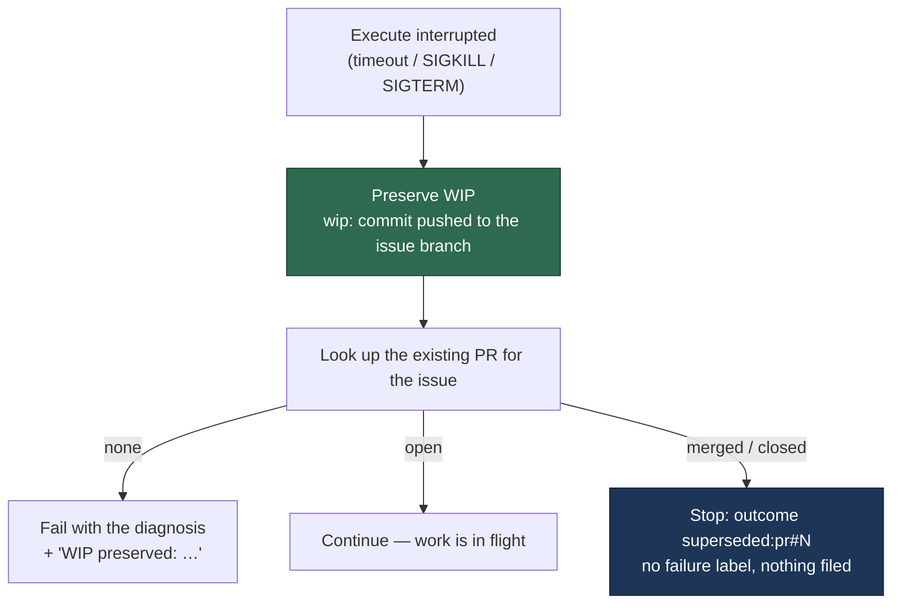

# Timeout path preserves WIP first; a merged sibling PR stops the run as `superseded`

## Summary

An interrupted execute phase discarded its uncommitted work whenever *any*
PR existed for the issue, and then failed for the wrong reason. On
VibeCoder#185 a sibling host's PR #215 merged mid-run: the timeout path took
the "PR already exists → continue" shortcut before counting dirty files, 51
minutes of work was thrown away, and completion failed "no commits ahead …
Claude likely modified files but did not commit them" — released as
`no_pr:unknown:completion`. Closes #218.

Three changes:

1. **Preservation runs first, unconditionally.** The timeout, SIGKILL and
   external-SIGTERM branches of `execute_phase.ts` call the new
   `preserveRunWip()` before any existing-PR lookup, so the #47/#148
   guarantee ("a deadline-bound execute never discards its work") holds
   whatever PRs exist.
2. **Open PR ≠ merged PR.** `superseding_pr.ts` classifies the existing PR
   as `none` / `open` / `superseded`. An **open** PR still means work in
   flight and the run continues, exactly as before; a **merged or closed**
   one stops the run with a new `superseded` `RunOutcome` naming the PR and
   the branch the preserved WIP is on. That is not a failure: no failure
   label, no `unknown` category, and `run_failure_issue.ts` (which only
   reads `no_pr` outcomes) files nothing. Every lookup failure fails safe to
   `open`, so a `gh` hiccup can never invent a superseded stop.
3. **Completion preserves rather than describes.** The "no commits ahead"
   bail-out commits and pushes the dirty tree as a `wip:` commit (still
   caught by the #148 WIP-only gate, so no half-done PR is raised) and
   applies the same superseded classification — a branch level with base
   because a sibling merged the work releases as `superseded:pr#N`.

### Files

| File | Change |
| --- | --- |
| `lib/superseding_pr.ts` | **New** — classify the existing PR; format the `superseded:pr#N` reason |
| `lib/phases/run_wip_preservation.ts` | **New** — shared preservation, extracted from the execute timeout branch |
| `lib/phases/execute_phase.ts` | Preserve first, then classify, on all three interrupted-run branches |
| `lib/phases/completion_phase.ts` | "No commits ahead" preserves the tree and recognises a superseding PR |
| `lib/run_outcome.ts` | New `superseded` outcome kind + `supersededOutcome()`; `describeRunOutcome` → `superseded:pr#N` |
| `lib/heartbeat_storage.ts` | Render the superseded outcome in the release comment and the attempt tally |
| `lib/issue_worker_types.ts` / `lib/issue_worker.ts` | `early_exit` results may carry their own outcome; completion `early_exit` handled |
| `lib/wip_checkpoint.ts` | `buildUncommittedWorkWipCommitMessage()` for the completion-phase preservation commit |
| `docs/workflows/issue-processing.md` | Two new failure-mode bullets + the decision-order diagram |

## Evidence

Backend/CLI only — there is no web interface to screenshot. The evidence is
the test suite below plus the decision order the change enforces:



Before this change the `L` node came first, and both the `open` and
`merged / closed` arrows led to `C`.

Targeted run of the new and adjacent suites:

```text
$ deno test --allow-all --no-check tests/superseding_pr_test.ts \
    tests/execute_phase_superseded_wip_test.ts \
    tests/completion_phase_superseded_wip_test.ts \
    tests/heartbeat_outcome_render_test.ts tests/issue_worker_test.ts \
    tests/completion_phase_head_reconcile_test.ts tests/execute_phase_killed_test.ts
ok | 153 passed | 0 failed
```

`./quality.sh` passes every gate except `deno tests`, which reports **10
pre-existing environment-dependent failures** unrelated to this change
(`setup_workdir_reminder_test.ts` ×7, `fleet_health_test.ts`,
`host_workdir_guard_test.ts`, `optional_feature_env_test.ts` — all of them
probe the host work dir or `/etc`-style files). Verified by running the same
four files in a clean `git worktree` checked out at `origin/main`: the
identical 10 failures occur there. No test fails because of this PR.

### Security self-check

- Input validation: `classifyExistingPrForIssue` validates the PR number
  parsed from the URL and the `state` string from `gh` before acting on
  either; an unparseable or unrecognised value fails safe to "open".
- Injection surface: no new shell or SQL. The one new `gh` call passes an
  argument array (`["pr", "view", String(prNumber), "--repo", repo, …]`) —
  no string concatenation of external input.
- Privileged operations: the preservation commit goes through the existing
  `commitAndPushPending` chokepoint, keeping the default-branch guard
  (#2584), the secret/hidden-file gate (#1758) and the run-id trailer
  (#2381).
- Error handling: no new user-facing surface leaks stack traces; every
  fail-safe fallback is logged rather than swallowed.
- Dependencies: none added.

## Test Plan

New:

- `tests/superseding_pr_test.ts` — 9 tests: absent PR → `none`; `OPEN` →
  `open`; `MERGED` and `CLOSED` → `superseded`; an unreadable state, an
  unrecognised state and a throwing lookup all fail safe **and** warn; an
  object-shaped lookup result still classifies; the reason string leads with
  `superseded:pr#N` and names the preserved branch.
- `tests/execute_phase_superseded_wip_test.ts` — the issue's acceptance
  test: **timeout + dirty tree + merged PR ⇒ WIP pushed to the branch and
  outcome `superseded:pr#215`**. Plus: an open PR preserves the WIP and still
  continues; no PR still fails as a `timeout` with the WIP preserved; a clean
  tree supersedes without inventing a commit.
- `tests/completion_phase_superseded_wip_test.ts` — "no commits ahead" with a
  dirty tree pushes a `wip:` commit and says so in the failure; the same
  state with a merged PR releases as `superseded:pr#215` from phase
  `completion`; a clean tree with no PR fails exactly as before.

Modified (documented):

- `tests/heartbeat_outcome_render_test.ts` — appended a `superseded` case to
  the shape table (so the existing marker/sweep assertions cover it) and two
  new tests for its ✅ release line and attempt-tally text. No existing case
  or assertion was changed.

Behaviour change affecting one existing test's message assertion, kept green
rather than modified: `issue_worker_test.ts`'s "bails out before gh pr create
when branch has zero commits ahead" asserts the failure names *uncommitted
changes*. The completion phase now preserves that work, so the message states
both — `N file(s) carried uncommitted changes; WIP preservation failed (…)` —
and the existing assertion still holds without edit.
