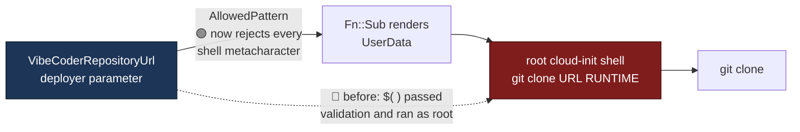

## Summary

Read `infra/cloudformation/linux-verification-host.yaml` end to end — the
never-recorded chunk 2 of #2170 — triaged it per `docs/SECURITY-SCAN.md` Phase
3, and committed the audit record
`docs/audits/security-sweep-2180-linux-verification-host.md`. Closes #2180.

Two of the five cases the issue named were confirmed:

- **Fixed here.** `VibeCoderRepositoryUrl` is interpolated into a double-quoted
  shell string at `:341`, and its `AllowedPattern` admitted `$`, `(` and `)` —
  so a URL that **passed validation** executed an arbitrary command **as root**
  during cloud-init. `$IFS` supplies the whitespace a payload needs, so no space
  or quote character was required. The pattern is now
  `^https://[A-Za-z0-9._~:/@%+-]+$` — the characters a clone URL needs and no
  shell metacharacter.
- **Filed as #2199.** The host's unpinned `curl … | sh` Deno and Claude CLI
  installers, classified A03:2025 / A08:2025 and against the scan's own
  `curl | sh` supply-chain category. Filed against the **root cause**
  (`docs/SETUP.md:532,536`, the documented manual install) rather than the
  template, which mirrors it by design; `setup.sh:999` and `quality.sh:71` are
  the other two call sites.

The other three cases were refuted with reasons, and the template's two
deliberate design points (podman only; stock Ubuntu so #722 still reproduces)
are recorded as **not** findings. The trust boundary — a deployer who already
holds `CAPABILITY_IAM` and could write `UserData` directly — is stated, which is
what bounds both findings to Low and what distinguishes the upstream attacker in
finding 2 from the deployer in finding 1.

## Evidence

Backend/infrastructure change with no web interface, so no screenshot applies.
The evidence is the reproduction and the regression test.

**The injection, reproduced against the unfixed template.** The payload
`https://github.com/x$(touch$IFS./INJECTED)y.git` matches the **old**
`AllowedPattern`, and the rendered clone line executed it:

```console
$ bash script.sh
RUNUSER ARGV: -l ubuntu -c git clone https://github.com/xy.git /home/ubuntu/vibe-coder-runtime
$ ls
INJECTED  script.sh
```

**The regression test, red before the fix:**

```console
$ deno task test tests/linux_verification_host_template_test.ts --filter "shell metacharacter"
error: AssertionError: Values are not equal: AllowedPattern admits "$" into the clone command line
FAILED | 0 passed | 1 failed
```

**Green after it, with the whole file:**

```console
$ deno task test tests/linux_verification_host_template_test.ts
ok | 30 passed | 0 failed (45ms)
```

**Full gate:** `./quality.sh < /dev/null` →
`Result: PASSED (with skipped
checks)`, run after the final edit.



## Acceptance Criteria

<!-- vibe-spec-review inputs="diff+issue-body" -->

- **met** — Record committed — evidence:
  `docs/audits/security-sweep-2180-linux-verification-host.md` — reviewer: met
- **met** — Case 1 (network posture) marked confirmed or refuted — evidence:
  record §"Case 1 — network posture holds"; refuted, no ingress rule, egress
  five explicit rules with 22/3389 closed — reviewer: met
- **met** — Case 2 (identity) marked confirmed or refuted — evidence: record
  §"Case 2 — identity and host hardening hold"; refuted, `:231` SSM core only,
  `:263` sets `HttpTokens` to required, `:271` `Encrypted: true` — reviewer: met
- **met** — Case 3 (`curl | sh`) classified A03/A08 and against the scan's own
  category, with the trust boundary stated — evidence: record finding 2 and
  §"Case 3"; confirmed, filed as **#2199** — reviewer: met
- **met** — Case 4 (`VibeCoderRepositoryUrl`) decided finding vs residual —
  evidence: record §"Case 4"; decided a finding, fixed in-change at
  `infra/cloudformation/linux-verification-host.yaml:68` — reviewer: partial —
  reason: the reviewer read the AC's "confirmed (issue number)" literally and
  marked it partial because no issue number exists for this case; the issue body
  directs one-line defects to be fixed in-change instead of filed, which is what
  happened, so it is recorded as met with the departure stated here
- **met** — Case 5 (`${!VAR}` escaping) marked confirmed or refuted — evidence:
  record §"Case 5" and
  `linux_verification_host_template_test.ts::only the three stack parameters
  the bootstrap needs are substituted into it`;
  refuted as a security defect, and the script's own comment corrected from two
  to three — reviewer: met
- **met** — The trust boundary stated — evidence: record §"The trust boundary
  this sweep assumes" — reviewer: met
- **met** —
  `deno test worker/deno/tests/linux_verification_host_template_test.ts` passes
  — evidence: `ok | 30 passed | 0 failed` — reviewer: met
- **met** — `./quality.sh < /dev/null` passes — evidence:
  `Result: PASSED (with skipped checks)` after the final edit — reviewer: met
- **unrequested** — the regression test also **executes** the rendered clone
  line and asserts the sink fired — evidence:
  `worker/deno/tests/linux_verification_host_template_test.ts:479-512` —
  reviewer: unrequested — reason: the issue asked only for pattern coverage;
  demonstrating the sink is what makes the pattern's tightness evidently the
  control rather than a stylistic choice, and it is guarded by a "premise
  changed" message so a later, correct hardening of the sink fails loudly and
  legibly instead of passing vacuously
- **unrequested** — the substituted-parameter set is pinned exactly by a new
  test — evidence: `worker/deno/tests/linux_verification_host_template_test.ts`,
  `only the three stack parameters the bootstrap needs are substituted into it`
  — reviewer: unrequested — reason: case 5 asked for a confirmation, and this is
  what keeps it confirmed — a future parameter added to the script must be
  reviewed against its sink before the list can grow
- **unrequested** — the parameter `Description` gained rationale beyond the
  one-line pattern change — evidence:
  `infra/cloudformation/linux-verification-host.yaml:69-78` — reviewer:
  unrequested — reason: a tightened regex with no stated reason is the kind a
  later reader loosens back; the template is deployed by hand, so its own
  `Description` is where the reason has to live
- **unrequested** — the operator note covers the credential-in-URL residual as
  well as the pattern — evidence: `docs/EC2-LINUX-VERIFICATION.md:84-93` —
  reviewer: unrequested — reason: the record files that residual as an
  observation, not a finding, but it is an operator **step** (what a deployer
  may put in the parameter), which is the condition the issue set for touching
  this document

## Standards Review

<!-- vibe-standards-review inputs="diff+CODING-STANDARDS.md" -->

- **violation** — a new comment the adjacent code refutes: it claimed all three
  substituted parameters are constrained by `AllowedValues` or `AllowedPattern`,
  but `AutoStopHours` is `Type: Number` bounded by `MinValue`/`MaxValue` —
  evidence: `infra/cloudformation/linux-verification-host.yaml:291` — reason:
  fixed in this diff; the comment now names the actual constraint on each of the
  three
- **violation** — the pattern test justified a `user:token@` clone URL as "the
  userinfo form a private fork needs", contradicting the parameter `Description`
  and `docs/EC2-LINUX-VERIFICATION.md`, which both forbid a credential in this
  parameter — evidence:
  `worker/deno/tests/linux_verification_host_template_test.ts:470` — reason:
  fixed in this diff; the fixture is now a plain userinfo host and the comment
  states why `:` and `@` stay in the set — a URL needs them, and the
  no-credential rule is operator guidance a regex cannot enforce
- **violation** — `docs/archive/pr-summaries/pr-summary-2180.md` was absent —
  evidence: the diff at the time of review — reason: this file
- **clean** — Australian English throughout; TDD linkage verified by the
  reviewer independently (old pattern restored → red, fix → green, 30 passed);
  tests call real code rather than grepping source; fail-loud assertions with
  `finally` cleanup; unit-test shape parallel-safe and fast; `deno lint`,
  `deno check`, `deno fmt --check`, `markdownlint` clean on the changed files;
  commit message carries the issue number and the `Vibe-Coder-Run-Id` trailer;
  no hidden path, key material or new outbound sink staged; the record's OWASP
  ids and every one of its line citations verified accurate at HEAD

## Test Plan

Added to `worker/deno/tests/linux_verification_host_template_test.ts`:

- `only the three stack parameters the bootstrap needs are substituted into it`
  — pins the exact `Fn::Sub` substitution set (case 5), so a new
  deployer-controlled value cannot enter the root bootstrap unreviewed.
- `the repository URL parameter admits no shell metacharacter, because the
  clone line is a live command-substitution sink`
  — the regression test for the fix. **Observed failing against the unfixed
  template** (`AllowedPattern admits "$" into the clone command line`). It
  accepts four real clone URLs (the default, a fork, a `host:port` self-hosted
  URL, a userinfo host), renders and **executes** the real clone line with
  `runuser` stubbed to prove the sink is live, then asserts all 24 shell
  metacharacters and the reproduced payload are refused.

Whole file: 30 passed, 0 failed. Full gate: `./quality.sh < /dev/null` →
`Result: PASSED (with skipped checks)`.
