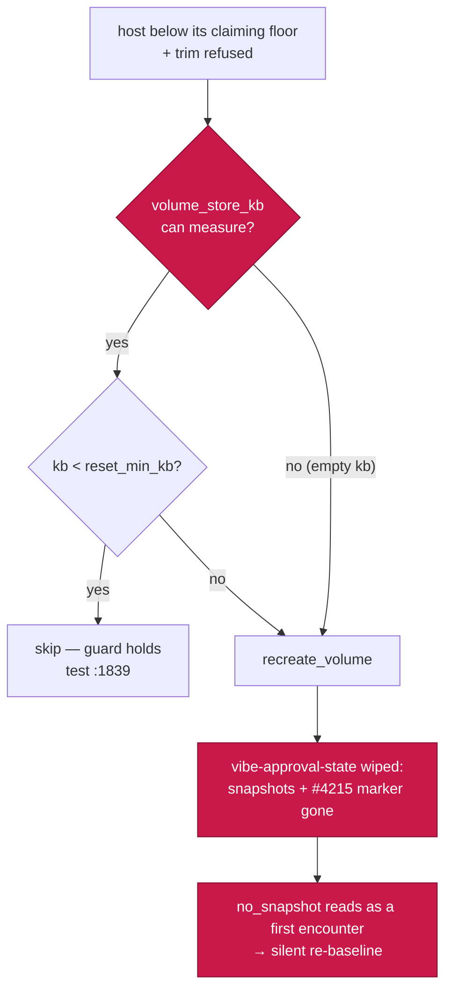

## Summary

Delta security sweep of the three top-level shell entry points — `run.sh`,
`setup.sh` and `loop.sh` — covering every hunk changed since
`docs/audits/security-sweep-1221-shell-entry-points.md` landed at
`2370a7de55bc85893dff3b342d862ab714f7795b`: +680 / −191 across 15 commits, read
hunk by hunk and triaged per `docs/SECURITY-SCAN.md` Phase 3. Adds one file,
`docs/audits/security-sweep-2181-shell-entry-points-delta.md`. Closes #2181.

**One finding survived triage** and is filed as
[#2216](https://github.com/stSoftwareAU/VibeCoder/issues/2216)
(`SEC-3cc92c0a026b`, `severity:medium`, `confidence:high`, CWE-693):
`heal_untrimmable_volumes` (`run.sh:1518`) applies the Issue #2117
minimum-size guard only when the volume's size can be measured —

```bash
kb="$(volume_store_kb "${volume}" || true)"
if [[ "${kb}" =~ ^[0-9]+$ ]] && ((kb < reset_min_kb)); then continue; fi
```

— so an unmeasurable volume falls straight through to `recreate_volume`. The
sibling path added in the same window, `reset_work_volumes_before_build`
(`run.sh:1108-1109`), fails **closed** on the identical condition. When this
catches `vibe-approval-state` it destroys the Issue #1341 work-on TOCTOU
baseline *and* the Issue #4215 initialised-store marker together, so
`readContentApprovalState` reads an uninitialised store, returns a genuine
first encounter, and the next run silently re-baselines every tracked issue
against content that may have been edited after approval.

**Not fixed in this change.** The issue authorises an in-change fix only for a
one-line defect. The correct remedy is to exclude that volume by *role* rather
than by size, which means the plan in `worker/deno/lib/container_launch.ts` must
mark which volumes may be reset for disk, and the assertion at
`run_sh_launcher_test.ts:1791` must change with it. The one-line fail-closed
variant would also change the work volume's Issue #478 heal behaviour on
unmeasurable stores — a trade to decide, not to assume.

Four of the five #1221 findings were fixed inside this window (#1298, #1299,
#1300, #1301, all closed); each was re-read at its new form rather than taken
on the issue's word. Seven further candidates were raised and refuted with
reasons, and every category the issue named that came back empty is stated as
empty.

## Evidence

Backend/documentation change with no web interface, so there is no screenshot
to capture. The evidence is reproducible command output.

**The finding is confirmed by the repository's own tests**, which encode both
outcomes on the same trim refusal — no new test was needed to demonstrate it:

| Test | Store directories created | Asserts |
| ---- | ------------------------- | ------- |
| `run_sh_launcher_test.ts:1791` | none — both volumes unmeasurable | `removedVolumes === [WORK_VOLUME_NAME, APPROVAL_STATE_VOLUME_NAME]` |
| `run_sh_launcher_test.ts:1839` | both, with sizes | approval store spared |



**Scope regenerated and verified exact**, not taken from the issue body:

```console
$ git diff 2370a7de55bc85893dff3b342d862ab714f7795b HEAD -- run.sh setup.sh loop.sh --stat
 loop.sh  |  44 +++--
 run.sh   | 578 ++++++++++++++++++++++++++++++++++++++++++++++-----------------
 setup.sh | 249 ++++++++++++++++++++++++---
 3 files changed, 680 insertions(+), 191 deletions(-)
$ git log --oneline 2370a7de..HEAD -- run.sh setup.sh loop.sh | wc -l
15
```

**`shellcheck` first, as the issue asks**, and clean at the level CI enforces:

```console
$ shellcheck -e SC1091 -e SC2034 run.sh setup.sh loop.sh ; echo $?
0
```

The optional-check counts were diffed note-for-note against the base commit:
no new check code appears, only more instances of the four the #1221 record
already triaged (SC2250 205→228, SC2310 48→58, SC2312 4→8, SC2249 2→2). Each
of the ten new SC2310 notes and four new SC2312 notes is attributed to its
call site in the record.

**Quality gate** — `./quality.sh < /dev/null` run in the foreground to
completion, exit 0, all checks PASSED (`config integration` SKIPPED by the
gate itself). Re-run after each round of review fixes, because the first run
predated later edits and its PASS had gone stale.

## Acceptance Criteria

<!-- vibe-spec-review inputs="diff+issue-body" -->

- **met** — Record names the base commit, the head commit and every hunk range read per file; nil results stated explicitly per category — evidence: `docs/audits/security-sweep-2181-shell-entry-points-delta.md:18-23` (commits and command), `:26-60` (6 / 17 / 21 hunk ranges, verified character-for-character against a regenerated diff by the reviewer), `:254-338` (nine categories stated empty) — reviewer: partial — reason: the reviewer verified every hunk range as exact but found the `run.sh` heading claiming "22 hunks" over 21 listed; corrected to 21 in `aca2859b` and confirmed against `git diff … -- run.sh | grep -c '^@@'` = 21.
- **met** — Surviving findings filed as `security` issues and cross-referenced; refutations recorded — evidence: #2216 (`security`, `bug`, `severity:medium`, `confidence:high`), cross-referenced both ways at `…-delta.md:131-135`; seven refutations at `:194-252`; three non-findings at `:340-366` — reviewer: partial — reason: the reviewer found #2216 missing the `<!-- finding-id: SEC-… -->` and `<!-- cwe: … -->` markers that `docs/SECURITY-SCAN.md:470-492` makes the Phase 4 dedup key; without them the next scan would re-file the same root cause. Stamped `SEC-3cc92c0a026b` / `CWE-693` (matching `FINDING_ID_RE`, `worker/deno/lib/security_sarif.ts:75`) and cross-referenced in the record.
- **met** — `./quality.sh < /dev/null` passes — evidence: full gate re-run in the foreground after the final edit, exit 0, every check PASSED — reviewer: missing — reason: the reviewer was right at the time. My first gate run preceded a later edit to the SC2310 triage row, whose unescaped `||` split a five-column table into seven cells and failed MD056, so that earlier PASS was stale. Pipes escaped in `aca2859b` and the gate re-run green; `markdownlint-cli2` reports 0 issues.

## Standards Review

<!-- vibe-standards-review inputs="diff+CODING-STANDARDS.md" -->

- **violation** — no `docs/archive/pr-summaries/pr-summary-2181.md`, which CODING-STANDARDS.md requires alongside the record (the sibling sweep `7da2defa` shipped one for #2179) — evidence: `docs/archive/pr-summaries/pr-summary-2181.md` — reason: fixed here — this file is that summary.
- **violation** — citation points at unrelated code: the deleted repo-list jq-merge is at `setup.sh:1096-1099` at the base commit, not `:1213-1216`, which is `prompt_launchagent_setup()` there — evidence: `docs/audits/security-sweep-2181-shell-entry-points-delta.md:112` — reason: fixed in this diff; verified by reading `setup.sh:1096-1099` out of the base blob. A record whose purpose is to stop a later sweep re-deriving the work is worthless if its citations land elsewhere.
- **violation** — cited range omits the line the claim rests on: `make_credential_dir` is `setup.sh:281-286`, and the cited `:284-289` started below the `umask 077` that makes it owner-only at creation — evidence: `docs/audits/security-sweep-2181-shell-entry-points-delta.md:304` — reason: fixed in this diff.
- **clean** — Australian English throughout (`initialised`, `optimisation`, `behavioural`, `unrecognised`; no US spellings); `markdownlint-cli2` 0 issues under the repo's own config; headings hierarchical, tables well-formed, every link resolves including the relative link to the #1221 record; commit safety (one non-hidden `docs/audits/*.md`, no `.env`/`.config.json`/`*.pem`, no `git add -f`); both commits carry `(Issue #2181)` and a `Vibe-Coder-Run-Id` trailer; every diff-scope fact exact; the whole `shellcheck` triage table reproducible at both commits; finding 1's code citations all verified; #1298-#1301 closed with the stated titles; no sweep-ledger entry owed (`lib-sweep-coverage.json` covers only `worker/deno/{lib,commands,setup}`); the #1221 record left untouched so `git log -1` still dates it correctly.

Two reviewer nits were taken as well: the `rm -rf` bullet now notes the second
literal occurrence at `setup.sh:1344` is inside a `print_info` string and never
executed, and the over-long line 112 was rewrapped to match the surrounding
text.

## Test Plan

No new tests. This change adds no runtime surface of its own — it is an audit
record, and the finding it reports is demonstrated by tests that already exist
rather than by tests added here:

- `worker/deno/tests/run_sh_launcher_test.ts:1791` and `:1839` are the
  confirming evidence for finding #2216; they pass today, because `:1791`
  currently asserts the defective outcome. A fix PR for #2216 carries the
  regression test and changes that assertion.
- `./quality.sh < /dev/null` — full gate, exit 0, including `deno tests`,
  `semgrep`, `markdownlint` and `mermaid` over the new record.
- `shellcheck -e SC1091 -e SC2034 run.sh setup.sh loop.sh` — exit 0.
