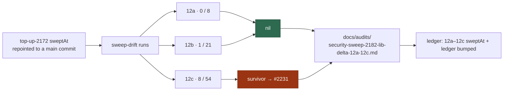

## Summary

Delta security sweep of `worker/deno/lib/` ledger slices **12a**
(subprocess/argv), **12b** (filesystem/temp) and **12c** (untrusted GitHub
ingestion) for everything added or modified since the #1610 record landed at
`9442a932…`. Closes #2182.

The drift lists were regenerated with `sweep-drift`, not taken from the issue's
planning-time counts: **12a 0 added / 8 modified, 12b 1 / 21, 12c 8 / 54** — 92
modules, all accounted for. Added modules were read in full; modified modules
had their hunks read and followed into the module wherever a hunk touched the
slice's sink. Nothing was skipped, including the modules #2170 would have
allowed a skip-with-citation for.

12a and 12b are **nil**. 12c produced **one survivor**, filed as
[#2231](https://github.com/stSoftwareAU/VibeCoder/issues/2231):
`clearEarlierSyncEscalation` in `milestone_branch_sync.ts` removes the
`needs-human` label when the issue thread contains a fixed, guessable comment
marker — and never checks who wrote the comment, so any commenter on this public
repo can strip a human-attention label. Not fixed here: the gate needs the
comment author threaded through `escalateSyncConflict` and the fleet identity
resolved, which is more than the one-line fix #2182 permits a sweep to carry.

`sweep-drift` could not run at all before this change: slice `top-up-2172`
carried a squash-deleted feature-branch `sweptAt`, and `driftSince` fails the
**whole** report on it. It is repointed at the commit that added its record to
`main`, exactly as the #2178 remedy message instructs.

### What changed

## Evidence

Backend/documentation change — there is no web interface to screenshot. The
evidence is the sweep output and the gate:

- Drift regenerated with the command the record names:
  `deno run --allow-read --allow-run --allow-env --allow-sys=hostname worker/deno/mod.ts sweep-drift --repo "$(pwd)"`.
- Every one of the 92 drift paths appears in the record — checked mechanically
  by grepping each path from the `sweep-drift` output against
  `docs/audits/security-sweep-2182-lib-delta-12a-12c.md` (0 missing).
- `worker/deno/tests/lib_sweep_coverage_test.ts` — 31 passed, 0 failed, against
  the edited ledger.
- `markdownlint-cli2` on the new record — 0 issues.

## Acceptance Criteria

<!-- vibe-spec-review inputs="diff+issue-body" -->

- **met** — every added module and every modified hunk in the three slices'
  drift lists is accounted for; nil stated explicitly per slice — evidence:
  `docs/audits/security-sweep-2182-lib-delta-12a-12c.md` lists all 92 drift
  paths name-for-name (0/8, 1/21, 8/54), and "12a is nil", "12b is nil", "12c is
  not nil" each appear in their own section — reviewer: met
- **met** — survivors filed as `security` issues and cross-referenced;
  refutations recorded — evidence:
  [#2231](https://github.com/stSoftwareAU/VibeCoder/issues/2231) (label
  `security`, cites #2182 and the record; the record's findings table cites it
  back), 23 refutations recorded with `file:line` citations — reviewer: met
- **met** — `sweptAt` and `ledger` updated for 12a–12c; `deno test` (incl.
  `worker/deno/tests/lib_sweep_coverage_test.ts`), `deno lint`,
  `deno fmt --check` pass — evidence: `docs/audits/lib-sweep-coverage.json` sets
  all three to `9395461966809ac1a5c7223dcf80b4e7cc1c324f` (=
  `git merge-base origin/main HEAD`, an ancestor of `origin/main`); the reviewer
  independently ran the test (31 passed), `deno lint` and `deno fmt --check` —
  reviewer: met
- **met** — (method bullet) `claude_credential_pool.ts` was only partially read
  by #2170 and must be read — evidence: record section
  "`claude_credential_pool.ts` — read across slices"; its drift was read at hunk
  level against slice 12k's own `sweptAt` and found nil — reviewer: partial —
  reason: the reviewer saw the pre-amendment diff, where the module was deferred
  to #2183 on the grounds that 12k is not one of this record's slices; it has
  since been read and recorded here, without bumping 12k's `sweptAt`
- **unrequested** — `docs/audits/lib-sweep-coverage.json`: slice `top-up-2172`'s
  `sweptAt` repointed from `de3581eca8…` to `5f3e6d9b8c…` — reviewer:
  unrequested — reason: a hard blocker, not creep — that commit was
  squash-deleted, `collectSweepDrift` loops every slice and throws before
  printing, so no slice's drift list could be generated at all until it was
  fixed; the new value is exactly what the #2178 remedy message prescribes

## Standards Review

<!-- vibe-standards-review inputs="diff+CODING-STANDARDS.md" -->

- **violation** — every PR must carry
  `docs/archive/pr-summaries/pr-summary-<issue>.md` with Summary (incl. the
  closing keyword), Evidence and Test Plan — evidence:
  `docs/archive/pr-summaries/pr-summary-2182.md` — reason: the reviewer read the
  commit before this file existed; it is added in this diff, carrying
  `Closes #2182`
- **clean** — Australian English throughout ("sanitised", "neutralises",
  "canonicalised", "deduped"); the only American spellings anywhere are
  `color:#fff` inside Mermaid style directives
- **clean** — commit safety: nothing matching `.*`, `*.pem`, `*.key` or
  `credentials.json` staged; two ordinary tracked docs, no `git add -f`, no
  `--no-verify`
- **clean** — Mermaid: the sweep's flow is carried by a fenced `mermaid`
  flowchart, matching the sibling #1610 record's shape
- **clean** — formatting: `deno fmt --check` passes and `markdownlint-cli2`
  reports 0 issues across the repo's doc globs
- **clean** — the `sweptAt` rule in `docs/SECURITY-SCAN.md`: the new value
  equals `git merge-base origin/main HEAD`, and the repointed `top-up-2172`
  value is exactly
  `git log --diff-filter=A -1 --format=%H origin/main -- docs/audits/security-sweep-2172-milestone-groups-gate.md`
- **clean** — commit conventions: subject names `(Issue #2182)` and the body
  carries the `Vibe-Coder-Run-Id` trailer

## Test Plan

No production code changed, so no new test was added — the deliverables are an
audit record and a ledger edit, and the ledger has an existing enforcing test.

- `worker/deno/tests/lib_sweep_coverage_test.ts` — 31 passed, 0 failed. It is
  the failure detection #2182 names: it fails if a slice's record path does not
  exist or its `sweptAt` is malformed, and it now also covers the
  unreachable-`sweptAt` remedy message added by #2178.
- `deno run … mod.ts sweep-drift --repo "$(pwd)"` — exits 0 and prints a block
  for every slice. Before the `top-up-2172` repoint it exited non-zero with
  `fatal: bad object de3581eca8…`, so this is also the regression evidence for
  that one-line fix.
- `./quality.sh` — full gate, run after the final edit.
- `markdownlint-cli2` over the repo's doc globs — 0 issues.

The survivor's own regression test rides its fix PR, per #2182's "Failure
Detection" — the acceptance criteria on
[#2231](https://github.com/stSoftwareAU/VibeCoder/issues/2231) require a test
that fails against the current code.
