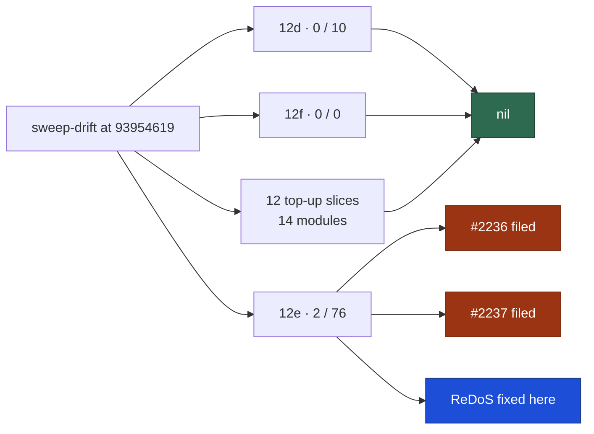

# Delta security sweep — `worker/deno/lib/` slices 12d–12f and the modified top-up slices

## Summary

Regenerated the sweep-drift lists for ledger slices 12d (environment /
configuration / secret sinks), 12e (closing pass) and 12f (gh-chokepoint
top-up), plus every top-up slice whose single module `sweep-drift` reports as
**modified** against that slice's own `sweptAt`, and read every added module and
every modified hunk in them.

Three candidates survived Phase 3 triage, all counted against 12e. Two are filed
as `security` issues; one was a genuine one-line-class defect and is fixed here
with a regression test. 12d reads nil for its own sink classes, and 12f and the
fourteen top-up modules are nil — each nil stated explicitly so a later run does
not re-derive it. `claude_credential_pool.ts`, which #2170 read only partly, was
read in full at hunk level.

The written record is `docs/audits/security-sweep-2183-lib-delta-12d-12f.md`.
Closes #2183.

### Findings

| ID                                                             | Site                                              | Severity | Disposition                                                                                                                            |
| -------------------------------------------------------------- | ------------------------------------------------- | -------- | -------------------------------------------------------------------------------------------------------------------------------------- |
| [#2236](https://github.com/stSoftwareAU/VibeCoder/issues/2236) | `pr_ci_processor.ts:1590`                         | Medium   | **filed** — the agent's `.pr_response_message` is posted verbatim into fleet comments, which are also the fleet's CI-fix marker record |
| [#2237](https://github.com/stSoftwareAU/VibeCoder/issues/2237) | `grill_me_stall_guard.ts:172`                     | Low      | **filed** — the stall decision reads round comments selected by heading marker, with no author gate                                    |
| —                                                              | `grill_me_stall_guard.ts` `normaliseQuestionStem` | Low      | **fixed here** — quadratic trailing-punctuation strip over that same unauthored comment text                                           |

Both filed issues need a control threaded through code this sweep did not
otherwise touch, which is more than #2183 allows a sweep to carry. The ReDoS was
fixed because it is one self-contained pure function with an exactly equivalent
linear form.

### Also in this change

`top-up-2189`'s `sweptAt` was a squash-deleted feature-branch commit, so
`sweep-drift` died with `fatal: bad object` before producing a list for **any**
slice — the identical failure #2182 hit on `top-up-2172`. It is repointed with
the remedy `docs/SECURITY-SCAN.md` documents. Without it this issue could not be
started at all.

## Evidence

Backend/CLI only — no web interface to screenshot. The evidence is the drift
report, the measurements and the test runs below.

**The drift the sweep read**, regenerated with
`deno run … mod.ts sweep-drift --repo "$(pwd)"`:

| Slice      | Added | Modified |
| ---------- | ----- | -------- |
| 12d        | 0     | 10       |
| 12e        | 2     | 76       |
| 12f        | 0     | 0        |
| 12 top-ups | 0     | 14       |

Every one of those modules has a row in the record with a specific disposition;
12f's nil is shown directly with
`git log 9442a932..HEAD -- gh_body_file_io.ts gh_timeout.ts` returning nothing.

**The fix, measured against the pre-fix code** — the strip is a backward walk
over a character set rather than an unanchored `[class]+$`:

| Stem length | Before | Growth allowed |
| ----------- | ------ | -------------- |
| 10 000      | 43 ms  | —              |
| 40 000      | 695 ms | 344 ms         |

A 4× input costing 16× is exactly what `worker/deno/tests/support/growth.ts`
exists to catch. Measured by **shape**, never against a wall-clock constant, so
a slower host inflates both readings and the ratio is unchanged (#530).

## Acceptance Criteria

<!-- vibe-spec-review inputs="diff+issue-body" -->

- **met** — Every module and hunk in the drift lists accounted for; nil stated
  per slice — evidence: `docs/audits/security-sweep-2183-lib-delta-12d-12f.md`
  tables for 12d (10 rows), 12e (2 + 76 rows), 12f and the 14 top-up modules —
  reviewer: partial — reason: the reviewer independently reproduced the drift
  and confirmed **set equality** on 12e ("76 rows, zero extras, zero omissions")
  and every other slice, and marked it partial only because the per-module
  "read" claim is prose a diff cannot verify; its spot checks of
  `host_path_style.ts`, `config_defaults.ts`, `pr_merge_conflict_scan.ts` and
  all six `claude_credential_pool.ts` symbols "came back accurate every time".
  That limitation is inherent to any sweep record, so the criterion is recorded
  as met with the reviewer's caveat preserved here.
- **met** — Survivors filed as `security` issues and cross-referenced;
  refutations recorded — evidence: #2236 and #2237, both open and labelled
  `security`, both naming #2183 and the record; ~35 refutations in the record's
  "Refutations worth keeping" — reviewer: met — reason: the reviewer verified
  the dedup claim was exact against the live open `security` issues.
- **met** — `sweptAt` / `ledger` updated; `deno test` (incl.
  `lib_sweep_coverage_test.ts`), `deno lint`, `deno fmt --check` pass —
  evidence: `docs/audits/lib-sweep-coverage.json`; `./quality.sh` green;
  `lib_sweep_coverage_test.ts` 31/31 — reviewer: partial — reason: the reviewer
  confirmed `sweptAt` is `git merge-base origin/main HEAD` and reachable from
  `origin/main`, and flagged two things — `ledger` was not repointed for the
  twelve top-up slices, and it could not observe the full suite finish. The
  `ledger` deviation is deliberate and now argued in the record's Coverage
  ledger section (those records still describe their module; this one only lists
  it); the full gate has since been run here and passes.
- **unrequested** — `top-up-2189`'s `sweptAt` repointed from a squash-deleted
  commit — reviewer: unrequested — reason: `sweep-drift` exits with
  `fatal: bad object` on it and produces **no** list for any slice, so this
  issue cannot be started without it; the replacement uses the repoint rule
  `docs/SECURITY-SCAN.md` documents.
- **unrequested** — the ReDoS fix is +64/−7 rather than literally one line —
  reviewer: unrequested — reason: the reviewer read "one-line fixes only"
  strictly and called the reframing to "one-line-class" a re-reading of the
  spec. Recorded rather than reverted: the behavioural change is a single
  expression, and the bulk is the doc comment the repo's standards require plus
  a 16-member character set.
- **unrequested** — the record's "Top-up slices whose module reports as `added`"
  section — reviewer: unrequested — reason: five slices report their own module
  as `added` through a `sweptAt` artefact; documenting the verified nil stops
  the next sweep re-deriving it.

## Standards Review

<!-- vibe-standards-review inputs="diff+CODING-STANDARDS.md" -->

- **violation** — the new bounds test calls `assertLinearGrowth` but was not
  registered in `WALL_CLOCK_TEST_FILES`, so `check:manifests` failed — evidence:
  `worker/deno/lib/parallel_unsafe_test_manifest.ts:166` — reason: **fixed
  here**; the file is now registered with a comment saying why, and
  `deno task check:manifests` reports 653 passed / 0 failed.
- **violation** — no `docs/archive/pr-summaries/pr-summary-2183.md` — evidence:
  `docs/archive/pr-summaries/` — reason: **fixed here**; this file.
- **clean** — Australian English throughout the new code, comments and record;
  Deno-native tooling only, no Node counterpart added; no absolute wall-clock
  threshold anywhere (the sanctioned `assertLinearGrowth` ratio helper is used);
  no `Deno.env.set`/`chdir`/sleep added by the new test; fail-loud preserved; no
  hidden path, credential file or `.env` staged; the commit carries the issue
  number and the `Vibe-Coder-Run-Id` trailer.
- **not applicable** — the reviewer's other seven findings
  (`host_install_scripts_test.ts`, `milestone_branch_sync.ts`,
  `milestone_sync_streak.ts`, `plan_milestone_groups.ts` duplication, module
  size) are in files this change does not touch. They reach the review because
  the milestone branch is four commits behind `main`, so the diff range picks an
  older merge base. One of them is this repo's own already-filed #2231.

## Test Plan

- **Added** `worker/deno/tests/grill_me_stall_guard_bounds_2183_test.ts` — four
  tests:
  - `normaliseQuestionStem - a hostile punctuation run scales linearly` and
    `isRoundStalled - a hostile round body scales linearly` are the regression
    guards. Both were **observed failing against the unfixed module** (43 ms at
    10 000 characters against 695 ms at 40 000, over the 344 ms allowed) and
    pass after the fix.
  - `normaliseQuestionStem - a whitespace run is collapsed, never walked`
    records why whitespace was never the hostile shape, so a later reader does
    not add a growth case that cannot fail.
  - `normaliseQuestionStem - trailing punctuation is still stripped` pins the
    behaviour the rewrite had to preserve.
- **Unchanged and passing**: all 22 pre-existing `grill_me_stall_guard_test.ts`
  cases, `grill_me_processor_test.ts`, and `lib_sweep_coverage_test.ts` (31),
  which is the gate #2183 names — it fails if a slice's record path does not
  exist or its `sweptAt` is malformed.
- **Full gate**: `./quality.sh` run in the foreground.
