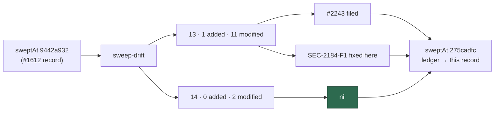

# Delta security sweep — `worker/deno/commands/` slice 13 and `worker/deno/setup/` slice 14

## Summary

Regenerated the `sweep-drift` lists for ledger slices 13 (commands CLI entry
points) and 14 (setup CLI) against their previous `sweptAt`,
`9442a932…` — the commit the #1612 record landed at — and read the one added
module in full plus every modified hunk in both.

Two candidates survived Phase 3 triage, both in slice 13. One is filed; one is
a self-contained fail-silent defect fixed here with a regression test. Slice 14
is nil, stated explicitly. Both `sweptAt` values move to
`275cadfc6d601758a8d72b738e189fc16a67c0c0` — `git merge-base origin/main HEAD`,
the `main`-reachable rule #2178 documents — and both `ledger` fields point at
the new record, `docs/audits/security-sweep-2184-commands-setup-delta.md`.

Closes #2184.

### Findings

| ID | Site | Severity | Disposition |
| -- | ---- | -------- | ----------- |
| [#2243](https://github.com/stSoftwareAU/VibeCoder/issues/2243) | `lib/implementation_comments.ts:239`, reached from `commands/work_on_issue.ts` | Low | **filed** — the implementation path's selection cap runs ahead of `detectCommentFlood` and the suspicious-pattern collection, which `comment_trust_filter.ts` places deliberately before every cap |
| SEC-2184-F1 | `commands/callback_conformance.ts:89` | Low | **fixed here** — `--host-failure` bypassed the Issue #2107 refusal, so the fixture reported a proven contract for a hook it never ran |

#2243 is filed rather than fixed because restoring the invariant means
auditing the full annotated thread while the selection bounds only what is
carried — more than the one-line change #2184 allows a sweep to carry.
SEC-2184-F1 is one extra condition at a single call site.

## Evidence

Backend/CLI only — no web interface to screenshot. The evidence is the drift
report, the code reads recorded in the audit file, and the test runs below.

**The drift the sweep read**, regenerated with
`deno run … mod.ts sweep-drift --repo "$(pwd)"`:

| Slice | Added | Modified | Unowned |
| ----- | ----- | -------- | ------- |
| 13 `commands/` | 1 | 11 | 0 |
| 14 `setup/` | 0 | 2 | 0 |

Every one of those modules has a row in the record with a band and a specific
disposition. `commands/toolchain_selfcheck.ts`, added under `commands/` in the
same window, is reported as `top-up-2070`'s drift and belongs to that slice's
record — not slice 13's.

**SEC-2184-F1, reproduced before the fix.**
`worker/deno/mod.ts:428` builds each argument key with `arg.slice(2)` and does
no dash/underscore normalisation, so `--host-failure` — the spelling every
other flag on this command uses — arrives as `args["host-failure"]`. The
Issue #2107 guard read `args.host_failure` alone, `parseArguments` iterates
`CONTAINER_CALLBACK_EVENTS` only, and the value was dropped. Driving the
command with that key returned `success: true` against the unfixed guard; it
returns the refusal after it.

`./quality.sh` passes (`Result: PASSED (with skipped checks)` — `config
integration` is the environment-gated skip, not a failure). It was re-run after
the fix landed.

## Acceptance Criteria

<!-- vibe-spec-review inputs="diff+issue-body" -->

- **met** — every module and hunk in both drift lists accounted for; nils stated per slice — evidence: `docs/audits/security-sweep-2184-commands-setup-delta.md` slice-13 table (12 rows, one per module, each banded A1/A2/A3/B1/B2/C) and slice-14 table (2 rows), with "Slice 13 result" and "Slice 14 result" stating the nils and `unowned: 0` recorded for both — reviewer: met
- **met** — survivors filed as `security` issues and cross-referenced; refutations recorded — evidence: #2243 open with the `security` label, citing #2184 and the record path, and cross-linked from the record's Findings table; eight commands refutations, four setup refutations and three residuals recorded — reviewer: met — reason: the reviewer noted the second survivor was fixed in-PR rather than filed, and read that as satisfied because the issue's "one-line fixes only, each with a regression test" clause authorises it; recorded here so the departure from a literal reading is visible
- **met** — both `sweptAt` entries updated; `deno test` (incl. `worker/deno/tests/lib_sweep_coverage_test.ts`), `deno lint`, `deno fmt --check` pass — evidence: `docs/audits/lib-sweep-coverage.json` slices 13 and 14 at `275cadfc…`, which is `git merge-base origin/main HEAD` and contained in `main`; full `./quality.sh` green, covering all three stages — reviewer: met

No `unrequested` entry: the Spec reviewer traced every change in the diff to
the issue, including the one-line `callback_conformance.ts` guard.

## Standards Review

<!-- vibe-standards-review inputs="diff+CODING-STANDARDS.md" -->

- **violation** — no PR summary under `docs/archive/pr-summaries/` — evidence: the reviewed diff carried only the record, the ledger and the fix — reason: fixed here; this file is that summary, and it carries the regression-test linkage the standard asks be stated in it
- **violation** — DRY: the new regression test looped over both `host_failure` and `host-failure`, re-asserting what the existing #2107 case already proves — evidence: `worker/deno/tests/callback_conformance_test.ts:279` — reason: fixed here; the case now asserts the kebab spelling alone and points at the #2107 case above it for the underscore
- **clean** — Australian English throughout (the only `color` tokens are Mermaid `style` directives); no hidden path staged; the test calls `callbackConformanceCommand.execute` with real arguments and asserts on the returned `success`/`message` rather than grepping source; no wall-clock sleep, env mutation or absolute-millisecond threshold in the new test; the fix widens a refusal rather than narrowing one, so nothing is caught-and-ignored; KISS — one condition at one call site, with no change to `parseArgs`; commit messages carry the issue reference and the `Vibe-Coder-Run-Id` trailer; the ledger's new `sweptAt` is an ancestor of `origin/main`; the record's heading hierarchy and tables satisfy the enabled markdownlint rules

## Test Plan

- **Added** `worker/deno/tests/callback_conformance_test.ts::callback_conformance command - the kebab spelling is refused too (Issue #2184)` — drives the command with `--host-failure` and asserts the refusal. Observed failing against the unfixed guard (`success` was `true`) and passing after it.
- **Unchanged and still green** `worker/deno/tests/callback_conformance_test.ts` (13 tests) — including the Issue #2107 underscore case the fix must not regress.
- **Unchanged and still green** `worker/deno/tests/lib_sweep_coverage_test.ts` and `worker/deno/tests/sweep_drift_command_test.ts` (36 tests) — the ledger gate that fails in CI if a slice's record path does not exist or its `sweptAt` is malformed.
- **Full gate** `./quality.sh` — PASSED, re-run after the final edit.
