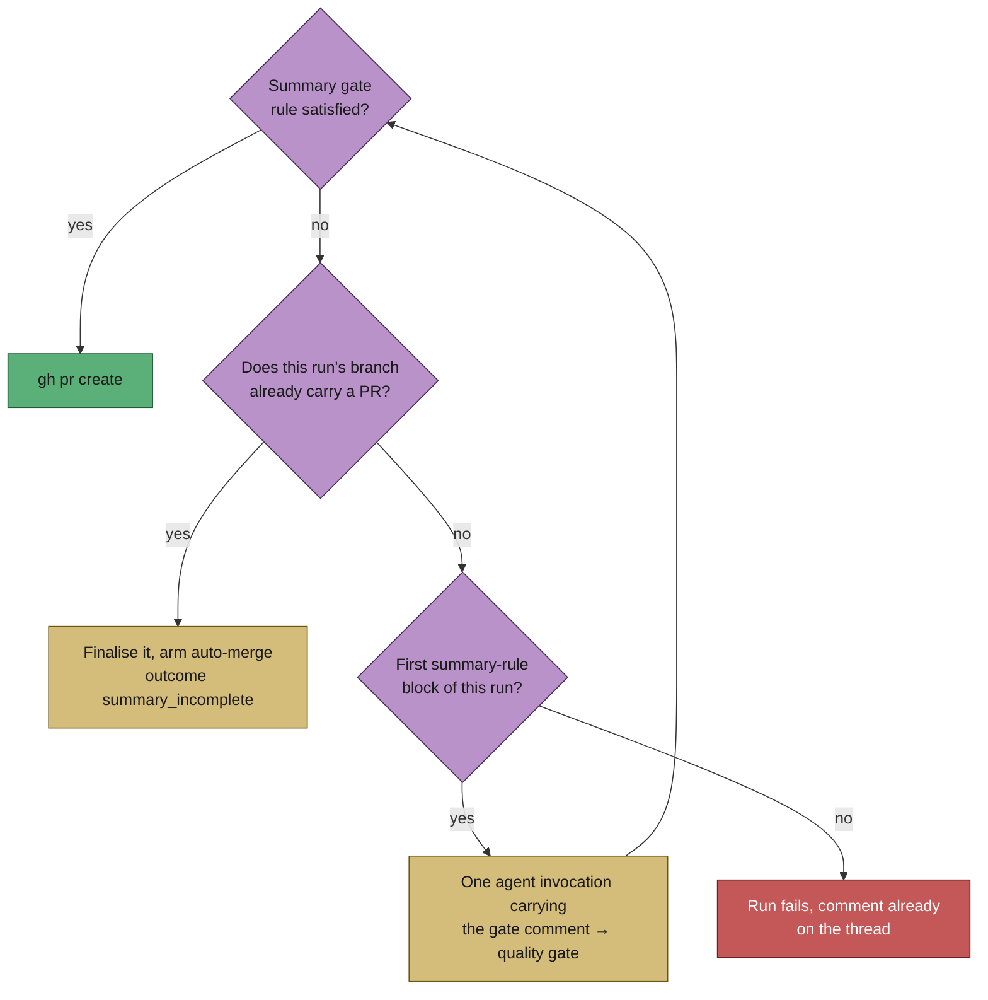

## Summary

A PR-summary rule block that reached no PR ended the run, so the next whole
agent session existed only to add a documentation block to a branch that was
already pushed and quality-gated. On this host that was 4 of 16 runs that
reached completion, 3 of them failed outright as `no_pr:unknown:completion`.

The first summary-rule block of a run now recovers in-run, the way the
security-fix gate has since Issue #1575: the gate's own remediation comment is
replayed into one short agent invocation, the quality gate runs again over the
changed tree, and completion is attempted once more. A second block in the same
run fails exactly as before. Closes #2189.

- **In-run recovery** — `worker/deno/lib/summary_rule_gate_retry.ts` builds the
  retry prompt (the gate comment verbatim, between named notice markers) and
  drives invocation → quality gate → completion.
- **One invocation per run** — `workOnIssueCompletion` enters the recovery only
  when the run has recorded exactly one block, so a block on the re-run is the
  second and fails. The recovery never re-enters itself.
- **All three summary gates** — closure (#518), independent review (#663) and
  reproduction status (#521) route through `reportSummaryRuleBlock`, so all
  three recover. The security-fix and changed-workflow gates are unchanged:
  they report defects in the change, not documentation shortfalls.
- **Failure directions** — an invocation that cannot be launched changed nothing
  on the branch, so the original block is returned unaltered; the same verdict
  is never posted to the issue twice; a block on a run that already has a PR
  still takes Issue #1140's `summary_incomplete` path, with no invocation at all.
- The infrastructure retry in `runCompletionAttempt` now also skips a
  summary-rule block — re-running the same body against the same summary
  reproduces the verdict.

## Evidence

Backend/worker change with no web interface, so there is nothing to screenshot;
the evidence is the tests below, driving the live completion phase.



Targeted run of the new and neighbouring suites:

```text
deno test --allow-all tests/completion_phase_*.ts tests/summary_rule_gate_retry_test.ts
ok | 122 passed | 0 failed
```

## Test Plan

Added `worker/deno/tests/completion_phase_summary_rule_retry_test.ts`, which
drives the **live** completion phase and asserts on the observable outcome —
invocation count, prompt contents, `gh pr create` calls, comments posted:

- `completion - a first summary-rule block re-invokes the agent once and the PR is raised`
  — exactly one invocation, one quality-gate re-run, PR created.
- `completion - the recovery prompt carries the gate's own remediation comment`
  — the prompt carries the closure gate's comment and the summary path, and the
  comment is on the issue thread once.
- `completion - a second block in the same run ends the run with one comment`
  — the run fails, no second invocation, no `gh pr create`, one comment.
- `completion - a recovery invocation that cannot be launched leaves the block standing`
  — the block stands, the quality gate does not re-run.
- `completion - the reproduction gate recovers on the same path` — the same
  recovery for a `bug`-labelled run's `## Reproduction` block.
- `completion - a block on a run that already has a PR is not re-invoked` —
  Issue #1140's path is untouched.

Added `worker/deno/tests/summary_rule_gate_retry_test.ts` for the prompt
builder: the verdict replay, the "no new work / do not create the PR / never
invent a reviewer verdict" instructions, and the two fail-loud refusals (an
unusable issue number, an empty remediation comment).

Existing suites re-run unchanged: `completion_phase_acceptance_closure_test.ts`,
`completion_phase_summary_incomplete_test.ts`,
`completion_phase_reproduction_status_test.ts`,
`completion_phase_security_gate_retry_test.ts`, `lib_sweep_coverage_test.ts`.

## Documentation

- `docs/workflows/issue-processing.md` — new section *The in-run recovery from a
  summary-rule block*, with the gate flowchart updated to show the recovery arm.
- `docs/audits/security-sweep-2189-summary-rule-gate-retry.md` and the
  `top-up-2189` slice in `docs/audits/lib-sweep-coverage.json` — the security
  reading of the new module, as the coverage ledger requires.
