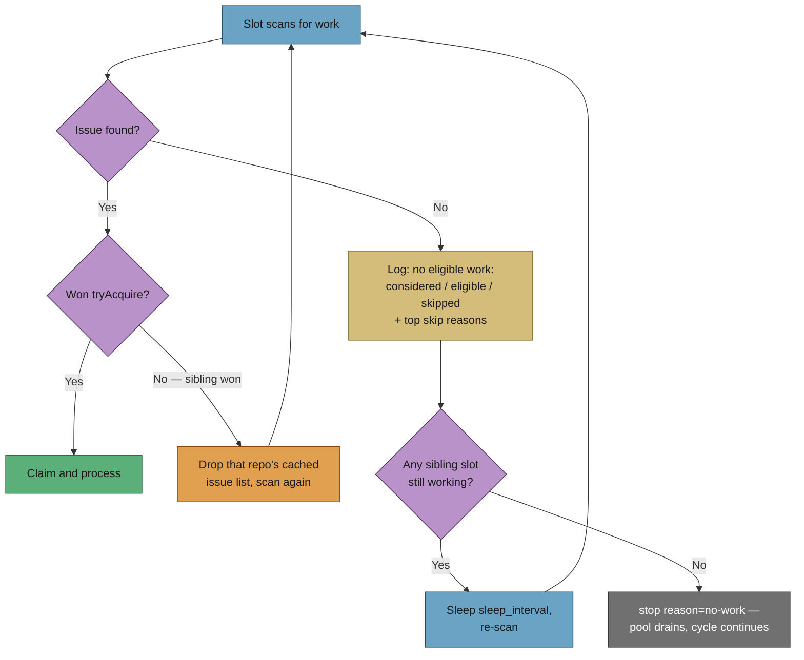

# Pool slots state why they found nothing — and keep looking

## Summary

A pool slot whose `findNextIssue` returned `null` did `return` with no log
line at all. In the reported run, `s2` wrote **nothing** for the whole hour
after `s1` claimed GRQ#4202, while `diagnose-repo` showed a dozen eligible
`top-priority` issues: a two-slot pool silently ran as one, and the log could
not say so. Closes #219.

Four changes in `runSlot` (`worker/deno/lib/run_core.ts`) and the scan it
calls:

1. **Every slot exit states its reason** — `stop reason=no-work`,
   `deadline`, `shutdown`, `drain`, `exit`, `find-error`. Previously only
   `deadline` and `shutdown` were logged.
2. **An empty scan is quantified.** The `no eligible work:` line carries
   `considered=N eligible=N skipped=N top-skips=reason=count,…`, rendered by
   the new `formatScanSummary` in `issue_finder_logger.ts`. The counts ride
   the finder result (`FindIssuesResult.diagnosticSummary`) and reach the
   slot through `findNextIssue`'s new `onScanSummary` callback, so they are
   visible **without** `ISSUE_FINDER_DEBUG` — which is off in production.
3. **A slot that finds nothing re-scans instead of retiring.** While a
   sibling slot still holds work, the empty slot sleeps `sleep_interval` and
   scans again, so work that becomes claimable mid-cycle is picked up within
   one interval. It retires only when no sibling is running — that is the
   pool draining so the maintenance ladder can run, and it says so.
4. **A lost `tryAcquire` drops that repo's cached issue list** (new optional
   `invalidateRepoIssueCache` dep, wired to `IssueCache.invalidateRepo`), so
   the re-scan is not served the same ranking that just lost from the 600 s
   cache. A cache that will not clear is logged loudly and the slot keeps
   scanning — a stale ranking still beats idling for the rest of the cycle.

The idle re-scan interval is floored at one second so a misconfigured
`sleep_interval: 0` cannot hot-loop the GitHub API, and the loop yields to
the event loop each pass so an idle slot can never starve a sibling's
in-flight I/O.

## Evidence

Backend/CLI change — no web interface to screenshot. Verified by tests
(below) and by confirming each new test fails against the unfixed code.



**Regression check** — with the fix reverted to `if (issue === null) return;`
and the invalidation removed, all three new pool tests fail:

```
FAILED | 0 passed | 3 failed | 23 filtered out
  slot pool - a slot that finds nothing while a sibling works …
  slot pool - a slot that finds nothing with no sibling running …
  slot pool - a slot that loses the acquire race …
```

With the fix in place: `ok | 26 passed | 0 failed` for
`run_core_slot_pool_test.ts`, and `298 passed | 0 failed` across the
`run_core*`, `issue_finder*`, `find_oldest*` and `slot_*` suites.

**Quality gate** — `./quality.sh` passes every check except `deno tests`,
which reports 10 pre-existing failures unrelated to this change
(`setup_workdir_reminder_test.ts`, `optional_feature_env_test.ts`,
`fleet_health_test.ts`, `host_workdir_guard_test.ts` — host work-dir paths
that do not exist in this container). Verified identical on a clean tree with
this branch's changes stashed: `FAILED | 63 passed | 10 failed`.

## Test Plan

Added, all failing before the fix and passing after:

- `worker/deno/tests/run_core_slot_pool_test.ts`
  - *a slot that finds nothing while a sibling works states why and re-scans
    instead of retiring* — asserts the idle slot claims work that appears on
    a later scan, and that the log line carries
    `considered=12 eligible=0 skipped=12 top-skips=cooldown=8,repo-busy=4`
    and the re-scan interval.
  - *a slot that finds nothing with no sibling running retires with a stated
    reason* — both slots log `stop reason=no-work` with their counts, exactly
    once per pool.
  - *a slot that loses the acquire race drops that repo's cached issue list
    before re-scanning* — asserts `invalidateRepoIssueCache` is called with
    the winner's repo.
- `worker/deno/tests/issue_finder_logger_test.ts` — three `formatScanSummary`
  cases: full counts, top-N truncation busiest-first, and a scan with no
  skips.
- `worker/deno/tests/find_oldest_issue_test.ts` — *a scan that selects
  nothing still reports its counts*: a scan whose only candidate is in
  cooldown returns `found: false` with `diagnosticSummary.skippedByReason
  .cooldown === 1`.

Docs updated in the same change: `docs/workflows/resilience-and-concurrency.md`
(new section with the diagram above) and the `max_concurrent_issues` row in
`docs/CONFIGURATION.md`.
