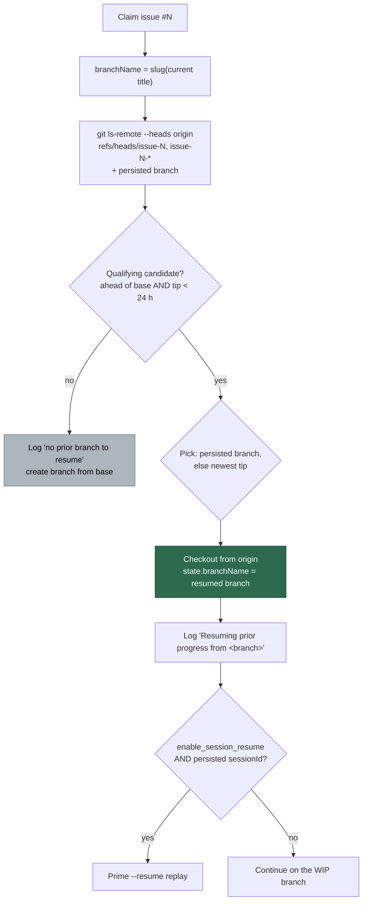

# PR Summary — Issue #220

## Summary

Resume-on-reclaim keyed on the **title-derived** branch name, so it was only as
stable as the issue title. When #211 was retitled between two claims the second
claim derived a different slug, matched nothing, and started from scratch while
`origin/issue-211-two-hosts-…` still carried a 20-file WIP commit (`7bc5ea8`).
The same happened whenever the clarity pass rewrote a title or slug truncation
differed between hosts.

Prior work is now found by issue **number**:

- New `worker/deno/lib/issue_branch_resume.ts` asks the remote
  `git ls-remote --heads origin refs/heads/issue-<N> refs/heads/issue-<N>-*`,
  plus `refs/heads/<persisted branch>` so the resume pointer is honoured
  whatever the branch is called.
- A candidate qualifies when it carries commits beyond the base branch and its
  tip is inside the 24 h resume window (the same window as the resume file —
  it keeps a long-dead, squash-merged branch from being rebuilt). Of the
  qualifying candidates the persisted branch wins, else the most recently
  pushed; the rest are named in the log.
- The lookup no longer sits behind `enable_session_resume`. That flag now gates
  only the CLI `--resume` conversation replay and the periodic checkpoints, not
  whether pushed WIP is used.
- The resumed branch becomes `state.branchName`, so this run's commits, push
  and PR head all follow the branch that holds the work rather than the new
  title's slug.
- Every claim logs which branch it resumed, or that none existed.

Resume stays an optimisation, never control flow: an `ls-remote` failure, an
unfetchable branch, or an unmeasurable ahead-count degrades to "start clean"
with the reason named in the log rather than failing the phase. The one loud
throw is a non-positive/non-integer issue number — globbing on that would be
worse than stopping.

Closes #220.

## Evidence

Backend/CLI change — no web interface to screenshot. Verified by tests (below)
and the full local gate.

Local gate: `./quality.sh` passes every check except 10 pre-existing failures in
`setup_workdir_reminder_test.ts`, `fleet_health_test.ts`,
`host_workdir_guard_test.ts` and `optional_feature_env_test.ts`, which are
host-work-dir/environment assertions unrelated to this change — confirmed by
stashing the change and re-running those files on a clean tree (same 9/10
failures).

## Test Plan

New `worker/deno/tests/issue_branch_resume_test.ts` (unit, 15 cases):

- ref patterns key on the issue number; the persisted branch is added whatever
  it is called, and not duplicated when the glob already covers it;
- `ls-remote` parsing keeps only well-formed `refs/heads/*` lines with a 40-hex
  sha (malformed and dash-leading refs dropped);
- selection: persisted branch beats a newer sibling; without a pointer the most
  recently pushed wins; unknown tip times rank last;
- lookup: a retitled issue resumes the old-title branch; a branch level with
  base, a branch older than the window, an unfetchable branch and an empty
  remote all decline; an unreachable remote and an unknown ahead-count are
  handled loudly (the latter still resumes rather than losing WIP); a
  non-numeric issue number throws.

New `worker/deno/tests/setup_branch_resume_test.ts` (drives the real setup
phase with `enable_session_resume: false`, 5 cases) — the acceptance test the
issue asks for:

- persisted branch ≠ title-derived branch ⇒ the persisted branch is resumed,
  becomes `state.branchName`, and nothing is recreated from base;
- an orphaned `issue-<N>-*` branch is resumed with no resume file at all;
- with several candidates the pointer wins;
- no prior branch ⇒ clean start on the title-derived name;
- a branch that cannot be checked out falls back to a clean branch.

Modified `worker/deno/tests/wip_resume_handoff_test.ts` — **documented test
change**: the #148 setup test's git mock now answers `ls-remote`/`show`/
`rev-list` for the checkpoint branch. Under the new contract a resume pointer
alone is not enough; the branch must actually exist on the remote and be ahead
of base. The assertions (resumed flag set, pointer kept on disk) are unchanged
and no test was removed or disabled.

## Documentation

- `docs/CONFIGURATION.md` — the Session Resume section now states that picking
  up pushed WIP is independent of `enable_session_resume`, describes the
  issue-number lookup and the selection rule, and references the new module.
- `CHANGELOG.md` — entry under Unreleased → Changed.
