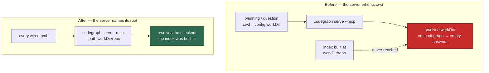

# Root the CodeGraph MCP server at the indexed checkout

## Summary

`codegraphMcpServer()` named no root, so the `codegraph serve --mcp` server a
run was handed inherited the agent's working directory. That directory is the
checkout only on the two issue paths. The planning and question processors run
the agent with `cwd: config.workDir` — the **parent** of every clone — so their
`codegraph_explore` calls resolved a directory with no `.codegraph/` in it while
the run still reported `status: ok` with real node and relationship counts: a
silent degradation the trial protocol says must not happen.

The fix is option 1 from the issue. `codegraphMcpServer(repoDir)` now takes the
indexed checkout and emits `serve --mcp --path <checkout>`; `codegraph_run.ts`
passes the same `repoDir` it handed `prepareCodegraphContext`, so all six wired
paths are rooted identically. The knob is the v1.6.0 CLI's own — confirmed by
running `codegraph serve --help` on this host, which the binary being installed
now made possible:

```text
-p, --path <path>  Project path (optional for MCP mode, uses rootUri from client)
```

The path rides in the **arguments** rather than a `cwd` key because
`buildCodexMcpConfigArgs` translates `command`, `args` and `env` and drops
`cwd` — one entry has to serve Claude and Codex alike. A call with an empty
checkout throws instead of silently re-rooting at the working directory.

Closes #2200.

## Evidence

Backend/CLI change with no web interface, so the evidence is test output rather
than a screenshot.

**The fault, and what removes it:**



**Red before, green after.** With `--path` removed from the argument list, the
new assertions fail on every wired path — the planning and question paths are
the ones the issue reports, and the other four fail because they now assert the
root explicitly rather than assuming the working directory:

```text
planning_processor - one index serves every invocation of the round ... FAILED
question_processor - an indexed run gets the line and the server together ... FAILED
execute_phase - an indexed run gets the line and the server together ... FAILED
execute_claude_phase - an indexed run gets the line and the server together ... FAILED
pr_ci_processor - an indexed run gets the line and the server together ... FAILED
pr_feedback_processor - an indexed run gets the line and the server together ... FAILED
prepareCodegraphRun - the server follows the checkout that was indexed (Issue #2200) ... FAILED
error: AssertionError: ... planning_processor: the codegraph MCP server must be
rooted at the indexed checkout (Issue #2200)
```

With the fix in place the same eight files pass (`61 passed | 0 failed`), and
the full gate is green:

```text
Result: PASSED (with skipped checks)
  deno tests PASSED   semgrep PASSED   mermaid PASSED   markdownlint PASSED
```

(`config integration` is the gate's usual host-config skip, unrelated to this
change.)

## Test Plan

- `worker/deno/tests/support/codegraph_mcp_root.ts` — new: reads the root out
  of a run's `mcpConfig` through `CODEGRAPH_ROOT_FLAG`, so the one invariant is
  asserted through one helper rather than six copies.
- `worker/deno/tests/codegraph_context_test.ts` — `codegraphMcpServer` roots the
  server at the checkout it is given (two different checkouts, read back through
  the flag rather than by position), and a checkout-less call fails loudly.
- `worker/deno/tests/codegraph_run_test.ts` — `prepareCodegraphRun - the server
  follows the checkout that was indexed (Issue #2200)`, plus the root assertion
  on the existing indexed-run test.
- The six wired paths each assert the server's root equals the `repoDir` handed
  to `prepareCodegraphContext`, which is the check the issue's Failure Detection
  section asks for:
  `execute_phase_codegraph_2159_test.ts`,
  `execute_claude_phase_codegraph_2159_test.ts`,
  `planning_processor_codegraph_2159_test.ts`,
  `question_processor_codegraph_2159_test.ts`,
  `pr_feedback_processor_codegraph_2160_test.ts`,
  `pr_ci_processor_codegraph_2160_test.ts` (both its invocations). The planning
  and question tests additionally pin `cwd` to the work volume, so the two
  facts that made the mismatch invisible are asserted side by side.
- `agent_mcp_config_test.ts` and `agent_provider_codex_test.ts` pin the rooted
  argument list through both the Claude config file and the Codex `-c`
  translation, proving the path survives the translation that drops `cwd`.

## Notes for the reviewer

- **Scope** — `docs/REPO-CONTEXT-TRIAL.md` §1.2 is updated because it documents
  where CodeGraph is wired in and the sequence diagram now shows the rooted
  invocation; no other behaviour was touched.
- **Option 2 was not taken.** Giving the two processors the checkout as `cwd`
  is the wider behaviour change the issue itself flags as needing its own
  assessment — it would move where planning and question runs write.
