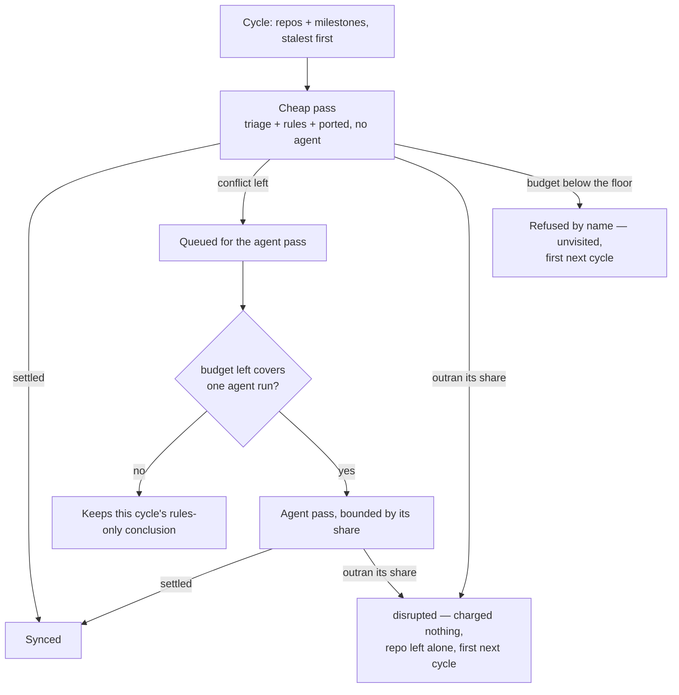

## Summary

The milestone branch sync was one handler under one 795 s watchdog, handing
each milestone whatever budget was left. On GRQ-23 a single conflict
resolution took the lot: the watchdog abandoned the handler, every milestone
behind it in the fleet-wide repository order went unsynced, and a both-added
`docs/audits/lib-sweep-coverage.json` — the shape the sweep's own triage
settles by union in seconds — was left for a human to merge by hand. Nothing
else would ever have touched it: the PR merge-conflict pass stands down on
`milestone/**` heads by design (Issue #1772).

The sweep now makes **two passes** and spends a **share** of its budget on each
attempt, in **stalest-first** order. Closes #2215.

- **Cheap rungs before expensive ones, across milestones.** The first pass
  offers every milestone in the fleet the deterministic rungs only (triage,
  dependency rules, ported) with `agentAllowed: false`. Only then does the
  agent pass return to the conflicts those rungs could not settle. A ledger
  union can no longer wait behind an agent.
- **A share, not the remainder.** `milestoneAttemptShareMs` divides what is
  left of the handler budget by the work still to do, floored at three
  minutes. It is a cap, not a reservation: an attempt that finishes in seconds
  returns the rest to the next one. Below the floor the remaining milestones
  are refused **by name** before anything starts. An attempt that outruns its
  share is abandoned — it concludes `disrupted`, is charged nothing (exactly
  as a killed attempt already is), and nothing else in its repository is
  touched this cycle, because the clone belongs to the attempt still running
  inside it. That repository's `RepoLease` is released only once the abandoned
  attempt settles, so an issue slot cannot reset the clone from under it.
- **Stalest first.** `openConflictAttempt` stamps `lastVisitedAt` on the
  branch's ledger entry, and both repositories and milestones are ordered by
  it. What the budget never reached carries no stamp and goes first next
  cycle.

Bookkeeping that had to follow: a milestone attempted twice in one cycle is
**one** cycle's verdict, so the failure streak is counted once per branch per
cycle (Issue #4260's threshold still means three cycles) and
`isRepeatedFailureReason` is handed the *previous* cycle's reason so
Issue #1964's repeat gate never compares a cycle with itself.

## Evidence

Backend/CLI change with no web interface, so there is no screenshot to take;
the evidence is the tests and the full quality gate.

- `./quality.sh` — **PASSED** (with `config integration` skipped, as it is on
  this host) after the final edit. `deno tests`, `deno lint`, `deno type
  check`, `deno fmt`, `semgrep`, `completeness checks` and the rest all green.
- `deno test tests/milestone_sync_starvation_test.ts` — 4 passed.
- `deno test tests/milestone_sync_pacing_test.ts` — 9 passed.
- `deno test tests/milestone_branch_sync_test.ts` — 51 passed.
- `deno test tests/milestone_*.ts tests/heartbeat_milestones_test.ts` —
  774 passed, 0 failed.

## Reproduction

- **symptom** — one conflict resolution spends the sync handler's whole 795 s
  watchdog budget; the handler is abandoned and every milestone behind it in
  the fleet-wide repository order is never looked at, leaving a trivially
  resolvable both-added ledger conflict for a human to merge by hand
- **status** — `verified` — a cut-down regression test written against the
  **unfixed** `milestone_branch_sync.ts` (restored from `HEAD` into the tree)
  failed with the old call order
  `["milestone/conflicts:agent", "milestone/ledger-union:agent"]` — the first
  milestone taking the agent before the second had had any attempt — and
  passed with the fixed module, producing
  `["milestone/conflicts:rules", "milestone/ledger-union:rules", "milestone/conflicts:agent"]`
- **regression test** —
  `worker/deno/tests/milestone_sync_starvation_test.ts::syncMilestoneBranches - the cheap rungs run across every milestone before any agent does (Issue #2215)`,
  with
  `::syncMilestoneBranches - a resolution that outruns its share is abandoned and the milestone behind it is still synced (Issue #2215)`
  covering the budget half — its agent stub never settles, so a sweep that
  still waited for it would hang rather than return

## Acceptance Criteria

<!-- vibe-spec-review inputs="diff+issue-body" -->

- **met** — Fix 1: bound the agent rung per milestone to a share of the
  remaining handler budget; a resolution that cannot finish inside it
  concludes `disrupted`, charged nothing — evidence:
  `worker/deno/lib/milestone_sync_pacing.ts::milestoneAttemptShareMs`,
  `worker/deno/lib/milestone_branch_sync.ts::awaitWithin`, and
  `worker/deno/tests/milestone_sync_starvation_test.ts::a resolution that outruns its share is abandoned…`
  — reviewer: met — reason: the reviewer confirmed the mechanism but flagged
  that the agent pass divided the budget by the whole deferred queue although
  only one agent ever runs, which could refuse the rung to the branch at the
  front and never offer it behind; fixed in this diff — the agent pass now
  sizes its share from a single unit
- **met** — Fix 2: cheap rungs before expensive ones across milestones; the
  #2207 ledger-union shape must never wait behind an agent — evidence:
  `worker/deno/tests/milestone_sync_starvation_test.ts::the cheap rungs run across every milestone before any agent does`
  — reviewer: met
- **met** — Fix 3: rotate the start point (or order by last-synced) so a
  starved milestone is first next cycle — evidence:
  `worker/deno/lib/milestone_sync_pacing.ts::orderReposByStaleness` /
  `orderMilestonesByStaleness`, `SyncStreakEntry.lastVisitedAt` — reviewer:
  met — reason: the reviewer noted the order is "least recently *attempted*",
  not "least recently synced", because a milestone the cadence guard skips
  gets no stamp; that is the intended reading — a branch already carrying the
  current tip is not starved, it is up to date
- **met** — Test: with two milestones where the first needs an agent whose
  stub outruns the budget and the second is a ledger union, the second is
  synced, the first concludes `disrupted`, and the handler returns inside the
  budget — evidence:
  `worker/deno/tests/milestone_sync_starvation_test.ts::a resolution that outruns its share is abandoned and the milestone behind it is still synced`
  — reviewer: met — reason: the reviewer objected that "returns inside the
  budget" was asserted as `elapsed < deadline + 1000 ms`; the stopwatch has
  been removed entirely — the agent stub never settles, so the test returning
  at all *is* the assertion, and the Standards reviewer separately flagged the
  same line as a forbidden absolute wall-clock threshold
- **met** — Test: the same two milestones next cycle start from the starved
  one — evidence:
  `worker/deno/tests/milestone_sync_starvation_test.ts::the milestone the budget starved goes first next cycle`
  — reviewer: partial — reason: the reviewer was right that the first version
  hand-seeded `lastVisitedAt` and never exercised the write side; the test now
  runs **two real cycles** — cycle 1 abandons the first milestone and never
  reaches the second, cycle 2 reads the ledger cycle 1 persisted and starts
  from the starved one
- **unrequested** — the *cheap* attempts are bounded too, not only the agent
  rung — reviewer: unrequested — reason: the 13 minutes in the incident log
  contained no sync line of any kind, so bounding only the agent rung would
  not have bounded the reported symptom; the floor was raised to three minutes
  so a legitimate merge-plus-gate is refused before it starts rather than
  abandoned part-way
- **unrequested** — a disrupted attempt ends that repository's pass for the
  cycle (`abandonedRepos`) — reviewer: unrequested — reason: nothing can
  cancel a merge already running in a clone, and starting a second git process
  in that same clone is the corruption this guard exists to prevent; the cost
  is bounded to one repository and recovered by the stalest-first order
- **unrequested** — the `RepoLease` is released asynchronously, once the
  abandoned attempt settles — reviewer: unrequested — reason: same root cause;
  giving the lease back while a merge is still running would let an issue slot
  reset the clone underneath it
- **unrequested** — `countedFailures` ("one cycle, one verdict per branch")
  and the previous-cycle reason handed to `isRepeatedFailureReason` — reviewer:
  unrequested — reason: a milestone is now attempted twice in a cycle, so
  without these the #4260 streak would double-step and #1964's repeat gate
  would compare a cycle with itself; they preserve existing behaviour rather
  than adding any
- **unrequested** — `attemptShareFloorMs` / `attemptShareReserveMs` on
  `MilestoneBranchSyncDeps` — reviewer: unrequested — reason: injected seams so
  the bound is unit-testable in milliseconds, matching the existing
  `agentTimeoutMs` / `minMsPerAgentAttempt` seams beside them
- **unrequested** — repositories with no local clone are filtered out before
  the share denominator is computed — reviewer: unrequested — reason: the
  reviewer showed the quoted log had eight of them, which would have shrunk
  every share eightfold for work that does not exist
- **unrequested** — `docs/INTERNALS.md`, `docs/workflows/milestones.md`, and
  the `top-up-2215` slice in `docs/audits/lib-sweep-coverage.json` with its
  `docs/audits/security-sweep-2215-milestone-sync-pacing.md` record —
  reviewer: unrequested — reason: a code change owes a docs change, and every
  new `lib/` module must be claimed by a sweep slice or the gate fails

## Standards Review

<!-- vibe-standards-review inputs="diff+CODING-STANDARDS.md" -->

- **violation** — a new `lib/` module claimed by no sweep slice, failing
  `check:manifests` — evidence:
  `worker/deno/lib/milestone_sync_pacing.ts:1` — reason: fixed here — slice
  `top-up-2215` added to `docs/audits/lib-sweep-coverage.json` with its
  written record at `docs/audits/security-sweep-2215-milestone-sync-pacing.md`
- **violation** — an absolute wall-clock threshold assertion in a unit test —
  evidence: `worker/deno/tests/milestone_sync_starvation_test.ts:132` —
  reason: fixed here — the `elapsed < …` assertion is gone; the test's proof
  is that it returns at all against a stub that never settles, so nothing is
  compared against a constant and the file stays out of `WALL_CLOCK_TEST_FILES`
- **violation** — the abandonment timer is armed on the global `setTimeout`
  rather than the clock seam — evidence:
  `worker/deno/lib/milestone_branch_sync.ts:1007` — reason: stands. The sweep's
  existing seam is `deps.now`, which the bound is measured against; adding a
  timer seam would mean threading a second injected clock through a module
  whose every other deadline reads `deps.now`. The tests drive the bound
  through the injected floor and reserve instead of a stopwatch, which is what
  the standard is protecting
- **violation** — the abandoned attempt's eventual rejection was caught and
  discarded — evidence: `worker/deno/lib/milestone_branch_sync.ts:1298` —
  reason: fixed here — a rejection after abandonment now logs a `WARNING`
  naming the branch, the repository and the error; the pass no longer awaits
  it, so that log is the only place it could be reported
- **violation** — the "lease released only once the abandoned attempt settles"
  behaviour had no test — evidence:
  `worker/deno/lib/milestone_branch_sync.ts::releaseAfter` — reason: fixed here
  — `worker/deno/tests/milestone_sync_starvation_test.ts::an abandoned attempt keeps its repository's lease until it settles`
  asserts the lease is still held while the attempt runs, that no other
  milestone of that repository is touched, and that it is released once the
  attempt settles
- **violation** — `docs/archive/pr-summaries/pr-summary-2215.md` missing —
  evidence: repository root — reason: fixed here — this file
- **violation** — the twelve-line share-options block duplicated between the
  two passes — evidence: `worker/deno/lib/milestone_branch_sync.ts:1728` /
  `:1789` — reason: fixed here — one `shareFor(unitsLeft)` closure is the
  single reader of the floor and the reserve
- **violation** — a 445-line `attemptMilestone` closure in a file that grew
  1927 → 2274 lines, against "favour many smaller, focused source files" —
  evidence: `worker/deno/lib/milestone_branch_sync.ts:1159` — reason: stands,
  deliberately. The body is the pre-existing per-milestone code moved verbatim
  into one closure so that both passes call **one** implementation of the
  ledger's rules; lifting it to a module-level function would mean threading
  eleven mutable sweep-locals (`streaks`, `streaksDirty`, `synced`, `skipped`,
  `failed`, `agentSpent`, `countedFailures`, `deferredToAgent`,
  `abandonedRepos`, `abandonedWork`, `priorReasons`) through a parameter
  object — more indirection, not less. The genuinely separable part, the
  pacing arithmetic, *was* extracted to `milestone_sync_pacing.ts`
- **clean** — Australian English throughout; every new test calls real
  exported functions and asserts on results and ledger side effects (no
  source-grepping); no existing test removed or commented out; both new test
  files well inside the 10 s budget; temp dirs per test with `finally`
  cleanup; no hidden path staged; budget refusals, abandonment and sync
  failures all emit `WARNING:` lines naming the branch, repo and reason;
  `lastVisitedAt` and the two new deps are additive and optional; commit
  carries the `Vibe-Coder-Run-Id` trailer

## Test Plan

Added:

- `worker/deno/tests/milestone_sync_pacing_test.ts` — 9 cases over the pure
  pacing helpers: an unbounded pass, the share division, the floor, the
  refusal-by-name, the single-milestone case, unreadable/absent visit stamps,
  and both stalest-first orderings including the stable-order tie-break.
- `worker/deno/tests/milestone_sync_starvation_test.ts` — 4 end-to-end cases
  over `syncMilestoneBranches`: an agent resolution abandoned at its share
  while the ledger union behind it still syncs; two real cycles proving the
  starved milestone goes first on the second; the cheap-then-agent call order;
  and the lease held until the abandoned attempt settles.

Modified (business-logic change, documented in place):

- `worker/deno/tests/milestone_branch_sync_test.ts`
  - `the same tip waits out the cooldown and a moved tip does not` — a
    conflicting milestone is now attempted twice in a cycle (cheap, then
    agent), so the expected attempt count moved 1 → 2.
  - `too little of the cycle left denies the agent to every branch` — the
    deadline moved 70 s → 200 s so the scenario still exercises the *agent*
    refusal rather than the new per-attempt floor, which is a different
    refusal.
  - `a merge that fails after the agent ran keeps the grant spent` — the
    plain post-agent failure is now expressed through the agent pass
    (`agentFailure: "plain"` on the harness milestone), because the cheap pass
    never grants the rung.
  - `a clean merge refunds the grant to the next branch` — a branch that
    merges cleanly is never offered the rung at all now, so its grant
    assertion moved `true` → `false`; the property the test protects (the
    conflicting branch still gets the cycle's agent) is unchanged.
