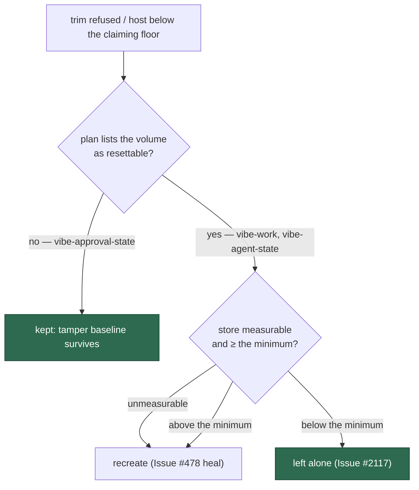

# The launch plan, not `du`, decides which volumes a disk reset may destroy

## Summary

`run.sh` decided by **measured size** which volumes it could destroy to
reclaim host disk. It can only measure the Apple container store, so on every
Docker or Podman host — and on any Apple host whose store directory is
missing — `volume_store_kb` failed, the Issue #2117 minimum-size conjunct
(`[[ "${kb}" =~ ^[0-9]+$ ]] && ((kb < reset_min_kb))`) evaluated false, and the
guard was **skipped rather than failed closed**: `vibe-approval-state` was
recreated along with the work volume.

That volume holds the content-approval snapshots — the Issue #1341 TOCTOU
gate. A recreated store loses both the state file and the Issue #4215
initialised-store marker, so `readContentApprovalState` returns a genuine
first encounter, every tracked issue is re-baselined against its body **as it
stands now**, and content edited after an allowed author added `work-on`
verifies as unchanged. Nothing latches: `unusableStores` and the "Content
approval state deleted" error need a read error or a state file missing from
an *initialised* store, and a recreated volume is neither.

The fix follows the issue's suggested direction — exclude the store by
**role**, not by size:

- `container_launch.ts` adds `resettableVolumes` to the launch plan,
  rendered as `volume-resettable=<name>` tokens. It lists the disposable
  volumes (`vibe-work`, `vibe-agent-state`); `vibe-approval-state` is never
  on it. Test volume-name overrides are marked from the same spellings the
  mounts use, so an override cannot mark one volume and reset another.
- `run.sh` parses that list (a plan without one is an incomplete plan and
  refuses to launch) and consults it **before any measurement** in both reset
  paths — the Issue #478 post-init heal and the Issue #2092 pre-build reset.
  A volume the plan does not list is kept, whatever it holds and whether or
  not its store can be measured.
- The work volume's behaviour on an unmeasurable store is deliberately
  unchanged: the Issue #478 heal still recreates it, which is what that heal
  exists to do. Only the role gate is new.
- `run.ps1` parses the new key (Windows has no low-disk heal, so it carries
  it as it already carries the claiming floor); an unrecognised plan key is a
  loud launch failure there, so parsing it is mandatory.

Closes #2216.

## Evidence

Backend/CLI change — no web interface to screenshot. The evidence is the
launcher tests below, which run the real `run.sh` against a recording runtime
stub and assert on the volumes it actually removed.

**Original trigger closed, no trivial bypass.** The trigger was an
unmeasurable (or merely large) approval store reaching `recreate_volume`. Both
reset paths now test `volume_may_reset "${volume}"` — a literal comparison
against the plan's `volume-resettable` list — before they call
`volume_store_kb`, so no measurement outcome can reach the recreate for a
volume absent from that list. The heal additionally filters
`trim_refused_volumes` down to the resettable set up front, so the approval
store is not even counted towards "worth destroying". The list is emitted by
`buildContainerLaunchPlan` from the same expressions the mounts use, and a
plan carrying no `volume-resettable` token fails the launcher's
incomplete-plan check rather than defaulting to "anything may be reset" —
there is no path that re-derives resettability from size.

## Reproduction

- **symptom** — with the runtime refusing the trim and the host below its
  claiming floor, `run.sh` recreated `vibe-approval-state` whenever its store
  could not be measured, silently disarming the content-approval tamper gate
- **status** — `verified` — both new launcher tests were run against the
  unfixed code (`git stash` of `run.sh`, `run.ps1` and `container_launch.ts`,
  tests retained) and failed with
  `Actual / Expected … - "vibe-approval-state"`; both pass after the fix
- **regression test** —
  `worker/deno/tests/run_sh_launcher_test.ts::run.sh - a refused trim below the floor spares the approval store when its size cannot be measured (Issue #2216)`

## Test Plan

Added:

- `worker/deno/tests/run_sh_launcher_test.ts::run.sh - a refused trim below the floor spares the approval store when its size cannot be measured (Issue #2216)`
  — the heal path with no container store at all (every Docker/Podman host):
  only `vibe-work` is removed, and the log names the store it kept.
- `worker/deno/tests/run_sh_launcher_test.ts::run.sh - the pre-build reset spares the approval store however much it holds (Issue #2216)`
  — the Issue #2092 pre-build path with a 64 MB approval store above the
  minimum: only `vibe-work` is removed.
- `worker/deno/tests/container_launch_test.ts::buildContainerLaunchPlan - only the disposable volumes may be reset for disk (Issue #2216)`
  — the plan lists the work and agent-state volumes, never the approval
  store, and honours test volume-name overrides.

Modified (documented business-logic change, no test removed or commented
out):

- `worker/deno/tests/run_sh_launcher_test.ts::run.sh - a refused trim below the claiming floor recreates the volumes and re-runs the init (Issue #478)`
  asserted `removedVolumes === [vibe-work, vibe-approval-state]` — it encoded
  the defect, since the fixture creates no store directories and both volumes
  were therefore unmeasurable. It now asserts `[vibe-work]`; everything else
  about the Issue #478 heal (recreate, second init, `[WORK_VOLUME_UNRECOVERED]`,
  the launch still proceeding) is unchanged.
- `worker/deno/tests/container_launch_test.ts` — the render/parse round trip
  now also asserts the role list survives the hand-off.
- `worker/deno/tests/run_sh_launcher_test.ts::run.sh - recreates a volume with the verb its runtime spells, never a hardcoded one (Issue #731)`
  — the test is about the removal *verb*; its trailing volume-list assertion
  is narrowed to `[vibe-work]` for the same reason.
- `worker/deno/tests/tabletop_container_runner_test.ts` — its literal launch
  plan gains the new required `resettableVolumes` field (its throwaway work
  volume; the tabletop mounts no approval store).

`./quality.sh` passes in full (all stages PASSED; `config integration`
SKIPPED as it is on this host).

Docs: `docs/CONTAINER.md` gains the role gate as its own numbered point in
the untrimmable-volume heal section, with the decision flowchart updated.
