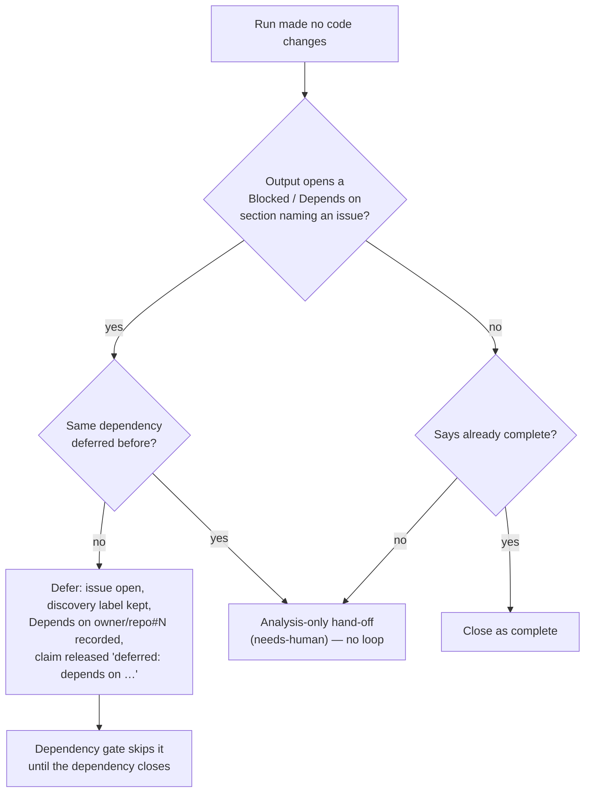

# Blocked on a dependency is a deferral, not a closure (Issue #222)

## Summary

A `work-on` run that produces no code changes had two endings — "already
complete" (close the issue) and "analysis-only" (`needs-human` + strip the
discovery label). A run that read the code and correctly found the work blocked
on **another issue** had none, so on NEAT-AI-Backpropagation#94 the agent's
well-evidenced "## Blocked: `creature_validate` …" answer was mis-described as
"analysis-only / recommendation-only", handed to a human, and — worse — closed
as `not planned` by the implementing agent itself.

This adds the third ending and removes the agent's ability to decide the issue's
fate. Closes #222.

- **Deferral (new outcome).** `blocked_outcome.ts` detects blocked-shaped output
  and `blocked_deferral.ts` performs the deferral: the issue stays **open** with
  its discovery label (no `needs-human`), `Depends on owner/repo#N` is written
  into the body — the exact form `isDependencyBlocked` reads — and the claim is
  released with the outcome `deferred: depends on owner/repo#N`, which the
  release comment states. The `blocked` label is the fallback when the body
  cannot be edited; when neither lands the run logs a partial deferral rather
  than reporting success. The deferral is checked **before** the already-complete
  branch, because a blocked answer routinely contains "no changes needed …" and
  closing a live task is the one outcome the next scan cannot undo.
- **Detection requires two signals** — a line opening a `Blocked` / `Depends on`
  section, *and* an issue reference in that section naming something other than
  the issue being worked — so a passing mention ("nothing here is blocked")
  never defers an issue. Code fences and code spans are ignored, matching
  `extractDependencyReferences`.
- **No silent re-deferral.** The deferral comment carries a hidden marker naming
  the dependency. A run reporting the *same* dependency again means the gate did
  not hold, so it falls through to the analysis-only hand-off and a human sees
  it, instead of spending a full agent run on every scan.
- **`gh` guard refuses issue-lifecycle verbs.** A coding run seeds its claimed
  issue (`claimed_issue_guard.ts`, an `AsyncLocalStorage` context mirroring the
  write-repo allowlist), and the guard refuses `close`, `reopen`, `delete`,
  `transfer`, `lock`, `unlock`, `pin`, `unpin` — plus the REST spellings
  (`gh api -X PATCH …/issues/N -f state=closed`, `…/issues/N/lock`) — for every
  issue in the claimed repo, with `[SECURITY] [ISSUE_LIFECYCLE_REFUSED]`. The
  run names the verbs it still permits; the coding route permits `edit` only, so
  `gh issue edit N --add-label needs-human` keeps working. Inert for any flow
  that seeds no claim (the planning route legitimately closes its issue).
- **Cross-repo dependencies are now gated.** `Depends on owner/repo#N`
  previously matched nothing at all, so a cross-repo deferral would have been
  re-claimed immediately. `extractDependencyReferencesDetailed()` keeps the repo
  each reference names, `isDependencyBlocked` resolves it against **its own**
  repo, and the issue-fetch memo is keyed by repo as well as number so another
  repository's `#560` can never be served from this repo's entry.
- **Prompts updated** (`prompts/issue/v34.md`,
  `prompts/coding_guidelines/v40.md`): a new "Issue Lifecycle Is Not Yours To
  Change" section tells the agent to report a block in the shape the worker
  recognises and states that closing the issue is refused; the escape-hatch and
  negative-result flows now end with a comment and leave closure to the worker.

## Evidence

Backend/CLI change — no web interface to screenshot. The evidence is the test
suite below plus the repository quality gate (`./quality.sh`): every check
passes — prompt immutability, mermaid, markdownlint, docs prompt versions, lint,
type check, fmt — and all 46 new tests pass.

Ten pre-existing failures remain in `fleet_health_test.ts`,
`host_workdir_guard_test.ts`, `optional_feature_env_test.ts` and
`setup_workdir_reminder_test.ts`. They are environment-dependent (they assert on
the host work-dir layout and on an unreadable file) and **not** caused by this
change: the identical ten fail on the base commit `543b19d` in the same
container (`deno test --no-check` on those four files: `63 passed | 10 failed`).
No file in this PR is imported by them.



Agent-side refusal, as the guard now reports it:

```text
[SECURITY] [ISSUE_LIFECYCLE_REFUSED] Refused 'gh issue-close' on
stSoftwareAU/NEAT-AI-Backpropagation#94 from the agent subprocess — issue
lifecycle changes (close, reopen, edit, delete, transfer, lock, unlock, pin,
unpin) on stSoftwareAU/NEAT-AI-Backpropagation are the worker's or a human's
decision, not the implementing agent's (this run's claimed issue). …
```

## Test Plan

All four suites are new and call the real functions with test data:

- `worker/deno/tests/blocked_outcome_test.ts` — detection: the NEAT#94 output
  shape, bare `#N`, list/bold/heading openings, self-reference excluded, fenced
  examples ignored, passing mentions rejected, reason bounded.
- `worker/deno/tests/handle_no_changes_blocked_deferral_test.ts` — the
  regression the issue asks for: blocked-shaped output ⇒ deferral, **not**
  close and **not** analysis-only (issue open, no `needs-human`, dependency line
  written, `deferred: depends on owner/repo#N` outcome); a blocked run carrying
  "no changes needed" is never treated as already complete; a second deferral on
  the same dependency hands off instead of looping; non-blocked analysis-only
  output still hands off unchanged.
- `worker/deno/tests/claimed_issue_lifecycle_guard_test.ts` — the guard refuses
  `gh issue close|reopen|delete|transfer|lock` and the REST spellings on the
  claimed repo, allows comments/labels/`edit`, allows a permitted verb, is inert
  with no claim, rejects a malformed `--claimed-issue`, bakes the claim into the
  shim wrapper, and keeps two concurrent slots isolated.
- `worker/deno/tests/cross_repo_dependency_gate_test.ts` — cross-repo references
  are extracted with their repo, block while open, release once closed, fail
  safe when unreadable, and the fetch memo never answers across repos.

Run: `./quality.sh < /dev/null` (full gate: `deno test`, `deno check`, lint,
`deno fmt --check`, markdownlint, Mermaid validation).
