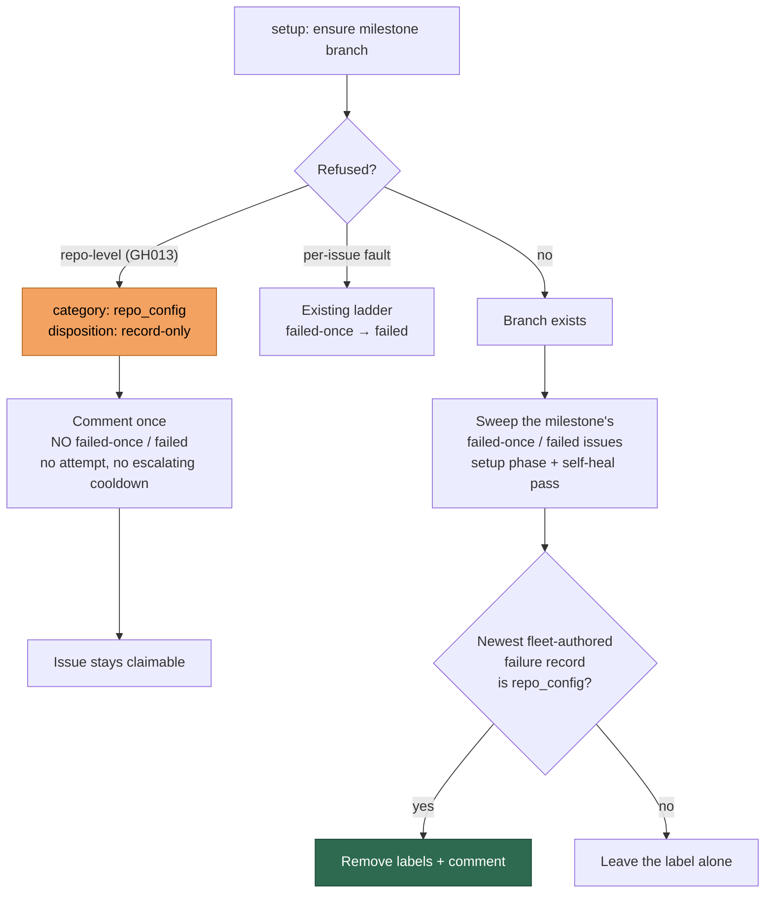

## Summary

A repository-level refusal of a `milestone/**` branch (`GH013: Repository rule
violations`) matched no pattern in `detectFailureCategory`, so it came out
`unknown` — and `unknown` is not infrastructure, so every setup refusal went up
the `failed-once` → `failed` ladder. On `stSoftwareAU/GRQ-FX-validation`
sixteen sub-issues were labelled in under a minute each without touching a line
of code, and nothing released them when the ruleset was repaired.

This change makes the refusal a repository fact rather than an issue fact:

- **New `repo_config` failure category.** `isRepoLevelMilestoneBranchRefusal`
  (`milestone_branch_rejection.ts`) requires *both* a repo-level refusal
  signature *and* the refused **ref** (`refs/heads/milestone/…`,
  `-> milestone/…`), so an ordinary protected-branch push refusal — including
  one that merely names its milestone base branch — keeps its `push_failure`
  category and its bounded infrastructure retry.
- **No label, no ladder, no cooldown escalation — but still one comment.**
  `handleIssueFailure` short-circuits `repo_config` as it does
  `scheduled_release`: one **Automated Processing Paused (Repository
  Configuration)** comment, no `failed-once` / `failed`. The class gets its own
  `record-only` disposition in `coding_failure_ladder.ts`, which skips the
  attempt and the escalating 2 h → 6 h → 24 h cooldown while still reaching
  that comment.
- **The backlog releases itself.** `releaseMilestoneBranchRefusalLabels`
  sweeps the milestone's open `failed-once` / `failed` issues once the branch
  exists and removes the labels only where `detectFailureCategory` calls the
  issue's most recent **fleet-authored** failure record `repo_config`. Called
  from both success paths: the setup phase, and the per-cycle
  `selfHealMilestoneBranches` pass — the only one that reaches a milestone
  whose children *all* reached `failed`, since those are filtered out of label
  discovery.

Closes #2220.

## Evidence

Backend/worker change with no web interface, so there is no screenshot to
capture. The evidence is the test suite below and the gate output: `./quality.sh`
passed in full on the final tree (21 checks passed, `config integration`
skipped as it is on this host).

## Reproduction

- **symptom** — a `GH013` milestone-branch refusal at `setup` was diagnosed
  `**Category:** unknown` and added `failed-once`, then `failed`, to every
  sub-issue in the milestone; nothing removed them once the ruleset was fixed.
- **status** — `verified` — the regression assertion was run against the
  unfixed `failure_diagnosis.ts` (taken from `HEAD` into a scratch module) and
  observed failing with `Actual: unknown / Expected: repo_config`; it passes
  against the fixed code. The scratch module was deleted before committing.
- **regression test** —
  `worker/deno/tests/milestone_branch_refusal_release_test.ts::refusal release - the exact GH013 message is categorised repo_config, not unknown (Issue #2220)`

## Acceptance Criteria

<!-- vibe-spec-review inputs="diff+issue-body" -->

- **met** — A setup refusal matching `isRepoLevelBranchRejection` never adds `failed-once` or `failed` — evidence: the `repo_config` short-circuit in `worker/deno/lib/label_failure.ts` plus `worker/deno/tests/milestone_branch_refusal_release_test.ts::refusal release - handleIssueFailure adds no failed-once/failed label for a milestone refusal` — reviewer: met — reason: the reviewer noted the predicate is narrower than the literal wording (it also requires a milestone-branch context) and confirmed every real setup reason still matches; the narrowing is deliberate so a feature-branch protection refusal keeps its `push_failure` retry.
- **met** — After the milestone branch is created, sibling issues labelled for that refusal are un-labelled within one cycle without human action — evidence: `worker/deno/lib/milestone_branch_refusal_release.ts`, wired at `worker/deno/lib/phases/setup_branch_phase.ts` and `worker/deno/lib/milestone_branch_self_heal.ts`; tests `setup phase - a successful milestone branch releases the refusal's siblings` and `releaseMilestoneBranchRefusalLabels - releases the refusal's issues and keeps genuine failures` — reviewer: partial — reason: the reviewer's residual gap was the self-heal call site taking the sweep's default label names instead of the configured ones; fixed after its verdict — `MilestoneSelfHealDeps.failureLabels` is now passed from `config` by both production callers.
- **met** — Regression test: the exact GH013 message fed to `detectFailureCategory` is not `unknown` — evidence: `worker/deno/tests/milestone_branch_refusal_release_test.ts` using the verbatim three-line message from the issue — reviewer: met
- **met** — Suggested fix 1: `handleIssueFailure` treats it like `scheduled_release` — comment once, no label, issue claimable — evidence: `worker/deno/lib/coding_failure_ladder.ts` `record-only` disposition + tests `planCodingFailure - a milestone refusal still reaches handleIssueFailure, so the issue gets its comment` and `applyCodingFailureLadder - a milestone refusal comments and labels nothing` — reviewer: partial — reason: the reviewer found the comment was dead code — `repo-config` was in `TRANSIENT_FAILURE_CLASSES`, and a transient decision returns before `handleIssueFailure`, so siblings got no record at all. Fixed after its verdict with the `record-only` disposition, which withholds the label and the cooldown but still writes the comment.
- **unrequested** — a `repo-config` class in `run_outcome_classifier.ts` (`not_code_fixable`) — reviewer: unrequested — reason: the classifier switches exhaustively on `FailureCategory` via `assertNever`, so a new category cannot compile without an arm; `not_code_fixable` keeps a repository setting from being auto-filed as a worker defect.
- **unrequested** — a "Milestone branch restored — failure labels released" comment on each released issue — reviewer: unrequested — reason: a label vanishing with no record is unauditable; it is one comment per issue, once, only when a label was actually removed.
- **unrequested** — fleet-author verification of failure records via `selectFleetAuthoredComments` — reviewer: unrequested — reason: found by the security sweep this repo requires for a new `lib/` module — a failure record is plain Markdown, so without it a forged comment strips a genuine `failed` label. Fails closed: an unresolvable fleet keeps every label.
- **unrequested** — the `docs/INTERNALS.md` section and Mermaid diagram — reviewer: unrequested — reason: repo standard — a code change owes a docs change, and the milestone-ruleset section is where #2007/#2067/#2079 are already documented.
- **unrequested** — the new `docs/audits/security-sweep-2220-…` record and its `lib-sweep-coverage.json` slice — reviewer: unrequested — reason: required by the coverage gate in `lib_sweep_coverage_test.ts`, which is red for any new `worker/deno/lib/` module claimed by no sweep slice. This was the CI failure on `validate (tests 1/4)`.

## Standards Review

<!-- vibe-standards-review inputs="diff+CODING-STANDARDS.md" -->

- **violation** — `docs/archive/pr-summaries/pr-summary-2220.md` was missing from the tree — evidence: repository root — reason: fixed here — this file.
- **violation** — the self-heal caller used the sweep's hardcoded default label names while the setup-phase caller passed `config.failedLabel` / `config.failedOnceLabel`, so a deployment that renamed them would have its only path to an all-`failed` milestone list labels that do not exist — evidence: `worker/deno/lib/milestone_branch_self_heal.ts:711` — reason: fixed here — `MilestoneSelfHealDeps.failureLabels`, passed from `config` by `run_core_production_deps.ts` and `commands/milestone_branch_sync.ts`.
- **violation** — the incident narrative was restated on four surfaces and two disagreed ("six" vs "eight" issues reaching `failed`) — evidence: `docs/INTERNALS.md:3966` against `worker/deno/lib/label_failure.ts:468` — reason: fixed here — settled on the six the issue's own table enumerates (#123–#128).
- **violation** — two error paths of a new public function had no test, while the security record asserts their fail direction as a security property — evidence: `worker/deno/lib/milestone_branch_refusal_release.ts:300` and `:384` — reason: fixed here — `… - a malformed issue list is reported and releases nothing` and `… - a comment that fails after the label came off is still a release, and is said out loud`.
- **violation** — the `Milestone branch unavailable` heading literal exists in three places with no single source of truth — evidence: `worker/deno/lib/milestone_branch_refusal_release.ts:82` — reason: stands, deliberately. The heading is one of *three* independent signals (heading, `detectFailureCategory`, and the comment author), and all three fail towards keeping the label. Centralising a comment heading across the phase, the rejection module and the sweep is a wider refactor than this issue asks for.
- **clean** — Australian English throughout (`categorised`, `labelled`, `normalisation`, `behaviour`); `deno fmt`, `deno lint` and `deno check` clean; tests call real functions and assert outcomes, with no wall-clock sleeps, retry loops or source-grepping; no silent failure — every `gh` fault lands in `RefusalReleaseOutcome.errors`, both callers log it, and a faulted sweep releases its once-per-run claim; secret redaction preserved via `buildErrorSection` → `redactSecrets`; no hidden paths staged; `gh` writes go through the injected runner as argv arrays, never a shell string; `RUN_FAILURE_CLASSES` and every `FailureCategory` switch extended additively so exhaustiveness holds.

## Test Plan

`worker/deno/tests/milestone_branch_refusal_release_test.ts` (22 tests, all
new). They are unit tests: every dependency is an injected function or an
in-memory `gh` fake, so the suite touches no network, spawns no process and
finishes in under 50 ms.

- `detectFailureCategory` on the verbatim GH013 message and on the reason the
  setup phase actually returns.
- The narrowing: a `GH006` protected-branch refusal on a feature branch stays
  `push_failure`; a network failure naming a milestone branch stays
  `push_failure`; a child-push refusal that merely *names* its milestone base
  branch stays `push_failure`; the raw remote text still matches on the
  refused ref.
- `repo_config` is not infrastructure, has its own display name, diagnosis and
  one-liner, and is never auto-filed as a worker defect.
- `handleIssueFailure` adds no label for the refusal and still comments; an
  ordinary quality failure still enters the `failed-once` ladder.
- `classifyCodingFailure` returns `record-only` with no cooldown kind;
  `planCodingFailure` still routes it into `applyCodingFailureLadder` (the
  regression for the dead comment), and a genuinely transient failure does not;
  `applyCodingFailureLadder` end-to-end writes the comment and no label.
- `refusalIsMostRecentFailure`: releases on a refusal record, keeps the label
  when a genuine failure is newer, releases when the refusal is newer, ignores
  non-failure chatter and an empty list, accepts the
  `## Milestone branch unavailable` escalation as a record, and — the
  precedence regression — keeps the label on a quality-gate record that merely
  *quotes* the branch and "required status checks".
- `releaseMilestoneBranchRefusalLabels` against an in-memory repository:
  releases the refusal's issues, retains a genuine failure, comments once per
  release, sweeps a branch once per run, reports a `gh` 403 and a malformed
  payload in `errors` rather than swallowing them, still counts a release when
  only the follow-up comment failed, and releases nothing when the record was
  written outside the fleet or the fleet identity cannot be resolved.
- Setup-phase wiring: a successful milestone branch releases a sibling's
  `failed-once`; an issue with no milestone issues no `gh issue list` at all.

Existing suites re-run green: `failure_diagnosis_test.ts`,
`milestone_branch_rejection_test.ts`, `run_outcome_classifier_test.ts`,
`milestone_branch_self_heal_test.ts`, `lib_sweep_coverage_test.ts`,
`marker_dedup_author_cap_test.ts`, and the full `./quality.sh` gate.
