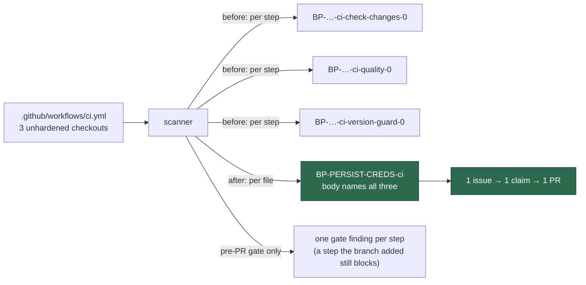

## Summary

The `github-actions-audit` pre-filers for checkout credentials and broad
artefact uploads filed **one issue per offending step**, so a `ci.yml` with
three unhardened checkout jobs became three claims, three Claude runs and
three PRs editing the same file — only the first had anything to change.
Both families now file **one finding per workflow file**
(`BP-PERSIST-CREDS-<basename>`, `BP-ARTIFACT-UPLOAD-<basename>`), with every
offending job/step listed in the one issue body. Closes #2221.

The per-step id is not discarded — it stays the unit of the smaller
decisions: an open per-step issue covers its file (so the reshape never
re-files against a repository mid-flight), an in-source
`best-practice-ignore` marker written against one still suppresses that
step, and the pre-PR changed-workflow gate reports per step.

## Evidence

Backend/CLI change — no web interface to screenshot. The evidence is the
test suite below, plus a red-then-green check of the gate regression test:
with the per-file finding fed to the gate unchanged,
`changed-workflow gate - a second offending checkout the run added is
reported` fails (`AssertionError: the added offender must block`); with the
per-step expansion in `workflow_file_checks.ts` it passes.

## Acceptance Criteria

<!-- vibe-spec-review inputs="diff+issue-body" -->

- **met** — a workflow with N unfixed checkout steps yields exactly one
  `BP-PERSIST-CREDS-<workflow>` finding whose body names all N — evidence:
  `worker/deno/tests/checkout_persist_credentials_scanner_test.ts::scan - three flaggable jobs in one file yield ONE finding naming all three`
  (and the artefact twin in
  `worker/deno/tests/artifact_upload_scanner_test.ts`) — reviewer: met
- **met** — `docs/GITHUB-ACTIONS-AUDIT-SCAN.md` id table updated — evidence:
  `docs/GITHUB-ACTIONS-AUDIT-SCAN.md:415-465`, plus `DESIGN-PRINCIPLES.md`
  and `prompts/github_actions_audit/prompt.md` — reviewer: met — reason: the
  reviewer flagged that the migration paragraph split the bullet catalogue
  in two; it was moved after the last bullet in this diff
- **met** — existing per-step issues are not duplicated by the per-file id —
  evidence:
  `worker/deno/tests/checkout_persist_credentials_scanner_test.ts::scan - an open legacy per-step id covers the per-file finding`
  and `worker/deno/tests/workflow_scan_common_test.ts::selectLiveSteps - an open per-step id covers the whole file (migration)`
  — reviewer: partial — reason: the reviewer wanted a prefix scan of the
  known-open ids rather than the exact per-step ids reconstructed from the
  offending steps; a prefix scan mis-attributes across basenames that prefix
  one another (`ci` vs `ci-extra`), so the exact reconstruction stands and
  the residual case (a job renamed or a step inserted between the per-step
  filing and the next scan) files one per-file issue beside the stale
  per-step one, which is the over-report side of the trade
- **unrequested** — the artefact-upload severity now escalates when **any**
  listed job has secrets in scope, not just the step's own job — evidence:
  `worker/deno/lib/artifact_upload_scanner.ts` (`live.some((s) => s.hasSecrets)`),
  test `scan - severity escalates when any listed job has secrets in scope`
  — reviewer: unrequested — reason: one finding per file must carry one
  severity; taking the maximum is the only choice that does not under-report
  a secret-bearing job
- **unrequested** — `workflow_file_checks.ts` expands the two per-file
  findings back to one **gate** finding per step — evidence:
  `worker/deno/lib/workflow_file_checks.ts`, regression test
  `worker/deno/tests/changed_workflow_gate_test.ts::changed-workflow gate - a second offending checkout the run added is reported`
  — reviewer: unrequested — reason: both reviewers found that without it the
  gate's `(finding id, file)` diff let a checkout step the branch **added**
  cancel against a pre-existing one and pass — a safety regression this
  change would otherwise have introduced

## Standards Review

<!-- vibe-standards-review inputs="diff+CODING-STANDARDS.md" -->

- **violation** — a newly introduced offender was masked by a pre-existing
  one at the changed-workflow gate — evidence:
  `worker/deno/lib/workflow_file_checks.ts:147` — reason: fixed here; the
  gate expands per-file findings to one finding per step and
  `changed_workflow_gate.ts` documents why
- **violation** — the filed title and body were ungrammatical for a single
  step (`1 checkout step persist credentials`) — evidence:
  `worker/deno/lib/checkout_persist_credentials_scanner.ts:409` — reason:
  fixed here; both wordings are asserted by
  `scan - the title and body read correctly for a single offending step`
- **violation** — ~25 lines of dedup/suppression logic duplicated across the
  two scanners — evidence: `worker/deno/lib/artifact_upload_scanner.ts:394`
  — reason: fixed here; extracted as `selectLiveSteps()` in
  `worker/deno/lib/workflow_scan_common.ts` with its own tests
- **violation** — `legacy*Id` exported with no consumer and no test —
  evidence: `worker/deno/lib/checkout_persist_credentials_scanner.ts:270` —
  reason: fixed here; renamed `persistCredentialsStepId` /
  `artifactUploadStepId`, consumed by `workflow_file_checks.ts`
- **violation** — Markdown defects: `DESIGN-PRINCIPLES.md` line beginning
  `#2221` parsed as an ATX heading, and the id catalogue split by a prose
  block — evidence: `DESIGN-PRINCIPLES.md:1688`,
  `docs/GITHUB-ACTIONS-AUDIT-SCAN.md:429` — reason: both reflowed here;
  `markdownlint-cli2` reports 0 issues
- **violation** — call-site comments in the audit template still described
  the per-step shape — evidence:
  `worker/deno/lib/idle_task_templates/github_actions_audit_template.ts:1150`
  — reason: fixed here
- **violation** — hand-wrapped docs exceeded the surrounding ~76-column
  wrap — evidence: `docs/GITHUB-ACTIONS-AUDIT-SCAN.md:740` — reason:
  reflowed here
- **clean** — Australian English throughout (artefact, behaviour,
  authorised); real-code tests that call the scanners with fixtures and
  assert on returned findings, no source-grepping, no sleeps or wall-clock
  assertions; `deno fmt`/`lint`/`check` clean; no hidden paths staged; the
  pre-existing legacy-marker suppression tests were left in place and still
  pass; prompt template edited in place with no bare `#NNN` reference

## Test Plan

Added:

- `worker/deno/tests/checkout_persist_credentials_scanner_test.ts` — one
  finding per file naming all three jobs; one finding per file across two
  files; the migration (open per-step id covers the file); a per-step id for
  another file does not suppress this one; triage suppression of a per-step
  id drops only that step; a marker above one checkout drops only that step,
  above every checkout drops the file; single- and multi-step wording.
- `worker/deno/tests/artifact_upload_scanner_test.ts` — the same set, plus
  severity escalation when any listed job has secrets in scope.
- `worker/deno/tests/workflow_scan_common_test.ts` — six cases over the new
  `selectLiveSteps()` helper.
- `worker/deno/tests/changed_workflow_gate_test.ts` — regression test: a
  second offending checkout the branch adds still blocks (observed failing
  against the un-expanded gate, passing with the fix).

Modified (business-logic change, per the TDD rule): the two
`"two flaggable jobs both produce findings, sorted by id"` tests became
`"… yield ONE finding naming both"`, and the per-step id assertions in
`worker/deno/tests/github_actions_audit_template_test.ts` became per-file
ids. No test was removed or commented out.

Full gate: `./quality.sh` run in the foreground.
