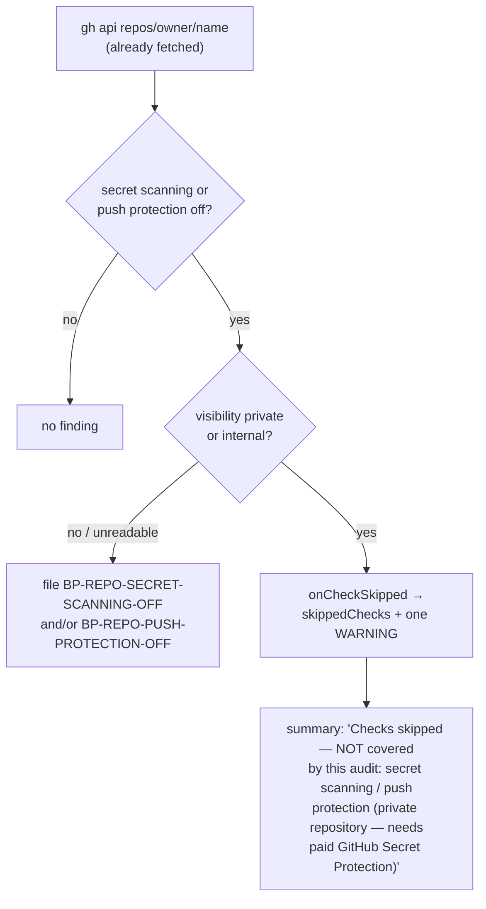

# Skip secret scanning / push protection findings on private repositories

## Summary

Secret scanning and push protection are free on a public repository but need
the paid GitHub Secret Protection add-on on a private or internal one. The
weekly `github-actions-audit` filed `BP-REPO-SECRET-SCANNING-OFF` and
`BP-REPO-PUSH-PROTECTION-OFF` regardless, so on every private repo the finding
only asked an admin to spend money and was closed by hand
(`stSoftwareAU/GRQ-AutoTrader#507`).

The scanner now reads the repository's visibility from the same
`repos/{owner}/{repo}` response it already fetches for the security settings
and, on a `private` or `internal` repository, files neither finding. The skip
is recorded rather than silent: it travels through a new `onCheckSkipped`
callback (not `onLookupFailure`, which logs a fault), the audit records it in
its existing `skippedChecks` list, and the close-comment summary names it under
"Checks skipped — NOT covered by this audit". One log line at `WARNING` — never
`ERROR` — says the same. The write-side twin, `repo-settings-harden`, plans no
`secret-scanning` step there and prints the skip instead of attempting a write
GitHub would refuse. Public repositories, and a visibility that cannot be read,
behave exactly as before.

Closes #2225.

## Evidence

Backend/CLI change with no web interface to screenshot. Evidence is the test
suite and the quality gate:

- `deno test tests/repo_settings_scanner_test.ts tests/repo_settings_harden_test.ts
  tests/github_actions_audit_template_test.ts` — 98 passed, 0 failed.
- `./quality.sh` — PASSED (deno tests, lint, type check, fmt, semgrep,
  markdownlint, mermaid and the chokepoint gates all green; only the
  `config integration` check skipped, as it is on this host).

## Acceptance Criteria

<!-- vibe-spec-review inputs="diff+issue-body" -->

- **met** — `scanRepoSettings` reads visibility from the repository-metadata
  response it already fetches and, on `private`/`internal`, files neither
  finding — evidence:
  `worker/deno/tests/repo_settings_scanner_test.ts::scanRepoSettings - a private repository files neither secret-scanning finding and records one skip (Issue #2225)`
  — reviewer: met
- **met** — the skip is recorded in `skippedChecks` and named in the audit
  summary as "secret scanning / push protection (private repository — needs
  paid GitHub Secret Protection)" — evidence:
  `worker/deno/tests/github_actions_audit_template_test.ts::runTask - a deliberately skipped settings check is named in the summary and logged as a warning, not an error (Issue #2225)`
  — reviewer: met
- **met** — one log line at warning level, not error — evidence: the same
  template test asserts no `error:` record and one `warn:` record — reviewer:
  met
- **met** — a new skip callback; `onLookupFailure` is not reused — evidence:
  `worker/deno/lib/repo_settings_scanner.ts` `onCheckSkipped`; the private-repo
  scanner test throws if `onLookupFailure` fires — reviewer: met
- **met** — public repositories still file both findings with today's text —
  evidence:
  `worker/deno/tests/repo_settings_scanner_test.ts::scanRepoSettings - a public repository still files both findings (Issue #2225)`
  — reviewer: met
- **met** — `planRepoSettingsHardening` receives the visibility in its snapshot
  and plans no `secret-scanning` step on private/internal — evidence:
  `worker/deno/tests/repo_settings_harden_test.ts::planRepoSettingsHardening - a private repository plans no secret-scanning step and reports the skip (Issue #2225)`
  — reviewer: met
- **met** — the command output carries the one-line skip note, and `--apply`
  sends no `security_and_analysis` write — evidence:
  `worker/deno/commands/repo_settings_harden.ts` appends
  `SECRET_PROTECTION_SKIP_NOTE`; with no planned step `applyRepoSettingsPlan`
  issues no write — reviewer: partial — reason: the reviewer noted the note is
  not printed on a private repo whose settings are *already* enabled; that is
  deliberate — the note reports a step that would otherwise have been planned,
  so the plan and its note cannot disagree
  (`repo_settings_harden_test.ts::isSecretScanningSkipped - no skip when the settings already hold…`)
- **met** — public repositories keep the step and its warning — evidence:
  `worker/deno/tests/repo_settings_harden_test.ts::planRepoSettingsHardening - a public repository keeps the secret-scanning step and its warning (Issue #2225)`
  — reviewer: met
- **met** — visibility decides the exemption (`visibility`, falling back to the
  boolean `private`); an unreadable visibility is evaluated exactly as today;
  `internal` is treated like `private`; no licence lookup — evidence:
  `worker/deno/tests/repo_settings_harden_test.ts::needsPaidSecretProtection - private and internal cost money, public does not, and an unknown visibility falls back to the private flag (Issue #2225)`
  — reviewer: met
- **met** — already-open findings are left for humans; the audit does not close
  them — evidence: no close path added; the scanner only returns findings —
  reviewer: met
- **met** — docs record the exemption in both the settings pre-filer and the
  harden-command sections — evidence: `docs/GITHUB-ACTIONS-AUDIT-SCAN.md` —
  reviewer: met
- **unrequested** — a third test file, `github_actions_audit_template_test.ts`,
  gains one test — reviewer: unrequested — reason: the issue requires the skip
  to reach `skippedChecks`, the summary and a WARNING log; that wiring lives in
  the template, so it is the only place the requirement can be verified
- **unrequested** — four scanner/harden tests beyond the private and internal
  cases the issue names — reviewer: unrequested — reason: they pin the issue's
  stated assumptions (unreadable visibility never skipped, the boolean `private`
  fallback, already-enabled settings), each of which is a behaviour the change
  could silently get wrong
- **unrequested** — the command's existing `message` expression is
  reparenthesised to append the skip note — reviewer: unrequested — reason: the
  note must apply to both the "nothing to harden" and the planned-steps
  branches; no existing branch text changed

## Standards Review

<!-- vibe-standards-review inputs="diff+CODING-STANDARDS.md" -->

- **violation** — `docs/archive/pr-summaries/pr-summary-2225.md` was missing —
  evidence: `docs/archive/pr-summaries/` — reason: fixed here; this file is the
  summary.
- **violation** — the new exported `needsPaidSecretProtection` had no direct
  test, only transitive coverage — evidence:
  `worker/deno/lib/repo_settings_harden.ts:357` — reason: fixed here; added
  `repo_settings_harden_test.ts::needsPaidSecretProtection - private and
  internal cost money…` covering case normalisation, the `public`-beats-`private`
  precedence, the boolean fallback and the unknown-visibility default.
- **violation** — the command's changed message assembly has no test —
  evidence: `worker/deno/commands/repo_settings_harden.ts:250` — reason: stands.
  `execute` binds `runGhCommand` directly and has no injection seam, so a test
  would need live `gh` calls; adding that seam is a refactor outside this
  issue. Both units it composes are tested directly
  (`isSecretScanningSkipped`, and `SECRET_PROTECTION_SKIP_NOTE` is the literal
  the docs quote).
- **violation** — `onCheckSkipped` is optional, so a caller that omits it would
  suppress two findings with no record — evidence:
  `worker/deno/lib/repo_settings_scanner.ts:70` — reason: stands. It mirrors the
  pre-existing optional `onLookupFailure` on the same options object, and the
  sole production caller passes it; making one callback required and leaving its
  twin optional would be the inconsistency, not the fix.
- **clean** — Australian English throughout; tests call real functions and
  assert on returned findings, plan steps, log records and summary text (no
  source-grepping, no sleeps); fail-loud preserved (unknown visibility is never
  exempt, the skip is routed away from the failure callback and is never logged
  as ERROR); no hidden paths staged; run-id trailer and `Closes #2225` present;
  one shared predicate keeps the planner and the command's note in agreement;
  docs updated on every surface that named the old behaviour.

## Test Plan

Added:

- `worker/deno/tests/repo_settings_scanner_test.ts`
  - `scanRepoSettings - a private repository files neither secret-scanning finding and records one skip (Issue #2225)`
  - `scanRepoSettings - an internal repository is exempt like a private one (Issue #2225)`
  - `scanRepoSettings - a private repository with both settings already on records no skip (Issue #2225)`
  - `scanRepoSettings - a public repository still files both findings (Issue #2225)`
  - `scanRepoSettings - an unreadable visibility is evaluated exactly as today (Issue #2225)`
  - `scanRepoSettings - the boolean private flag alone exempts the repository (Issue #2225)`
- `worker/deno/tests/repo_settings_harden_test.ts`
  - `planRepoSettingsHardening - a private repository plans no secret-scanning step and reports the skip (Issue #2225)`
  - `planRepoSettingsHardening - a public repository keeps the secret-scanning step and its warning (Issue #2225)`
  - `needsPaidSecretProtection - private and internal cost money, public does not, and an unknown visibility falls back to the private flag (Issue #2225)`
  - `isSecretScanningSkipped - no skip when the settings already hold, or when visibility is unknown (Issue #2225)`
- `worker/deno/tests/github_actions_audit_template_test.ts`
  - `runTask - a deliberately skipped settings check is named in the summary and logged as a warning, not an error (Issue #2225)`

No existing test was modified or removed.
