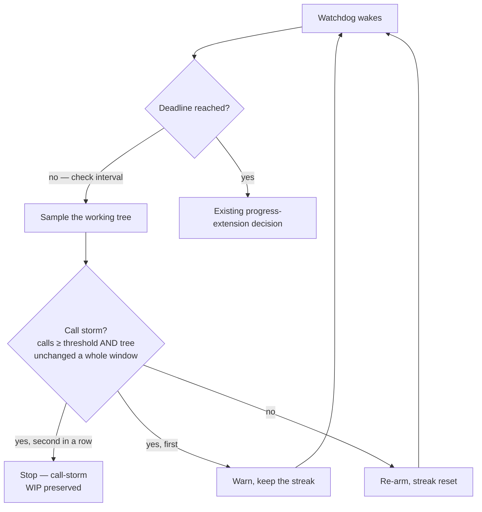

## Summary

A run that polls a job it started in the background was invisible to every
watchdog the worker had: the no-output watchdog saw output every second, and the
progress extension only _declined to extend_ a deadline still an hour away.
GRQ-23 slot s2 spent an hour and roughly 700 billed turns on `pgrep`, `tail` and
`echo w252` while a background `deno task test` ran, changing not one byte of
the checkout, and finished with no PR.

This adds the worker-side guard the issue asked for (the prompt half landed in
#2232). The progress tracker keeps a sliding window of tool-call times; a new
pure module decides when that rate with an unchanged working tree is a storm;
the runner's interim check stops the agent once **two consecutive** checks
agree, records a reason naming the loop, and lets the existing WIP-preservation
path keep whatever was committed. On by default at 60 calls in 5 minutes, with
`call_storm_enabled: false` to turn it off.

Closes #2230.

## Evidence

Backend/worker change with no web interface to screenshot — the evidence is the
test suite and the gate. `./quality.sh` passes in full (deno tests, lint, type
check, fmt, markdownlint, semgrep, mermaid, manifests).



What an operator sees, first window then the stop:

```text
[call-storm] call storm: 372 calls in 5m, tree unchanged; last: Bash echo w252
— check 1 of 2; the run is stopped if the next check agrees
[call-storm] stopping the agent after 1483s: call storm: 372 calls in 5m,
tree unchanged; last: Bash echo w252
```

The failure reason the issue comment carries says what happened —
`Claude was stopped as stalled before its timeout — call storm: …` — rather than
claiming a timeout the run never reached, and still classifies as `timeout`
rather than as an external kill, so a polling loop is not retried as
infrastructure.

**Red-capable check.** With the guard's wiring disabled (`checkCallStorm`
returning `undefined`),
`claude_runner_call_storm_2230_test.ts::a call storm
with an unchanged tree is stopped once two checks agree`
never completes — the storming run is never stopped, which is the defect. With
the guard in place it passes in 129 ms.

## Acceptance Criteria

<!-- vibe-spec-review inputs="diff+issue-body" -->

- **met** — the agent templates forbid polling a backgrounded long-running
  command — evidence: `worker/deno/lib/repo_config.ts:155` (landed in #2232, not
  in this diff) — reviewer: met — reason: the reviewer said "met, but not by
  this diff"; the issue comment hands only the worker half to the fleet
- **met** — a tool-call rate over a sliding window with no working-tree change
  stops the agent as stalled — evidence:
  `worker/deno/lib/call_storm.ts::decideCallStorm`,
  `worker/deno/lib/claude_runner.ts::checkCallStorm`/`fireCallStorm` — reviewer:
  met
- **met** — the reason names the loop
  (`call storm: N calls in M, tree unchanged; last: …`) — evidence:
  `worker/deno/tests/call_storm_test.ts::60 calls in five minutes with an unchanged tree is a stall naming the loop`
  — reviewer: met
- **met** — the existing WIP-preservation path keeps what was committed —
  evidence: the kill sets `timedOut` + `TIMEOUT_EXIT_CODE`, which routes to the
  existing `preserveRunWip` path in `worker/deno/lib/phases/execute_phase.ts` —
  reviewer: met
- **partial** — "the worker has a guard for a call-storm" — evidence:
  `worker/deno/lib/progress_extension_runtime.ts::buildProgressExtension` —
  reviewer: partial — reason: the guard rides the progress extension's interim
  check, so it covers issue work only and is off when
  `progress_extension_enabled: false`; documented in `docs/CONFIGURATION.md`
  rather than widened here
- **partial** — "the issue template contains the no-polling rule;
  `prompt_gate_instruction_check` still passes" — evidence:
  `worker/deno/tests/prompt_gate_instruction_check_test.ts` passes; the rule's
  own test came with #2232 — reviewer: partial — reason: no new prompt test
  here, because this branch changes no prompt
- **met** — 60 calls in 5 minutes with an unchanged tree → stalled verdict —
  evidence:
  `worker/deno/tests/call_storm_test.ts::60 calls in five minutes with an unchanged tree is a stall naming the loop`
  — reviewer: met — reason: departure recorded — the _verdict_ is per window as
  the issue specifies, but after review the runner requires two consecutive
  storm windows before it stops a run, so a read-heavy first five minutes is
  warned rather than killed
- **met** — 60 calls with a tree change → not stalled — evidence:
  `worker/deno/tests/call_storm_test.ts::60 calls with a working-tree change is not a stall`;
  runner-level
  `claude_runner_call_storm_2230_test.ts::a busy run that keeps changing the tree is never stopped`
  — reviewer: met
- **met** — 10 calls in 5 minutes → not stalled — evidence:
  `worker/deno/tests/call_storm_test.ts::10 calls in five minutes is not a stall`
  — reviewer: met
- **unrequested** — three operator config keys (`call_storm_enabled`,
  `call_storm_calls`, `call_storm_window_seconds`) with load-time validation —
  reviewer: unrequested — reason: a guard that kills runs needs a kill switch
  and tunables; every comparable worker guard in this repo is configured the
  same way
- **unrequested** — bounded tool-call history in the tracker
  (`TOOL_CALL_HISTORY_MS`, `TOOL_CALL_HISTORY_MAX`) — reviewer: unrequested —
  reason: the sliding window needs a retained history, and an unbounded one on a
  storming run is exactly the shape that costs memory
- **unrequested** — `"call-storm"` added to `ClaudeTimeoutReason`, plus a
  `stallReason` field — reviewer: unrequested — reason: required for the result
  to say which guard fired; the runner's result flows into
  `ClaudeExecutionResult`, so the type had to widen with it
- **unrequested** — `watchdogFiredIn` recognises `Watchdog: call-storm`, and the
  execute phase words a storm stop as "stopped as stalled" — reviewer:
  unrequested — reason: without it the guard's own SIGTERM read as an _external_
  kill, classified as infrastructure and retried in process
- **unrequested** — two consecutive storm windows required before a stop —
  reviewer: unrequested — reason: the review showed one window of 60 calls is
  reachable by ordinary read-heavy investigation; this is the narrowing that
  keeps the default from stopping healthy runs
- **unrequested** — `worker/deno/lib/call_storm.ts` registered in
  `docs/audits/lib-sweep-coverage.json` — reviewer: unrequested — reason:
  `deno task check:manifests` fails without it, so the gate demands it

## Standards Review

<!-- vibe-standards-review inputs="diff+CODING-STANDARDS.md" -->

- **violation** — new `lib/` module claimed by no sweep slice, so
  `check:manifests` was red — evidence:
  `docs/audits/lib-sweep-coverage.json:479` — reason: fixed here;
  `call_storm.ts` added to slice 12e and the gate passes
- **violation** — a comment the change falsified ("an interim check can never
  kill") — evidence: `worker/deno/lib/claude_runner.ts:1698` — reason: fixed
  here; the doc comment now names the one thing that can end the run
- **violation** — the storm reason was reported through the extension
  telemetry's `refusalReason`, so operator output claimed an extension was
  refused when none was — evidence: `worker/deno/lib/claude_runner.ts:1526` —
  reason: fixed here; it travels in its own `stallReason` field and the execute
  phase renders it as a stall
- **violation** — silent ceilings: a window or threshold beyond the tracker's
  retention was accepted and then quietly under-counted or never fired —
  evidence: `worker/deno/lib/config.ts:648` — reason: fixed here; `loadConfig`
  refuses both, with tests, and the doc table states the limits
- **violation** — the guard ignores the external-work signal (Issue #508) with
  no reconciliation — evidence: `worker/deno/lib/claude_runner.ts:1677` —
  reason: deliberate and now documented as a fourth limit; a descendant burning
  CPU does not excuse a poll loop, and an agent waiting inside one bounded
  foreground command makes no tool calls at all, so it cannot trip the guard
- **violation** — the most likely false positive (read-heavy exploration at the
  shipped defaults) was untested — evidence:
  `worker/deno/tests/call_storm_test.ts` — reason: fixed here; the exploration
  shape is pinned, and the runner now requires two consecutive windows with a
  test for a storm window followed by a working window
- **violation** — no PR summary file — evidence:
  `docs/archive/pr-summaries/pr-summary-2230.md` — reason: fixed here; this file
- **violation** — commit subject used `(#2230)` rather than the `(Issue #2230)`
  convention — evidence: commit `5ebf7465` — reason: stands; amending a
  pushed-branch history was judged worse than the inconsistency, and the
  follow-up commit uses the convention
- **violation** — the `5m30s` duration branch was unexercised — evidence:
  `worker/deno/lib/call_storm.ts:105` — reason: fixed here;
  `call_storm_test.ts::a mixed window reads as minutes and seconds`
- **clean** — Australian English throughout; Deno-native tooling only, no new
  dependency; tests call real code (`loadConfig`, `buildProgressExtension`,
  `AgentProgressTracker.feed`, `runClaudeWithTimeout`) with no source-grepping;
  no wall-clock sleeps or absolute timing assertions (injected clock, stub
  gates, log/probe rendezvous); the pure decision extracted rather than buried
  in the 3.9k-line runner; config single source of truth (defaults, key
  registry, both config types); fail-loud validation naming the key, the value
  and the way to turn the guard off; no hidden or credential paths staged;
  run-id trailer present

## Test Plan

- `worker/deno/tests/call_storm_test.ts` — the pure decision: the issue's three
  cases (60/unchanged → stalled naming the loop, 60/tree change → not stalled,
  10 calls → not stalled), an inclusive threshold, an unverifiable tree, a
  disabled or unconfigured guard, window formatting, and the read-heavy
  exploration shape.
- `worker/deno/tests/agent_progress_call_window_test.ts` — the sliding window:
  counting inside and outside it, retention ageing, a bounded history on a
  storming run, the last-call summary, and Codex tool items.
- `worker/deno/tests/claude_runner_call_storm_2230_test.ts` — end to end on an
  injected clock: a sustained storm stopped once two checks agree with
  `timeoutReason: "call-storm"`; a busy run that keeps changing the tree never
  stopped; no policy wired → unchanged behaviour; a storm window followed by a
  working window → not stopped.
- `worker/deno/tests/call_storm_config_2230_test.ts` — defaults, explicit
  tunables, key recognition, the four load-time refusals, and the policy
  reaching the runner option (and not reaching it when switched off).
- `worker/deno/tests/call_storm_failure_reporting_2230_test.ts` — the stopped
  storm is recognised as the worker's own watchdog, classified as a timeout
  rather than an external kill, and its reason names the loop.
- Full `./quality.sh`: PASSED.
