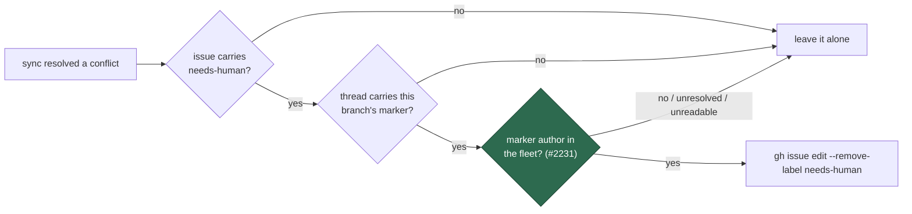

# Gate the milestone sync-conflict marker on a fleet author (Issue #2231)

## Summary

`clearEarlierSyncEscalation` removed `needs-human` from a milestone's tracking
issue whenever the thread carried a sync-conflict marker for that branch —
without checking who wrote the comment. The marker prefix
(`<!-- vibe-milestone-sync-conflict key="milestone/<slug>@`) is fixed text and
the slug is public on every milestone PR, so any account able to comment on a
public repository could plant one and have the worker strip a human-attention
label. The sibling `hasConflictEscalationComment` trusted an unauthored marker
the same way, where a planted one suppresses an analysis only a human can
settle.

Both sites now project the comment authors and keep only the matches
`selectFleetAuthoredComments` (`alert_dedup_authors.ts`) attributes to a fleet
account — the control `milestone_branch_self_heal.ts` already applies to its own
marker searches. The fail directions follow the per-site rule: the label clear
fails **closed** (an unresolved fleet identity, or an unreadable thread, leaves
the label alone), and the cross-host dedup keeps failing **open** (an
unattributable marker means the conflict is reported again rather than
silenced).

Closes #2231.

## Evidence

Backend-only change — no web interface to screenshot. The evidence is the test
run and the closed attack path.

**The original trigger is closed, with no trivial bypass.** The forged path was:
an outsider comments the marker prefix on the tracking issue → the next sync
that auto-resolves a conflict reads the thread → the marker matches →
`gh issue edit --remove-label needs-human`. Every match is now filtered by
`isFleetAuthor` against the fleet identity (`service_accounts` ∪
`fleet_pr_authors` ∪ this host's login) before anything is removed, so an
outsider's comment yields an empty match set and the function returns `""` with
no `gh issue edit` call at all. No equivalent bypass exists: the login is the
only authenticated part of a comment, it is read from `gh`'s own payload rather
than from the comment body, so marker text crafted to look fleet-authored
changes nothing; the object shape, the bare-login shape, a missing author and an
unreadable author are each handled explicitly, so no payload variant smuggles an
unattributed row past the filter; and an unresolved fleet set or an unreadable
thread removes nothing. The two remaining ways to reach the removal are to be a
fleet account (trusted here by definition, as everywhere else in the fleet) or
to widen the configured fleet, which only a repository writer can do.

**Test run.** `./quality.sh` passed in full (deno tests, lint, type check, fmt,
markdownlint, semgrep, mermaid and the chokepoint gates all PASSED; `config
integration` SKIPPED, as it is on `main` without a live config). The regression
file was also run with `worker/deno/lib/milestone_branch_sync.ts` and
`milestone_conflict_dedup.ts` checked out at `origin/main`: `FAILED | 1 passed |
4 failed` — the four security cases fail against the unfixed code and the
"#2214 still works" case passes, then all five pass after the fix.

## Acceptance Criteria

<!-- vibe-spec-review inputs="diff+issue-body" -->

- **met** — a comment carrying the marker from a non-fleet author does not cause
  `needs-human` to be removed — evidence:
  `worker/deno/tests/milestone_sync_escalation_author_2231_test.ts::escalateSyncConflict - a sync-conflict marker planted by a non-fleet commenter does not strip needs-human (Issue #2231)`
  — reviewer: met
- **met** — a comment carrying the marker from a fleet author still clears the
  label, so #2214's behaviour is preserved — evidence:
  `worker/deno/tests/milestone_sync_escalation_author_2231_test.ts::escalateSyncConflict - a fleet-authored marker still clears the needs-human it applied (Issue #2231)`
  — reviewer: met
- **met** — regression test in `worker/deno/tests/` drives `escalateSyncConflict`
  / `clearEarlierSyncEscalation` through an injected `ghCommandFn`, asserts no
  `--remove-label` call for the forged-author case, and fails against the current
  code — evidence: the forged-author case above, observed failing with the lib
  files at `origin/main` — reviewer: met — reason: the reviewer noted that as
  committed the file also failed to *load* on `main`, because it imported a
  symbol this branch adds; that import and its two unit cases moved to
  `worker/deno/tests/alert_dedup_author_verification_test.ts`, so the red run now
  shows four clean assertion failures rather than a load error.
- **met** — `./quality.sh` passes — evidence: full gate run,
  `Result: PASSED (with skipped checks)` — reviewer: met
- **unrequested** — two rows added to the marker-driven-actions table in
  `SECURITY.md` — reviewer: unrequested — reason: that table is this control
  class's registry, and a code change owes its docs change; without the rows the
  two newly gated sites are invisible to the next reader of the control.
- **unrequested** — `clearEarlierSyncEscalation` now throws on a payload whose
  `comments` is not an array, plus the test that pins it — reviewer: unrequested
  — reason: the new projection would otherwise have swallowed a malformed
  payload that previously threw into the catch and was logged; the label outcome
  is identical either way, only the diagnostic is restored (fail-loud standard).
- **unrequested** — the shared `parseIssueViewCommentRows` in
  `alert_dedup_authors.ts` and its two unit cases — reviewer: unrequested —
  reason: raised by the standards review as a fourth copy of the same
  normalisation; it is homed beside the selector its rows are handed to. The
  three pre-existing copies are untouched, being outside this issue's scope.

## Standards Review

<!-- vibe-standards-review inputs="diff+CODING-STANDARDS.md" -->

- **violation** — DRY: the comment-author projection was a fourth copy of the
  same normalisation — evidence:
  `worker/deno/lib/milestone_conflict_dedup.ts:129` (as first written) — reason:
  fixed in this diff; the projection moved to
  `worker/deno/lib/alert_dedup_authors.ts::parseIssueViewCommentRows` and both
  sites import it.
- **violation** — fail-loud: a malformed `comments` payload was swallowed where
  the old `(parsed.comments ?? []).some` shape threw into the catch and logged —
  evidence: `worker/deno/lib/milestone_branch_sync.ts:1800` (as first written) —
  reason: fixed in this diff; the function now throws
  ``gh issue view returned no `comments` array``, as its sibling already did.
- **violation** — test coverage: the new exported projection had no test of its
  own — evidence: `worker/deno/lib/milestone_conflict_dedup.ts:129` (as first
  written) — reason: fixed in this diff; both author shapes, a missing author, an
  unreadable author, non-object entries and a non-array payload are covered in
  `worker/deno/tests/alert_dedup_author_verification_test.ts`.
- **violation** — the PR summary file was absent when the review ran — evidence:
  `docs/archive/pr-summaries/pr-summary-2231.md` — reason: fixed; this is that
  file, and it states the regression-test linkage.
- **violation** — `milestone_presync.ts` calls `escalateSyncConflict` without a
  `dedupAuthors` seam, so the child-run pre-cut path resolves the fleet from the
  ambient `CONFIG_PATH` / `GITHUB_USER` — evidence:
  `worker/deno/lib/milestone_presync.ts:628` — reason: stands. That is the
  documented production default for every caller of `alert_dedup_authors.ts`
  ("omitted means read the configured fleet identity"); adding a seam there is a
  change the issue did not ask for.
- **clean** — Australian English throughout the added lines; tests call real
  exported functions through a `gh` stub and assert on the resulting label edits
  and comment bodies, with no source-grepping; no existing test case or assertion
  was removed, and each modified suite says why the commenter was named; the fail
  direction is stated per site with its own `unverifiedOutcome` sentence, and the
  unresolved-fleet path is logged and pinned by a test; every new export carries a
  doc comment; `SECURITY.md` gains both sites in the author-check table; no hidden
  paths staged; commits reference Issue #2231 and carry the run-id trailer; the
  new helper went into the small dedup module rather than the 2,100-line sync
  module.

Two risks the reviewers raised, recorded rather than fixed here. On a repository
with neither `service_accounts` nor `fleet_pr_authors` configured, the label
clear now fails closed, so #2214's automatic `needs-human` clear no longer
happens there — the harmless direction, named in the log every time. And
`resolveAlertDedupAuthors` reads `CONFIG_PATH` only, never `CONFIG_FILE`: that is
pre-existing behaviour shared with every other caller of the helper, not
something this diff introduces.

## Test Plan

- Added `worker/deno/tests/milestone_sync_escalation_author_2231_test.ts`:
  - `escalateSyncConflict - a sync-conflict marker planted by a non-fleet commenter does not strip needs-human (Issue #2231)`
    — the regression case: it reproduces the flaw, fails against the unfixed code
    and passes after the fix.
  - `escalateSyncConflict - a fleet-authored marker still clears the needs-human it applied (Issue #2231)`
    — #2214's behaviour is preserved.
  - `escalateSyncConflict - an unresolved fleet identity leaves the label alone (Issue #2231)`
    — the fail-closed direction, and the warning that names it.
  - `escalateSyncConflict - a thread whose comments cannot be read leaves the label alone and says so (Issue #2231)`
    — a malformed payload is logged, never read as "no escalation here".
  - `hasConflictEscalationComment - a marker from outside the fleet is not an escalation already posted (Issue #2231)`
    — a planted marker no longer suppresses the analysis.
- Added to `worker/deno/tests/alert_dedup_author_verification_test.ts`:
  `parseIssueViewCommentRows - keeps both author shapes and drops what cannot be read`
  and `parseIssueViewCommentRows - a payload that is not an array yields no rows`.
- Updated, with no case or assertion removed — each now names its commenter,
  because an unattributed marker is no longer evidence:
  `milestone_sync_success_notice_2214_test.ts`,
  `milestone_conflict_dedup_test.ts`,
  `milestone_sync_conflict_analysis_escalation_test.ts`.
- Full `./quality.sh`: PASSED.
