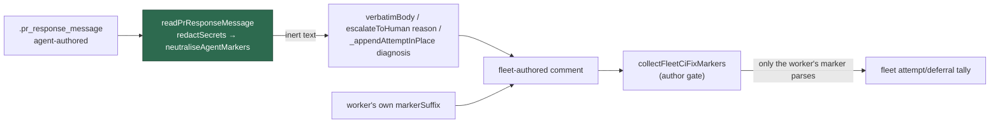

# Neutralise marker syntax in agent-authored PR replies

## Summary

The CI-fix and PR-feedback lanes post the agent's own `.pr_response_message`
**verbatim** inside a comment the **fleet account** authors, and since #1879
those bodies are the fleet-wide record of CI-fix attempts and deferrals —
parsed by marker, gated only on the *comment's* author. A
`<!-- vibe-ci-fix-attempt … -->` or `<!-- vibe-ci-fix-deferred … -->` smuggled
into the agent's message was therefore posted by the fleet and read back as the
fleet's own claim: a forged deferral parks a red pull request for good, forged
attempts exhaust the shared attempt budget and force a spurious `needs-human`.

Every HTML-comment delimiter in agent-authored text is now made inert at the
`readPrResponseMessage` chokepoint (`neutraliseAgentMarkers`), **by
construction rather than by marker name**, so a marker added years from now is
defused by the same two replacements. The defusal is logged as
`AGENT_MARKER_NEUTRALISED` through `logger.security` — fail loud, not silent —
and the text is defused rather than deleted, so the injection attempt stays
visible to a reviewer. The worker's own marker is concatenated **after** the
agent's text and still parses, so #1879's tally is untouched.

Closes #2236.

## Evidence

Backend/CLI change with no web interface to screenshot. Verified by tests.
Added `worker/deno/tests/pr_ci_processor_marker_injection_test.ts::processCiFailure - a forged attempt marker in the agent's message never reaches the fleet record (Issue #2236)`,
which reproduces the flaw, fails against the unfixed code and passes after the
fix:

- `deno test worker/deno/tests/pr_ci_processor_marker_injection_test.ts` —
  **red** with `worker/deno/lib/` reverted to `origin/main` (both forged
  markers parse out of the posted body), **green** after the fix.
- `./quality.sh` — `Result: PASSED (with skipped checks)` (only the repo's
  pre-existing `config integration: SKIPPED`), 22318 tests.

**Original trigger closed, no trivial bypass.** The attack input is a
well-formed marker in `.pr_response_message`. Every marker must open with
`<!--` and close with `-->`; both literals are replaced at the one chokepoint
all three readers of that file go through, before the text reaches any comment
body, and a space is kept inside each token so a longer dash run cannot
re-form the delimiter (`<!--->` → `<!- - ->`). Nothing is filtered by marker
name, so no future marker name reopens the hole, and the parse patterns
(`ATTEMPT_MARKER_RE` / `DEFERRAL_MARKER_RE`) require the literal `<!--` that no
longer survives. The three sinks the issue names —
`verbatimBody` (`pr_ci_processor.ts:1590`), `escalateToHuman`'s `reason`
(`:1737`) and `_appendAttemptInPlace`'s `diagnosis` (`:1707`) — all derive from
the same `customMessage`, so all three are covered by the single chokepoint.

One **adjacent** sink is out of this issue's scope and is filed as
stSoftwareAU/VibeCoder#2260: the failing **check name** is still interpolated
raw into the same bodies (`pr_no_changes_response.ts:102-113`), and on a fork's
`pull_request` workflow that name is attacker-chosen.

## Acceptance Criteria

<!-- vibe-spec-review inputs="diff+issue-body" -->

- **met** — a `.pr_response_message` carrying a well-formed
  `<!-- vibe-ci-fix-attempt … -->` does not produce a fleet comment whose body
  parses as that attempt marker — evidence:
  `worker/deno/tests/pr_ci_processor_marker_injection_test.ts::processCiFailure - a forged attempt marker in the agent's message never reaches the fleet record (Issue #2236)`
  — reviewer: met
- **met** — the same holds for `<!-- vibe-ci-fix-deferred … -->` — evidence:
  `worker/deno/tests/pr_ci_processor_marker_injection_test.ts::processCiFailure - a forged deferral marker in the agent's message never reaches the fleet record (Issue #2236)`
  — reviewer: met
- **met** — the worker's own `markerSuffix` is still parsed normally, so
  #1879's fleet-wide tally is preserved — evidence:
  `worker/deno/tests/agent_marker_neutralisation_test.ts::neutraliseAgentMarkers - the worker's own marker appended afterwards still parses`,
  plus the injection test asserting exactly one marker with the worker's own
  `head` / `attempt` / `outcome` — reviewer: met
- **met** — regression test in `worker/deno/tests/` drives the CI-fix reply
  path with an injected `.pr_response_message` and asserts
  `parseCiFixAttemptMarkers` finds only the worker's own marker; it fails
  against the current code — evidence:
  `worker/deno/tests/pr_ci_processor_marker_injection_test.ts` (the reviewer
  independently reverted `worker/deno/lib/` to `origin/main` and watched both
  tests fail) — reviewer: met
- **met** — `./quality.sh` passes — evidence: full gate run at `c86108ce`,
  `Result: PASSED (with skipped checks)` — reviewer: met — reason: the reviewer
  recorded "met (at final HEAD only)"; the gate failed at the first commit
  (`lib_sweep_coverage_test.ts` — the new module was claimed by no sweep slice)
  and the second commit added the slice and its written record
- **unrequested** — the PR-feedback and merge-conflict lanes also pass a logger
  into `readPrResponseMessage` (`pr_feedback_processor.ts:885`,
  `merge_conflict_agent.ts:221` via `pr_merge_conflict_processor.ts:893`) —
  reviewer: unrequested — reason: the neutralisation reaches those lanes free
  from the chokepoint the issue endorsed; without the logger their defusal
  would be silent, which the issue's own "fail loud, not silently" requirement
  forbids
- **unrequested** — sweep-coverage ledger entry plus
  `docs/audits/security-sweep-2236-agent-marker-neutralisation.md` — reviewer:
  unrequested — reason: the repo's completeness gate fails any new `lib/`
  module claimed by no sweep slice, so this is required by the `./quality.sh`
  criterion
- **unrequested** — prose in `docs/CONFIGURATION.md` and `docs/INTERNALS.md` —
  reviewer: unrequested — reason: both documents describe the marker record as
  author-gated; leaving them silent about the new control would be a documented
  surface drifting from the code
- **unrequested** — the bounded name reporting in the warning
  (`MAX_REPORTED_NAMES`, `MAX_NAME_LENGTH`) and its four tests — reviewer:
  unrequested — reason: the issue asks for a warning; naming what was defused
  makes it actionable, and the caps stop hostile text flooding the log line

## Standards Review

<!-- vibe-standards-review inputs="diff+CODING-STANDARDS.md" -->

- **violation** — the new `lib/` module was claimed by no sweep slice, so
  `deno task check:manifests` failed — evidence:
  `worker/deno/lib/agent_marker_neutralisation.ts:1` — reason: fixed here —
  `top-up-2236` added to `docs/audits/lib-sweep-coverage.json` with its written
  record `docs/audits/security-sweep-2236-agent-marker-neutralisation.md`
- **violation** — no PR summary file — evidence:
  `docs/archive/pr-summaries/pr-summary-2236.md` — reason: fixed here — this
  file, carrying the regression-test linkage and the closing keyword
- **violation** — the merge-conflict lane read the chokepoint with no logger,
  so its defusal was silent while the docstring claimed all three consumers
  logged it — evidence: `worker/deno/lib/merge_conflict_agent.ts:221` — reason:
  fixed here — `createMergeConflictReplyReader` takes an optional logger and
  `pr_merge_conflict_processor.ts:893` passes the one already in scope
- **violation** — the test named "the reported names are capped" used only two
  distinct names, so the cap branch was never taken, and `MAX_NAME_LENGTH` had
  no test — evidence:
  `worker/deno/tests/agent_marker_neutralisation_test.ts:77` — reason: fixed
  here — the dedup test was renamed, and cases for twelve distinct names, a
  200-character name and empty input were added
- **clean** — Australian English throughout (no `behavior|color|organiz|analyze|neutralize|…` in the diff); `deno fmt --check`, `deno lint`, semgrep `p/default` and markdownlint clean; tests call real functions (the injection test drives `processCiFailure` end to end and parses the posted body with the production parsers); both new suites correctly classified as unit tests; `readPrResponseMessage` gains an optional trailing parameter only (additive); `redactSecrets` still runs first and the neutralisation applies to its output; no hidden or credential-shaped path staged; both commits reference `(Issue #2236)` and carry the `Vibe-Coder-Run-Id` trailer

## Test Plan

Added:

- `worker/deno/tests/pr_ci_processor_marker_injection_test.ts` — two regression
  tests driving `processCiFailure` with an injected `.pr_response_message`
  carrying a forged attempt marker and a forged deferral marker, asserting the
  **posted** body parses as only the worker's own marker. Both fail against the
  unfixed code and pass after the fix.
- `worker/deno/tests/agent_marker_neutralisation_test.ts` — ten unit tests for
  `neutraliseAgentMarkers`: marker-free prose unchanged, empty input, a forged
  attempt marker no longer parsing, an unknown future marker name, a longer
  dash run, an unclosed delimiter, the worker's own marker still parsing when
  appended afterwards, dedup, the five-name report cap and the 64-character
  name cap.
- `worker/deno/tests/pr_branch_preparation_test.ts` — two chokepoint tests: a
  marker in the file is neutralised and logged once as
  `AGENT_MARKER_NEUTRALISED`, and marker-free prose (including
  `Map<string, number>`) is returned byte-exact with nothing logged.

Re-ran unchanged: `pr_ci_processor_test.ts`, `pr_ci_processor_no_changes_test.ts`,
`pr_ci_processor_deferral_test.ts`, `pr_ci_processor_auto_fix_cap_test.ts`,
`pr_feedback_processor_test.ts`, `merge_conflict_agent_test.ts`,
`pr_merge_conflict_processor_test.ts`, `commit_and_push_pending_test.ts`,
`lib_sweep_coverage_test.ts` — all green, plus the full `./quality.sh`.
