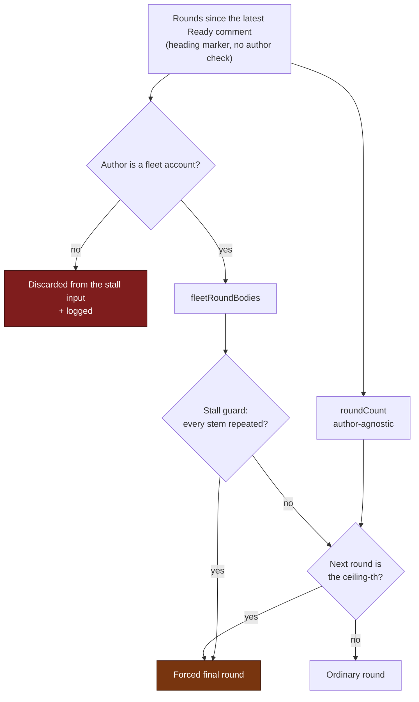

# Gate the grill-me stall guard on a fleet author (Issue #2237)

## Summary

The grill-me **stall guard** (#1933) decided that a clarification round had
repeated itself — and so that the next round must be the *forced final* one —
from round comments selected by heading marker alone, with no author check.
`carriesRoundMarker` is deliberately author-agnostic (#1560, #3768), so any
account that can comment on the issue could post one `## Grill-Me Round N`
comment repeating the worker's own published question stems and end the
clarification loop early, with the forger choosing which questions counted as
"already asked". That is Broken Access Control (A01:2025): a control decision
taken from attacker-settable data.

`decideGrillMeStop` now takes the stall input and the ceiling input as two
**separate** parameters — `fleetRoundBodies` (author-verified) and `roundCount`
(author-agnostic) — so a caller cannot satisfy one with the other by accident.
The processor feeds the stall guard only the rounds
`selectFleetAuthoredRounds` attributes to a fleet account
(`githubUser` ∪ `fleet_pr_authors` ∪ `service_accounts`, via the
`resolveSuppressionExcludedLogins` set the processor already resolves), while
the runaway ceiling keeps counting every marker-carrying round so #1560 and
#3768 are not regressed. The `countGrillMeRounds` justification that asserted
the worker "never acts on the forgery" is corrected in the same change, as are
the two operator surfaces that documented the guard.

**Fail direction:** an unresolved fleet identity keeps **no** rounds, so the
stall guard sees fewer than two rounds and reports no stall. An extra round of
questions costs the developer one reply; a grilling forced to convert their
still-open questions into named assumptions cannot be undone.

Closes #2237.

## Evidence

Backend/CLI change — no web interface to screenshot. The evidence is the
regression suite below plus the full quality gate.

### The original trigger is closed, with no trivial bypass

The forged comment is still counted (numbering and the ceiling are unchanged),
but it can no longer reach the stall decision. The only input
`isRoundStalled` now receives is
`selectFleetAuthoredRounds(roundsSinceReady, fleetLogins).map((c) => c.body)`
(`worker/deno/lib/grill_me_processor.ts:1557`, `:1574`), and that selector keeps
a round only when `isFleetAuthor(c.author, fleet)` holds. `c.author` comes from
the GitHub API's comment payload, not from the comment body, so nothing a
commenter can write — a forged marker heading, a copy-pasted stem, a fake
`author=` line, a quoted round — changes it. The three bypasses worth naming:

- **Forge a different marker.** Every round scanner shares
  `carriesRoundMarker`, so a different heading is not a round at all and never
  reaches the guard.
- **Drown the guard in rounds.** The ceiling is the only thing a non-fleet
  round can still move, and the ceiling round is a forced final round that
  *converges* — the fail-safe #1560 already documented.
- **Empty the fleet set.** `selectFleetAuthoredRounds` returns `[]` for an
  unresolved fleet identity, which yields no stall rather than an early final
  round (`worker/deno/tests/grill_me_stall_guard_author_2237_test.ts::selectFleetAuthoredRounds - an unresolved fleet identity keeps no rounds (fails towards a productive grilling)`).

The exclusion is logged loudly rather than silently applied
(`grill_me_processor.ts:1558-1571`).



### Regression test — red before, green after

Added
`worker/deno/tests/grill_me_stall_guard_author_2237_test.ts::processGrillMe - a forged round from a non-fleet author does not trip the stall guard (Issue #2237)`,
which reproduces the flaw: it posts Round 1 from the fleet identity
(`testbot`), a developer reply, then a `## Grill-Me Round 2` comment from
`drive-by-commenter` copy-pasting Round 1's question stem, and asserts the
prompt Claude receives carries no forced-final instruction.

It **fails against the unfixed code and passes after the fix**, observed both
ways in this run. Reverting only the author gate at the call site — passing
`roundsSinceReady.map((c) => c.body)` as `fleetRoundBodies` — turns it red:

```
processGrillMe - a forged round from a non-fleet author does not trip the stall guard (Issue #2237) ... FAILED (9ms)
error: AssertionError: A round authored outside the fleet must not force a final round
FAILED | 0 passed | 1 failed | 6 filtered out (11ms)
```

With the gate in place the same command is green (9 passed, 0 failed). The
negative assertion cannot pass vacuously: the sibling test
`processGrillMe - a fleet-authored round repeating every stem still trips the stall guard (Issue #1933)`
runs the identical scenario with a fleet author and asserts the exact string
`Forced final round: stall guard tripped at Round 2` is present, so if the
guard stopped working altogether that test would fail.

## Acceptance Criteria

<!-- vibe-spec-review inputs="diff+issue-body" -->

- **met** — a `## Grill-Me Round N` comment from a **non-fleet** author that
  repeats every earlier stem does not trip the stall guard — evidence:
  `worker/deno/tests/grill_me_stall_guard_author_2237_test.ts::processGrillMe - a forged round from a non-fleet author does not trip the stall guard (Issue #2237)`
  — reviewer: met
- **met** — a round from a **fleet** author that repeats every earlier stem
  still trips it, so #1933's behaviour is preserved — evidence:
  `worker/deno/tests/grill_me_stall_guard_author_2237_test.ts::processGrillMe - a fleet-authored round repeating every stem still trips the stall guard (Issue #1933)`,
  plus the 22 unchanged cases in `grill_me_stall_guard_test.ts` — reviewer: met
- **met** — the runaway ceiling still counts rounds author-agnostically, so
  #1560 and #3768 are not regressed — evidence:
  `worker/deno/tests/grill_me_stall_guard_author_2237_test.ts::processGrillMe - the runaway ceiling still counts rounds authored outside the fleet (Issues #1560, #3768)`
  — reviewer: met. The reviewer confirmed the test discriminates: with
  `maxGrillMeRounds: 3` and one fleet plus one forged round, a fleet-only count
  would reach 2 and not trip.
- **met** — regression test in `worker/deno/tests/` drives `decideGrillMeStop`
  through the processor with a forged-author round and asserts no `stall`
  trigger; it fails against the current code — evidence:
  `worker/deno/tests/grill_me_stall_guard_author_2237_test.ts::processGrillMe - a forged round from a non-fleet author does not trip the stall guard (Issue #2237)`
  — reviewer: met. The reviewer reverted both library files to `bb9ff519`
  independently and observed the failure, confirming it is behavioural rather
  than a missing-export compile error.
- **met** — `./quality.sh` passes — evidence: full gate run after the final
  edit, `Result: PASSED (with skipped checks)`, exit 0; only the environmental
  `config integration` check is skipped — reviewer: met
- **unrequested** — `logger.warn("Grill-me rounds authored outside the fleet
  excluded from the stall decision", …)` and the `fleetRounds` field on the
  existing stop-trigger log — evidence:
  `worker/deno/lib/grill_me_processor.ts:1560` — reviewer: unrequested —
  reason: kept. A security control that silently drops input is the
  fail-silently shape the standards forbid, and it mirrors
  `selectFleetAuthoredMatches`' own discard log. It fires once per grill-me
  pass, and only on an issue that actually carries a non-fleet marker comment.
- **unrequested** — splitting `decideGrillMeStop`'s single `roundBodies` into
  `fleetRoundBodies` + `roundCount`, and migrating the 9 existing call sites —
  evidence: `worker/deno/lib/grill_me_stall_guard.ts:216` — reviewer:
  unrequested — reason: kept, and load-bearing. The old ceiling read
  `roundBodies.length`, so gating that one parameter would have author-gated
  the ceiling too and regressed #1560/#3768 — the third criterion cannot hold
  without the split.
- **unrequested** — the `docs/INTERNALS.md` and `docs/workflows/grill-me.md`
  rewrites, including the Mermaid decision-node relabel — evidence:
  `docs/workflows/grill-me.md:563` — reviewer: unrequested — reason: kept. The
  issue named only the code comment, but both documents stated the now-false
  "every round posted since the latest Ready comment"; a code change owes a
  docs change.
- **unrequested** — six supporting unit tests beyond the regression test
  (`selectFleetAuthoredRounds` cases, and the two `decideGrillMeStop`
  input-disagreement cases) — evidence:
  `worker/deno/tests/grill_me_stall_guard_author_2237_test.ts:245` — reviewer:
  unrequested — reason: kept. The Test Coverage standard requires a happy path,
  an error path and the edge cases for every new or modified public function,
  and the disagreement cases are what stop a future caller re-opening this
  hole.

### Reviewer findings acted on after the review

- **Dead fail-closed branch.** The reviewer found
  `if (fleetLogins.length === 0) return [];` redundant — `isFleetAuthor`
  already rejects every login against an empty set. Removed; the docstring now
  records where the property actually comes from, and the test that pins it is
  unchanged.
- **Stale prose.** `collectGrillMeRoundsSince`'s docstring claimed the counter
  and the stall guard "see exactly the same window" — true of the time window,
  no longer of the set. Reworded.
- **Overclaim.** The new module comment said "a caller cannot satisfy one with
  the other by accident"; nothing type-level enforces that. Reworded to what is
  true — a caller must name both, so it is a visible choice.

Two reviewer notes were not acted on, deliberately. The issue suggested reusing
`selectFleetAuthoredMatches`; that helper (and its comment-shaped sibling) is
`async` and resolves the fleet set by loading the config, whereas the processor
has already resolved the same set synchronously into `fleetLogins` a few
hundred lines earlier — reusing it would add an await and a second config read
to get the identical answer, so the fleet set still comes from the existing
`resolveSuppressionExcludedLogins` resolver and no new definition of "the
fleet" is introduced. The reviewer also noted that `latestRoundNumber` remains
the author-agnostic count, so a forged marker can shift the round number
*printed* in the trigger line; that is cosmetic, does not affect whether the
stall fires, and changing the issue-wide numbering is what #1560 forbids.

## Standards Review

<!-- vibe-standards-review inputs="diff+CODING-STANDARDS.md" -->

- **violation** — no `docs/archive/pr-summaries/pr-summary-2237.md`, and with it
  no regression-test linkage or test-classification statement — evidence:
  `docs/archive/pr-summaries/` — reason: fixed here; this file is the summary,
  it states the red-then-green linkage explicitly, and the Test Plan records
  the unit classification and why.
- **violation** — the modified public function's defining edge case was
  untested: every case in the guard's own test file passed `roundCount` equal
  to `fleetRoundBodies.length`, so the two inputs never disagreed — evidence:
  `worker/deno/tests/grill_me_stall_guard_test.ts:174` — reason: fixed in
  commit `08895e94`, which adds both disagreement directions directly
  (`decideGrillMeStop - a stalled pair excluded from the fleet bodies runs an
  ordinary round (Issue #2237)` and `decideGrillMeStop - the ceiling trips on
  the author-agnostic count alone (Issues #1560, #3768)`).
- **violation** — DRY: the new test file re-copies `makeComment` /
  `makeConfig` / `makeContext` / `makeIssue` / `stubGhClient`, a third copy of
  the grill-me fixture set — evidence:
  `worker/deno/tests/grill_me_stall_guard_author_2237_test.ts:49` — reason:
  stands. Extracting a shared grill-me fixture means editing two unrelated
  test files (`grill_me_processor_test.ts`,
  `grill_me_processor_escalation_test.ts`); that is the adjacent refactor the
  Change Scope rule keeps out of a security fix.
- **violation** — Prefer smaller files: `selectFleetAuthoredRounds` was added
  to the 2 299-line `grill_me_processor.ts` rather than the 248-line
  `grill_me_stall_guard.ts` — evidence:
  `worker/deno/lib/grill_me_processor.ts:682` — reason: stands, deliberately.
  The stall guard module is documented as pure — the processor owns the comment
  window and the GitHub data — and the selector's siblings
  (`carriesRoundMarker`, `collectGrillMeRoundsSince`) live in the processor, so
  moving it would split round selection across two modules.
- **clean** — Australian English throughout (no American forms in the added
  lines); tests exercise real code through `processGrillMe` rather than
  inspecting source text; unit-test classification correct and
  `check:manifests` passes; fail-loud (nothing swallowed, the degraded path
  emits `logger.warn` with the counts); commit safety (no hidden or
  key-material paths staged); run-id trailer on both commits; the docs owed by
  the code change updated in the same commit, including the Mermaid decision
  node; `deno fmt`, `deno lint`, `deno check` and `markdownlint-cli2` clean.

## Test Plan

New file `worker/deno/tests/grill_me_stall_guard_author_2237_test.ts` —
9 tests, all unit (no network, no subprocess, no clock; the prompts directory
is resolved from the checkout, the established idiom):

| Test | What it pins |
|------|--------------|
| `processGrillMe - a forged round from a non-fleet author does not trip the stall guard (Issue #2237)` | The regression. A fleet round plus a forged round repeating its stem leaves the next round ordinary. |
| `processGrillMe - a fleet-authored round repeating every stem still trips the stall guard (Issue #1933)` | The same two rounds, both fleet-authored, still force a final round. |
| `processGrillMe - the runaway ceiling still counts rounds authored outside the fleet (Issues #1560, #3768)` | A forged round still brings the ceiling closer. |
| `decideGrillMeStop - a stalled pair excluded from the fleet bodies runs an ordinary round (Issue #2237)` | The two inputs disagreeing, stall direction. |
| `decideGrillMeStop - the ceiling trips on the author-agnostic count alone (Issues #1560, #3768)` | The two inputs disagreeing, ceiling direction. |
| `selectFleetAuthoredRounds - keeps only the fleet-authored rounds` | Happy path, including a peer fleet identity. |
| `selectFleetAuthoredRounds - login matching is case-insensitive` | GitHub logins are case-insensitive. |
| `selectFleetAuthoredRounds - an unresolved fleet identity keeps no rounds (fails towards a productive grilling)` | The chosen fail direction. |
| `selectFleetAuthoredRounds - a blank author is never fleet` | Empty and whitespace authors. |

Modified `worker/deno/tests/grill_me_stall_guard_test.ts` — the nine
`decideGrillMeStop` call sites were migrated to the split signature
(`roundBodies:` → `fleetRoundBodies:` plus an explicit `roundCount:`). **No
test was removed, disabled or weakened**: every assertion and expected value is
unchanged, and each migrated case passes `roundCount: bodies.length`, which is
exactly what the single old parameter meant.

Commands run:

- `deno test --allow-all tests/grill_me_stall_guard_author_2237_test.ts tests/grill_me_stall_guard_test.ts tests/grill_me_processor_test.ts tests/grill_me_processor_escalation_test.ts tests/grill_me_stall_guard_bounds_2183_test.ts` → **166 passed, 0 failed**
- `./quality.sh` → **PASSED** (all 21 checks; `config integration` skipped as it is on this host)
