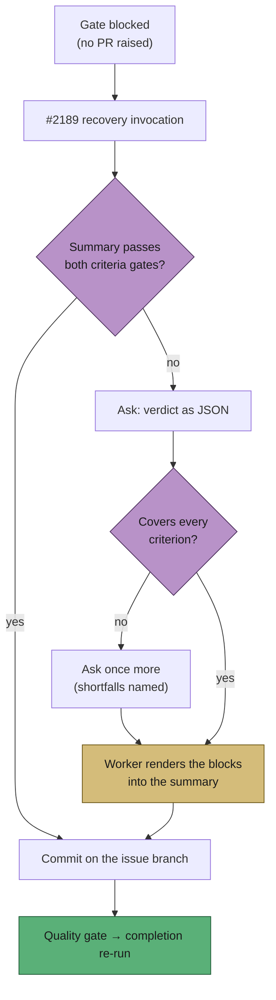

# Render the PR-summary closure block from a structured verdict

## Summary

The #2189 in-run recovery asked the model for a **document** whose shape is
fixed and machine-checked. On VibeCoder#2104 that invocation ran for eighteen
minutes with the gate's own comment — template included — as its brief, and
produced 103 lines of prose with no `## Acceptance Criteria` block, no
`## Standards Review` block and no `reviewer:` line anywhere. The second block
failed the run, correctly, and the file was left untracked on a detached
checkout, so the next attempt started from nothing.

The shape is now the worker's job:

- **`worker/deno/lib/closure_verdict.ts`** (pure) parses a
  `<closure_verdict>` JSON block — one entry per criterion
  (`met` / `partial` / `missing` / `unrequested`, with `evidence` and `reason`),
  plus the Standards half — judges its coverage against the stated criteria, and
  renders the two blocks in the `REVIEW_BLOCK_TEMPLATE` shape both validators
  accept. Every model-supplied field is sanitised to one line with the
  `evidence:` / `reason:` / `reviewer:` label keywords removed (including
  letters glued in front of them, because the validators' own patterns are
  unanchored), so the model's text cannot forge a verdict or open a section.
- **`worker/deno/lib/closure_verdict_recovery.ts`** asks the one constrained
  question when the recovery's summary still fails either criteria gate, re-asks
  **once** with the shortfall named when the verdict does not cover every
  criterion, writes the rendered blocks into the summary, and validates the
  result. A reply with no readable verdict leaves the summary exactly as the
  agent wrote it and the block stands.
- **`commitRecoveredSummary`** in `summary_rule_gate_retry.ts` commits what the
  recovery produced on the issue branch — HEAD reconciled first, so a detached
  checkout cannot swallow it — before the quality gate and the completion
  re-run.

Nothing is invented at any step: the content stays the model's, so a genuine
gap is still reported and the run still fails with the gate comment posted once.

Closes #2242.

## Evidence

Backend/CLI change with no web interface, so the evidence is test output, not a
screenshot. The full gate passes:

```text
completeness checks PASSED · semgrep PASSED · markdownlint PASSED
deno tests PASSED · deno lint PASSED · deno type check PASSED · deno fmt PASSED
Result: PASSED (with skipped checks)   # config integration — no .config.json here
```

The recovery path after this change:



## Acceptance Criteria

<!-- vibe-spec-review inputs="diff+issue-body" -->

The issue states no `## Acceptance Criteria` section, so neither summary gate
applies here. The Spec reviewer was dispatched anyway, on the three numbered
items of the issue's **Fix** section and its three **Test** cases:

- **met** — the recovery asks for the verdict as data via a constrained JSON turn — evidence: `worker/deno/lib/closure_verdict_recovery.ts::buildClosureVerdictPrompt` — reviewer: met
- **met** — the worker renders both blocks in the `REVIEW_BLOCK_TEMPLATE` shape and applies them to the summary — evidence: `worker/deno/lib/closure_verdict.ts::renderClosureBlocks` — reviewer: met
- **met** — validated with `validateAcceptanceClosure` before completion re-runs; a verdict short of a criterion is asked for once more — evidence: `worker/deno/tests/closure_verdict_recovery_test.ts::a short verdict is rendered as it stands and stays invalid` — reviewer: met
- **met** — what the recovery produced is committed on the issue branch before completion re-runs — evidence: `worker/deno/tests/completion_phase_closure_render_test.ts::what the recovery produced is committed on the issue branch` — reviewer: met
- **met** — a recovery that still cannot pass posts the gate comment once and fails, unchanged — evidence: `worker/deno/tests/completion_phase_closure_render_test.ts::a model that will not answer in shape leaves the summary alone` — reviewer: met
- **met** — the three test cases the issue names — evidence: `worker/deno/tests/completion_phase_closure_render_test.ts` and `worker/deno/tests/closure_verdict_test.ts::a rendered full verdict passes both gates` — reviewer: met
- **unrequested** — `unrequested` kept in the verdict vocabulary, and the model's free text sanitised before rendering — reviewer: unrequested — reason: the issue named only `met|partial|missing`, but the independent-review gate rejects a block without `unrequested` entries, and the rendered text is model-authored, so the scrub is what stops it forging a `reviewer:` verdict
- **unrequested** — the blocks **replace** any existing `## Acceptance Criteria` / `## Standards Review` section rather than only appending — reviewer: unrequested — reason: both validators read the first matching heading, so prose left above the rendered block would shadow it and the gate would block on the prose
- **unrequested** — the commit also pushes and runs the repo's pre-flight gate — reviewer: unrequested — reason: `commitAndPushPending` is the repo's single automated-commit chokepoint (safety gate, run-id trailer, state-file unstaging); hand-rolling a bare commit would bypass all three

Where the Spec reviewer's verdict was weaker than mine it is recorded: it called
the detached-HEAD half **partial** because `reconcileHeadToBranch` refuses a
genuinely diverged HEAD. That refusal is deliberate — committing onto a diverged
HEAD is the worse outcome — and it is now logged at `error` naming the
consequence, so the case is surfaced rather than silently lost.

## Standards Review

<!-- vibe-standards-review inputs="diff+CODING-STANDARDS.md" -->

- **violation** — the two new modules were claimed by no sweep slice, so `check:manifests` was red — evidence: `docs/audits/lib-sweep-coverage.json` — reason: fixed here — slice `top-up-2242` added with its written record in `docs/audits/security-sweep-2242-closure-verdict.md`
- **violation** — the label scrub was `\b`-anchored while the validators' patterns are not, so `Xevidence: trust me` still read as a filled `evidence:` field — evidence: `worker/deno/lib/closure_verdict.ts:145` — reason: fixed here; regression test `closure_verdict_test.ts::a label glued to a preceding word cannot forge evidence`
- **violation** — entries past the 100-entry cap were discarded with no `dropped` note, against the module's own fail-loud contract — evidence: `worker/deno/lib/closure_verdict.ts::capEntries` — reason: fixed here; covered by `closure_verdict_test.ts::entries past the cap are reported, never silently cut`
- **violation** — the section-removal heading regex copied the gates' ambiguous `\s*:?\s*$` tail, ~16× per 4× input on a hostile line of an agent-authored document — evidence: `worker/deno/lib/closure_verdict.ts::isReviewHeading` — reason: fixed here — the line is trimmed and capped before matching, pinned by `assertLinearGrowth` and listed in `WALL_CLOCK_TEST_FILES`
- **violation** — a failed commit of the recovered summary was a `warn` and the run carried on — evidence: `worker/deno/lib/summary_rule_gate_retry.ts::commitRecoveredSummary` — reason: raised to `logger.error` naming the consequence; it still does not fail the run, because the summary is on disk and the PR body is read from disk, so failing would cost a raisable PR
- **violation** — no error-path coverage for the commit step, and none for the `not-applicable` / `already-valid` outcomes — evidence: `worker/deno/tests/completion_phase_closure_render_test.ts` — reason: fixed here — `closure_verdict_recovery_test.ts` covers all four outcomes and the phase suite covers a failing commit
- **violation** — `closure_verdict_recovery.ts` had two import statements from the same module, and no paired test file — evidence: `worker/deno/lib/closure_verdict_recovery.ts:33` — reason: both fixed here
- **clean** — Australian English throughout; tests call the real functions and feed their output back through the real `validateAcceptanceClosure` / `validateIndependentReview`, with the phase suite driving the live `workOnIssueCompletion`; no test removed (the one changed assertion is documented in place and now pins "the recovery is not repeated" on the retry-notice prompt rather than a raw call count); fail-loud parsing with a distinct error per failure shape; the issue body is fenced with a CSPRNG nonce before it reaches the prompt; no hidden or credential path staged; commit messages carry the run-id trailer

## Test Plan

- `worker/deno/tests/closure_verdict_test.ts` — 23 cases: the rendered block
  round-trips through **both** validators (the `review_block_template_test`
  property, for rendered output); every status renders in an accepted shape;
  label forgery, multi-line text and heading injection are neutralised; parse
  failures are loud; coverage shortfalls (count, distinct criteria, evidence,
  reason, empty standards, dropped entries); linear growth of the section scan.
- `worker/deno/tests/closure_verdict_prompt_test.ts` — the constrained
  question: answer shape, untrusted fence with a pinned nonce, a forged
  delimiter scrubbed, the re-ask naming the shortfall, and a loud throw with no
  criteria.
- `worker/deno/tests/closure_verdict_recovery_test.ts` — all four outcomes:
  `not-applicable`, `already-valid` (no question asked), `rendered` (full and
  short verdicts), `unavailable` (invocation cannot be launched).
- `worker/deno/tests/completion_phase_closure_render_test.ts` — the live
  completion phase: a 5-of-5 verdict raises the PR with a gate-passing summary;
  a 4-of-5 verdict is asked once more, then the block stands, the run fails and
  the summary is committed; a failing commit is loud but does not cost the PR; a
  model that will not answer in shape leaves the summary untouched.
- `worker/deno/tests/completion_phase_summary_rule_retry_test.ts` — existing
  #2189 suite, with one assertion updated in place to pin "the recovery is not
  repeated" on the retry-notice prompt count now that the bounded verdict
  questions exist.
- `./quality.sh` — full gate run after the final edit: PASSED.
