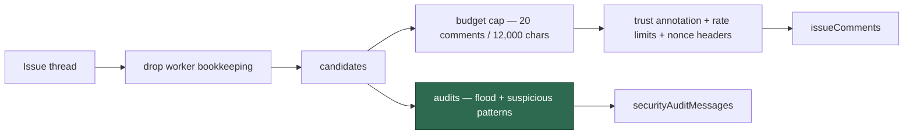

# Audit the whole thread before the implementation prompt's budget cap

## Summary

`buildImplementationCommentContext` handed `prepareTrustAnnotatedCommentList`
only the comments that survived `selectImplementationComments` — a 20-comment /
12,000-character cap — so the comment-flood detector and the suspicious-pattern
audit saw the capped set rather than the thread. Both detectors are documented
in `comment_trust_filter.ts` as running *before any cap*, and the implementation
route was running one in front of them: an attacker posting 15 untrusted
comments of ~1,200 characters produced no `[SECURITY] [COMMENT_FLOOD]` event,
and any injection pattern in a comment that lost the budget was silently absent
from the audit log.

The fix separates the two concerns. Audits now run over the **candidate** set —
the thread minus worker bookkeeping, before the count and character caps — while
the selection continues to decide only what the prompt *carries*. The volume
reaching the prompt is unchanged.

Closes #2243.

- `lib/comment_trust_filter.ts` — the flood verdict and the suspicious-pattern
  collection are extracted into `auditsFromAnnotated`, and exposed to callers
  that cap before formatting as `collectCommentSecurityAudits`.
  `prepareTrustAnnotatedCommentList` uses the same helper, so there is one
  source of truth for what an audit pass emits.
- `lib/implementation_comments.ts` — `selectImplementationComments` now returns
  its `candidates` (post-noise-filter, pre-cap), and
  `buildImplementationCommentContext` audits that set. The returned messages are
  a superset of the ones the formatting call raises over the selected subset, so
  they replace rather than duplicate them.



## Evidence

Backend/CLI change with no web interface, so there is nothing to screenshot.
The evidence is the regression tests, run against the unfixed and the fixed
code.

Against the unfixed code:

```
comment flood is audited even when the budget drops the surplus (#2243) ... FAILED
  AssertionError: the flood must be audited over the whole thread, got: []
suspicious pattern in a budget-dropped comment is still audited (#2243) ... FAILED
  AssertionError: a dropped injection must still be audited, got: []
FAILED | 10 passed | 2 failed
```

After the fix, `deno test tests/implementation_comments_test.ts
tests/comment_trust_filter_test.ts tests/comment_rate_limiter_test.ts` reports
`ok | 62 passed | 0 failed`.

### Original trigger closed, with no trivial bypass

The trigger in the issue — 15 untrusted comments of ~1,200 characters on an
implementation run — now raises
`[SECURITY] [COMMENT_FLOOD] Issue has 15 untrusted comments`, asserted by the
first test above. The bypass class is closed rather than the one input: the
audit no longer reads the *output* of any cap, it reads `candidates`, which is
the whole thread minus content-matched worker bookkeeping. Tuning comment size
or count to lose the budget therefore cannot move a comment out of the audited
set, because the budget no longer gates it. The one remaining exclusion is
`isWorkerNoiseComment`, which drops only bodies carrying the worker's own
markers — it never admits attacker text into the prompt, and an attacker who
copies a marker removes their own comment from the prompt rather than from the
audit of anything else.

## Test Plan

- Added
  `worker/deno/tests/implementation_comments_test.ts::comment flood is audited even when the budget drops the surplus (#2243)`
  — builds the issue's exact scenario (15 untrusted comments of ~1,200
  characters) and asserts the `[SECURITY] [COMMENT_FLOOD]` event names all 15.
  It reproduces the flaw: observed failing against the unfixed code (empty
  `securityAuditMessages`) and passing after the fix.
- Added
  `worker/deno/tests/implementation_comments_test.ts::suspicious pattern in a budget-dropped comment is still audited (#2243)`
  — an injection comment that provably loses the budget to twelve trusted
  comments is still audited, and is still absent from the prompt blob. Also
  observed failing against the unfixed code and passing after the fix.
- Existing `tests/comment_trust_filter_test.ts` and
  `tests/comment_rate_limiter_test.ts` pin the extracted `auditsFromAnnotated`
  behaviour unchanged; no existing test was modified or removed.
