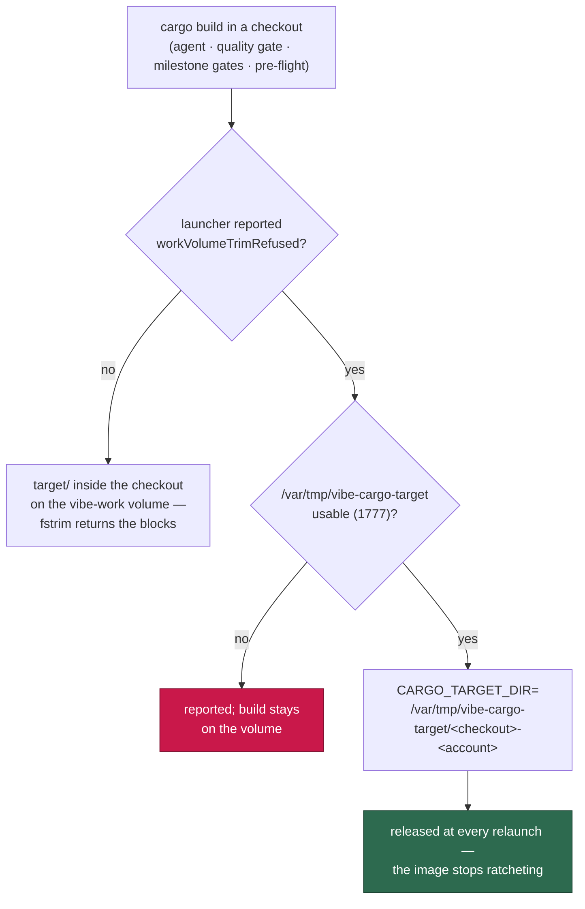

# Build artefacts on the ephemeral layer where the trim is refused

## Summary

On a runtime that refuses FITRIM (Apple `container`, Issue #478), every block a
`cargo build` writes **inside** the `vibe-work` volume is allocated to its
sparse image for good. GRQ-23 therefore carried 22 GB of image for 6.4 GB of
live data, grew 15–20 GB an hour through a Rust-heavy cycle, and had its volume
recreated every cycle — 20–30 idle minutes an hour and a cold cache at every
launch. `judgeGuestReclaim` already knew deleting those artefacts returns
nothing; nothing stopped them being written to the image in the first place.

When the launcher reports `workVolumeTrimRefused` (its `host-disk.json`
reading), the worker now points `CARGO_TARGET_DIR` at
`/var/tmp/vibe-cargo-target/<checkout key>` — the container's **own** root
filesystem, a separate sparse image released at every relaunch — for every
subprocess it runs against a checkout: the coding agent, the repository's own
quality gate, the milestone merge gate, the milestone resolution gate and the
pre-flight gate. The volume then keeps only clones, worktrees and state.

- **Keyed by checkout path**, not by slot: cargo takes a file lock on the
  target directory for the whole build, so a shared directory would serialise
  two slots' Rust builds — and keying by path covers the lane worktree
  (`worktrees/<slot>/<repo>`) *and* the shared clone the maintenance passes
  build in, where 16 GB of `target/` was measured.
- **Keyed by account too**, with the shared root created `1777`: the
  repository's own commands drop to `agent` and the worker's run as `vibe`
  (Issue #571), and neither can write into a directory the other created.
- **Carried in argv past `sudo`.** The image's sudo rule has no `SETENV` tag,
  so `env_reset` strips a variable handed to `sudo` in the child environment.
  The dropped spawn therefore becomes
  `sudo -n -u agent -- env CARGO_TARGET_DIR=… bash -c './quality.sh'`; without
  this the repository's own `target/` — the 1.7–4.4 GB the issue is about —
  would still land on the volume.
- **Nothing changes where the trim is honoured.** No launcher reading, an older
  launcher that writes no flag, a runtime that trims, or an operator's explicit
  `CARGO_TARGET_DIR` all leave the environment exactly as it was. A root that
  cannot be provisioned is reported and the build stays where it is today —
  a disk problem is never turned into a build failure.

Closes #2247.

## Evidence

Backend/CLI change — no web interface to screenshot. The evidence is the test
suite below, run against this branch:

```text
deno test tests/ephemeral_build_cache_test.ts tests/quality_gate_phase_test.ts \
  tests/untrusted_command_env_test.ts tests/untrusted_spawn_env_test.ts
ok | 85 passed | 0 failed
```

The untrusted-spawn guard (`untrusted_spawn_env_test.ts`) spawns a real
repo-supplied command and reads its environment back; it caught the placement
arriving as a name the allowlist had not granted — on this very host, which
*is* trim-refused — so `CARGO_TARGET_DIR` joined `ALLOWED_ENV_NAMES` beside
`CARGO_HOME` and `DENO_DIR` rather than becoming an exception to the
allowlist.

`scanWorkVolumeUsage - a build sent to the ephemeral layer leaves 0 build
artefacts on the volume` is the telemetry half of the issue's test list: it
builds a real work root, writes a real artefact tree at the ephemeral target
path, and asserts the `Work volume:` scan reports `artefacts 0`.



## Acceptance Criteria

<!-- vibe-spec-review inputs="diff+issue-body" -->

- **met** — `CARGO_TARGET_DIR=/var/tmp/vibe-cargo-target`, one directory per
  checkout, only when `workVolumeTrimRefused` — evidence:
  `worker/deno/lib/ephemeral_build_cache.ts:68` and
  `worker/deno/tests/ephemeral_build_cache_test.ts::ephemeralBuildCacheEnv - trim refused points the build at the ephemeral layer`
  — reviewer: met
- **met** — keyed by the checkout path, so the shared clone the maintenance
  passes build in is covered as well as `worktrees/<slot>/<repo>` — evidence:
  `worker/deno/tests/ephemeral_build_cache_test.ts::cargoTargetDirForCheckout - one directory per checkout, so cargo's lock never serialises two slots`
  — reviewer: met
- **missing** — `CARGO_HOME` moved to the ephemeral layer — reviewer: missing
  — reason: deliberately declined and now documented accurately — the
  entrypoint puts it on the volume (`container/entrypoint.sh:249`), but a
  download cache grows by what it fetched and is read back next launch,
  whereas a `target/` is rewritten every build, and that rewrite is what
  allocates fresh image blocks; moving it buys a cold registry download every
  launch.
- **partial** — `DENO_DIR` confirmed off the volume, else moved — evidence:
  `worker/deno/lib/ephemeral_build_cache.ts:50-57` and `docs/CONTAINER.md`
  — reviewer: missing — reason: the confirmation was performed this time and
  came back the other way (`container/entrypoint.sh:409-411` puts it on the
  volume); the move was declined for the same reason as `CARGO_HOME`, and the
  first draft's claim that it was already ephemeral has been corrected rather
  than left standing.
- **missing** — any other directory the telemetry classes as "caches"
  (`.deno-cache`, `.vibe-cache`, `.gh-*-cache`) — reviewer: missing — reason:
  same trade as above; the issue author's own refinement narrowed the fix to
  the `target/` directories, which is where the measured 16 GB and 4.4 GB sat.
- **met** — set on every subprocess the slot runs against a checkout: the
  agent, the quality gate, the milestone merge and resolution gates — evidence:
  `worker/deno/lib/claude_runner.ts:1157`,
  `worker/deno/lib/quality_gate_phase.ts` (`untrustedQualityCommandEnv` +
  `carryEnvThroughSudo`), `worker/deno/lib/milestone_merge_gate.ts:280`,
  `worker/deno/lib/milestone_resolution_gate.ts:134` — reviewer: partial —
  reason: the reviewer read the first commit, where `sudo`'s `env_reset` would
  have stripped the variable before the repository's command ran and the
  pre-flight gate was not covered; both are fixed here
  (`worker/deno/lib/pre_flight_gate.ts:178`) and the sudo carriage is pinned by
  `tests/quality_gate_phase_test.ts::carryEnvThroughSudo - the placement travels in argv, past sudo's env_reset`.
- **partial** — a repository configured with `dockerImage` — evidence:
  `worker/deno/lib/quality_gate_phase.ts` docker path — reviewer: partial —
  reason: the variable is set on the `docker run` client, not inside that
  container; passing it through would need a `-e` plus a mount for the target
  directory, which is a change to `buildDockerRunArgs` and its containment
  argument, and no repository on the affected host uses that path.
- **met** — a runtime that honours the trim is unchanged — evidence:
  `worker/deno/tests/ephemeral_build_cache_test.ts::buildCacheEnvForCheckout - a launch that trimmed the volume is left alone`
  — reviewer: met
- **met** — the `Work volume:` telemetry's "build artefacts" figure reads 0 —
  evidence:
  `worker/deno/tests/ephemeral_build_cache_test.ts::scanWorkVolumeUsage - a build sent to the ephemeral layer leaves 0 build artefacts on the volume`
  — reviewer: met
- **partial** — "the guest reclaim reports them as not on the volume" —
  evidence: the same telemetry test — reviewer: partial — reason:
  `judgeGuestReclaim` is unchanged and already refuses to delete on this
  runtime; what the change moves is what the scan can find, which is what the
  test asserts.
- **unrequested** — per-account target directories, the account read off the
  argv, and the `sudo … env NAME=value` carriage — reviewer: unrequested —
  reason: without them the placement either never reaches the account that
  builds (`env_reset`) or fails with `EACCES` the first time the two accounts
  meet in one directory.
- **unrequested** — provisioning the shared root `1777`, with a reported
  fallback to today's behaviour when it cannot be created — reviewer:
  unrequested — reason: the shared parent has to exist and be writable by both
  accounts, and an undisk-related build failure would be a worse outcome than
  the ratchet it replaces.
- **unrequested** — an explicit `CARGO_TARGET_DIR` in the worker's environment
  wins, at every spawn site — reviewer: unrequested — reason: an operator's own
  setting must not be silently overridden; the first draft honoured it at one
  site only.
- **unrequested** — an empty checkout path throws, and the key is a sanitised
  single segment — reviewer: unrequested — reason: an unnamed checkout would
  key every build to one directory (the serialisation the issue's caveat is
  about), and a key carrying `/` or `..` would place the build outside the
  root.
- **unrequested** — a second, launch-scoped reader of `host-disk.json` —
  reviewer: unrequested — reason: `HostDiskMonitor` lives in a closure inside
  the production-deps factory and is not reachable from an environment
  builder; the flag is a property of the launch, which is why reading it once
  is sound.
- **unrequested** — the `docs/CONTAINER.md` section, the `docs/CONTAINMENT.md`
  table row, and the security-sweep record plus ledger slice — reviewer:
  unrequested — reason: house rules — a code change owes a docs change, and
  every new `lib/` module must be claimed by a sweep slice or
  `check:manifests` fails.

## Standards Review

<!-- vibe-standards-review inputs="diff+CODING-STANDARDS.md" -->

- **violation** — the new `lib/` module was claimed by no sweep slice, so
  `deno task check:manifests` was red — evidence:
  `docs/audits/lib-sweep-coverage.json` — reason: fixed here — slice
  `top-up-2247` plus its written record
  `docs/audits/security-sweep-2247-ephemeral-build-cache.md`.
- **violation** — the tests mutated process-wide state (`Deno.env.set("HOME")`)
  to drive the launch verdict, failing the parallel-safety cap — evidence:
  `worker/deno/tests/ephemeral_build_cache_test.ts` — reason: fixed here — the
  verdict is a parameter (`buildCacheEnvForCheckout(..., { trimRefused })`),
  the ambient singleton is the production default only, and the test-reset
  hook is gone.
- **violation** — `catch { return undefined }` around the environment read hid
  a missing `--allow-env` as "the runtime trims" — evidence:
  `worker/deno/lib/ephemeral_build_cache.ts:246` — reason: fixed here — the
  read is no longer wrapped, so the permission fault propagates.
- **violation** — `deno fmt --check` failed on two wrapped lines — evidence:
  `worker/deno/tests/ephemeral_build_cache_test.ts` — reason: fixed here; the
  full gate passes.
- **violation** — the four wiring sites had no tests; `untrustedAccountOf` was
  exported from `quality_gate_phase.ts` but tested in another module's file —
  evidence: `worker/deno/lib/quality_gate_phase.ts` — reason: partly fixed —
  the composition is now the exported `untrustedQualityCommandEnv` and
  `carryEnvThroughSudo`, both tested in `tests/quality_gate_phase_test.ts`
  alongside the moved `untrustedAccountOf` tests; the agent and the two
  milestone gates remain one-line calls covered through the shared helper.
- **violation** — the module claimed `CARGO_HOME` and `DENO_DIR` were already
  off the volume, which `container/entrypoint.sh` contradicts — evidence:
  `worker/deno/lib/ephemeral_build_cache.ts:50-57` — reason: fixed here — the
  prose now states where they are and why they stay, and `docs/CONTAINER.md`
  matches.
- **clean** — Australian English throughout; every test calls a real exported
  function and asserts on its result (no source-grepping); JSDoc with
  `@param`/`@returns`/`@throws` on every export; KISS/DRY (one digest, one
  helper reused by five spawn sites); fail-loud on an empty checkout path and
  on an unvouched argv value; no hidden path staged; `deno lint` and
  `deno check` clean; the docs change lands in the same commit.

## Test Plan

Added `worker/deno/tests/ephemeral_build_cache_test.ts` (24 tests):

- the target directory lands under the ephemeral root and never under the work
  volume; the key is a single path segment even for a hostile checkout name;
- one directory per checkout (two slots and the shared clone all differ) and
  one per account; stable for the same checkout;
- an empty checkout path fails loudly rather than keying every build to one
  directory;
- `workVolumeTrimRefused` true → the env carries the ephemeral path; false, no
  flag, a malformed reading, or no reading at all → the env is unchanged; an
  explicit `CARGO_TARGET_DIR` is never overridden;
- the shared root is created `1777`; a root that cannot be created is reported
  and the placement falls back to today's behaviour;
- `scanWorkVolumeUsage` reports 0 build artefacts on the volume once the build
  went to the ephemeral layer.

Added to `worker/deno/tests/quality_gate_phase_test.ts`: `untrustedAccountOf`,
`untrustedQualityCommandEnv` (placement, allowlist still applied, the
repository's own declaration still winning, no credential leaking) and
`carryEnvThroughSudo` (argv carriage, untouched when the worker runs the
command itself, refusal of a value it cannot vouch for).

Modified `worker/deno/tests/untrusted_command_env_test.ts` — documented
deliberately: its source-text assertion pinned the old spelling
`overrides: repoCredentialEnv`, which Issue #2247 moved into
`untrustedQualityCommandEnv`. The assertion now names the new spelling **and**
the same test asserts the guarantee behaviourally (a source-environment
credential does not reach the child; a declared one does), so the check is
stronger than the string it replaced.

Re-ran the suites covering every wired spawn site:
`tests/quality_gate_phase_test.ts`, `tests/untrusted_command_env_test.ts`,
`tests/pre_flight_gate_test.ts`, `tests/milestone_merge_gate_test.ts`,
`tests/milestone_resolution_gate_test.ts`, plus
`tests/lib_sweep_coverage_test.ts` and `tests/parallel_safety_cap_test.ts`.

Documentation: a new section in `docs/CONTAINER.md` (with a Mermaid diagram)
beside the existing trim-refusal self-heal, a row in the `docs/CONTAINMENT.md`
writable-path table, and the security-sweep record
`docs/audits/security-sweep-2247-ephemeral-build-cache.md`.
