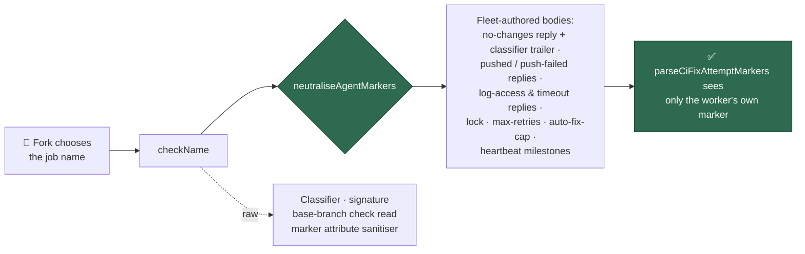

# Neutralise the failing check's name before it reaches a fleet-authored body

## Summary

Issue #2236 closed one route by which untrusted text reaches a **fleet-authored**
CI-fix comment body — the agent's `.pr_response_message`. The failing **check
name** was a second route into the same bodies, and it was interpolated raw. On a
`pull_request`-triggered workflow the job name is derived from the head ref, so a
fork chooses it: a name carrying `<!-- vibe-ci-fix-attempt … -->` was posted by
the fleet account and read back as the fleet's own claim on the next scan, because
the fleet-wide record (Issue #1879) is gated on the *comment's* author, never on
where inside the body a marker came from.

The name now runs through the established `neutraliseAgentMarkers` helper —
**inert by construction, never by marker name** — at every point it enters a body
the fleet authors. It stays **raw** for the lookups that must match what GitHub
reported: the classifier, the failure signature, the base-branch check read, and
`buildCiFixAttemptMarker`'s own attribute sanitiser. Closes #2260.



### Sinks covered

| Sink | Where |
| ---- | ----- |
| No-changes reply (all arms) | `lib/pr_no_changes_response.ts:100` |
| Classifier trailer (`check:<name>`, "no recognised pattern in check…") | `lib/pr_no_changes_response.ts:81` |
| Pushed / push-failed / log-access / timeout replies | `lib/pr_ci_processor.ts:984` (`safeCheckName`) |
| Auto-fix-cap escalation summary (and each attempt's `diagnosis`) | `lib/auto_fix_attempt_tracker.ts:270,288` |
| Lock comment, max-retries comment | `lib/pr_ci_processor.ts:641,765`, `lib/pr_ci_checks.ts:166` |
| Heartbeat milestones (incl. the run summary) | `lib/pr_ci_processor.ts:908` |

The processor reports the defusal once per run as
`CHECK_NAME_MARKER_NEUTRALISED` (fail loud, never swallowed); the pure body
builders neutralise **again** by construction so a future caller cannot reopen
the hole.

## Evidence

Backend/CLI change with no web interface — no screenshot applies. The evidence is
the regression suite, which drives the real `processCiFailure` and parses the body
that was **actually posted** with the production marker parsers:

```text
running 6 tests from ./tests/pr_ci_processor_check_name_injection_test.ts
processCiFailure - a forged attempt marker in the check name never reaches the fleet record (Issue #2260) ... ok
processCiFailure - a forged deferral marker in the check name never parks the pull request (Issue #2260) ... ok
processCiFailure - the classifier trailer cannot smuggle the check name's marker back in (Issue #2260) ... ok
buildAutoFixCapSummary - a forged marker in the check name or a diagnosis stays inert (Issue #2260) ... ok
buildMaxRetriesComment - a forged marker in the check name stays inert (Issue #2260) ... ok
processCiFailure - an ordinary check name is posted unchanged (Issue #2260) ... ok
ok | 6 passed | 0 failed
```

Against the unfixed code the same suite is red — `expected only the worker's own
marker; parsed 2`, and the forged deferral parses out of the fleet's own comment.

**Original trigger closed, with no trivial bypass.** The attack input — a check
name carrying `<!-- vibe-ci-fix-attempt … -->` — reaches a fleet-authored body
only through the sinks tabled above, and each one now renders it through
`neutraliseAgentMarkers`, which rewrites **every** `<!--` and `-->` (leaving
`<!- -` / `- ->`, with a space inside so a longer dash run cannot re-form the
delimiter). The neutralisation is keyed on the HTML-comment delimiters, not on
any marker name, so a differently-named or future marker is covered by the same
code; and `parseCiFixAttemptMarkers` / `parseCiFixDeferralMarkers` cannot match
without an intact delimiter pair. The worker's own marker is concatenated
**after** the neutralised prose and still parses as exactly one record. The two
indirect re-injection routes an independent review found — the classifier
trailer, which quotes the name back as `check:<name>`, and the cap summary —
were closed in the same change and each carries its own test.

## Acceptance Criteria

<!-- vibe-spec-review inputs="diff+issue-body" -->

- **met** — Neutralise the check name at the point it is interpolated into a body the fleet authors, by construction rather than by marker name, using the `neutraliseAgentMarkers` helper — evidence: `worker/deno/lib/pr_no_changes_response.ts:81,100`, `worker/deno/lib/pr_ci_processor.ts:552,984`, `worker/deno/lib/auto_fix_attempt_tracker.ts:270`, `worker/deno/lib/pr_ci_checks.ts:166` — reviewer: partial — reason: the reviewer read the first commit and found two live routes left (the classifier trailer and the auto-fix-cap summary); both were closed in the second commit, with a test each that was observed red beforehand
- **met** — Regression test in `worker/deno/tests/` driving the CI-fix reply path with a check name carrying a forged marker, asserting `parseCiFixAttemptMarkers` finds only the worker's own marker in the posted body, failing against the current code — evidence: `worker/deno/tests/pr_ci_processor_check_name_injection_test.ts::processCiFailure - a forged attempt marker in the check name never reaches the fleet record (Issue #2260)` — reviewer: met — reason: the reviewer independently re-ran the suite on a clean `main` worktree and saw it fail there
- **unrequested** — the lock comment, the max-retries comment, the auto-fix-cap summary and the heartbeat milestones are neutralised too, beyond the three sites the issue names — reviewer: unrequested — reason: each is a comment the fleet account posts on the same pull request, so the author-gated record reads markers out of them exactly as it does the three named ones; leaving them would have closed the hole only where it had already been pointed out
- **unrequested** — `recordCiMilestone` neutralises the whole milestone text rather than just the name — reviewer: unrequested — reason: every milestone this module records carries the check name directly or through a run summary, so one chokepoint is both simpler and tighter than eight call-site edits
- **unrequested** — `docs/CONFIGURATION.md` and `docs/INTERNALS.md` updated — reviewer: unrequested — reason: both already document the #2236 control that this change extends; the standing rule is that a code change owes a docs change

## Standards Review

<!-- vibe-standards-review inputs="diff+CODING-STANDARDS.md" -->

- **violation** — the defusal was swallowed at two sinks, contradicting "Never Fail Silently — Fail Loud" and the helper's own contract — evidence: `worker/deno/lib/pr_ci_checks.ts:166`, `worker/deno/lib/pr_no_changes_response.ts:100` — reason: fixed here — the processor now passes the already-logged inert name into both builders (`lib/pr_ci_processor.ts:765,1800`), so the defusal is reported once per run at the chokepoint; the builders keep their own by-construction neutralisation as the guarantee
- **violation** — a fleet-authored body still interpolated the raw check name (auto-fix-cap escalation) — evidence: `worker/deno/lib/auto_fix_attempt_tracker.ts:258` — reason: fixed here — the finished summary is made inert as a whole, which also covers each attempt's `diagnosis` lifted from a comment body
- **violation** — `buildMaxRetriesComment` changed behaviour with no test, and the cap sink had none — evidence: `worker/deno/lib/pr_ci_checks.ts:162` — reason: fixed here — `buildMaxRetriesComment - a forged marker in the check name stays inert` and `buildAutoFixCapSummary - a forged marker in the check name or a diagnosis stays inert` added
- **violation** — the docs claimed coverage the code did not yet have — evidence: `docs/CONFIGURATION.md:4109` — reason: fixed here — the enumeration now matches the shipped sinks and states where the defusal is logged
- **violation** — DRY: three renderings of "make the check name safe", only one logging — evidence: `worker/deno/lib/pr_ci_processor.ts:551` — reason: stands, deliberately — the processor is the single logging chokepoint, and the two pure builders keep a second, silent by-construction pass so a future caller that forgets cannot reopen the hole; defence in depth is worth one repeated expression
- **clean** — Australian English throughout; `deno fmt` / `deno lint` / `deno check` clean; new tests drive real functions and parse the posted body with the production parsers rather than grepping source; no wall-clock or sleep-based assertions; no hidden paths staged; marker schema, config keys and callback contracts unchanged; the raw name correctly preserved for the classifier, the signature and the base-branch check read

## Test Plan

- Added `worker/deno/tests/pr_ci_processor_check_name_injection_test.ts` (6 tests):
  - `processCiFailure - a forged attempt marker in the check name never reaches the fleet record (Issue #2260)` — reproduces the flaw, fails against the unfixed code and passes after the fix
  - `processCiFailure - a forged deferral marker in the check name never parks the pull request (Issue #2260)` — likewise red before, green after
  - `processCiFailure - the classifier trailer cannot smuggle the check name's marker back in (Issue #2260)` — the `unknown` category, whose trailer quotes the name back; red before the second commit
  - `buildAutoFixCapSummary - a forged marker in the check name or a diagnosis stays inert (Issue #2260)` — red before the second commit
  - `buildMaxRetriesComment - a forged marker in the check name stays inert (Issue #2260)`
  - `processCiFailure - an ordinary check name is posted unchanged (Issue #2260)` — the general case is untouched and nothing benign is reported as neutralised
- Existing suites re-run green: `pr_ci_processor_*`, `pr_no_changes_response_test.ts`, `pr_ci_checks_test.ts`, `auto_fix_attempt_tracker_test.ts`, `pr_feedback_processor_no_changes_test.ts`, `handle_no_changes_*`, `agent_marker_neutralisation_test.ts` — 177 passed, 0 failed.
- Full `./quality.sh` gate run: every stage passes except `deno tests`, which is
  red on **three pre-existing failures unrelated to this change** —
  `ephemeral_build_cache_test.ts::buildCacheEnvForCheckout - a trim-refused
  launch moves the build off the volume`, `…::buildCacheEnvForCheckout - the
  account the command drops to reaches the key` and
  `quality_gate_phase_test.ts::untrustedQualityCommandEnv - a trim-refused
  launch builds off the work volume`. Verified by checking out the base commit
  `8756d7c5` in a scratch worktree and running the same two files there: the
  same three fail, with this branch's changes absent (they belong to Issue
  #2247 / PR #2281 and are environment-dependent on this host).
