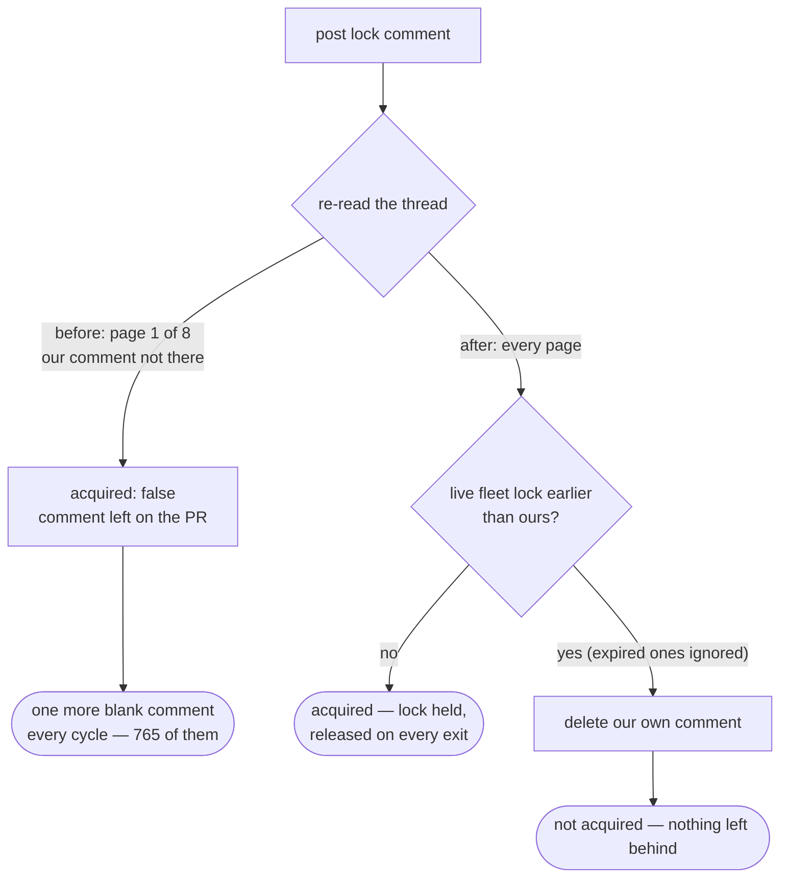

# The PR branch lock reads the whole thread and leaves nothing on it

## Summary

The mess the issue points at is
[`stSoftwareAU/NEAT-AI-Lamarck#239`](https://github.com/stSoftwareAU/NEAT-AI-Lamarck/pull/239):
**765 blank `BRANCH_UPDATE_LOCK` comments**, a branch no host could update,
and two escalations asking a human to sort it out. One defect in
`worker/deno/lib/pr_branch_lock.ts` produced all three.

The lock read the PR's comments **unpaginated**, so GitHub returned only the
**30 oldest**. Once a thread outgrew one page:

- the stale sweep saw no lock comment and expired nothing, and
- the verification read could not see the comment this host had posted three
  seconds earlier, so `acquired: false` came back every time — and that path
  left the comment on the PR.

Every cycle therefore added one more blank comment, acquired nothing, and the
branch update never ran. Three rules close it off: the read is paginated, the
posted comment is deleted on **every** not-acquired path, and an **expired**
marker is ignored when the winner is chosen — so a delete that never succeeded
cannot wedge the PR. Closes #2265.

## Evidence

Backend/CLI change, so there is no web interface to screenshot. The evidence
is the live API and the tests.

### The blindness, against the real PR

`gh api` without `--paginate` returns page one — 30 comments, none of them a
lock, because the locks start further down the thread:

```text
$ gh api repos/stSoftwareAU/NEAT-AI-Lamarck/issues/239/comments \
    --jq '[.[] | select(.body | test("<!-- BRANCH_UPDATE_LOCK:"))] | length'
0
$ gh api repos/stSoftwareAU/NEAT-AI-Lamarck/issues/239/comments --jq 'length'
30
```

The read this PR ships sees all of them:

```text
$ gh api --paginate \
    'repos/stSoftwareAU/NEAT-AI-Lamarck/issues/239/comments?per_page=100' \
    --jq '[.[] | select(.body | test("<!-- BRANCH_UPDATE_LOCK:")) | {id, created_at}]'
8 pages, 767 lock comments
```

`0` is what the sweep and the verification read saw for three days. `767` is
what they see now — every one of them expired, so the sweep clears them (100
per pass) and the branch becomes updatable again without anyone touching that
PR by hand.

`--paginate --jq '[…]'` prints one JSON array **per page**, and `--slurp` is
refused alongside `--jq` (`the --slurp option is not supported with --jq`), so
`parseLockCommentPages` flattens the pages.

### What changed



### Fail loud

The sweep stays best-effort — it must never throw into a branch update — but
it is no longer silent: a read it could not make and a delete it could not
make are logged with the cause, and a backlog it could not finish says how
many remain. A sweep that quietly did nothing is how 765 comments accumulated
without anyone noticing.

## Test Plan

Added to `worker/deno/tests/pr_branch_lock_test.ts`:

- `parseLockCommentPages flattens one array per page` — the real
  `--paginate --jq` payload shape.
- `cleanStaleBranchUpdateLocks reads every page of a busy thread` — a stale
  lock that exists **only on page two** is deleted, and the read carries
  `--paginate` and `per_page=100`. Red before the fix.
- `a lock the re-read cannot see is deleted, not left behind` and
  `a lock is deleted when the verification read fails` — the two paths that
  leaked a comment on every cycle. Both red before the fix.
- `an expired lock nobody could delete does not stall the branch` — a
  three-day-old marker whose every delete is refused with 403 no longer wins
  the race.
- `cleanStaleBranchUpdateLocks caps deletions per pass` — a 150-marker backlog
  costs 100 DELETEs, not 150, and the remainder is reported.
- `cleanStaleBranchUpdateLocks reports a delete it could not make` /
  `reports an unreadable thread` — failures are logged, not swallowed.

Added to `worker/deno/tests/pr_branch_update_contention_test.ts`:

- `the lock comment carries a readable line` — the branch-update path passes a
  note, so its lock stops rendering as a blank comment (Issue #1659).

Modified (fixtures only, no assertion weakened): the existing
`pr_branch_lock_test.ts` stubs matched the comments endpoint at `args[1]`,
which is now `--paginate`. They match on the endpoint argument instead, via
one `isCommentRead` helper. All 37 tests in the file pass, including the 26
that predate this change.

Results: `deno test tests/pr_branch_lock_test.ts` 37 passed;
`tests/pr_branch_lock_test.ts tests/pr_ci_processor_lock_test.ts
tests/pr_merge_conflict_processor_test.ts tests/pr_branch_update*_test.ts
tests/security_untrusted_ingestion_1249_test.ts` 192 passed, 0 failed;
`deno fmt --check` and `deno lint` clean.

## Follow-up

`worker/deno/lib/claim_pr_comment.ts` carries the same unpaginated read in
three places (the stale sweep, the release-by-body lookup, and the
competing-claim re-read), so a PR-comment claim on a long thread leaks the
same way. Filed as #2266 rather than folded in here — it is a separate module
with its own claim protocol and tests.
