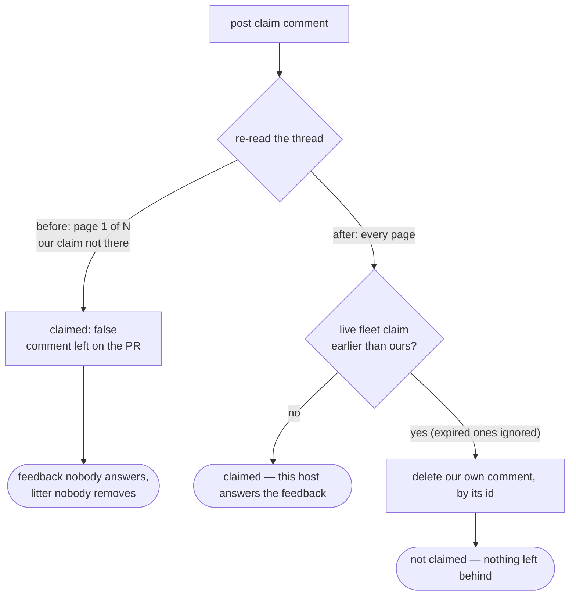

# The PR-comment claim reads the whole thread and leaves nothing on it

## Summary

`worker/deno/lib/claim_pr_comment.ts` carried the same unpaginated read that
Issue #2265 had just fixed in `pr_branch_lock.ts`. All three of its
`gh api repos/<repo>/issues/<pr>/comments` calls returned the **30 oldest**
comments, so once a PR thread outgrew one page:

- the stale-claim sweep saw no claim and expired nothing,
- the verification re-read could not see the comment this host had posted three
  seconds earlier, so the claim never succeeded, and
- `removeOwnClaimComment` looked the comment up by body and found nothing, so it
  stayed on the PR for ever.

That is a claim nobody can take and litter nobody removes — the shape that left
765 `BRANCH_UPDATE_LOCK` comments on `stSoftwareAU/NEAT-AI-Lamarck#239`. The
same three rules close it: the reads are paginated, the posted comment is
deleted on **every** not-claimed path (by the id `gh` returned when posting it),
and an **expired** claim is ignored when the winner is chosen so a delete that
never succeeded cannot wedge the PR. Closes #2266.

The read, its one-array-per-page parse and the comment delete now live in
`worker/deno/lib/marker_comment_pages.ts`, which both the lock and the claim use
— a second copy would be a second place for the next page-one bug to hide.

## Evidence

Backend/CLI change with no web interface, so there is no screenshot; the
evidence is the tests and the argv the module now builds.



The read `gh` is now asked for — paginated, 100 per page, with the author
projection the Issue #1124 fleet check needs:

```text
gh api 'repos/<repo>/issues/<pr>/comments?per_page=100' --paginate \
  --jq '[.[] | select(.body | test("<!-- PR_COMMENT_CLAIM:")) | {id, body, created_at, author: .user.login}]'
```

`--paginate --jq '[…]'` prints one JSON array **per page** (`--slurp` is refused
alongside `--jq`), which `parseMarkerCommentPages` flattens — and it throws on
an unreadable page rather than passing it off as an empty thread.

The regression tests' `gh` fake answers with **page one only** when `--paginate`
is absent, exactly as GitHub does, so the page-two tests fail against the
unpaginated read they exist to catch (verified: removing the single `--paginate`
argument turns them red).

Full gate: `./quality.sh` PASSED (21 checks; `config integration` skipped as it
requires live config), and `deno task check:manifests` passes with the new
module claimed by the Issue #1216 sweep slice.

## Reproduction

- **symptom** — on a PR thread longer than 30 comments, no host can claim a
  feedback comment and each attempt leaves another claim comment behind
- **status** — `verified` — the page-two tests were observed failing against the
  unfixed module (7 failures, including `claimed: true` where a page-two
  competitor should have won and no delete of the posted comment) and passing
  after the fix
- **regression test** —
  `worker/deno/tests/claim_pr_comment_pagination_test.ts::claim pr comment - a competing claim on page two costs this host the race`
  and
  `…::claim pr comment - deletes the posted comment when the re-read comes back empty`

## Acceptance Criteria

<!-- vibe-spec-review inputs="diff+issue-body" -->

- **met** — read with `--paginate` and `?per_page=100`, parsing the
  one-array-per-page payload — evidence:
  `worker/deno/lib/marker_comment_pages.ts:99` (`fetchMarkerComments`), used by
  the sweep, the re-read and the own-comment fallback; asserted by
  `worker/deno/tests/claim_pr_comment_pagination_test.ts::claim pr comment - both comment reads are paginated at 100 per page`
  — reviewer: met
- **met** — flatten the payload the way `parseLockCommentPages` does — evidence:
  `worker/deno/lib/marker_comment_pages.ts:53` (`parseMarkerCommentPages`),
  which both `parseLockCommentPages` and `parseClaimCommentPages` now call —
  reviewer: met — reason: the reviewer flagged the first commit's copy of that
  parser as duplication; it was extracted into the shared module in response
- **met** — delete the posted claim comment on every not-claimed path, by the id
  `gh` returned when posting it — evidence:
  `worker/deno/lib/claim_pr_comment.ts` (`dropOwnClaimComment`, called on the
  read-failure, no-contender and lost-race paths) — reviewer: met
- **met** — ignore an expired claim when picking the winner — evidence:
  `worker/deno/lib/claim_pr_comment.ts` (`competingClaims` filter) and
  `…pagination_test.ts::claim pr comment - an expired claim the sweep could not delete is ignored`
  — reviewer: met — reason: the reviewer noted the expiry clock is anchored to
  this host's own comment rather than to `nowMs`, which differs by the 3 s
  consistency sleep; the anchor is deliberate (both timestamps are GitHub's, so
  the comparison carries no clock skew) and the 3 s window only ignores a claim
  the next sweep pass deletes anyway
- **met** — regression test serving two pages, asserting the page-two claim is
  seen — evidence:
  `…pagination_test.ts::claim pr comment - a competing claim on page two costs this host the race`
  and `…::the sweep expires a stale claim that only exists on page two` —
  reviewer: met
- **met** — test asserting the posted comment is deleted when the re-read comes
  back empty — evidence:
  `…pagination_test.ts::claim pr comment - deletes the posted comment when the re-read comes back empty`
  — reviewer: met
- **unrequested** — the paginated sweep caps deletions at
  `MAX_STALE_CLAIM_DELETIONS` (100) per pass — evidence:
  `worker/deno/lib/claim_pr_comment.ts:115` — reviewer: unrequested — reason:
  pagination is what exposes a backlog, so without the cap one claim attempt
  would issue hundreds of serial deletes before answering any feedback; covered
  by `…pagination_test.ts::the stale sweep caps its deletions per pass`
- **unrequested** — an empty/no-contender re-read is now a _not-claimed_ path
  (it returned `claimed: true` before) — evidence:
  `worker/deno/lib/claim_pr_comment.ts` (`contenders.length === 0`) — reviewer:
  unrequested — reason: implied by the required regression test, since the
  posted comment can only be deleted there if the host backs off
- **unrequested** — `pr_branch_lock.ts` delegates its read/parse/delete to the
  new shared module — evidence: `worker/deno/lib/pr_branch_lock.ts:313-347` —
  reviewer: unrequested — reason: the alternative was a second copy of the
  parser the issue itself points at as "the working parser"
- **unrequested** — failure logging on the post, sweep-read, delete and
  verification-read paths — evidence: `worker/deno/lib/claim_pr_comment.ts` —
  reviewer: unrequested — reason: those were silent `catch {}` blocks, and a
  sweep that quietly did nothing is how 765 comments accumulated unnoticed

## Standards Review

<!-- vibe-standards-review inputs="diff+CODING-STANDARDS.md" -->

- **violation** — test fake ignored `--paginate`, so the behavioural page-two
  tests could not fail against the unpaginated read — evidence:
  `worker/deno/tests/claim_pr_comment_pagination_test.ts:104` — reason: fixed
  here; the fake now returns page one alone when the flag is absent, and
  removing `--paginate` from the module turns the page-two tests red
- **violation** — DRY: `parseClaimCommentPages`, `fetchClaimComments` and
  `deleteClaimComment` were near-verbatim copies of the `pr_branch_lock.ts`
  helpers — evidence: `worker/deno/lib/claim_pr_comment.ts:160` — reason: fixed
  here; all three delegate to `worker/deno/lib/marker_comment_pages.ts` and the
  lock does too
- **violation** — a destructive write driven by an unauthenticated marker: the
  no-URL fallback deleted any comment containing this host's marker, and counted
  any such comment as ours — evidence: `worker/deno/lib/claim_pr_comment.ts:303`
  and the `ownClaim` selection — reason: fixed here; the fallback keeps only
  fleet-authored matches and takes the **newest**, so a stranger's copy is never
  deleted and a previous run's leftover cannot win the race (the reviewer's
  scenario reproduced as a test failure before the fix)
- **violation** — two touched `catch` blocks still discarded the error while
  every other path logged it — evidence: `worker/deno/lib/claim_pr_comment.ts`
  (claim post, verification read) — reason: fixed here; both log the cause
- **violation** — `DEFAULT_MAX_STALE_CLAIM_DELETIONS` was named a default with
  no override, and no test exercised the cap — evidence:
  `worker/deno/lib/claim_pr_comment.ts:115` — reason: fixed here; renamed to
  `MAX_STALE_CLAIM_DELETIONS` with a test
- **violation** — hand-rolled `try`/`catch` where `assertThrows` says it in one
  line — evidence: `worker/deno/tests/claim_pr_comment_pagination_test.ts:148` —
  reason: fixed here
- **clean** — Australian English throughout; no hidden paths staged; every test
  calls real functions (`claimPrComment`, `parseClaimCommentPages`) and asserts
  on returned values, deletion side effects and log output rather than grepping
  source; no wall-clock or duration assertions (`sleepFn`/`nowMsFn` injected, 29
  tests in 65 ms); Deno-native tooling only; all 17 pre-existing
  `claim_pr_comment_test.ts` cases untouched and green.

## Test Plan

Added `worker/deno/tests/claim_pr_comment_pagination_test.ts` (11 cases):

- `parseClaimCommentPages flattens one array per page`
- `parseClaimCommentPages throws on an unreadable page`
- `a competing claim on page two costs this host the race`
- `the sweep expires a stale claim that only exists on page two`
- `both comment reads are paginated at 100 per page`
- `deletes the posted comment when the re-read comes back empty`
- `with no comment URL back, the newest fleet-authored match is deleted`
- `the stale sweep caps its deletions per pass`
- `deletes its own comment by id, not by matching the body`
- `an expired claim the sweep could not delete is ignored`
- `a same-second tie is broken by comment id, not by whose claim it is`
- `a live claim posted seconds earlier still wins`

Unchanged and still passing: `worker/deno/tests/claim_pr_comment_test.ts` (17),
`pr_branch_lock_test.ts`, `pr_branch_update*`, `pr_ci_processor_lock_test.ts`,
`pr_feedback_processor_test.ts`, `security_untrusted_ingestion_1249_test.ts`
(178 together), plus `deno task check:manifests` (656) and the full
`./quality.sh`.

## Follow-up filed

`stSoftwareAU/VibeCoder#2269` — the eyes reaction is added before the claim is
verified, so on a no-winner path (failed verification read) the feedback comment
stays marked processed and is never answered. Pre-existing and separate from
this fix; `needs-human` triage is not required, it is a normal bug.
