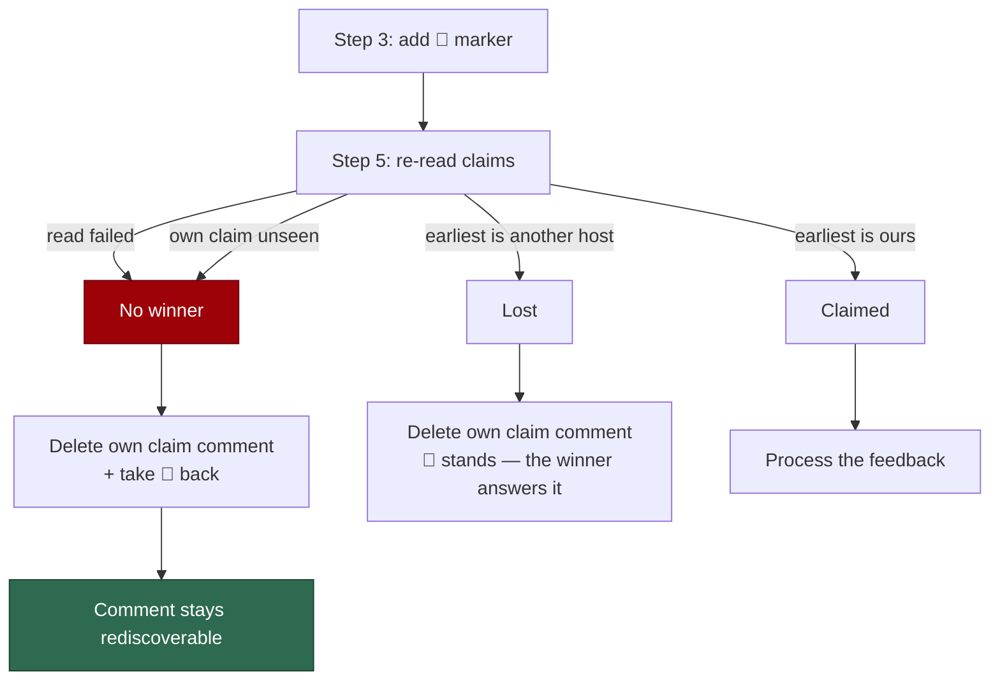

# PR Summary — Issue #2269

## Summary

`claimPrComment` adds the processed marker (👀) in step 3, **before** the claim
is verified, so the marker was left on the feedback comment even when the claim
was then dropped with **no winner** — the verification read failed, or the
re-read could not see this host's own claim comment. That marker is exactly what
stops `findActionableComment` surfacing the comment again, so the feedback was
answered by nobody and nothing said so.

The issue offered two options. The one taken is **remove the reaction on the
no-winner paths**, keeping step 3 where it is: adding the marker early is what
narrows the window in which a sibling host rediscovers the comment, and that
trade-off is now stated in the `claim_pr_comment.ts` module comment.

- `removeProcessedMark` (`worker/deno/lib/pr_comments.ts`) reads the comment's
  `eyes` reactions (paginated, `content=eyes`), keeps the ones left by the
  **acting** `gh` login, and deletes each by reaction id. It never throws into
  the caller and never reports a silent success: an unresolvable login, an
  unreadable or non-array page, a row with an unusable reaction id, and a failed
  delete all come back as an error.
- `claimPrComment` calls it on both no-winner paths, and **not** on the lost
  path — there the winner answers the comment, so its marker is correct.
- A `reactionsPath` helper replaces the three copies of the
  `pulls/comments` vs `issues/comments` ternary in `pr_comments.ts`.

Closes #2269.

## Evidence

Backend/CLI change with no web interface to screenshot. The evidence is the test
run:

- `deno test tests/claim_pr_comment_eyes_reaction_test.ts` — 15 passed against
  the fix; **3 of them fail** against `origin/main`'s `claim_pr_comment.ts`
  (the reaction is never taken back and nothing is logged).
- `deno test tests/claim_pr_comment_test.ts
  tests/claim_pr_comment_pagination_test.ts tests/pr_comments_test.ts
  tests/pr_maintenance_test.ts` — 125 passed, 0 failed.
- `./quality.sh` — PASSED (re-run after the final edit).

The reaction endpoints are exercised through a **fake of the API** keyed on the
endpoint path, not by asserting the request text, so a mapping that reversed
`pulls/comments` and `issues/comments` reads an empty collection and the test
goes red (CODING-STANDARDS.md, "Fake the external service").

## Reproduction

- **symptom** — a PR feedback comment kept its 👀 marker after a claim that
  nobody won, so `findActionableComment` skipped it for ever and the feedback
  was never answered
- **status** — `verified` — the regression tests were observed failing against
  the unfixed `claim_pr_comment.ts` (restored from `origin/main`) and passing
  after the fix
- **regression test** —
  `worker/deno/tests/claim_pr_comment_eyes_reaction_test.ts::claim pr comment - a failed verification read takes the eyes reaction back`

## Acceptance Criteria

<!-- vibe-spec-review inputs="diff+issue-body" -->

- **met** — the failed-verification-read path must not leave the eyes reaction —
  evidence: `worker/deno/lib/claim_pr_comment.ts` (`dropOwnProcessedMark()`
  before the `claimed: false` return) — reviewer: met
- **met** — the path where the re-read cannot see this host's own claim must not
  leave the eyes reaction — evidence:
  `worker/deno/tests/claim_pr_comment_eyes_reaction_test.ts::claim pr comment - an unseen own claim takes the eyes reaction back`
  — reviewer: met
- **met** — removal by reaction id (`GET …/reactions` then
  `DELETE …/reactions/{id}`), filtered to this account — evidence:
  `worker/deno/lib/pr_comments.ts` (`fetchOwnEyesReactions` +
  `removeProcessedMark`) — reviewer: met
- **met** — a claim lost to a real winner keeps the reaction — evidence:
  `worker/deno/tests/claim_pr_comment_eyes_reaction_test.ts::claim pr comment - a claim lost to a real winner keeps the eyes reaction`
  — reviewer: met
- **met** — a test that drives `claimPrComment` down a no-winner path
  (verification read throws) and asserts the comment is left rediscoverable —
  evidence:
  `worker/deno/tests/claim_pr_comment_eyes_reaction_test.ts::claim pr comment - a failed verification read takes the eyes reaction back`
  — reviewer: met
- **met** — the module comment says which trade-off was chosen — evidence:
  `worker/deno/lib/claim_pr_comment.ts` module doc-comment — reviewer: met
- **partial** — the comment is left rediscoverable for **every** comment type —
  evidence: `worker/deno/lib/pr_comments.ts` (`pr_review` branch) — reviewer:
  partial — reason: the `pr_review` marker is a review *dismissal* and GitHub
  offers no un-dismissal, so that no-winner case is reported loudly rather than
  undone
- **partial** — removal restores rediscoverability in all fleet configurations —
  evidence: `worker/deno/lib/pr_comments.ts` (acting-login filter) versus
  `worker/deno/lib/pr_maintenance.ts` (any fleet login's 👀 hides a comment) —
  reviewer: partial — reason: only this account's own reaction can be deleted by
  GitHub; a sibling account's marker means that sibling claimed the comment, so
  removing it is not this run's call
- **unrequested** — `reactionsPath` helper extracted and applied to the three
  pre-existing endpoint ternaries in `pr_comments.ts` — reviewer: unrequested —
  reason: the new code would have been a fourth copy of the same ternary; a
  behaviour-preserving dedup in the one file the change already touches
- **unrequested** — the `pr_review` branch returns a bespoke error instead of
  attempting a removal — reviewer: unrequested — reason: fail-loud; a marker
  that cannot be taken back must be reported, never reported as removed
- **unrequested** — pagination, the `content=eyes` server-side filter and
  case-normalised login matching in the reactions read — reviewer: unrequested —
  reason: a plain unpaginated GET returns 30 rows, which is the exact defect
  Issues #2265/#2266 fixed in the sibling reads of this module
- **unrequested** — `docs/INTERNALS.md` and `docs/workflows/pr-feedback.md`
  updated — reviewer: unrequested — reason: both describe the "mark processed"
  step this change alters; a code change owes a docs change
- **unrequested** — nine tests beyond the single one the issue asked for —
  reviewer: unrequested — reason: the standards require an error path and edge
  cases for every new public function

## Standards Review

<!-- vibe-standards-review inputs="diff+CODING-STANDARDS.md" -->

- **violation** — a page that parses but is not an array was skipped silently,
  so `removeProcessedMark` could report success while the marker still stood —
  evidence: `worker/deno/lib/pr_comments.ts` (`fetchOwnEyesReactions` page loop)
  — reason: fixed here; a non-array page now throws
- **violation** — an unvalidated `Number(entry.id)` could build
  `DELETE …/reactions/NaN` — evidence: `worker/deno/lib/pr_comments.ts`
  (`fetchOwnEyesReactions`) — reason: fixed here; a non-numeric id throws before
  any delete is issued
- **violation** — the tests asserted the literal request text the code builds,
  which the "Fake the external service" standard forbids — evidence:
  `worker/deno/tests/claim_pr_comment_eyes_reaction_test.ts` — reason: fixed
  here; the tests now drive a fake of the reactions API keyed on the endpoint
  path and assert the resulting state
- **violation** — the `--paginate` concatenation branch was never exercised —
  evidence: `worker/deno/tests/claim_pr_comment_eyes_reaction_test.ts` — reason:
  fixed here by `remove processed mark - clears its reactions across every page`
- **violation** — the PR summary file was missing — evidence:
  `docs/archive/pr-summaries/pr-summary-2269.md` — reason: fixed here
- **violation** — the first commit subject used `Refs #2269` rather than the
  documented `(Issue #2269)` form — evidence: commit `Take the eyes reaction
  back when a PR-comment claim has no winner` — reason: stands (the subject is
  already published on the branch); the follow-up commits use the documented
  form and the issue number is in every message
- **violation** — `removeProcessedMark` returns `Error | null` rather than the
  `Result<T, E>` union used elsewhere in the module — evidence:
  `worker/deno/lib/pr_comments.ts` (`removeProcessedMark` signature) — reason:
  stands; it mirrors `deleteIssueComment`, the sibling delete helper the claim
  already reports failures through, and the JSDoc now says so
- **clean** — Australian English throughout; fail-loud error handling on every
  read, login resolution and delete; tests call real functions and assert side
  effects; no hidden paths staged; injectable `ghCommandFn`/`log` seams; full
  JSDoc; `deno fmt`, `deno lint` and `deno check` clean

## Test Plan

Added `worker/deno/tests/claim_pr_comment_eyes_reaction_test.ts` (15 tests):

- `claimPrComment` takes the 👀 marker back when the verification read fails,
  and when the re-read cannot see this host's own claim.
- `claimPrComment` leaves the marker when the claim is lost to a real winner,
  and when it is won.
- A marker that cannot be taken back is logged with the consequence named.
- `removeProcessedMark`: deletes only this account's `eyes` reaction; uses the
  `pulls` collection for a review comment and leaves the `issues` one alone;
  clears reactions across every page; deletes nothing when the account left no
  marker; reports an unreadable list, a non-array payload, an unusable reaction
  id, an unresolvable acting login, a dismissed review, and a failed delete.

Unchanged suites re-run: `claim_pr_comment_test.ts`,
`claim_pr_comment_pagination_test.ts`, `pr_comments_test.ts`,
`pr_comment_supersession_test.ts`, `pr_maintenance_test.ts`,
`security_untrusted_ingestion_1249_test.ts` — all pass.
