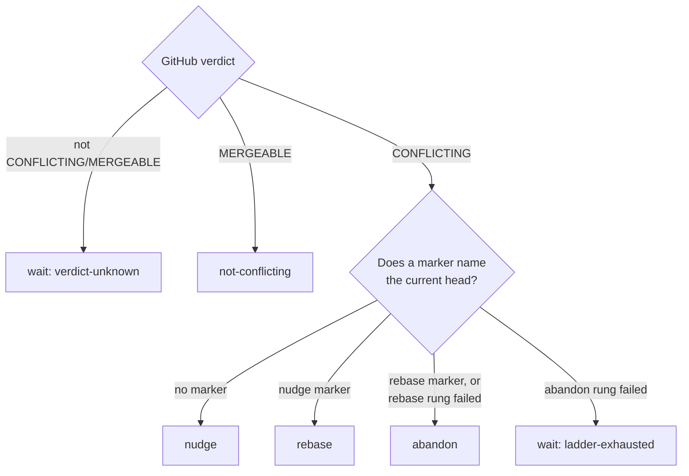

# Add the stale-verdict ladder markers and thread reader (Issue #2276)

## Summary

The rungs that break a stale GitHub `CONFLICTING` verdict need memory of which
rung already ran at which head sha — without it a rung's own output reads back
as a reason to run it again, which is the loop NEAT-AI-Lamarck#239 sat in. This
adds that memory and the decision over it, as pure code with no GitHub or git
surface. Closes #2276.

- `worker/deno/lib/merge_conflict_markers.ts` — `CONFLICT_NUDGE_MARKER`,
  `CONFLICT_REBASE_MARKER` and `CONFLICT_RUNG_FAILED_MARKER` in the canonical
  `vibe-*` grammar, one builder each, each refusing a sha it cannot write back.
  `isConflictHeadSha` is exported so writer and reader share one definition.
- `worker/deno/lib/conflict_verdict_ladder.ts` — `parseLadderState` reads the
  latest marker of each kind off the **trusted** thread and resets on a
  `CONFLICT_RESOLVED_MARKER`; `decideLadderRung` returns exactly one rung per
  (state, head, verdict).
- `docs/audits/security-sweep-2276-conflict-verdict-ladder.md` plus its
  `top-up-2276` slice — required by `lib_sweep_coverage_test.ts`, which fails
  loud on any unclaimed module under `worker/deno/lib/`.

No rung name shares a literal with the frozen `vibe-coder:merge-conflict-*`
vocabulary, so the rungs are invisible to `parseConflictAttempts`: they neither
spend the attempt budget nor reset it.



## Evidence

Backend module only — no web interface to screenshot. The evidence is the test
run:

```text
deno task test tests/conflict_verdict_ladder_test.ts
ok | 20 passed | 0 failed (33ms)
```

`deno lint` (2692 files), `deno fmt --check` (2704 files), `deno task check`
and `deno task check:manifests` (656 tests) all pass from `worker/deno`.
`tests/pr_merge_conflict_scan_test.ts` and `tests/conflict_abandon_restart_test.ts`
were re-run beside the new file (114 passed).

<!-- vibe-quality-gate-skipped reason="budget" detail="./quality.sh runs sequentially in this container and was still running at the 900s bound with ~13 minutes of run budget left; lint, fmt --check, deno check, check:manifests, markdownlint on the new audit doc and the three merge-conflict test files were run individually and pass. CI runs the same checks on this PR." -->

## Reproduction

- **symptom** — a rung read its own marker back as a reason to run again, so
  the resolver looped on a stale `CONFLICTING` verdict at an unchanged head
  (NEAT-AI-Lamarck#239: 46 attempt/resolved pairs at head `094a66ad`)
- **status** — `partial` — reason: the looping resolver path is not in this
  diff (it is a sibling issue of parent #2272), so there was no unfixed code
  here to drive red; what is reproduced is the state-model half — the
  decide → append the rung's marker → decide sequence that must not return the
  same rung twice, which is asserted directly
- **regression test** —
  `worker/deno/tests/conflict_verdict_ladder_test.ts::decideLadderRung - the ladder climbs one rung per head sha`

## Acceptance Criteria

<!-- vibe-spec-review inputs="diff+issue-body" -->

- **met** — `parseLadderState` returns the latest nudge / rebase / rung-failed
  heads and returns an empty state after a `CONFLICT_RESOLVED_MARKER` —
  evidence:
  `worker/deno/tests/conflict_verdict_ladder_test.ts::parseLadderState - the latest marker of each kind wins`
  and `::parseLadderState - a resolved marker resets the ladder` — reviewer:
  met
- **met** — `decideLadderRung` returns exactly one rung per (state, head,
  verdict); after a rung's marker names the head, the same head never returns
  that rung again — evidence:
  `worker/deno/tests/conflict_verdict_ladder_test.ts::decideLadderRung - the ladder climbs one rung per head sha`
  — reviewer: met
- **met** — a verdict other than `CONFLICTING`/`MERGEABLE` returns `wait`
  whatever the state — evidence:
  `worker/deno/tests/conflict_verdict_ladder_test.ts::decideLadderRung - a verdict that is neither CONFLICTING nor MERGEABLE waits`
  (5 states × 4 verdicts) — reviewer: met
- **met** — a malformed sha attribute is ignored and does not throw — evidence:
  `worker/deno/tests/conflict_verdict_ladder_test.ts::parseLadderState - a malformed sha is ignored and warned about`
  — reviewer: met
- **met** — `parseConflictAttempts` counts are unchanged by the new markers —
  evidence:
  `worker/deno/tests/conflict_verdict_ladder_test.ts::the ladder markers change no parseConflictAttempts count`
  — reviewer: met
- **met** — `deno test …`, `deno lint` and `deno fmt --check` pass — evidence:
  run from `worker/deno`, 20 tests pass, lint clean over 2692 files, fmt clean
  over 2704 — reviewer: met
- **unrequested** — heads are validated and normalised inside
  `decideLadderRung`, and an unusable `currentHead` throws — evidence:
  `worker/deno/lib/conflict_verdict_ladder.ts:207` — reviewer: unrequested —
  reason: the issue's union has no member for a head that cannot be compared;
  both reviewers found the first version's silent `verdict-unknown` disguised a
  broken head lookup as "GitHub is still computing", so it now fails loud
- **unrequested** — the marker builders throw on a sha they cannot write back —
  evidence: `worker/deno/lib/merge_conflict_markers.ts:99` — reviewer:
  unrequested — reason: a marker the reader would discard is a rung that runs
  again at the same head, which is the loop this ladder ends; write-side
  validation makes that unreachable
- **unrequested** — `docs/audits/security-sweep-2276-conflict-verdict-ladder.md`
  and the `top-up-2276` ledger slice — evidence:
  `docs/audits/lib-sweep-coverage.json` — reviewer: unrequested — reason:
  repo gate, not choice: `lib_sweep_coverage_test.ts` fails until every new
  `lib/` module is claimed by a slice with its written record
- **unrequested** — `parseLadderState` takes an optional
  `{ logger }` second argument — evidence:
  `worker/deno/lib/conflict_verdict_ladder.ts:126` — reviewer: unrequested —
  reason: the issue requires the malformed-attribute warning; a pure function
  needs the logger passed in to emit one

The spec reviewer's other two findings were acted on rather than recorded:
prefix-tolerant sha matching is gone (exact `===`, as specified — its failure
direction was to *skip* a rung, and skipping ends at the PR close), and the
verdict/head normalisation it flagged is kept only as `trim()` plus case
folding on values GitHub renders in fixed case.

## Standards Review

<!-- vibe-standards-review inputs="diff+CODING-STANDARDS.md" -->

- **violation** — the nudge marker's head semantics were contradictory, and a
  writer recording the pre-nudge head would nudge for ever — evidence:
  `worker/deno/lib/merge_conflict_markers.ts:61` — reason: fixed here; the
  marker now documents that `head` is the sha the nudge **produced**
- **violation** — DRY: the sha pattern was declared in both modules — evidence:
  `worker/deno/lib/conflict_verdict_ladder.ts:46` (as reviewed) — reason: fixed
  here; `isConflictHeadSha` is exported from the marker module and used by both
- **violation** — the doc comment said "prefix-tolerant in one direction only"
  while the code was symmetric — evidence:
  `worker/deno/lib/conflict_verdict_ladder.ts:99` (as reviewed) — reason: fixed
  here; the prefix match is gone entirely and the comment with it
- **violation** — an unusable `currentHead` was swallowed as
  `wait: verdict-unknown` with no log — evidence:
  `worker/deno/lib/conflict_verdict_ladder.ts:215` (as reviewed) — reason:
  fixed here; it throws naming the head
- **violation** — the rebase marker writes `old="…"`, which no reader consumes
  — evidence: `worker/deno/lib/merge_conflict_markers.ts:110` — reason: stands;
  the issue specifies both attributes, and the replaced head is the audit trail
  a human needs to find the pre-rebase commits
- **violation** — no `worker/deno/tests/merge_conflict_markers_test.ts` for the
  new builders — evidence: `worker/deno/lib/merge_conflict_markers.ts:105` —
  reason: stands; the issue names
  `worker/deno/tests/conflict_verdict_ladder_test.ts` as the home for these
  tests, and splitting the round-trip between writer and reader across two
  files would weaken it
- **violation** — `logger?.warn?.()` rather than `logger?.warn()` on a required
  interface method — evidence:
  `worker/deno/lib/conflict_verdict_ladder.ts:136` — reason: stands; it is the
  spelling every sibling in this subsystem uses
  (`conflict_abandon_restart.ts:1114`), and diverging in one module is the
  drift the convention exists to stop
- **violation** — no PR summary file — evidence: this file — reason: fixed
  here; it is written last by design
- **clean** — Australian English throughout; `deno fmt`/`lint`/`check`/
  `check:manifests` clean; every test calls the real functions with no sleeps,
  polling or spawned processes; no `Deno.Command`, filesystem or network use;
  four literal linear regexes, none built from a variable; warn context
  truncated to 200 characters; the untrusted-comment boundary documented with
  its #1247 rationale; the frozen `vibe-coder:` literals untouched; no hidden
  path staged

## Test Plan

New — `worker/deno/tests/conflict_verdict_ladder_test.ts` (20 cases):

- marker builders: canonical grammar, and a refusal for a sha they cannot write
  back
- `parseLadderState`: one marker of each kind, empty thread, latest-wins,
  resolved-marker reset, markers after a reset, malformed sha ignored and
  warned, unknown rung name ignored, no cross-reading between the marker
  vocabularies
- `decideLadderRung`: unknown verdict over 5 states × 4 verdicts, `MERGEABLE`,
  untouched head, a head no rung pushed, the full one-rung-per-head climb,
  failed rebase rung, failed abandon rung, an exact-match miss restarting the
  ladder, an unusable head failing loud
- budget isolation: `parseConflictAttempts` returns identical (and non-trivial)
  counts for a thread with and without the three new markers

Unchanged and re-run: `tests/pr_merge_conflict_scan_test.ts`,
`tests/conflict_abandon_restart_test.ts` (114 passed together with the new
file). No test was removed or disabled.
