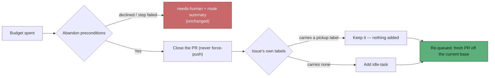

# Abandon-and-restart re-queues on the issue's own pickup label

## Summary

The last automatic rung of the merge-conflict ladder closed the PR and then
decided _who_ re-queued its originating issue: where the pickup label was one
the worker may not apply (`work-on` and the rest of the reserved set), Issue
#1773 reopened the issue at `needs-human` and asked a person to re-apply the
label. That parks the issue outside discovery — the opposite of restarted — and
on the live case NEAT-AI-Lamarck#234 it also threatened a deliberate
`top-priority`.

The rung now keeps whatever pickup label the issue already carries
(`top-priority`, `work-on`, `low-priority` or `idle-task`) and applies
`idle-task` — the one pickup label `worker_label_guard.ts` lets the worker apply
— when it carries none. No route through an abandon reaches `needs-human` any
more: the `abandoned-unlabelled` outcome, `escalateAbandonedIssue`, the
`escalateNeedsHuman` / `needsHumanLabel` / `workLabel` / `ensureLabelExists`
deps and the consumers' `awaitingLabel` operand are gone, and the `abandoned`
outcome carries `label: { kept } | { applied: "idle-task" }` instead. The rung's
_declined_ and _failed_ routes keep their existing escalation, untouched.

Closes #2277.

## Evidence

Backend-only change — no web interface to screenshot. Verified by the tests
below plus the full quality gate — `./quality.sh` reports every check PASSED,
with the usual `config integration` skip.

## Reproduction

- **symptom** — an exhausted PR whose originating issue carries `top-priority`
  was abandoned into `needs-human` (outcome `abandoned-unlabelled`): the PR
  closed, the issue reopened and labelled `needs-human`, its pickup label named
  in a comment for a human to re-apply, and the work not re-queued at all
- **status** — `verified` — a scratch reproduction driving `abandonAndRestart`
  with `issueLabels: ["top-priority"]` was run against the unfixed module and
  went red (`abandoned-unlabelled`, and the assertion that no `gh` call names
  `needs-human` failed); the committed regression test below is the minimised
  form of it and passes after the fix
- **regression test** —
  `worker/deno/tests/conflict_abandon_restart_test.ts::abandonAndRestart - an issue carrying top-priority keeps it, and no label is added`

## Acceptance Criteria

<!-- vibe-spec-review inputs="diff+issue-body" -->

- **met** — regression test: originating issue carrying `top-priority` → PR
  closed, issue re-queued, no label added, no `needs-human` anywhere, restart
  comment names `top-priority` — evidence:
  `worker/deno/tests/conflict_abandon_restart_test.ts::abandonAndRestart - an issue carrying top-priority keeps it, and no label is added`
  — reviewer: met
- **met** — regression test: originating issue with no pickup label →
  `idle-task` added, no `needs-human` — evidence:
  `worker/deno/tests/conflict_abandon_restart_test.ts::abandonAndRestart - an issue with no pickup label gains idle-task, never needs-human`
  — reviewer: met
- **met** — issue already carrying `idle-task` → nothing added — evidence:
  `worker/deno/tests/conflict_abandon_restart_test.ts::abandonAndRestart - an issue already carrying idle-task has nothing added`,
  gated by `if ("applied" in requeueLabel)` in
  `worker/deno/lib/conflict_abandon_restart.ts` — reviewer: met
- **met** — every stubbed `gh` call in the module's tests is captured and none
  adds `needs-human` on any abandon outcome — evidence: the fake records every
  call unconditionally and `assertNoNeedsHuman` scans every captured argument
  (`worker/deno/tests/conflict_abandon_restart_test.ts`), now asserted on all
  five abandoning tests — reviewer: met — reason: the reviewer noted the helper
  was called from the three new tests only; it was extended to the other two
  abandon-outcome tests after that review
- **met** — `deno test`, `deno lint` and `deno fmt --check` pass — evidence:
  full `./quality.sh` gate run after the final edit, all checks PASSED —
  reviewer: met
- **unrequested** — `IDLE_TASK_LABEL` imported from `idle_task_issue.ts` instead
  of a new constant in `config_defaults.ts` — reviewer: unrequested — reason:
  the issue's "add a constant" clause was conditional; a canonical
  `IDLE_TASK_LABEL` already exists and twelve modules import it, so duplicating
  it would breach DRY
- **unrequested** — `docs/MERGE.md` and three passages of
  `docs/workflows/merge-conflicts.md` outside the named section (overview
  paragraph, Mermaid flowchart node, decision-operand table row) — reviewer:
  unrequested — reason: each described the removed `needs-human` route or the
  removed `awaitingLabel` operand, so leaving them would ship documentation that
  contradicts the code
- **unrequested** — `planRequeueLabel` and `requeueLabelName` exported —
  reviewer: unrequested — reason: exported so the policy is unit-testable
  directly and so the two consumers share one accessor rather than
  re-implementing the unwrap; both now have direct tests
- **unrequested** — case-insensitive pickup matching, reporting the canonical
  label name — reviewer: unrequested — reason: GitHub label names are
  case-insensitively unique, and reporting the constant keeps repository-chosen
  text out of the public comment bodies this decision feeds
- **unrequested** — `DEFAULT_NEEDS_HUMAN_LABEL` and the `ensureLabelExists` dep
  removed; `label` added to the scan/processor log lines — reviewer: unrequested
  — reason: both removed symbols existed solely for the deleted route and have
  no remaining consumers; the log operand replaces the removed `awaitingLabel`
  so an operator can still see which label the issue rests on

## Standards Review

<!-- vibe-standards-review inputs="diff+CODING-STANDARDS.md" -->

- **violation** — the `RequeueLabel` unwrap was re-implemented in both consumers
  (DRY) — evidence: `worker/deno/lib/pr_merge_conflict_scan.ts:1270` — reason:
  fixed here — `requeueLabelName` is exported and both call sites use it
- **violation** — the new exported `planRequeueLabel` had no direct test —
  evidence: `worker/deno/lib/conflict_abandon_restart.ts:289` — reason: fixed
  here — four direct tests cover precedence, the no-pickup case, casing and
  `requeueLabelName`
- **violation** — stale cross-reference to the removed label check — evidence:
  `worker/deno/lib/escalate_as_work.ts:52` — reason: fixed here — the doc
  comment now says the rung no longer asks that question and why
- **violation** — no PR summary file — evidence:
  `docs/archive/pr-summaries/pr-summary-2277.md` — reason: fixed here — this
  file, including the removed-test record below
- **violation** — commit subject used `(#2277)` rather than the documented
  `Fix: … (Issue #2277)` form — evidence: commit `f1c5a21` — reason: stands for
  that commit (rewriting pushed history is worse than the defect); the follow-up
  commits use the documented form
- **clean** — Australian English throughout code, tests and docs; fail-loud
  error handling (every step still returns a named `failed(...)`, the label add
  still fails loudly on `!ok`); tests call real functions and assert on captured
  `gh` calls rather than grepping source; no hidden paths staged; docs updated
  in the same change; net −225 lines with no dangling deps

## Removed tests — documented

Four tests covering the deleted #1773 route were removed, as the issue requires;
they assert behaviour that no longer exists:

- `abandonAndRestart - an issue the worker cannot re-label is still abandoned, and named (Issue #1773)`
- `abandonAndRestart - an unlabelled abandon is still bound to one restart (Issue #1773)`
- `abandonAndRestart - a needs-human that never landed is a named failure, not an abandon (Issue #1773)`
- `abandonAndRestart - the escalation honours a renamed needs-human label (Issue #1773)`

The one-restart bound they partly covered is still asserted by
`abandonAndRestart - a restarted issue is never abandoned twice` and
`abandonAndRestart - two hosts on the same PR produce one abandon`.

## Test Plan

Added to `worker/deno/tests/conflict_abandon_restart_test.ts`:

- `abandonAndRestart - an issue carrying top-priority keeps it, and no label is added`
- `abandonAndRestart - an issue with no pickup label gains idle-task, never needs-human`
- `abandonAndRestart - an issue already carrying idle-task has nothing added`
- `planRequeueLabel - keeps the highest-priority pickup label present`
- `planRequeueLabel - an issue with no pickup label gains idle-task`
- `planRequeueLabel - a differently-cased label still counts, and is canonicalised`
- `requeueLabelName - names either shape`
- `assertNoNeedsHuman` helper, asserted on every abandoning test

Modified:

- `abandonAndRestart - reopens a closed issue and applies idle-task` (was
  "…applies an appliable work label", which drove the removed `workLabel` dep)
- `worker/deno/tests/pr_merge_conflict_scan_test.ts::findConflictingPr - an abandon that applied idle-task reads as re-queued (Issue #2277)`
- `worker/deno/tests/pr_merge_conflict_processor_test.ts::processMergeConflict - an abandon names the label the issue was re-queued with (Issue #2277)`

Commands run: `deno test` on the three affected suites plus
`merge_conflict_drain`, `merge_conflict_stall_watchdog`,
`merge_conflict_decision_taxonomy` and `deferred_pr_drain`; `deno task check`;
`deno lint`; `deno fmt --check`; and the full `./quality.sh` gate.
