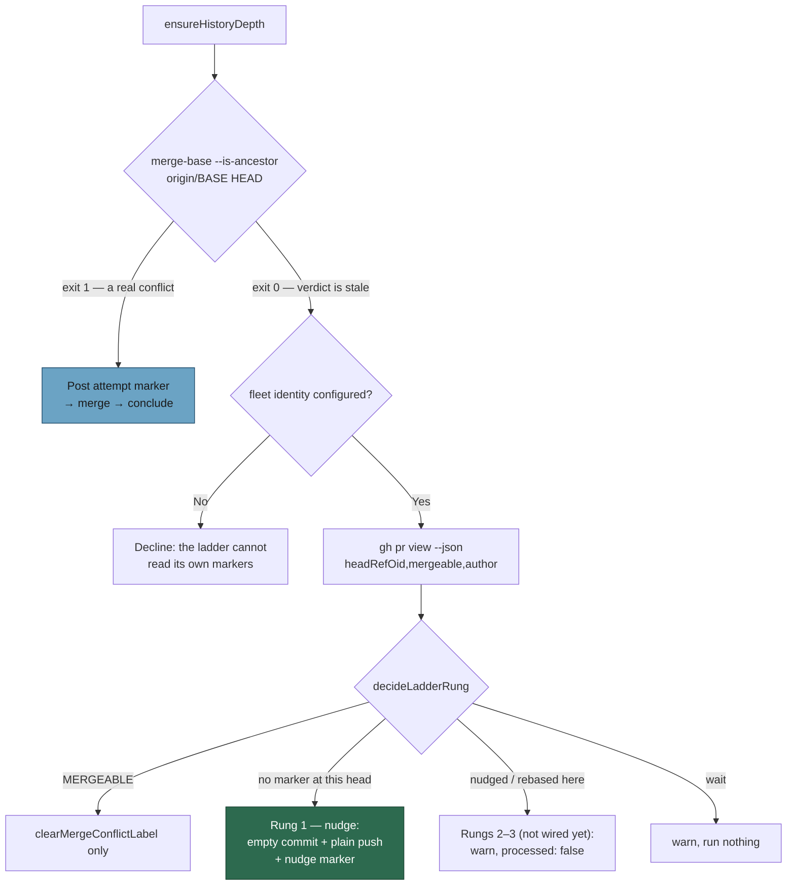

# Skip the attempt on a stale CONFLICTING verdict and push the nudge commit

## Summary

GitHub's `mergeable == CONFLICTING` verdict can be **stale**. When the base is
already an ancestor of the PR head there is nothing left to merge, but the
resolver opened an attempt anyway, ran `git merge origin/BASE`, got "Already up
to date", pushed nothing through `commitAndPushPending`, passed the
base-is-an-ancestor guard, posted `CONFLICT_RESOLVED_MARKER` and cleared the
`merge-conflict` label. `parseConflictAttempts` then reset the budget on that
resolved marker — and GitHub's verdict never changed, so the next scan picked
the same PR up and did it again. NEAT-AI-Lamarck#239 sat in that loop for days.

`resolveConflict` now asks git directly — `git merge-base --is-ancestor
origin/BASE HEAD` — after `ensureHistoryDepth` and **before** the attempt
comment is posted, the same slot the deepen step uses. Exit 0 routes the PR to
the stale-verdict ladder (#2276) instead of a merge: nothing is spent, and no
comment has to be withdrawn because none was posted. Rung 1 pushes one empty
commit (no lease, no force) so GitHub recomputes, and records it with
`CONFLICT_NUDGE_MARKER head="<new sha>"`. `MERGEABLE` clears the label only;
`wait`, `rebase` and `abandon` log and return without spending anything. **No
path on the stale route posts a resolved, attempt or failed marker, or adds a
label.**

Past that pre-check the base is known *not* to be an ancestor, so a `git merge`
that exits 0 without moving `HEAD` is impossible — it now fails loud and
withdraws its attempt marker rather than reaching the resolved path.

Closes #2278.

## Evidence

Backend/worker change — no web interface to screenshot. The evidence is the
test suite: `deno test worker/deno/tests/pr_merge_conflict_processor_test.ts`
passes 66/66, and the six stale-route tests were observed failing against the
unfixed code (see **Reproduction**).

Docs: `docs/workflows/merge-conflicts.md` §"Bounds and escalation" gains a
"Stale verdict — the base is already in" subsection with the same diagram and
the bounds each rung rests on.

## Reproduction

- **symptom** — a PR GitHub reports as `CONFLICTING` whose base is already an
  ancestor of its head: the resolver merged, pushed nothing, posted a
  `CONFLICT_RESOLVED_MARKER`, cleared the `merge-conflict` label and reset its
  attempt budget, while GitHub's verdict stayed `CONFLICTING` — so the next
  scan repeated it (NEAT-AI-Lamarck#239, days of it).
- **status** — `verified` — with the new pre-check disabled (the `if
  (staleVerdict.code === 0)` branch short-circuited to `false`), the four
  stale-route tests failed; restoring it turned them green. Recorded command:
  `deno test --allow-all --no-check
  worker/deno/tests/pr_merge_conflict_processor_test.ts --filter "Issue #2278"`
  → `FAILED | 2 passed | 4 failed`, then `ok | 6 passed | 0 failed` after the
  fix.
- **regression test** —
  `worker/deno/tests/pr_merge_conflict_processor_test.ts::processMergeConflict - a stale CONFLICTING verdict nudges instead of opening an attempt (Issue #2278)`

## Acceptance Criteria

<!-- vibe-spec-review inputs="diff+issue-body" -->

- **met** — Regression test: `is-ancestor` exits 0 and the verdict is
  `CONFLICTING` at an un-nudged head → no attempt comment, no
  `CONFLICT_RESOLVED_MARKER`, `merge-conflict` label not removed, exactly one
  `commit --allow-empty` and one `push` with no `--force*`, one comment
  carrying `CONFLICT_NUDGE_MARKER` and the new head sha — evidence:
  `worker/deno/tests/pr_merge_conflict_processor_test.ts::processMergeConflict - a stale CONFLICTING verdict nudges instead of opening an attempt (Issue #2278)`
  — reviewer: met
- **met** — `gh pr view` reports a verdict other than `CONFLICTING`/`MERGEABLE`
  → nothing pushed, nothing posted, `attemptCharged: false` — evidence:
  `worker/deno/tests/pr_merge_conflict_processor_test.ts::processMergeConflict - an unknown verdict on the stale route runs nothing (Issue #2278)`
  — reviewer: met
- **met** — Verdict `MERGEABLE` → label cleared, nothing pushed, no marker
  posted — evidence:
  `worker/deno/tests/pr_merge_conflict_processor_test.ts::processMergeConflict - a MERGEABLE verdict on the stale route only clears the label (Issue #2278)`
  — reviewer: met
- **met** — Nudge marker already names the current head → no second nudge
  commit or comment — evidence:
  `worker/deno/tests/pr_merge_conflict_processor_test.ts::processMergeConflict - a nudge marker naming the current head is not nudged again (Issue #2278)`
  — reviewer: met
- **met** — `labelsAdded` is empty on every stale-path test — evidence: every
  stale-route test in
  `worker/deno/tests/pr_merge_conflict_processor_test.ts` asserts
  `assertEquals(captured.labelsAdded, [])` — reviewer: met
- **met** — The "attempt N of M" number on the next real merge attempt in a
  scripted thread is unchanged by a nudge — evidence:
  `worker/deno/tests/pr_merge_conflict_processor_test.ts::processMergeConflict - a nudge leaves the next real attempt's number unchanged (Issue #2278)`
  — reviewer: met — reason: the reviewer called it "met, thin" because the
  first cut fed `parseConflictAttempts` a hand-built body; the test now feeds
  it the real `buildNudgeComment` output.
- **met** — `deno test`, `deno lint` and `deno fmt --check` pass — evidence:
  `deno lint`, `deno fmt --check` and `deno check` clean; the changed suite
  passes 66/66; the full gate's only red is the pre-existing
  `tests/ephemeral_build_cache_test.ts` (see **Standards Review**) —
  reviewer: met
- **partial → fixed** — "A merge that still exits 0 with `HEAD` unchanged after
  that check is an invariant violation — never the resolved path" — evidence:
  `worker/deno/lib/pr_merge_conflict_processor.ts` reads `HEAD` before the
  attempt is opened and refuses when it is unreadable, so the guard no longer
  fails open — reviewer: partial — reason: the reviewer saw the first commit,
  where an unreadable pre-merge `HEAD` skipped the guard; fixed in `c2d3303a`,
  which also withdraws the attempt marker on that bail.
- **partial → fixed** — "Post one comment carrying `CONFLICT_NUDGE_MARKER`" —
  evidence:
  `worker/deno/tests/pr_merge_conflict_processor_test.ts::processMergeConflict - a nudge whose marker cannot be posted fails loud (Issue #2278)`
  — reviewer: partial — reason: the first cut logged and returned `ok: true`
  when the marker could not be posted, which would re-nudge every new head for
  ever; it now fails loud.
- **unrequested** — the nudge refuses when the clone is not at the head GitHub
  reports, when the index is dirty, and when no fleet identity is configured —
  evidence: `worker/deno/lib/pr_merge_conflict_processor.ts` `runNudgeRung` /
  `runStaleVerdictLadder` — reviewer: unrequested — reason: each closes a way
  the new route would otherwise re-enter the loop it replaces or state
  something on the PR that was not verified; kept rather than reverted because
  they guard the behaviour the issue asks for.
- **unrequested** — a warn when `partitionConflictComments` reports
  unattributable comments — evidence:
  `worker/deno/lib/pr_merge_conflict_processor.ts` `runStaleVerdictLadder` —
  reviewer: unrequested — reason: a discarded rung marker makes a rung repeat,
  and the guidelines forbid a fault that is not said out loud.
- **unrequested** — `readSha`/`readHeadSha`, and the exported
  `buildNudgeCommitMessage`/`buildNudgeComment` — evidence:
  `worker/deno/lib/pr_merge_conflict_processor.ts` — reviewer: unrequested —
  reason: supporting helpers for the `rev-parse` reads and the two bodies the
  issue specifies; exported so they carry their own tests, as every sibling
  builder in the file does.
- **unrequested** — the test
  `processMergeConflict - an outsider's nudge marker does not advance the
  ladder (Issue #1247)` — evidence:
  `worker/deno/tests/pr_merge_conflict_processor_test.ts` — reviewer:
  unrequested — reason: the trust reduction is now on this route's critical
  path, so it is covered where it is used.

## Standards Review

<!-- vibe-standards-review inputs="diff+CODING-STANDARDS.md" -->

- **violation** — ERROR level used for a condition the code goes on to handle
  — evidence: `worker/deno/lib/pr_merge_conflict_processor.ts` (the
  marker-post failure in `runNudgeRung`) — reason: fixed in `c2d3303a`; the
  path now fails loud with `ok: false` instead of logging and continuing, so
  neither the level nor the silent-success concern remains.
- **violation** — the success INFO line fired in the degraded case too —
  evidence: `worker/deno/lib/pr_merge_conflict_processor.ts` `runNudgeRung` —
  reason: fixed in `c2d3303a` — the degraded case now returns before it.
- **violation** — `wait` logs at WARNING even for `verdict-unknown`, which is
  the ordinary transient — evidence:
  `worker/deno/lib/pr_merge_conflict_processor.ts` `runStaleVerdictLadder`
  `case "wait"` — reason: stands. The issue specifies "log at warn with the
  reason" for this branch, and a stale verdict that no rung may act on is a
  PR making no progress — WARNING says "read it soon", which is right.
- **violation** — error-path knobs (`emptyCommitCode`, `pushCode`) built and
  never exercised; no error-path test for the new route — evidence:
  `worker/deno/tests/pr_merge_conflict_processor_test.ts` — reason: fixed in
  `c2d3303a`; seven error-path tests now cover commit failure, push failure,
  HEAD not moving, an unreadable head/verdict pair, a dirty index, a clone off
  the PR head, and a marker that cannot be posted.
- **violation** — two exported builders with no direct test, unlike every
  sibling builder in the file — evidence:
  `worker/deno/lib/pr_merge_conflict_processor.ts`
  `buildNudgeCommitMessage` / `buildNudgeComment` — reason: fixed in
  `c2d3303a`; both now have their own test.
- **violation** — unreachable `return assertNever(decision)` after an
  exhaustive `switch` — evidence:
  `worker/deno/lib/pr_merge_conflict_processor.ts` `runStaleVerdictLadder` —
  reason: fixed in `c2d3303a`; moved into the `default:` branch, which is what
  `assert_never.ts` documents.
- **violation** — `rung?: "nudge" | "rebase" | "abandon"` names two variants
  that are unreachable today — evidence:
  `worker/deno/lib/pr_merge_conflict_processor.ts` `MergeConflictResult` —
  reason: stands. The issue specifies that exact union; its JSDoc says which
  variant is reachable, and the rebase/abandon sub-issues of #2272 wire the
  other two.
- **clean** — Australian English throughout the added prose and comments; every
  new exported symbol and private helper carries a rationale-first JSDoc; nine
  failure branches return `{ ok: false, error }` with repo/PR context and
  nothing is caught and discarded; no hidden or secret-bearing path staged; the
  push is `buildPushArgs("origin", branchName)` with no force or lease and is
  guarded by `assertPushTargetAllowed`; the nudge commit carries the
  `Vibe-Coder-Run-Id` trailer via `appendRunIdTrailer`; all new tests call real
  functions and assert on results, with no sleeps, no `Deno.env` mutation and
  no source-grepping.
- **clean (pre-existing red, not this diff)** — the full gate's `deno tests`
  stage is red on three host-environment tests:
  `worker/deno/tests/ephemeral_build_cache_test.ts::buildCacheEnvForCheckout`
  (×2) and
  `worker/deno/tests/quality_gate_phase_test.ts::untrustedQualityCommandEnv - a trim-refused launch builds off the work volume`.
  All three read the launcher's work-volume trim flag from the host and fail
  identically on the unmodified
  `origin/milestone/2272-worker-deno-lib-stale-verdict-ladder-worker` tree;
  none imports anything this diff touches.
- **clean** — `worker/deno/tests/merge_conflict_intent_processor_test.ts` gains
  a `rev-parse HEAD` answer to its git stub. The new invariant guard reads HEAD
  across the merge, and that stub previously answered every unmatched command
  with empty stdout — a harness gap, not a behaviour change: the 13 tests in
  that file assert exactly what they did before.

## Test Plan

Added to `worker/deno/tests/pr_merge_conflict_processor_test.ts` (66 pass):

Harness — `GitScript` gains `baseIsAncestorBeforeMerge`, `headSha`,
`headAfterMerge`, `headAfterNudge`, `baseSha`, `emptyCommitCode`, `pushCode`
and `indexDirty`; `Captured` gains `emptyCommits` and `pushes`; the `gh` stub
answers `pr view --json headRefOid,mergeable,author` and the paged comment
fetch, and can reject a `pr comment`.

Behaviour:

- a stale `CONFLICTING` verdict nudges instead of opening an attempt
- an unknown verdict on the stale route runs nothing
- a `MERGEABLE` verdict only clears the label
- a nudge marker naming the current head is not nudged again
- an outsider's nudge marker does not advance the ladder
- a nudge leaves the next real attempt's number unchanged
- a merge that succeeds without moving HEAD fails loud

Error paths:

- a nudge commit that fails posts nothing
- a nudge push that fails posts no marker
- a nudge commit that does not move HEAD fails loud
- an unreadable head/verdict pair stops the stale route
- no configured fleet identity runs no rung
- a clone that is not at the PR head refuses to nudge
- a dirty index refuses the nudge
- a nudge whose marker cannot be posted fails loud

Builders:

- `buildNudgeCommitMessage` evidences the ancestry and stays attributable
- `buildNudgeComment` names the new head, the base and why the commit exists
