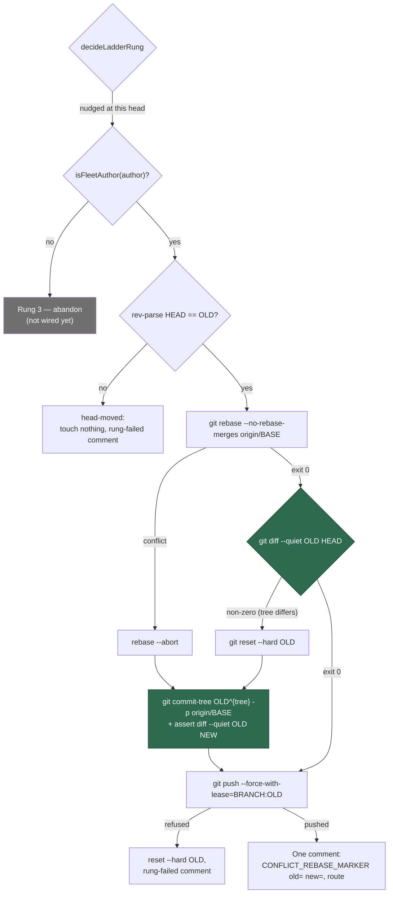

# Add the rebase rung with the tree-identity guard and the squash fallback

## Summary

The stale-verdict ladder's second rung. Rung 1 (#2278) pushes an empty commit so
GitHub recomputes mergeability; when that does not shift a `CONFLICTING` verdict
the ladder decided `rebase` and the processor logged a warning and returned —
the PR stopped climbing. NEAT-AI-Lamarck#239 is exactly that state.

`runRebaseRung` (`worker/deno/lib/conflict_rebase_rung.ts`) now replays the PR's
non-merge commits onto the base (`git rebase --no-rebase-merges origin/BASE`)
and pushes the result **only once `git diff --quiet OLD NEW` exits 0** — the new
head's tree is byte-identical to the head GitHub judged, so the push replaces a
commit graph and no file content at all. That guard is the whole licence for the
force-push: the resolver's contract forbids a *destructive* force-push
(Issues #1076, #4373) because a rebase once destroyed a PR's own changes, and a
push that provably changes no file is not that. The lease is pinned
(`--force-with-lease=BRANCH:OLD`), never a bare `--force`, so a branch that moved
on the remote refuses the push rather than being overwritten.

A replay that conflicts, or lands on a different tree, falls back to one commit
carrying the old head's tree on top of the base
(`git commit-tree OLD^{tree} -p origin/BASE`). It cannot conflict and cannot
lose the base's changes — the ladder runs only once `origin/BASE` is already an
ancestor of `OLD`, so `OLD`'s tree already contains the base — and its identity
is asserted anyway before the push, because "identical by construction" is a
claim about code and the push is irreversible. No agent runs on that path: under
the guard the only admissible resolution is a tree equal to `OLD`, which the
fallback produces outright.

Every outcome leaves the branch at `OLD` or at a head whose tree equals `OLD`'s,
error paths included: a fault restores `OLD` and then fails loud rather than
leaving a half-replayed branch behind. The rung is for **fleet-authored** PRs
only (`isFleetAuthor`, positive attribution required); a human's branch skips to
the abandon rung, which closes rather than rewrites.

Closes #2279.

## Evidence

Backend/worker change — no web interface to screenshot. The evidence is the test
suite: `deno test worker/deno/tests/conflict_rebase_rung_test.ts` passes 14/14
and `worker/deno/tests/pr_merge_conflict_processor_test.ts` passes 78/78, with
the six new processor tests observed failing against the unwired processor (see
**Reproduction**). `./quality.sh` passes every stage bar three pre-existing
host-environment failures reproduced on the milestone base (see **Acceptance
Criteria**, last criterion).

## Reproduction

- **symptom** — a PR whose `CONFLICTING` verdict survived the nudge stopped
  climbing: `decideLadderRung` returned `rebase` and the processor logged
  "not wired yet", pushed nothing and posted nothing, so the ladder never
  reached the abandon rung and the PR sat conflicting for ever.
- **status** — `verified` — with the `case "rebase"` wiring temporarily reverted
  to the #2278 placeholder, the six new processor tests were observed failing
  (`FAILED | 5 passed | 6 failed`), and all pass once the rung is wired.
- **regression test** —
  `worker/deno/tests/pr_merge_conflict_processor_test.ts::processMergeConflict - an identical tree pushes the replay once, with the pinned lease (Issue #2279)`
  and the five cases beside it.

## Acceptance Criteria

<!-- vibe-spec-review inputs="diff+issue-body" -->

- **met** — processor regression: differing tree → `reset --hard OLD`, then the
  squash fallback pushed with a tree equal to OLD — evidence:
  `worker/deno/tests/pr_merge_conflict_processor_test.ts::processMergeConflict - a replayed tree that differs is reset to OLD and the old tree squashed (Issue #2279)`
  — reviewer: met
- **met** — processor regression: replay conflict → `rebase --abort`, fallback
  pushed, `--force-with-lease=<branch>:<OLD>` present and no bare `--force`,
  comment names `squash` — evidence:
  `worker/deno/tests/pr_merge_conflict_processor_test.ts::processMergeConflict - a replay conflict aborts and pushes the squash of OLD's tree (Issue #2279)`
  — reviewer: met
- **met** — identical tree → exactly one push with the pinned lease, one
  `CONFLICT_REBASE_MARKER` comment carrying both shas and `rebase` — evidence:
  `worker/deno/tests/pr_merge_conflict_processor_test.ts::processMergeConflict - an identical tree pushes the replay once, with the pinned lease (Issue #2279)`
  — reviewer: met
- **met** — `rev-parse HEAD !== OLD` → nothing pushed, nothing reset, one
  rung-failed comment — evidence:
  `worker/deno/tests/pr_merge_conflict_processor_test.ts::processMergeConflict - a clone that is not at the judged head pushes nothing and reports the rung failed (Issue #2279)`
  — reviewer: met
- **met** — human-authored PR → no rebase commands issued — evidence:
  `worker/deno/tests/pr_merge_conflict_processor_test.ts::processMergeConflict - a human-authored PR is never rebased (Issue #2279)`
  and the unreadable-author case beside it — reviewer: met
- **met** — rung test: every outcome kind leaves the branch at OLD or at a head
  whose tree equals OLD — evidence:
  `worker/deno/tests/conflict_rebase_rung_test.ts::runRebaseRung - every outcome leaves the branch at OLD or at a head whose tree equals OLD`
  — reviewer: met
- **met** — the attempt count parsed from the resulting thread is unchanged by
  the rung — evidence:
  `worker/deno/tests/pr_merge_conflict_processor_test.ts::processMergeConflict - the rebase rung leaves the next real attempt's number unchanged (Issue #2279)`
  — reviewer: met
- **met** — `deno test`, `deno lint` and `deno fmt --check` pass — evidence:
  `./quality.sh` run after the final edit: every stage PASSED except `deno
  tests`, which reports **three pre-existing failures unrelated to this diff**
  (`ephemeral_build_cache_test.ts:237`, `:260`,
  `quality_gate_phase_test.ts:744`). Reproduced on the milestone base
  `517412fb` with none of this change present — `FAILED | 68 passed | 3 failed`
  — so they are the host-environment failures Issue #2247 / PR #2281 record.
  The touched suites are green: rung 14/14, processor 78/78, `git_ref_args`
  29/29, `lib_sweep_coverage` via `check:manifests` 656/656 — reviewer: partial
  — reason: the reviewer could not confirm a green full suite because its run
  collided with the gate's own run on the audit-journal lock; the gate was run
  here afterwards with nothing else running, and the only failures are the
  three reproduced on the base.
- **unrequested** — `buildRebaseArgs` gains a `RebaseArgsOptions`
  (`noRebaseMerges`) parameter — reviewer: unrequested — reason: the
  `git_ref_argv_check` gate forbids an inline `["rebase", …]` literal, so
  `--no-rebase-merges` can only reach git through the sanctioned builder; its
  own suite now covers the flag's position and the still-validated upstream.
- **unrequested** — `unwiredRung()` extracted from #2278's inline placeholder —
  reviewer: unrequested — reason: the human-author bail-out needs the same
  placeholder the abandon rung returns, and two copies of it would drift.
- **unrequested** — `assertPushTargetAllowed(branchName)` before the rung —
  reviewer: unrequested — reason: this rung force-pushes, and the default
  branch is read-only for the worker (Issue #2584); the nudge rung takes the
  same guard.
- **unrequested** — `head-moved` carries a `localHead` field — reviewer:
  unrequested — reason: the rung-failed comment names where the clone actually
  is, which is the whole diagnostic value of that outcome.
- **unrequested** — optional `runId` and `logger` on the request, and three
  `logger?.info` calls — reviewer: unrequested — reason: the fallback commit
  needs a run-id trailer (the pre-commit gate requires one) and the route taken
  must be visible in the worker log; both are injectable so the tests stay pure.
- **unrequested** — throw paths outside the three-kind union (unusable
  `oldHead`, unreadable `HEAD`, non-conflict rebase failure, `commit-tree`
  failure or garbage stdout, failed reset, failed `rebase --abort`) — reviewer:
  unrequested — reason: fail-loud; each is a fault rather than an outcome, and
  swallowing one would push a head nobody validated. Each restores `OLD` first
  and now also posts the rung-failed marker, so a fault cannot loop.
- **unrequested** — the `git diff --name-only --diff-filter=U` probe — reviewer:
  unrequested — reason: the issue's step 3 is keyed on "non-zero exit **with
  unmerged paths**", which is the only way to ask that question.
- **unrequested** — a no-op replay takes the fallback rather than pushing `OLD`
  back — reviewer: unrequested — reason: found by the same review; pushing OLD
  back gives GitHub nothing to re-judge while the comment claims a
  linearisation that never happened.
- **unrequested** — the rung-failed body renders its quoted git output inert
  (`neutraliseAgentMarkers`) — reviewer: unrequested — reason: git's stderr can
  carry a fork-chosen branch name, and a marker-shaped string in a
  fleet-authored body is read back as the fleet's own ladder memory
  (Issue #2260).
- **unrequested** — `buildSquashCommitMessage` is exported — reviewer:
  unrequested — reason: the commit message must carry Issue #2272, the old head
  and the run-id trailer, and a test that cannot call it can only assert that
  by matching the argv string.
- **unrequested** — the mermaid diagram, the reworded "a rung that cannot be
  recorded" bullet and the new entry in the file index of
  `docs/workflows/merge-conflicts.md` — reviewer: unrequested — reason: the
  diagram and the file index both stated rung 2 was unwired; leaving either
  would make the doc false.
- **unrequested** — `docs/audits/lib-sweep-coverage.json` + the
  `top-up-2279` sweep record — reviewer: unrequested (not seen; added after the
  review) — reason: the repo's own completeness gate fails until every module
  under `worker/deno/lib` is claimed by a slice that read it; this mirrors
  `top-up-2276` from the sibling issue.

## Standards Review

<!-- vibe-standards-review inputs="diff+CODING-STANDARDS.md" -->

- **violation** — the new `lib/` module was claimed by no sweep slice, so
  `deno task check:manifests` failed — evidence:
  `worker/deno/lib/conflict_rebase_rung.ts:1` — reason: fixed here — added the
  `top-up-2279` slice to `docs/audits/lib-sweep-coverage.json` and its written
  record `docs/audits/security-sweep-2279-conflict-rebase-rung.md`, which names
  the module; `check:manifests` now passes 656/656.
- **violation** — `buildRebaseArgs` is a modified public function with no test
  in its own suite for the new option — evidence:
  `worker/deno/lib/git_ref_args.ts:262` — reason: fixed here — two tests added
  covering the flag's position before `--end-of-options`, the opt-in default,
  and the still-enforced dash-leading-upstream refusal.
- **violation** — no `docs/archive/pr-summaries/pr-summary-2279.md` in the
  commit range, which also owes the statement that an existing #2278 test was
  rewritten — evidence: `docs/archive/pr-summaries/pr-summary-2279.md` (absent
  at the reviewed commit) — reason: fixed here — this file, with the rewritten
  test documented under **Test Plan**.
- **violation** (nit) — the numbered walkthrough comments ran 1, 2, 3, 4, 6 with
  no step 5 — evidence: `worker/deno/lib/conflict_rebase_rung.ts:334` — reason:
  fixed here — a line now says step 5 lives in `replaceWithSquashOfOldTree`.
- **clean** — Australian English throughout; TDD with real functions behind an
  injected git seam (no source-grepping, no sleeps, no spawns); fail-loud error
  handling, including the deliberate refusal to fall back on a non-conflict
  rebase failure; log levels (`info` for expected routes, `warn` for degraded
  ones); commit safety — no hidden paths staged, run-id trailer on every commit
  and on the fallback commit message; security — refs through
  `assertSafeGitRef`/`--end-of-options`, shas through `isConflictHeadSha`,
  always a pinned lease and never a bare `--force`, `assertPushTargetAllowed`
  before the push, bodies through the `gh` redaction chokepoint; KISS/DRY — the
  git work in its own focused module, the duplicated placeholder collapsed;
  docs updated in the same change with no surface left claiming rung 2 is
  unwired.

## Test Plan

New — `worker/deno/tests/conflict_rebase_rung_test.ts` (12 tests, scripted git
runner):

- an identical tree pushes the replay with the pinned lease, `--no-rebase-merges`
  and no bare force
- a differing tree is reset to `OLD` and the old tree squashed onto the base
- a replay conflict aborts (reading the unmerged paths *before* the abort) and
  pushes the squash
- a clone that is not at the judged head issues only the head read
- a refused push restores `OLD`
- a replay failure with **no** unmerged paths fails loud instead of falling back
- a fallback whose tree differs from `OLD` fails loud and restores `OLD`
- a replay that moves nothing takes the fallback rather than pushing `OLD` back
- a failed `git rebase --abort` stops instead of building on a mid-rebase clone
- a `commit-tree` failure pushes nothing
- an unreadable `HEAD` refuses rather than claiming the head moved
- an unusable `oldHead` is refused before any git runs
- the invariant over every outcome kind: the branch ends at `OLD` or at the
  pushed head, and every push was preceded by an identity guard that exited 0
- `buildSquashCommitMessage` names Issue #2272, the old head and the run-id
  trailer

Added to `worker/deno/tests/pr_merge_conflict_processor_test.ts` (76 total):

- identical tree → exactly one push with the pinned lease, one
  `CONFLICT_REBASE_MARKER` comment carrying both shas and `route: rebase`
- differing tree → `reset --hard OLD`, then the fallback pushed, comment names
  `route: squash`
- replay conflict → `rebase --abort`, fallback pushed, lease pinned, no bare
  `--force`
- clone not at the judged head → nothing pushed, nothing reset, one
  `CONFLICT_RUNG_FAILED_MARKER rung="rebase"` comment
- refused push → `OLD` restored, rung-failed comment, no rebase marker
- a rung **fault** (replay failure with no unmerged paths) still records the
  rung as failed, so the next scan climbs instead of re-deciding `rebase` here
- a marker-shaped string quoted out of git's output renders inert in the
  rung-failed body (Issue #2260)
- human-authored PR → no `rebase` command issued at all
- unreadable author → likewise (positive fleet attribution required)
- the attempt count parsed from a thread carrying the rung's own comment bodies
  is unchanged
- `buildRebaseComment` / `buildRungFailedComment` direct tests

Modified — `processMergeConflict - a nudge marker naming the current head is not
nudged again (Issue #2278)`. It asserted the unwired placeholder
(`processed: false`, nothing pushed); the rung is wired now, so it asserts the
ladder *climbing* instead — still no second nudge at that head, and
`rung === "rebase"`. Renamed to say so.
