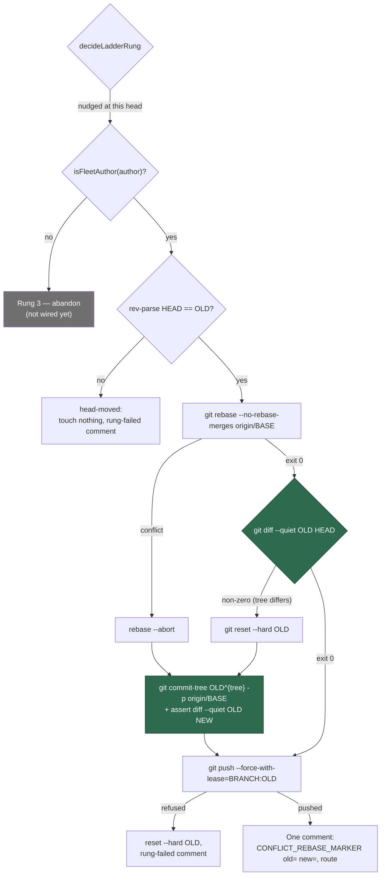

# Add the rebase rung with the tree-identity guard and the squash fallback

## Summary

The stale-verdict ladder's second rung. Rung 1 (#2278) pushes an empty commit so
GitHub recomputes mergeability; when that does not shift a `CONFLICTING` verdict
the ladder decided `rebase` and the processor logged a warning and returned —
the PR stopped climbing. NEAT-AI-Lamarck#239 is exactly that state.

`runRebaseRung` (`worker/deno/lib/conflict_rebase_rung.ts`) now replays the PR's
non-merge commits onto the base (`git rebase --no-rebase-merges origin/BASE`)
and pushes the result **only once `git diff --quiet OLD NEW` exits 0** — the new
head's tree is byte-identical to the head GitHub judged, so the push replaces a
commit graph and no file content at all. That guard is the whole licence for the
force-push: the resolver's contract forbids a *destructive* force-push
(Issues #1076, #4373) because a rebase once destroyed a PR's own changes, and a
push that provably changes no file is not that. The lease is pinned
(`--force-with-lease=BRANCH:OLD`), never a bare `--force`, so a branch that moved
on the remote refuses the push rather than being overwritten.

A replay that conflicts, or lands on a different tree, falls back to one commit
carrying the old head's tree on top of the base
(`git commit-tree OLD^{tree} -p origin/BASE`). It cannot conflict and cannot
lose the base's changes — the ladder runs only once `origin/BASE` is already an
ancestor of `OLD`, so `OLD`'s tree already contains the base — and its identity
is asserted anyway before the push, because "identical by construction" is a
claim about code and the push is irreversible. No agent runs on that path: under
the guard the only admissible resolution is a tree equal to `OLD`, which the
fallback produces outright.

Every outcome leaves the branch at `OLD` or at a head whose tree equals `OLD`'s,
error paths included: a fault restores `OLD` and then fails loud rather than
leaving a half-replayed branch behind. The rung is for **fleet-authored** PRs
only (`isFleetAuthor`, positive attribution required); a human's branch skips to
the abandon rung, which closes rather than rewrites.

Closes #2279.

## Evidence

Backend/worker change — no web interface to screenshot. The evidence is the test
suite: `deno test worker/deno/tests/conflict_rebase_rung_test.ts` passes 12/12
and `worker/deno/tests/pr_merge_conflict_processor_test.ts` passes 76/76, with
the six new processor tests observed failing against the unwired processor (see
**Reproduction**).

## Reproduction

- **symptom** — a PR whose `CONFLICTING` verdict survived the nudge stopped
  climbing: `decideLadderRung` returned `rebase` and the processor logged
  "not wired yet", pushed nothing and posted nothing, so the ladder never
  reached the abandon rung and the PR sat conflicting for ever.
- **status** — `verified` — with the `case "rebase"` wiring temporarily reverted
  to the #2278 placeholder, the six new processor tests were observed failing
  (`FAILED | 5 passed | 6 failed`), and all pass once the rung is wired.
- **regression test** —
  `worker/deno/tests/pr_merge_conflict_processor_test.ts::processMergeConflict - an identical tree pushes the replay once, with the pinned lease (Issue #2279)`
  and the five cases beside it.

## Acceptance Criteria

<!-- vibe-spec-review inputs="diff+issue-body" -->

PLACEHOLDER

## Standards Review

<!-- vibe-standards-review inputs="diff+CODING-STANDARDS.md" -->

PLACEHOLDER

## Test Plan

New — `worker/deno/tests/conflict_rebase_rung_test.ts` (12 tests, scripted git
runner):

- an identical tree pushes the replay with the pinned lease, `--no-rebase-merges`
  and no bare force
- a differing tree is reset to `OLD` and the old tree squashed onto the base
- a replay conflict aborts (reading the unmerged paths *before* the abort) and
  pushes the squash
- a clone that is not at the judged head issues only the head read
- a refused push restores `OLD`
- a replay failure with **no** unmerged paths fails loud instead of falling back
- a fallback whose tree differs from `OLD` fails loud and restores `OLD`
- a `commit-tree` failure pushes nothing
- an unreadable `HEAD` refuses rather than claiming the head moved
- an unusable `oldHead` is refused before any git runs
- the invariant over every outcome kind: the branch ends at `OLD` or at the
  pushed head, and every push was preceded by an identity guard that exited 0
- `buildSquashCommitMessage` names Issue #2272, the old head and the run-id
  trailer

Added to `worker/deno/tests/pr_merge_conflict_processor_test.ts` (76 total):

- identical tree → exactly one push with the pinned lease, one
  `CONFLICT_REBASE_MARKER` comment carrying both shas and `route: rebase`
- differing tree → `reset --hard OLD`, then the fallback pushed, comment names
  `route: squash`
- replay conflict → `rebase --abort`, fallback pushed, lease pinned, no bare
  `--force`
- clone not at the judged head → nothing pushed, nothing reset, one
  `CONFLICT_RUNG_FAILED_MARKER rung="rebase"` comment
- refused push → `OLD` restored, rung-failed comment, no rebase marker
- human-authored PR → no `rebase` command issued at all
- unreadable author → likewise (positive fleet attribution required)
- the attempt count parsed from a thread carrying the rung's own comment bodies
  is unchanged
- `buildRebaseComment` / `buildRungFailedComment` direct tests

Modified — `processMergeConflict - a nudge marker naming the current head is not
nudged again (Issue #2278)`. It asserted the unwired placeholder
(`processed: false`, nothing pushed); the rung is wired now, so it asserts the
ladder *climbing* instead — still no second nudge at that head, and
`rung === "rebase"`. Renamed to say so.
