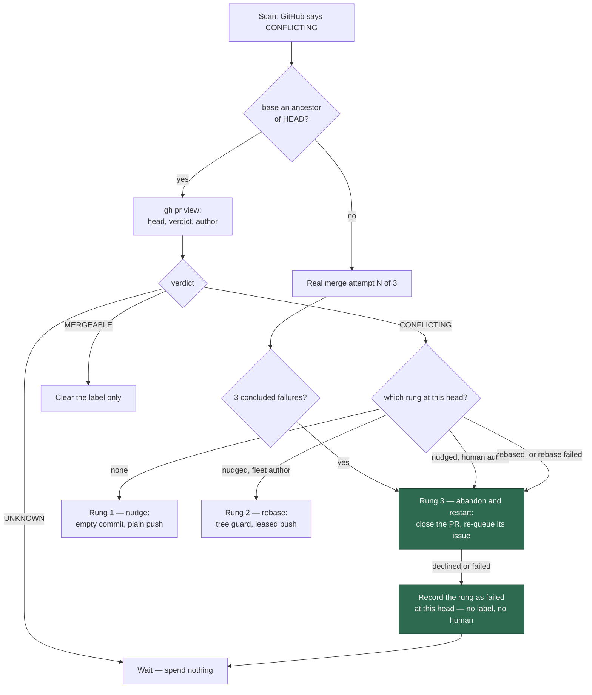

# Hand an exhausted stale-verdict ladder to abandon-and-restart

## Summary

The stale-verdict ladder's last rung is wired. When GitHub still reports
`CONFLICTING` at the head the rebase produced, when the rebase rung failed at
that head, or when a **human-authored** PR sits at the nudged head, the
processor now calls the existing `abandonRestartFn` seam instead of logging
"not wired yet" and returning `processed: false`. Closes #2280.

- **`abandoned`** → `rung: "abandon"`, and the summary names the issue that was
  re-queued and the pickup label it carries.
- **Declined** (`already-restarted`, no originating issue) **or `failed`** → one
  comment carrying
  `<!-- vibe-merge-conflict-rung-failed rung="abandon" head="<sha>" -->`, logged
  at warn naming the route, and **no label on the PR or the issue**. The reader
  returns `wait: ladder-exhausted` at that head, so the rung runs once; a later
  head or base move restarts the ladder at a real merge attempt, and the restart
  marker on the issue keeps the abandon itself to one per issue.
- **No route through this ladder applies `needs-human`.** Nothing has been spent
  and nothing is broken — the verdict is merely stale — so the stall watchdog
  (Issue #569) is the backstop. The budget-spent caller's `needs-human`
  escalation on a declined abandon is untouched.
- The `unwiredRung` placeholder from #2278/#2279 is deleted, and the two seams
  that call the abandon rung now share one `runAbandonRestart` helper so they
  cannot drift.

`docs/workflows/merge-conflicts.md` now documents all three rungs, the
once-per-head rule and the no-`needs-human` rule, with the full ladder in the
Mermaid flowchart. `docs/workflows/README.md` lists the lane but not its rungs,
so it needed no change.

## Evidence

Backend-only change — no web interface to screenshot. The evidence is the test
suite: the merge-conflict suites run 225/225 green, and the full quality gate
(`./quality.sh`) passes every stage — lint, type check, fmt, mermaid,
markdownlint, semgrep and the chokepoint checks — with 22,511 tests passing.

The gate's three remaining failures are **pre-existing and unrelated**:
`ephemeral_build_cache_test.ts` (×2) and `quality_gate_phase_test.ts` (×1) fail
identically in a clean worktree of the unmodified milestone branch, so they are
not this diff's. Filed as stSoftwareAU/VibeCoder#2291.

### Post-release check on the live case

NEAT-AI-Lamarck#239 (the PR) and NEAT-AI-Lamarck#234 (its issue) are the case
this ladder was built for. After release, the healthy shape is:

- **NEAT-AI-Lamarck#239** receives **at most one further comment per rung** —
  no repeated nudge, rebase or abandon comment at one head — and **no new
  attempt/resolved pair**. It ends either not `CONFLICTING` or closed by the
  abandon rung.
- **NEAT-AI-Lamarck#234** keeps `top-priority` and gains no label.
- **`needs-human` is applied nowhere** — neither thread.
- The scan's decision log shows `abandoned-restarted` for the PR if the rung
  closed it.

A second abandon comment on the PR, a new attempt/resolved pair, or
`needs-human` on either thread is the regression.
NEAT-AI-Lamarck#240 may have cleared the case by hand before this lands; that
does not change the fix.

## Reproduction

- **symptom** — the stale-verdict ladder never reached its last rung: with the
  nudge and the rebase already run at a head GitHub still called `CONFLICTING`,
  the processor logged "the 'abandon' rung is not wired yet" and returned
  `processed: false`, so the PR rested there indefinitely (NEAT-AI-Lamarck#239)
- **status** — `verified` — the new tests were run against the unfixed
  processor and observed failing (8 failures, including
  `result.value.rung` `undefined` instead of `"abandon"` and zero
  `abandonRestartFn` calls), then passing after the rung was wired
- **regression test** —
  `worker/deno/tests/pr_merge_conflict_processor_test.ts::processMergeConflict - a rebased head GitHub still calls CONFLICTING is abandoned (Issue #2280)`

## Acceptance Criteria

<!-- vibe-spec-review inputs="diff+issue-body" -->

- **met** — ladder state `rebasedHead === currentHead`, verdict `CONFLICTING` →
  `abandonRestartFn` called once with the PR's request; `abandoned` →
  `rung: "abandon"`, `labelsAdded` empty — evidence:
  `worker/deno/tests/pr_merge_conflict_processor_test.ts::processMergeConflict - a rebased head GitHub still calls CONFLICTING is abandoned (Issue #2280)`
  — reviewer: met
- **met** — a `rebase` rung-failed marker at the current head →
  `abandonRestartFn` called — evidence:
  `worker/deno/tests/pr_merge_conflict_processor_test.ts::processMergeConflict - a rebase rung-failed marker at this head climbs to abandon (Issue #2280)`
  — reviewer: met
- **met** — human-authored PR at the nudged head → straight to
  `abandonRestartFn`, no rebase commands — evidence:
  `worker/deno/tests/pr_merge_conflict_processor_test.ts::processMergeConflict - a human-authored PR is never rebased (Issue #2279)`
  (and the unreadable-author case beside it) — reviewer: met
- **met** — `already-restarted` decline → no label, one `abandon` rung-failed
  comment, `processed: false`; a second run at the same head calls
  `abandonRestartFn` zero times — evidence:
  `worker/deno/tests/pr_merge_conflict_processor_test.ts::processMergeConflict - a declined abandon records the rung and adds no label (Issue #2280)`
  — reviewer: met
- **met** — no placeholder "not yet wired" branch remains in the processor —
  evidence: `unwiredRung` deleted from
  `worker/deno/lib/pr_merge_conflict_processor.ts`; repo-wide grep finds only
  archived PR summaries — reviewer: met
- **met** — `docs/workflows/merge-conflicts.md` describes all three rungs, the
  once-per-head rule and the no-`needs-human` rule, with a Mermaid flowchart —
  evidence: `docs/workflows/merge-conflicts.md` "Stale verdict" subsection —
  reviewer: met
- **met** — `deno test`, `deno lint` and `deno fmt --check` pass — evidence:
  `./quality.sh` run after the final edit: lint, fmt, type check, mermaid,
  markdownlint and semgrep all PASSED; the merge-conflict suites run 225/225
  green — reviewer: partial — reason: the reviewer's own full-suite run had not
  finished when it reported, so it could not confirm whole-suite green. The gate
  was run here: its only failures are three pre-existing, environment-dependent
  build-cache tests (`ephemeral_build_cache_test.ts` ×2,
  `quality_gate_phase_test.ts` ×1) that fail identically on the unmodified
  milestone branch — verified in a clean worktree of
  `origin/milestone/2272-…` — and are untouched by this diff.
- **unrequested** — `describeConcludedAttempts()` in
  `worker/deno/lib/conflict_abandon_restart.ts`, and the reworded abandon
  comments that use it — reviewer: unrequested — reason: this issue's new caller
  reaches that rung with **zero** attempts opened, so the hard-coded "Two
  merge-conflict resolution attempts … concluded and failed" would have been a
  fabricated fact on a permanent public comment; the count is now read off the
  thread. Raised by the Standards reviewer, fixed here.
- **unrequested** — the abandon-specific closing sentence in
  `buildRungFailedComment` ("the next scan waits at `<sha>` …") — reviewer:
  unrequested — reason: the shared sentence said the next scan "climbs to the
  following rung", which is false for the ladder's last rung.
- **unrequested** — the `runAbandonRestart()` helper extracted out of
  `failAttempt` — reviewer: unrequested — reason: traceable to "the same request
  shape `failAttempt` builds"; the reviewer verified the request is unchanged
  field for field, so it is a faithful de-duplication, not a behaviour change.
- **unrequested** — the extra test `a failure after the close never claims
  nothing was closed (Issue #2280)` and the `abandon-failed` branch-note branch
  it covers — reviewer: unrequested — reason: `issue-label` runs after the PR is
  closed, so the flat "nothing was closed" note would have published state
  nobody checked.

## Standards Review

<!-- vibe-standards-review inputs="diff+CODING-STANDARDS.md" -->

- **violation** — the failed-abandon comment asserted "Nothing was closed and
  nothing on the branch was changed" on every non-abandoning outcome, including
  failures at `issue-reopen`/`issue-label`, which run *after* the close —
  evidence: `worker/deno/lib/pr_merge_conflict_processor.ts` (`runAbandonRung`)
  — reason: fixed here; the note is now derived from `route.kind`, and
  `::a failure after the close never claims nothing was closed (Issue #2280)`
  covers it.
- **violation** — the only `failed` test used `step: "pr-close"`, the one step
  for which that claim happened to hold, so the defect above stayed green —
  evidence: `worker/deno/tests/pr_merge_conflict_processor_test.ts` — reason:
  fixed here; a post-close step (`issue-label`) is now covered.
- **violation** — the abandon comments stated "Two merge-conflict resolution
  attempts … concluded and failed" on a route that opens none — evidence:
  `worker/deno/lib/conflict_abandon_restart.ts` (`buildAbandonPrComment`,
  `buildRestartIssueComment`, the success log) — reason: fixed here via
  `describeConcludedAttempts`, which counts what the thread records.
- **violation** — docstring drift: `ExhaustedEscalationRoute` and
  `describeExhaustedRoute` still described themselves as the `needs-human`
  route only — evidence: `worker/deno/lib/conflict_abandon_restart.ts` — reason:
  fixed here; both now name the second caller that asks nobody.
- **violation** — `recordingAbandon` duplicates three older inline stubs in the
  same test file — evidence:
  `worker/deno/tests/pr_merge_conflict_processor_test.ts` — reason: stands; the
  three older stubs belong to #1115 tests this issue does not touch, and folding
  them in would widen the diff past the change's scope.
- **clean** — Australian English throughout; fail-loud on an unpostable marker
  (returns `ok: false` with the cause chained, covered by a test); no
  `needs-human`, no label and no attempt/resolved/failed marker on this route,
  asserted positively; `Result<T>` control flow and `assertNever` exhaustiveness
  retained; tests drive real code through injected seams, no source-grepping, no
  sleeps or spawned processes; no hidden or credential-shaped path staged;
  `unwiredRung` fully removed with no live references left.

## Test Plan

Added to `worker/deno/tests/pr_merge_conflict_processor_test.ts`:

- `a rebased head GitHub still calls CONFLICTING is abandoned (Issue #2280)` —
  `abandonRestartFn` called once with this PR's request and no thread;
  `rung: "abandon"`, `labelsAdded` empty, nothing pushed or claimed.
- `a rebase rung-failed marker at this head climbs to abandon (Issue #2280)` —
  the marker the rebase rung leaves drives the climb; no rebase command runs.
- `a declined abandon records the rung and adds no label (Issue #2280)` — an
  `already-restarted` decline posts exactly one `rung="abandon"` rung-failed
  comment, `processed: false`, no label; a **second run at the same head**,
  handed that comment back, calls `abandonRestartFn` zero times and posts
  nothing.
- `an abandon that fails records the rung without a human (Issue #2280)` — a
  `failed` outcome is recorded the same way, with no `needs-human`.
- `a failure after the close never claims nothing was closed (Issue #2280)` — a
  failure at `issue-label` (which runs after the PR is closed) must not publish
  "nothing was closed".
- `an abandon whose marker cannot be posted fails loud (Issue #2280)` — the
  marker is the bound, so an unpostable one fails the pass.
- `buildRungFailedComment - the abandon rung says the ladder waits rather than
  climbs (Issue #2280)` — there is no rung above the abandon.

Added to `worker/deno/tests/conflict_abandon_restart_test.ts`:

- `describeConcludedAttempts - counts what the thread records (Issue #2280)`,
  plus an assertion on `buildAbandonPrComment` for the zero-attempt case.

**Two existing tests were deliberately rewritten**, and the change is recorded
in an in-file comment beside each: `a human-authored PR is never rebased
(Issue #2279)` and `an unreadable PR author is never rebased (Issue #2279)`
asserted the unwired placeholder (`rung: undefined`, nothing called). They now
assert the ladder going straight to the abandon rung — still with no rebase
command on a branch the fleet does not own. No test was removed or disabled.
