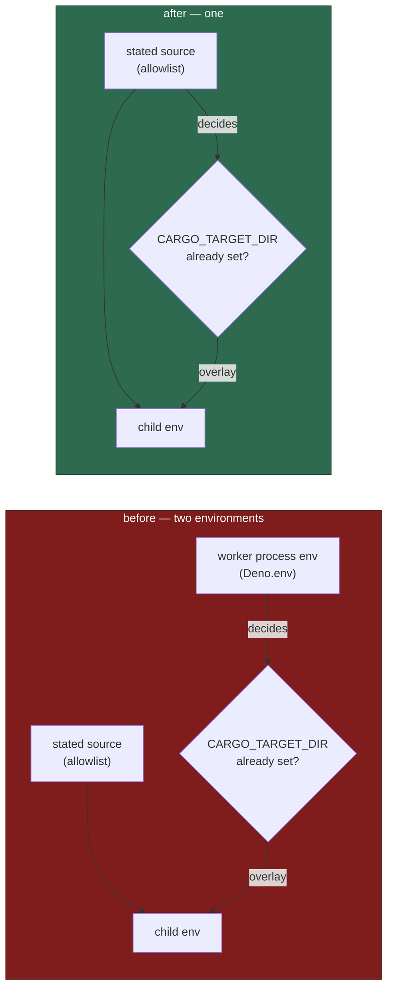

# Three build-cache tests: the placement is decided from the stated environment

## Summary

Three build-cache tests were red on every run on this host, with no local
changes at all. The cause was host state, and a seam that read it: the tests
inherited `CARGO_TARGET_DIR` from their own process, and
`ephemeralBuildCacheEnv` correctly treats an environment that already names
`CARGO_TARGET_DIR` as an operator's deliberate setting and places nothing —
returning `undefined` where the tests expected the off-volume directory.

The variable is there because the feature put it there: on a trim-refused host
the worker sets `CARGO_TARGET_DIR` on the coding agent it spawns
(`worker/deno/lib/claude_runner.ts:1157`), the agent runs `./quality.sh`, and
`deno test` inherits it. So the gate was red on precisely the hosts the feature
exists for.

Both sides were wrong, one each:

- **Production** — `untrustedQualityCommandEnv` built the child's environment
  from `options.source` but read the explicit-setting decision from a
  *different* environment (`Deno.env`, via `buildCacheEnvForCheckout`'s
  default). A decision read from one environment and applied to another is a
  seam that can disagree with itself: with no ambient setting it overrode an
  operator's stated `CARGO_TARGET_DIR`, and with one it suppressed a placement
  the child's own environment never asked to keep. It now passes its source
  through, so one source decides and is decided for.
- **The two `ephemeral_build_cache_test.ts` cases** — they inherited the host's
  environment instead of stating one. They now pass an explicit `source`.

`docs/CONTAINER.md` records the rule alongside the existing "an explicit
`CARGO_TARGET_DIR` is never overridden" bullet.

Closes #2291.

## Evidence

Backend/CLI change with no web surface, so the evidence is test output.

Before, on this host (unmodified `origin/main`):

```
FAILED | 68 passed | 3 failed (111ms)
buildCacheEnvForCheckout - a trim-refused launch moves the build off the volume
buildCacheEnvForCheckout - the account the command drops to reaches the key
untrustedQualityCommandEnv - a trim-refused launch builds off the work volume
```

The cause, isolated — the same unmodified tree, with the one variable removed:

```
$ env -u CARGO_TARGET_DIR deno test -A tests/ephemeral_build_cache_test.ts tests/quality_gate_phase_test.ts
ok | 71 passed | 0 failed (86ms)
```

After, green on both host shapes:

```
$ deno test -A tests/ephemeral_build_cache_test.ts tests/quality_gate_phase_test.ts
ok | 74 passed | 0 failed
$ env -u CARGO_TARGET_DIR deno test -A …            # ok | 73 passed | 0 failed
$ CARGO_TARGET_DIR=/some/host/state deno test -A …  # ok | 74 passed | 0 failed
```

Full gate: `./quality.sh` → `Result: PASSED (with skipped checks)` — including
`completeness checks`, whose parallel-safety cap rejected an earlier cut of
these tests for mutating `Deno.env`.

Where the decision is read from, before and after:



## Reproduction

- **symptom** — on a trim-refused host, three build-cache tests assert the
  off-volume `CARGO_TARGET_DIR` and get `undefined`, so `./quality.sh` is red
  for every run on that host
- **status** — `verified` — the regression test was observed failing against
  the unfixed production code (`origin/main`'s `quality_gate_phase.ts`) **both**
  with an ambient `CARGO_TARGET_DIR` and with `env -u CARGO_TARGET_DIR`, and
  passing after the fix in both
- **regression test** —
  `worker/deno/tests/quality_gate_phase_test.ts::untrustedQualityCommandEnv - the stated environment decides the placement, both ways`

## Acceptance Criteria

<!-- vibe-spec-review inputs="diff+issue-body" -->

- **met** — Decide which side is wrong: the trim-refused branch of
  `buildCacheEnvForCheckout` / `untrustedQualityCommandEnv`, or the tests'
  expectation — evidence: `worker/deno/lib/quality_gate_phase.ts:157-164`
  (JSDoc) and `docs/CONTAINER.md:1364-1370` name both sides and what each got
  wrong — reviewer: met
- **met** — Fix the one that is wrong — evidence:
  `worker/deno/lib/quality_gate_phase.ts:177` threads the source into the
  placement decision; `worker/deno/tests/ephemeral_build_cache_test.ts:247,273`
  state the environment — reviewer: partial — reason: the reviewer saw the
  production call site still passing no `source` and read the fix as
  test-only. It is a seam fix by design — with no `source` stated, both the
  child's environment and the decision fall back to the same `Deno.env`, so
  production behaviour is unchanged and correct; what was broken, and is now
  fixed, is that they disagreed the moment a source *was* stated. The
  reviewer's two accuracy findings about the prose were valid and both are
  fixed in commit 532239bf.
- **met** — Make the assertion independent of host volume state, so the gate
  is green on any host — evidence: the three named tests plus the new
  regression test pass with an ambient `CARGO_TARGET_DIR`, with
  `env -u CARGO_TARGET_DIR`, and with it set to an unrelated value —
  reviewer: met — reason: the reviewer's caveat (the first cut re-introduced
  host coupling via `Deno.env.set`) was correct and is fixed — both new cases
  now use the stated seam, and `completeness checks` passes.
- **unrequested** — the `docs/CONTAINER.md` paragraph recording which
  environment the decision is read from — reviewer: unrequested — reason: a
  code change owes a docs change; that bullet already documents "an explicit
  `CARGO_TARGET_DIR` leaves the environment as it was", and this change makes
  *which* environment part of that rule.

## Standards Review

<!-- vibe-standards-review inputs="diff+CODING-STANDARDS.md" -->

- **violation** — new unit tests mutated process-wide state (`Deno.env.set` /
  `Deno.env.delete`), which the repo's parallel-safety cap forbids — evidence:
  `worker/deno/tests/ephemeral_build_cache_test.ts:291` and
  `worker/deno/tests/quality_gate_phase_test.ts:796` in the first cut — reason:
  fixed in commit 532239bf — both cases now state the `source` seam that
  already existed, and `parallel safety - no new test mutates process-wide
  state (Issue #880)` passes.
- **violation** — the doc and JSDoc claimed the worker's own process "always
  carries a `CARGO_TARGET_DIR`", which nothing sets, and described a
  production behaviour change the seam fix does not make — evidence:
  `docs/CONTAINER.md:1366-1372` and `worker/deno/lib/quality_gate_phase.ts:158-163`
  in the first cut — reason: fixed in commit 532239bf; both now say only what
  is true — one source decides and is decided for, a caller states it,
  production states none.
- **violation** — the regression linkage was host-dependent (the new test's
  pre-fix verdict differed with and without an ambient `CARGO_TARGET_DIR`) —
  evidence: `worker/deno/tests/quality_gate_phase_test.ts:824` in the first
  cut — reason: fixed in commit 532239bf; the merged case asserts both
  directions, so it is red against the unfixed code on either host shape.
- **clean** — Australian English throughout; the fix itself minimal
  (one threading line plus stated sources); tests call real functions and
  assert on returned environments, with no source-grepping, sleeps or
  wall-clock budgets; Deno conventions (`@std/assert`, `deno fmt`, `deno lint`,
  `deno check` all clean); no new spawns, so the integration and benchmark
  manifests are correctly untouched; commit safety — four tracked, non-hidden
  paths, no credential material, run-id trailer present.

## Test Plan

- Modified `worker/deno/tests/ephemeral_build_cache_test.ts` — the two named
  cases (`a trim-refused launch moves the build off the volume`, `the account
  the command drops to reaches the key`) now state their environment instead
  of inheriting the host's.
- Added `worker/deno/tests/ephemeral_build_cache_test.ts::buildCacheEnvForCheckout - a stated environment decides the placement`
  — the stated source, in both directions: no setting means the placement
  stands; a setting means it is never overridden.
- Added `worker/deno/tests/quality_gate_phase_test.ts::untrustedQualityCommandEnv - the stated environment decides the placement, both ways`
  — the regression test for the seam, red against the unfixed code with and
  without an ambient `CARGO_TARGET_DIR`.
- No test was removed, commented out or weakened. The third named failing
  case, `untrustedQualityCommandEnv - a trim-refused launch builds off the work
  volume`, is unchanged — it already stated its environment and the production
  fix is what makes it pass.
