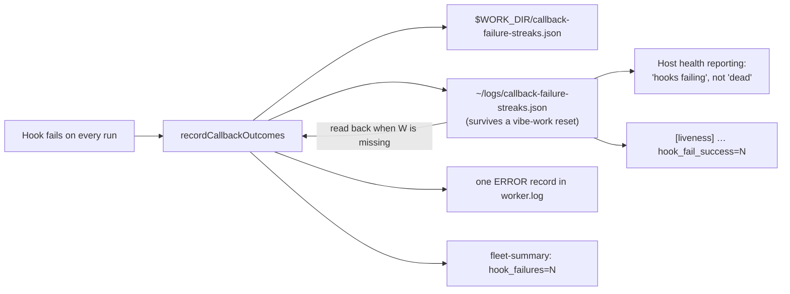

# Publish the callback-failure streak where the host can read it

## Summary

On GRQ-25 the `success` hook — a health heartbeat — failed on every terminal
run for two days. `recordCallbackOutcomes` did exactly what it was built to do:
it wrote one `ERROR` record into `worker.log`, which nothing consumed, so the
board read a working host as dead. The record then fired four times rather than
once, because the count lived only in `WORK_DIR` — the `vibe-work` volume the
launcher recreated three times that day (Issue #2077), zeroing it each time.

This change puts the same fact where the host's own health reporting can read
it, without reintroducing any GitHub write (the Issue #2111 boundary stands):

- **A published streak file.** `callback-failure-streaks.json` is now written to
  the host log directory (`${HOME}/logs`, the rw mount `worker.log` and
  `host-disk.json` already use) as well as `WORK_DIR`, carrying per run hook:
  event, hook path, streak, `firstFailureAt` / `lastFailureAt`, last status,
  exit code and duration, and the redacted head of its stderr.
- **A count that survives a volume reset.** The work-volume copy is preferred;
  when it is missing, the host copy is read instead, so the streak and its
  "failing since" timestamp carry across a `vibe-work` recreation. The GRQ-25
  window now produces one record saying *failing since 16 Sep 08:58Z*, not four
  each claiming a fresh three-issue streak.
- **The liveness line says so.** `[liveness] tick=… live_epoch=…
  last_productive=…` now ends with `hook_fail_success=N hook_fail_failure=N
  hook_fail_always=N` — all three hooks always named, so a host-side parser
  reads a fixed set of fields.
- **`fleet-summary:` says so.** `hook_failures=N` — failing hook invocations
  this run — sits beside `claims=`, `successes=` and `failures=`.
- **A copy that cannot be written is reported**, naming the directory and the
  reason, rather than silently publishing nothing.

Closes #2297.

## Evidence

Backend/CLI only — there is no web surface to screenshot. The evidence is the
test suite below plus the full quality gate, which passed after the final edit
(`./quality.sh`: `Result: PASSED (with skipped checks)` — `config integration`
is the pre-existing skip, it needs live credentials).



The published file, from
`worker/deno/tests/callback_failure_publication_test.ts`:

```json
{
  "version": 1,
  "updatedAt": "2026-09-16T09:00:00.000Z",
  "events": {
    "success": {
      "event": "success",
      "path": "/workspace/.grq-vibecoder/callbacks/success.sh",
      "streak": 3,
      "firstFailureAt": "2026-09-16T08:58:00.000Z",
      "lastFailureAt": "2026-09-16T09:00:00.000Z",
      "status": "failed",
      "exitCode": 1,
      "durationSeconds": 189.1,
      "stderr": "fatal: could not read Username for 'https://github.com'"
    }
  }
}
```

## Acceptance Criteria

The issue states no `## Acceptance Criteria` heading; its four numbered
**Proposed** items were given to the Spec reviewer as the criteria.

<!-- vibe-spec-review inputs="diff+issue-body" -->

- **met** — publish the streak to the host log directory, carrying event,
  streak, first-failure timestamp, last exit code and duration, redacted
  stderr head — evidence:
  `worker/deno/tests/callback_failure_publication_test.ts::#2297 - the streak is published to the host log directory with the facts the record carries`
  — reviewer: met
- **met** — keep the count across a volume reset by reading the host copy when
  the work-volume copy is missing — evidence:
  `worker/deno/tests/callback_failure_publication_test.ts::#2297 - a wiped work volume neither restarts the count nor re-records the streak`
  — reviewer: partial — reason: the reviewer argued the whole-file fallback
  loses a per-event streak when the run after a reset never invokes the failing
  hook. Read back, it does not: `recordCallbackOutcomes` seeds its event map
  from the snapshot it read (`callback_failure_streak.ts:234`) and republishes
  every event, so the inherited entry is carried into the rebuilt work copy. I
  departed from the verdict and added the test the reviewer said was missing —
  `#2297 - a run that never invoked the failing hook still carries its streak
  across the reset` — which fails on the behaviour it described and passes here.
- **met** — carry `hook_fail_success=N hook_fail_failure=N hook_fail_always=N`
  in the liveness line — evidence: `worker/deno/lib/run_core_production_deps.ts`
  (`checkLivenessWindow`) and
  `worker/deno/tests/callback_failure_publication_test.ts::#2297 - the liveness line names every run hook's streak`
  — reviewer: met — reason: the reviewer noted the fields ride the `result.ok`
  branch only (a guard-write failure already logs its own warning instead of a
  decision line, which is pre-existing), and that the read used the loop's
  `workDir` while the writer used `config.workDir`; the second is a real
  divergence and is fixed in this diff — both now use `config.workDir`.
- **met** — say `hook_failures=N` in `fleet-summary` — evidence:
  `worker/deno/lib/fleet_telemetry.ts` (`recordHookFailure`, `formatFleetSummary`)
  and
  `worker/deno/tests/callback_failure_publication_test.ts::#2297 - the fleet summary counts the hook failures beside the run outcomes`
  — reviewer: met
- **unrequested** — the published file is versioned (`version`, `updatedAt`)
  and the pre-#2297 bare-count format is still parsed — reviewer: unrequested —
  reason: the file changed shape, so a worker upgrading mid-streak would
  otherwise lose the very count this issue is about; kept.
- **unrequested** — a hook that succeeded stays in the file at `"streak": 0`
  rather than being dropped — reviewer: unrequested — reason: a health reader
  needs "this hook ran and is healthy", which absence cannot state; kept.
- **unrequested** — `failing since <timestamp>` added to the `ERROR` record —
  reviewer: unrequested — reason: the issue's own wording for criterion 2
  ("keeps *failing since* honest") is about that line; kept.
- **unrequested** — a 500-character bound on the published stderr head
  (`PUBLISHED_STDERR_HEAD_CHARS`) — reviewer: unrequested — reason: "redacted
  stderr head" needs a bound, and an unbounded one would put a 4,000-character
  stream in a file a health reporter polls; kept.
- **unrequested** — read and write failures on either copy are reported —
  reviewer: unrequested — reason: fail-loud; a silently lost copy restarts the
  streak, which is the fault the issue describes. Demoted to `WARNING` after the
  Standards review (see below), so it cannot fire at `ERROR` on a run that
  continues.
- **unrequested** — `docs/audits/lib-sweep-coverage.json` claims the new module
  — reviewer: unrequested — reason: repo bookkeeping the completeness gate
  requires for any new `lib/` module.

## Standards Review

<!-- vibe-standards-review inputs="diff+CODING-STANDARDS.md" -->

- **violation** — a streak copy that cannot be written was reported at `ERROR`
  while the run continues, which *Log Levels Are a Promise* reserves for "cannot
  continue" — evidence: `worker/deno/lib/callback_failure_streak.ts:225` —
  reason: fixed here. The module gained a `logWarn` sink (defaulting to
  `logError`, so a caller wiring only a fault sink still hears it) and
  production wires `logger.warn`, matching the sidecar-write precedent.
- **violation** — `readCopy` swallowed every read failure, so an unreadable or
  corrupt copy silently restarted the streak — evidence:
  `worker/deno/lib/callback_failure_publication.ts:212` — reason: fixed here. A
  `NotFound` stays silent (the first run on a host); anything else, and an
  unparseable body, warns and names the file. Two tests pin both halves.
- **violation** — `hostLogDirectory` read `HOME` only, where the repo's own
  resolver falls back to `USERPROFILE` (Issue #967) — evidence:
  `worker/deno/lib/callback_failure_publication.ts:100` — reason: fixed here,
  and the doc comment now cross-references the two sibling `${HOME}/logs`
  helpers rather than presenting itself as a fourth independent spelling.
- **violation** — `recordHookFailure`'s zero/negative/non-finite branch had no
  test, against the test-coverage expectations — evidence:
  `worker/deno/lib/fleet_telemetry.ts:375` — reason: fixed here; the fleet
  summary test now exercises `0`, `-2` and `NaN`.
- **violation** — `docs/archive/pr-summaries/pr-summary-2297.md` was untracked
  when reviewed — evidence: `docs/archive/pr-summaries/pr-summary-2297.md` —
  reason: it is committed with this change.
- **clean** — Australian English throughout; tests call real code against real
  temp directories with an injected clock (no sleeps, no host `HOME`/`WORK_DIR`);
  `deno check` / `fmt` / `lint` / `check:manifests` clean; the new module is
  claimed in the sweep ledger and has its paired test file; the streak file's
  legacy format still parses and `fleet-summary:` only gained a field;
  `redactSecrets` still runs before truncation; both docs updated in the same
  change; no hidden paths staged; no existing test removed or weakened.

## Test Plan

New — `worker/deno/tests/callback_failure_publication_test.ts` (11 tests):

- `the streak is published to the host log directory with the facts the record
  carries` — both copies land; the entry carries the event, path, streak,
  first/last failure timestamps, status, exit code, duration and redacted
  stderr, and the `ERROR` record names `failing since …`.
- `a wiped work volume neither restarts the count nor re-records the streak` —
  the GRQ-25 regression: delete the work-volume copy mid-streak, and the count
  continues to six with one record, not two, and `firstFailureAt` unchanged.
- `a run that never invoked the failing hook still carries its streak across
  the reset` — the mixed-outcome case: after the reset a failed run fires only
  `failure` and `always`, and the rebuilt work-volume copy still carries the
  `success` streak inherited from the host copy.
- `the work-volume copy is preferred while it exists`.
- `an older worker's plain-number streak file still reads` — the pre-#2297
  `{"always": 3}` format keeps its count across the upgrade.
- `a malformed copy reads as no streak, and says so rather than throwing`.
- `a copy that is simply not there yet is silent — that is the first run`.
- `a host copy that cannot be written is reported, never swallowed` — at
  `WARNING`, or at the fault sink when a caller wires only that one; and the
  work-volume copy still lands.
- `the liveness line names every run hook's streak`.
- `the host log directory is the HOME/logs mount`.
- `the fleet summary counts the hook failures beside the run outcomes`.

Modified — `worker/deno/tests/callback_failure_streak_test.ts`: the persisted
state widened from a bare count per event to the published snapshot, so the
in-memory `memoryStore` helper holds a snapshot and answers `read()` in counts;
every existing assertion is unchanged apart from the one that reads the file
directly (`persisted.always` → `persisted.events.always.streak`). No test was
removed, disabled or weakened.

Unchanged and re-run: `tests/callback_failure_streak_test.ts` (11),
`tests/fleet_telemetry_test.ts`, `tests/run_callbacks_test.ts`,
`tests/lib_sweep_coverage_test.ts`, then the full gate.
