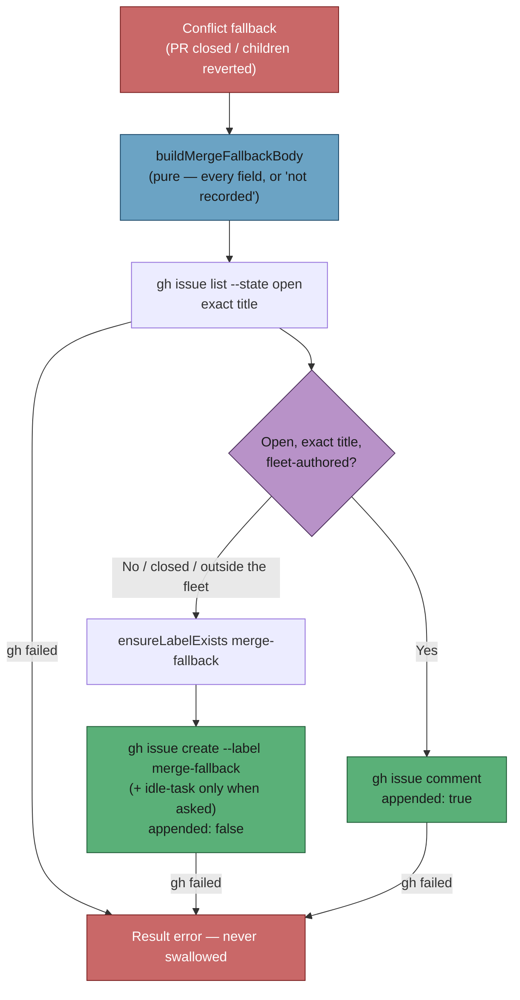

# Add the merge-fallback flag issue builder and filer

## Summary

Every merge-conflict fallback undoes work — the PR path closes the PR, the
milestone path reverts merged children — and left nothing behind naming the
cause. This adds the one shared module that writes that record down for both
paths: `worker/deno/lib/merge_fallback_issue.ts`, with a deterministic
title-keyed dedup, a body from which no field is ever omitted, and the
`merge-fallback` content label created on first use. It knows nothing about
either caller; the PR fallback and the milestone roll-back are wired to it by
their own sub-issues under #2298.

Closes #2304.

## Evidence

Backend module — no web interface to screenshot. The evidence is the test
suite and the full gate:

- `deno test worker/deno/tests/merge_fallback_issue_test.ts` — **26 passed,
  0 failed** (219 ms; every test injects `gh`, `ensureLabelExists` and the
  fleet identity, so nothing reaches a real GitHub).
- `./quality.sh` — **PASSED** (only `config integration` SKIPPED, as on the
  base branch). Includes `deno tests`, `deno lint`, `deno check`, `deno fmt`,
  semgrep, markdownlint, mermaid and the completeness/manifest checks.
- The surrogate-splitting guard was observed red before the fix and green
  after: with the trim line stubbed out,
  `buildMergeFallbackBody - truncation never splits a surrogate pair` FAILED;
  restored, it passes.

## Acceptance Criteria

<!-- vibe-spec-review inputs="diff+issue-body" -->

- **met** — `buildMergeFallbackBody` renders every field; a missing optional
  field renders `not recorded` — evidence:
  `worker/deno/tests/merge_fallback_issue_test.ts::buildMergeFallbackBody - an unrecorded field says so, never drops`
  and `::buildMergeFallbackBody - missing timings and host say not recorded` —
  reviewer: met — reason: the reviewer noted one caveat, that an absent *run*
  is omitted rather than listed as `not recorded`; the caller supplies the run
  list and the module cannot know a run it was never told about, so the
  per-field promise is what is implemented.
- **met** — a second event appends and returns `appended: true`; a closed flag
  is not reused; a same-title issue by a non-fleet author is not reused —
  evidence:
  `worker/deno/tests/merge_fallback_issue_test.ts::fileMergeFallbackIssue - a second event appends to the open flag`,
  `::fileMergeFallbackIssue - a closed flag issue is not reused`,
  `::fileMergeFallbackIssue - a same-title issue from outside the fleet is not reused`
  — reviewer: met
- **met** — `fileMergeFallbackIssue` returns the `gh` error as `Result` —
  evidence:
  `worker/deno/tests/merge_fallback_issue_test.ts::fileMergeFallbackIssue - a gh failure is returned, never swallowed`
  and `::fileMergeFallbackIssue - a failed comment is returned too` —
  reviewer: met
- **met** — `idle-task` is applied only when requested, and only through
  `isWorkerAppliableLabel` — evidence: `worker/deno/lib/merge_fallback_issue.ts`
  builds its labels with `guardedLabelArgs`, asserted by
  `::fileMergeFallbackIssue - idle-task only when the caller asks` — reviewer:
  met
- **met** — the test file covers happy file, dedup-append, closed/untrusted
  match ignored, `gh` failure, unicode and 10k-char analyses, missing timings —
  evidence: `worker/deno/tests/merge_fallback_issue_test.ts`, 26 tests, all
  passing — reviewer: met
- **met** — `./quality.sh` passes — evidence: full gate run after the final
  edit, `Result: PASSED (with skipped checks)` — reviewer: met
- **unrequested** — `mergeFallbackMarker` and the `<!-- vibe-merge-fallback
  repo="…" … -->` line at the top of the body — reviewer: unrequested —
  reason: the repo's marker grammar test (Issue #842) governs every `vibe-*`
  marker a `lib/` module emits, and the marker is what ties a flag issue back
  to its PR or branch the way every sibling escalation does; it is four lines
  and carries no behaviour of its own.
- **unrequested** — the 20,000-character per-run analysis cap, its truncation
  notice, and the widened code fence — reviewer: unrequested — reason: an
  agent reply is unbounded and a GitHub issue body is capped at 65,536
  characters, so without the cap the flag can fail to file because of the very
  analysis it exists to record; truncation is announced rather than silent.
- **unrequested** — `merge-fallback` added to
  `worker/deno/setup/content_label_definitions.ts` — reviewer: unrequested —
  reason: that table is the canonical colour/description source
  `ensureLabelExists` resolves against, so the label is created with the same
  colour in every repo instead of whichever call site got there first
  (Issue #368); the alternative was hard-coding a literal here.
- **unrequested** — `docs/audits/lib-sweep-coverage.json` entry for the new
  module — reviewer: unrequested — reason: the `completeness checks` gate fails
  the build until every new `lib/` module is claimed by a sweep slice. It is
  added to slice 12c (untrusted GitHub-data ingestion), which is where its
  siblings `escalate_as_work.ts` and `merge_conflict_stall_watchdog.ts` live;
  the slice's `sweptAt` predates this file, so the drift report picks it up as
  unswept — the same shape as commit `dae0ab8a`.

## Standards Review

<!-- vibe-standards-review inputs="diff+CODING-STANDARDS.md" -->

- **violation** — an unparseable dedup listing was caught and discarded with no
  log, contradicting the module's own "said out loud" docstring — evidence:
  `worker/deno/lib/merge_fallback_issue.ts:478` — reason: fixed here; the catch
  now logs the parse failure and why it files anyway, covered by
  `::fileMergeFallbackIssue - an unparseable listing files rather than stays silent`.
- **violation** — an unreadable issue number from `gh issue create` was
  returned as `issueNumber: 0` inside an `ok: true` result with no log, so a
  flag nothing can link to read as a normal success — evidence:
  `worker/deno/lib/merge_fallback_issue.ts:424` — reason: fixed here; the case
  is logged loudly, covered by
  `::fileMergeFallbackIssue - an unreadable issue number is said out loud`.
- **violation** — the docs claimed a label that could not be created still ends
  in a filed issue, which is false for a genuinely missing label — evidence:
  `docs/workflows/merge-conflicts.md:555` — reason: fixed here; the doc now
  says the refusal is logged and the create is attempted, and that a missing
  label fails the create and is returned as an error.
- **violation** — `mergeFallbackMarker` had no test for the quote-stripping its
  own comment claims — evidence:
  `worker/deno/lib/merge_fallback_issue.ts:190` — reason: fixed here, covered
  by `::mergeFallbackMarker - a quote in a branch cannot close an attribute`.
- **violation** — truncation used `String.slice` on UTF-16 units and could cut
  a surrogate pair in half — evidence:
  `worker/deno/lib/merge_fallback_issue.ts:227` — reason: fixed here; a
  trailing lone high surrogate is trimmed, verified red-then-green by
  `::buildMergeFallbackBody - truncation never splits a surrogate pair`.
- **violation** — a test cast a partial logger with `as never` — evidence:
  `worker/deno/tests/merge_fallback_issue_test.ts:404` — reason: fixed here;
  the tests now build a real `Logger`.
- **violation** — DRY: the "dedup by title, else append, else file" sequence
  duplicates `escalate_as_work.ts:218-300` — evidence:
  `worker/deno/lib/merge_fallback_issue.ts:351` — reason: stands. The author
  check the two share is already factored into `alert_dedup_authors.ts`;
  extracting the rest would mean refactoring `escalate_as_work.ts`, whose
  search argv differs (it drops its label filter conditionally, this one carries
  none) and which this issue does not ask to touch. The two also now diverge:
  this filer re-reads the row's `state` and returns the issue URL.
- **clean** — Australian English throughout; `Result` returned rather than
  thrown for the public API; every seam injected so no test reaches a real
  `gh`; all 26 tests call real functions and assert on results or recorded
  argv, with no sleeps or source-grepping; labels routed through
  `guardedLabelArgs`; every rendered field passed through `sanitiseIssueText`;
  no hidden paths staged; README and the merge-conflicts workflow doc updated
  in the same change.

## Test Plan

Added `worker/deno/tests/merge_fallback_issue_test.ts` — 26 tests:

- **Title** — the PR and milestone shapes, and that the title is deterministic.
- **Body** — every recorded field renders; the milestone target renders; an
  unrecorded field says `not recorded` rather than disappearing; missing and
  empty timings, host and analysis say so; unicode survives; a 10k analysis
  renders whole; an oversized one is truncated loudly; truncation never splits
  a surrogate pair; agent text cannot forge the module's marker.
- **Filing** — the flag is filed with the content label and without
  `idle-task`; the label is created first; `idle-task` is added only when
  asked, and only labels `isWorkerAppliableLabel` accepts reach `gh`.
- **Dedup** — a second event appends a comment and returns `appended: true`; a
  closed match, a non-fleet-authored match and a near-miss title all file a
  fresh flag instead.
- **Failure** — a failed `gh issue create` and a failed `gh issue comment` are
  both returned as `Result` errors; an unparseable listing, an unreadable issue
  number and a refused label creation are each logged out loud rather than
  swallowed.
