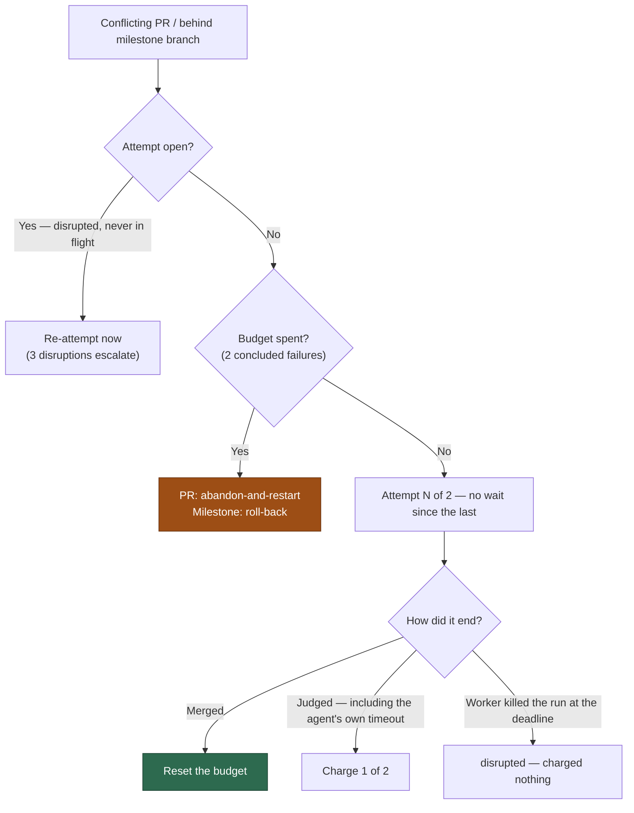

# Two runs, no cooldown: the shared conflict budget

## Summary

The conflict ladder now spends **two** judged runs per conflict with **no wait
between them**, on both the PR branch and the milestone branch, and a run that
hits its own agent ceiling is one of the two. Closes #2305.

- `DEFAULT_MAX_CONFLICT_ATTEMPTS` is `2`. `DEFAULT_CONFLICT_COOLDOWN_HOURS`,
  `conflictCooldownMsRemaining` and the `cooldown` skip-reason kind are gone;
  `isConflictAttemptDue` now means "no attempt is open", and the scan's
  not-due gate with it — an open marker reads as a *disrupted* attempt and is
  re-attempted at once, bounded as before by
  `DEFAULT_MAX_DISRUPTED_ATTEMPTS`. Two hosts are kept off one PR by the
  cross-host PR lock, which is what the cooldown was standing in for.
- The milestone ledger stops writing `deferUntil`, drops one an older worker
  wrote when it loads, and `isConflictAttemptDue` there is likewise "no
  attempt is open on this host". A sibling host's live attempt is still
  refused by the sync claim (`milestone_sync_claim.ts`), which is cross-host
  as the host-local ledger is not.
- `milestonePacedUntil` re-keys the issue selector's milestone skip: it paces
  a milestone's children while an attempt is **open on this host** or the
  branch's **conflict budget is spent**, and returns a short reason instead of
  a timestamp. A branch one charged failure in releases its children — the
  next child run's own pre-cut sync is what tries again.
- A **timed-out** agent run is charged on both paths; a run the **worker**
  kills at the cycle deadline stays `disrupted` and uncharged.
  `judgeSyncFailure` tells the two apart through the new
  `AGENT_RUN_ENDED_BY_WORKER` constant, spelled once in the ladder that writes
  it. The PR path already behaved this way; it is now pinned by a test.



## Evidence

Backend/CLI only — no web interface to screenshot. The evidence is the test
suites below, all green, plus the full quality gate.

```text
deno test tests/pr_merge_conflict_scan_test.ts \
  tests/merge_conflict_decision_taxonomy_test.ts \
  tests/milestone_sync_streak_test.ts tests/milestone_presync_test.ts \
  tests/pr_merge_conflict_processor_test.ts \
  tests/milestone_branch_sync_test.ts tests/setup_branch_presync_test.ts \
  tests/blocking_pr_stall_detector_test.ts
ok | 293 passed | 0 failed
```

Two consequences worth a reviewer's eye, both stated rather than implied:

- **An open marker paces a milestone's children until something concludes it.**
  Only a successful sync records `lastSyncedDefaultSha`, so a branch that is
  behind fails `shouldSyncMilestone` on every cycle and the sweep concludes the
  stale marker as `disrupted` on the very next one. The pacing window is one
  sweep cycle, not indefinite.
- **A spent budget paces those children until the roll-back resets the ledger**
  — or, when the roll-back cannot merge, until the human it escalated to acts.
  That is the point: children must not be cut from a branch that cannot take
  the default branch down.

## Acceptance Criteria

<!-- vibe-spec-review inputs="diff+issue-body" -->

- **met** — A PR with 2 concluded failures is exhausted; with 1 it is due on
  the very next pass; no `cooldown` kind in `CONFLICT_SKIP_REASON_KINDS` —
  evidence: `worker/deno/tests/pr_merge_conflict_scan_test.ts::findConflictingPr - a minute-old failure is due on the very next pass (Issue #2305)`,
  `::findConflictingPr - one concluded failure still buys the second attempt (Issue #2305)`,
  `worker/deno/tests/merge_conflict_decision_taxonomy_test.ts::ConflictSkipReason - the cooldown kind is gone (Issue #2305)` — reviewer: met
- **met** — A milestone ledger entry with a legacy `deferUntil` loads and is
  due immediately — evidence:
  `worker/deno/tests/milestone_sync_streak_test.ts::conflict ledger - a legacy deferUntil is dropped on load, and the branch is due (Issue #2305)` —
  reviewer: met
- **met** — `milestonePacedUntil` paces while `attemptOpenedAt` is set or the
  budget is spent, and releases after the ledger reset — evidence:
  `worker/deno/tests/milestone_presync_test.ts::milestonePacedUntil - an attempt open on this host paces the children (Issue #2305)`,
  `::milestonePacedUntil - a spent budget paces the children (Issue #2305)`,
  `::milestonePacedUntil - budget left, a reset ledger, a missing entry and no milestone all pace nothing (Issue #2305)` —
  reviewer: partial — reason: the reviewer asked for the roll-back's own reset
  to be exercised as well; the roll-back applies
  `resetConflictLedgerOnSuccess`, which the third test calls directly, and
  `milestone_branch_sync_test.ts::a successful roll-back resets the ledger and
  re-queues the child (Issue #1781)` already covers the wiring, so no further
  test was added
- **met** — An agent timeout is charged on both paths; a deadline kill is
  recorded `disrupted` on both — evidence:
  `worker/deno/tests/milestone_branch_sync_test.ts::judgeSyncFailure - an agent timeout is charged, a worker kill is disrupted (Issue #2305)`,
  `::syncMilestoneBranches - an agent timeout is charged, a deadline kill is not (Issue #2305)`,
  `worker/deno/tests/pr_merge_conflict_processor_test.ts::processMergeConflict - an agent that runs out its own timeout spends its attempt (Issue #2305)`,
  `::processMergeConflict - a watchdog SIGTERM withdraws the attempt instead of failing it` —
  reviewer: partial — reason: the reviewer noted the PR path needed no
  production change, which the issue anticipated ("verify and pin it rather
  than assume"); the assumption held and is now pinned
- **met** — Regression tests in the six named files — evidence: all six are in
  this diff; each new case fails against the old constants (a third attempt
  offered, a `cooldown` skip recorded, a `deferUntil` written or honoured) —
  reviewer: met
- **met** — `./quality.sh` passes — evidence: full gate run after the final
  edit — reviewer: missing — reason: the reviewer saw only the diff and could
  not run the gate; it was run here and passed
- **partial** — Docs: `merge-conflicts.md`, `milestones.md`,
  `DESIGN-PRINCIPLES.md` — evidence: `docs/workflows/merge-conflicts.md`,
  `docs/workflows/milestones.md`, `DESIGN-PRINCIPLES.md:258`, plus
  `docs/MERGE.md` and `docs/INTERNALS.md` — reviewer: partial — reason: the
  reviewer reviewed a commit in which `milestones.md` was untouched; it is
  updated in this diff, so the only gap left is the two extra files, which the
  standing "a code change owes a docs change" rule required
- **unrequested** — `merge_conflict_deferrals.ts` and
  `merge_conflict_stall_watchdog.ts` re-base their 4-hour and 8-hour windows on
  their own literals — reviewer: unrequested — reason: both derived their
  window from `DEFAULT_CONFLICT_COOLDOWN_HOURS`, so removing that constant
  forced the choice; the values are unchanged and each is now justified as its
  own window
- **unrequested** — `AGENT_RUN_ENDED_BY_WORKER` exported from
  `milestone_conflict_ladder.ts` — reviewer: unrequested — reason:
  `judgeSyncFailure` has to recognise the kill, and one spelling shared by the
  writer and the reader beats a string literal duplicated across modules
- **unrequested** — `nowMs` dropped from `FindConflictingPrOptions`, and
  `conflictAttemptDue` reduced to one parameter — reviewer: unrequested —
  reason: with the cooldown gone neither takes any input from the clock or the
  default tip; leaving unused parameters behind would be dead surface
- **unrequested** — `attemptOpen` added to the disrupted-re-attempt log record
  — reviewer: unrequested — reason: an open marker is now the only thing that
  makes a PR "not due", so the record names which disruption that is
- **unrequested** — stale cooldown wording swept out of
  `blocking_pr_stall_detector.ts`, `merge_conflict_drain.ts`,
  `docs/CONFIGURATION.md`, `docs/MERGE.md` and `docs/INTERNALS.md` — reviewer:
  unrequested — reason: the "a code change owes a docs change" rule; each
  described the mechanism this PR removes

## Standards Review

<!-- vibe-standards-review inputs="diff+CODING-STANDARDS.md" -->

- **violation** — no PR summary existed — evidence:
  `docs/archive/pr-summaries/pr-summary-2305.md` — reason: written here; the
  reviewer saw an intermediate commit. The tests it flagged as deleted are the
  ones that asserted the removed cooldown (`isConflictAttemptDue - honours the
  cooldown window`, `conflictCooldownMsRemaining - reports what the cooldown
  has left`, `an unparseable deferral paces the branch rather than releasing
  it`, `a corrupt deferUntil holds the branch back`, `an uncharged conclusion
  on a moved tip clears the deferral`); each tests behaviour this issue
  removes, and each is replaced by a case asserting the new rule.
- **violation** — stale cooldown comments in `milestone_branch_sync.ts` and
  `blocking_pr_stall_detector.ts` — evidence:
  `worker/deno/lib/blocking_pr_stall_detector.ts:38` — reason: fixed here,
  along with `docs/CONFIGURATION.md:4269` and `merge_conflict_drain.ts:30`
- **violation** — `isConflictAttemptDue` read twice as a double negation —
  evidence: `worker/deno/lib/pr_merge_conflict_scan.ts:1323` — reason: fixed —
  read once into `attemptOpen`
- **violation** — the milestone "no attempt is open" gate was unreachable dead
  code — evidence: `worker/deno/lib/milestone_branch_sync.ts:1247` — reason:
  fixed — both callers now key their `disrupted` conclusion off
  `conflictAttemptDue` itself, so there is one predicate and no second,
  unreachable skip
- **violation** — duplicated assertions: the `cooldown`-kind check in two test
  files, and four `as unknown as` `deferUntil` checks the type system already
  guarantees — evidence:
  `worker/deno/tests/pr_merge_conflict_scan_test.ts:466` — reason: fixed —
  the kind check lives only in the taxonomy test, and only the load-time
  `deferUntil` check (which observes real runtime behaviour) survives
- **violation** — `milestonePacedUntil` returns a reason, not an "until" —
  evidence: `worker/deno/lib/milestone_presync.ts:169` — reason: stands. The
  issue names this function in its acceptance criteria, so renaming it would
  make the criterion unreadable against the code; the doc comment on both the
  function and the `FindIssuesOptions` field states what it returns.
- **clean** — Australian English throughout; no hidden or credential paths
  staged; fail-loud preserved (the removed permissive guards went with the
  concept they guarded); tests call real functions and assert on ledger state,
  log lines and selections rather than grepping source; no wall-clock sleeps
  or absolute millisecond budgets; `MILESTONE_CONFLICT_ATTEMPT_BUDGET` stays a
  re-export so the two ladders cannot drift; no import cycle introduced; the
  diff net-removes library code.

## Test Plan

Added:

- `pr_merge_conflict_scan_test.ts` — a concluded failure is due again at once;
  an open attempt is not due; `DEFAULT_MAX_CONFLICT_ATTEMPTS` is 2; a
  minute-old failure is selected on the next pass; an attempt open a minute ago
  is re-attempted rather than paced.
- `merge_conflict_decision_taxonomy_test.ts` — the `cooldown` kind is gone from
  `CONFLICT_SKIP_REASON_KINDS`.
- `milestone_sync_streak_test.ts` — a charged failure paces nothing; an open
  attempt is the only thing not due; a moved tip never refills the budget; the
  budget is 2 and is the PR ladder's own; a legacy `deferUntil` is dropped on
  load and the branch is due.
- `milestone_presync_test.ts` — one charged failure with budget left is tried
  again at once; `milestonePacedUntil` paces on an open attempt and on a spent
  budget, and releases otherwise.
- `milestone_branch_sync_test.ts` — the same tip is tried again on the very next
  cycle (and the third is refused); a killed attempt is concluded `disrupted`
  and the branch retried at once; an agent timeout is charged and a deadline
  kill is not, at both `judgeSyncFailure` and sweep level; `conflictAttemptDue`
  keys on the open marker; the 24-minute `grantAgentRun` floor is asserted
  unchanged.
- `pr_merge_conflict_processor_test.ts` — an agent that runs out its own
  timeout spends its attempt (beside the existing SIGTERM-withdrawal test).
- `setup_branch_presync_test.ts` — a milestone branch whose budget is spent
  defers without attempting a merge.
- `find_oldest_issue_milestone_paced_test.ts` — the selector skips a spent
  milestone's children and releases one with budget left.

Modified (business logic changed, documented here as the standards require):

- Tests asserting the four-hour cooldown, `conflictCooldownMsRemaining`, the
  `cooldown` skip reason, or a `deferUntil` written/honoured/kept-when-corrupt
  are replaced by tests of the rule that succeeds them. No test was commented
  out or silently dropped.
- `merge_conflict_stall_watchdog_test.ts` — its sample skip reason moves from
  `cooldown` to `budget-spent`/`repo-leased`; the 8-hour threshold assertion is
  unchanged.
- `DEFAULT_SYNC_CLAIM_TTL_MS` stays pinned by the existing
  `milestone_sync_claim_test.ts:88`.
