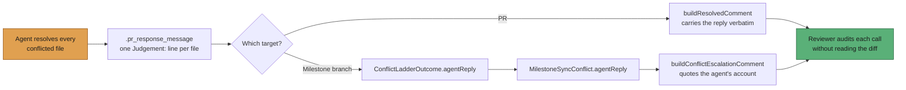

# Merge-conflict agent: judgement on every file, no in-run quality gate

## Summary

The merge-conflict agent now resolves **every** conflicted file, exactly as an
interactive "please resolve the merge conflicts" does. The
"stop / `git merge --abort` / hand it to a human" rule and its worked example
are gone from `prompts/merge_conflict/prompt.md`; where the two sides genuinely
contradict, the agent reads both sides' code (and the Originating Issues block
when one is present), resolves to the outcome both intents are best served by,
and writes one
`Judgement: <path> — <kept …; dropped …; because …>` line per conflicted file
into `.pr_response_message`. Never-side-pick is unchanged: `-X ours`,
`checkout --ours/--theirs`, reset, rebase and force-push are still forbidden,
and both sides still survive wherever both can stand.

The in-run quality gate is removed end to end — the `{{QUALITY_INSTRUCTIONS}}`
placeholder, the `qualityInstructions` field on `buildMergeConflictPrompt` /
`runMergeConflictAgent` / the PR processor / the milestone binding, and the
attempt comment's promise to run it. CI on the pushed merge is the gate on a
PR; the worker's own type-check gate, with its repair round, is the gate on a
milestone branch. An `Intent override:` claimed for a path the issue list does
not qualify is now reported on the conclusion comment as an **unverified
judgement** instead of aborting the merge and spending the attempt.

Closes #2306.

## Evidence

Backend/CLI change — no web interface to screenshot. The evidence is the test
suites listed under **Test Plan**, all green, plus `./quality.sh`.

How a judgement call reaches a reviewer on each path:

The milestone leg of that flow (`agentReply`) is new: the issue assumed the
sync report already carried the agent's reply, and it did not — see the
`unrequested` entry below.

## Acceptance Criteria

<!-- vibe-spec-review inputs="diff+issue-body" -->

- **met** — the rendered prompt contains no `merge --abort` instruction and no
  quality-instructions block — evidence:
  `worker/deno/tests/merge_conflict_prompt_v2_test.ts::merge_conflict - the rendered prompt never tells the agent to abort the merge`
  and `::merge_conflict - the template carries no quality-instructions placeholder`
  — reviewer: met — reason: the reviewer noted
  `merge_conflict_prompt_fence_1377_test.ts` was only updated for the dropped
  parameter and adds no assertion of its own; the two new assertions live in
  `merge_conflict_prompt_v2_test.ts`, which the criterion also names.
- **met** — `runMergeConflictAgent` has no `qualityInstructions` field and both
  callers compile — evidence: `worker/deno/lib/merge_conflict_agent.ts`,
  `worker/deno/lib/milestone_conflict_agent_binding.ts`,
  `worker/deno/lib/run_core_production_deps.ts`; `deno check` clean —
  reviewer: met
- **met** — the attempt comment no longer mentions the quality gate; a resolved
  comment carries the `Judgement:` lines verbatim — evidence:
  `worker/deno/tests/pr_merge_conflict_processor_test.ts::buildAttemptComment - promises no in-run quality gate (Issue #2306)`
  and `::buildResolvedComment - carries the agent's judgement lines verbatim (Issue #2306)`
  — reviewer: met
- **met** — an unqualified intent override no longer aborts the merge —
  evidence:
  `worker/deno/tests/merge_conflict_intent_processor_test.ts::processMergeConflict - an override with no evidence is reported, not refused`
  (asserts the merge lands and the comment flags an unverified judgement) and
  `worker/deno/tests/merge_conflict_intent_audit_test.ts::buildIntentOverrideSection - an uncorroborated claim is flagged as an unverified judgement`
  — reviewer: met
- **met** — the milestone type-check gate still runs after the agent
  (`milestone_sync_gate_repair_test.ts` green, unchanged) — evidence: the file
  is untouched by this diff and passes; `runGateWithRepair` /`resolutionGate`
  in `worker/deno/lib/git_pull.ts` are unmodified — reviewer: met
- **met** — `./quality.sh` passes — evidence: full gate run after the final
  edit, `Result: PASSED` — reviewer: missing — reason: the reviewer saw the
  gate red on the diff it was given, from
  `prompt_gate_instruction_check.ts` matching the new prompt line
  "**Do not run the repository's quality gate.**"; the line was reworded to
  "The repository's quality gate is not yours this merge." and the gate now
  passes.
- **unrequested** — the milestone agent-reply carrier
  (`ConflictLadderOutcome.agentReply`, `MilestoneSyncConflict.agentReply`, the
  `git_pull.ts` pass-through and the quoted block in
  `buildConflictEscalationComment`) — reviewer: unrequested — reason: the issue
  said the sync report "already carries the agent reply" and asked only for an
  assertion; it did not, so the judgement lines would have vanished on the
  milestone path. Built rather than asserted, and covered end to end by
  `worker/deno/tests/milestone_sync_agent_judgement_test.ts`.
- **unrequested** — two prose strings in
  `buildConsultedIssuesSection` (`worker/deno/lib/conflict_intent_audit.ts`) —
  reviewer: unrequested — reason: that comment told readers "both sides
  survive, or the resolution stops", which this change makes false; leaving it
  would have shipped a PR comment contradicting the behaviour.

## Standards Review

<!-- vibe-standards-review inputs="diff+CODING-STANDARDS.md" -->

- **violation** — the new prompt sentence read as an unconditional order to run
  the gate and failed the repo's own gate-instruction chokepoint — evidence:
  `prompts/merge_conflict/prompt.md:124` — reason: reworded to "The
  repository's quality gate is not yours this merge." in this diff;
  `tests/prompt_gate_instruction_check_test.ts` is green.
- **violation** — stale doc claim "a conflicting constant in source code is
  still a human's call", contradicting the new contract bullet 19 lines above —
  evidence: `docs/workflows/merge-conflicts.md:166` — reason: rewritten to
  name the agent's judgement in this diff.
- **violation** — stale doc claim "the agent's contract forbids it from
  deciding that … is a human's call" — evidence:
  `docs/workflows/merge-conflicts.md:189` — reason: rewritten in this diff to
  justify the dependency rules by cost, not by the removed refusal.
- **violation** — the milestone `agentReply` pass-through had no test driving
  `syncMilestoneBranchWithDefault`, though its siblings `decisions` and
  `repair` are covered end to end — evidence: `worker/deno/lib/git_pull.ts` —
  reason: added `worker/deno/tests/milestone_sync_agent_judgement_test.ts`,
  which drives the real sync over real git and asserts the line reaches the
  report comment.
- **violation** — vacuous assertion `assertStringIncludes(example, "read")`,
  which any substring satisfies — evidence:
  `worker/deno/tests/merge_conflict_prompt_v2_test.ts:191` — reason: replaced
  with assertions on the worked example's actual instruction and its
  `Judgement:` line.
- **violation** — an eight-line comment left narrating deleted code — evidence:
  `worker/deno/lib/pr_merge_conflict_processor.ts:1343` — reason: removed; the
  reasoning moved to `buildResolvedComment`'s doc comment, where the reader
  meets the record.
- **violation** — stale comment claiming the reply is read "in up to three
  places — the override guard, …" after the guard was deleted — evidence:
  `worker/deno/lib/pr_merge_conflict_processor.ts:1168` — reason: corrected to
  two places in this diff.
- **violation** — `docs/INTERNALS.md` said the report comment prints only the
  per-file rung list — evidence: `docs/INTERNALS.md:3336` — reason: extended to
  name the quoted agent reply in this diff.
- **clean** — Australian English throughout; `deno fmt`, `deno lint`,
  `deno check` and `markdownlint` clean; no test deleted or commented out, and
  every changed expectation carries an in-file note saying Issue #2306 changed
  the outcome deliberately; the mechanical guards (unmerged paths, conflict
  markers, base-is-an-ancestor) still fail loud; the milestone reply reaches
  the comment through `readPrResponseMessage`, which already redacts secrets
  and neutralises fleet markers, and is quoted rather than folded into worker
  prose; no hidden path staged; `buildIntentOverrideSection` now reuses
  `findUncorroboratedOverrides` rather than re-deriving eligibility.

## Test Plan

Added:

- `worker/deno/tests/merge_conflict_prompt_v2_test.ts` — the template carries
  no quality-instructions placeholder; the rendered prompt withholds the gate
  and names CI / the type-check gate instead; the rendered prompt never says
  `merge --abort`; the template asks for one judgement line per conflicted
  file; a genuine contradiction is decided rather than handed back; an
  unevidenced override is flagged, not refused.
- `worker/deno/tests/pr_merge_conflict_processor_test.ts` —
  `buildAttemptComment` promises no in-run quality gate;
  `buildResolvedComment` carries the judgement lines verbatim.
- `worker/deno/tests/milestone_conflict_ladder_test.ts` — the agent's reply
  travels with the ladder outcome, is consumed, and never reaches the index; an
  agent that wrote no reply reports none.
- `worker/deno/tests/milestone_sync_conflict_test.ts` — the judgement lines
  render on the sync report; no reply leaves the report as it was.
- `worker/deno/tests/milestone_sync_agent_judgement_test.ts` (new file) —
  end-to-end over real git: `syncMilestoneBranchWithDefault` carries the
  agent's reply from the clone to the conflict record and the report comment.

Modified (business-logic change, documented in each file):

- `worker/deno/tests/merge_conflict_prompt_v2_test.ts` — the contradictory
  timeout worked example is now decided by judgement rather than aborted; the
  intent carve-out no longer ends in `git merge --abort`;
  `QUALITY_INSTRUCTIONS` dropped from the required-placeholder list.
- `worker/deno/tests/merge_conflict_intent_processor_test.ts` — "an override
  with no evidence is refused" becomes "is reported, not refused".
- `worker/deno/tests/merge_conflict_intent_audit_test.ts` — the uncorroborated
  claim is flagged as an unverified judgement and says the merge still landed.
- `merge_conflict_agent_test.ts`, `merge_conflict_prompt_fence_1377_test.ts` —
  the dropped `qualityInstructions` argument.

Full gate: `./quality.sh` — `Result: PASSED`.
