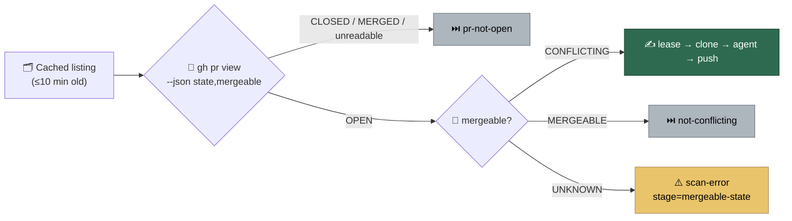

# PR path: re-read state and mergeable before each attempt

## Summary

The claim-point live PR read (Issue #1774) now asks `gh pr view --json
state,mergeable` in the same round trip, so the merge-conflict drain learns
that a PR another host or a human already merged in is no longer conflicting —
and stands down before the lease, the clone and the agent. Closes #2307.

- `worker/deno/lib/pr_branch_update.ts` — `makeGhPrStateFetcher` asks for
  `state,mergeable` (the argv both readers share, so they cannot drift), and
  `parsePrLiveFields` parses that payload into a state and a mergeable verdict.
  It still accepts the bare state string the fetcher used to return, so a `gh`
  stub answering `"OPEN"` keeps working; `classifyPrLiveState` is now that
  parser's `state` half.
- `worker/deno/lib/pr_live_state.ts` — an open `PrLiveStateReading` carries
  `mergeable`. It is **required**, not optional: the argv always asks for it,
  so a construction site that cannot say what GitHub answered should not
  compile. An unrecognised, missing or unparseable verdict reads as `UNKNOWN`,
  never `MERGEABLE`.
- `worker/deno/lib/merge_conflict_drain.ts` — after the existing `pr-not-open`
  skip, a live `MERGEABLE` skips with the existing `not-conflicting` reason and
  an `UNKNOWN` verdict skips with `scan-error` stage `mergeable-state`. Both go
  through `recordConflictDecision`, so the `merge_conflict_pass=` summary counts
  them, and both happen before `acquireLease` — no comment, push or label.

## Evidence

Backend/CLI change with no web interface to screenshot. The evidence is the
test run — `deno test -A tests/merge_conflict_drain_test.ts
tests/pr_live_state_test.ts tests/pr_branch_update_merged_midflight_test.ts`
reports `ok | 53 passed | 0 failed`, and the wider PR-pass suites
(`pr_ci_processor_test.ts`, `pr_feedback_processor_test.ts`,
`auto_merge_sweep_test.ts`, `merge_conflict_drain_fairness_test.ts`,
`merge_conflict_pr_blocked_reachability_test.ts`,
`merge_conflict_decision_taxonomy_test.ts`, `gated_head_passes_test.ts`,
`graft_context_wiring_2103_test.ts`) pass unchanged.

The sharpest test is
`merge_conflict_drain_test.ts::drainConflictingPrs - a live MERGED or
MERGEABLE read writes nothing to the PR`: it wires the drain to the real
`readPrLiveState` over a recording `gh` stub and asserts `prWriteCalls` is
empty — no comment, no label, no push — for both payloads.

## Test Plan

Added:

- `worker/deno/tests/pr_live_state_test.ts`
  - `readPrLiveState - an open PR reads as open, with its mergeable verdict`
    (also pins the new argv)
  - `readPrLiveState - a PR that merges cleanly reads as open and MERGEABLE`
  - `readPrLiveState - an unreadable mergeable is unknown, never mergeable`
  - `readPrLiveState - an unparseable payload is never open`
- `worker/deno/tests/merge_conflict_drain_test.ts`
  - `drainConflictingPrs - a PR that no longer conflicts is skipped before the
    lease`
  - `drainConflictingPrs - an unknown mergeable skips the PR without spending
    its budget`
  - `drainConflictingPrs - a live MERGED or MERGEABLE read writes nothing to
    the PR`
- `worker/deno/tests/pr_branch_update_merged_midflight_test.ts`
  - `classifyPrLiveState - reads the state out of the state,mergeable payload`
  - `parsePrLiveFields - both fields, in either payload shape`

Modified (fixture shape only, no assertion weakened): the `{ open: true }`
readings in `merge_conflict_drain_test.ts`,
`merge_conflict_drain_fairness_test.ts`,
`merge_conflict_pr_blocked_reachability_test.ts` and `auto_merge_sweep_test.ts`
now state their `mergeable`, because the open reading requires it;
`makeGhPrStateFetcher - asks gh for state and mergeable…` was renamed from
`…asks gh for the PR's state…` and now pins the new argv and payload.
