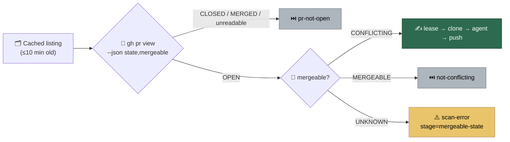

# PR path: re-read state and mergeable before each attempt

## Summary

The claim-point live PR read (Issue #1774) now asks `gh pr view --json
state,mergeable` in the same round trip, so the merge-conflict drain learns
that a PR another host or a human already merged in is no longer conflicting —
and stands down before the lease, the clone and the agent. Closes #2307.

- `worker/deno/lib/pr_branch_update.ts` — `makeGhPrStateFetcher` asks for
  `state,mergeable` (the argv both readers share, so they cannot drift), and
  `parsePrLiveFields` parses that payload into a state and a mergeable verdict.
  It still accepts the bare state string the fetcher used to return, so a `gh`
  stub answering `"OPEN"` keeps working; `classifyPrLiveState` is now that
  parser's `state` half.
- `worker/deno/lib/pr_live_state.ts` — an open `PrLiveStateReading` carries
  `mergeable`. It is **required**, not optional: the argv always asks for it,
  so a construction site that cannot say what GitHub answered should not
  compile. An unrecognised, missing or unparseable verdict reads as `UNKNOWN`,
  never `MERGEABLE`.
- `worker/deno/lib/merge_conflict_drain.ts` — after the existing `pr-not-open`
  skip, a live `MERGEABLE` skips with the existing `not-conflicting` reason and
  an `UNKNOWN` verdict skips with `scan-error` stage `mergeable-state`. Both go
  through `recordConflictDecision`, so the `merge_conflict_pass=` summary counts
  them, and both happen before `acquireLease` — no comment, push or label.

## Evidence

Backend/CLI change with no web interface to screenshot. The evidence is the
test run — `deno test -A tests/merge_conflict_drain_test.ts
tests/pr_live_state_test.ts tests/pr_branch_update_merged_midflight_test.ts`
reports `ok | 54 passed | 0 failed`, and the wider PR-pass suites
(`pr_ci_processor_test.ts`, `pr_feedback_processor_test.ts`,
`auto_merge_sweep_test.ts`, `merge_conflict_drain_fairness_test.ts`,
`merge_conflict_pr_blocked_reachability_test.ts`,
`merge_conflict_decision_taxonomy_test.ts`, `gated_head_passes_test.ts`,
`graft_context_wiring_2103_test.ts`) pass unchanged.

The sharpest test is
`merge_conflict_drain_test.ts::drainConflictingPrs - a live MERGED, CLOSED or
MERGEABLE read writes nothing to the PR`: it wires the drain to the real
`readPrLiveState` over a recording `gh` stub and asserts `prWriteCalls` is
empty — no comment, no label, no push — for all three payloads.

## Acceptance Criteria

<!-- vibe-spec-review inputs="diff+issue-body" -->

- **met** — A PR read live as MERGED, CLOSED or MERGEABLE is skipped before
  `prLiveState`'s successor writes anything; the captured `gh` calls show no
  comment, label or push — evidence:
  `worker/deno/tests/merge_conflict_drain_test.ts::drainConflictingPrs - a live
  MERGED, CLOSED or MERGEABLE read writes nothing to the PR` —
  reviewer: partial — reason: the reviewer saw only MERGED and MERGEABLE in the
  payload loop; CLOSED was added to that loop in this diff after the review.
- **met** — Each skip appears in the pass summary under `pr-not-open`,
  `not-conflicting` or `scan-error` — evidence:
  `worker/deno/lib/merge_conflict_drain.ts` (both skips go through
  `recordConflictDecision`), asserted as `not-conflicting=1` and `scan-error=1`
  on the `merge_conflict_pass=` line in `merge_conflict_drain_test.ts` —
  reviewer: met.
- **met** — `pr_live_state_test.ts`, `merge_conflict_drain_test.ts` cover
  open+CONFLICTING, open+MERGEABLE, unknown mergeable and MERGED — evidence:
  the nine tests listed in the Test Plan below — reviewer: met.
- **met** — `./quality.sh` passes — evidence: full gate run after the final
  edit, `Result: PASSED (with skipped checks)`; `config integration` is the
  environment-dependent skip the gate always reports here —
  reviewer: missing — reason: the reviewer is read-only and recorded the
  criterion as "unverified — not run (read-only review)"; the gate was run in
  this session.
- **unrequested** — `isPrLiveStateRead` rewritten to compare the `--json` field
  list — reviewer: unrequested — reason: the argv changed, so the predicate had
  to. The reviewer caught that my first version matched *any*
  `pr view --json state,…`, which would have made the mock fleet answer the
  `state,mergedAt` and `state,headRefName` lookups; it now matches this read's
  own field list only, pinned by
  `pr_live_state_test.ts::isPrLiveStateRead - recognises this read's own argv,
  and nothing else`.
- **unrequested** — `parsePrLiveFields` / `PrLiveFields` / `PrLiveMergeable`
  exported from `pr_branch_update.ts`, including the bare-state back-compat
  shape — reviewer: unrequested — reason: the issue asked for the branch-update
  parser to be updated and both readers to share the argv; one parser returning
  both fields is how they share it, and the legacy shape keeps ~40 `gh`
  fixtures answering `"OPEN"` valid instead of rewriting them.
- **unrequested** — `OPEN_CONFLICTING_PR_PAYLOAD` used by the mock fleet
  (`issue_worker_wiring.ts`) and `openPrGh` — reviewer: unrequested — reason:
  the mock fleet answers this read and had to learn the new payload; sharing
  one constant removes the second source of truth both reviewers flagged.
- **unrequested** — docs beyond `merge-conflicts.md`: `docs/INTERNALS.md`,
  `docs/workflows/pr-feedback.md` and a note on
  `docs/audits/security-sweep-1774-pr-live-state.md` — reviewer: unrequested —
  reason: all three documented the old `--json state --jq .state` argv, and a
  code change owes a docs change on every surface naming it.

## Standards Review

<!-- vibe-standards-review inputs="diff+CODING-STANDARDS.md" -->

- **violation** — the #1774 security sweep still documented
  `--json state --jq .state` and "only the literal `OPEN` produces `open: true`"
  — evidence: `docs/audits/security-sweep-1774-pr-live-state.md:20` — reason:
  fixed here with a scoped note recording the new argv and parser, leaving the
  audit's original findings intact.
- **violation** — the stub's module header still said `--json state` while its
  own `recordingStateGh` doc described the new payload — evidence:
  `worker/deno/tests/support/pr_live_state_stub.ts:4` — reason: fixed here.
- **violation** — `isPrLiveStateRead` is exported and was rewritten, but had no
  test of its own — evidence: `worker/deno/lib/pr_live_state.ts:82` — reason:
  fixed here; the new test covers both accepted field lists, four rejected
  ones, a missing field list and a missing `--json`.
- **violation** — no `docs/archive/pr-summaries/pr-summary-2307.md` —
  evidence: the reviewer ran against the first commit — reason: fixed here;
  this file is it.
- **clean** — Australian English throughout; fail-loud behaviour (an
  unparseable payload is `UNKNOWN`/`UNKNOWN`, never open or mergeable, and the
  drain records a decision rather than guessing); log levels unchanged and
  routed through `recordConflictDecision`; new tests call real functions and
  assert on returned decisions, none inspect source text; no existing test
  removed or weakened; no hidden paths staged; Deno-native tooling only.

## Test Plan

Added:

- `worker/deno/tests/pr_live_state_test.ts`
  - `readPrLiveState - an open PR reads as open, with its mergeable verdict`
    (also pins the new argv)
  - `readPrLiveState - a PR that merges cleanly reads as open and MERGEABLE`
  - `readPrLiveState - an unreadable mergeable is unknown, never mergeable`
  - `readPrLiveState - an unparseable payload is never open`
  - `isPrLiveStateRead - recognises this read's own argv, and nothing else`
- `worker/deno/tests/merge_conflict_drain_test.ts`
  - `drainConflictingPrs - a PR that no longer conflicts is skipped before the
    lease`
  - `drainConflictingPrs - an unknown mergeable skips the PR without spending
    its budget`
  - `drainConflictingPrs - a live MERGED, CLOSED or MERGEABLE read writes
    nothing to the PR`
- `worker/deno/tests/pr_branch_update_merged_midflight_test.ts`
  - `classifyPrLiveState - reads the state out of the state,mergeable payload`
  - `parsePrLiveFields - both fields, in either payload shape`

Modified (fixture shape only, no assertion weakened): the `{ open: true }`
readings in `merge_conflict_drain_test.ts`,
`merge_conflict_drain_fairness_test.ts`,
`merge_conflict_pr_blocked_reachability_test.ts` and `auto_merge_sweep_test.ts`
now state their `mergeable`, because the open reading requires it;
`makeGhPrStateFetcher - asks gh for state and mergeable…` was renamed from
`…asks gh for the PR's state…` and now pins the new argv and payload.
