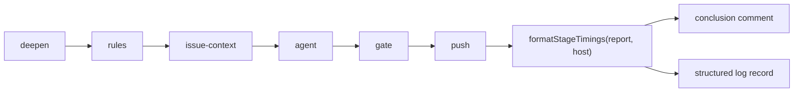

# Stage timings and host on every merge-conflict attempt

## Summary

A conflict attempt routinely runs for twenty to thirty minutes, and the only
record of where that time went was the wall-clock gap between two log lines.
This adds the breakdown. Closes #2308.

New `worker/deno/lib/conflict_stage_timer.ts` is a pure timer over an injected
clock: `start(stage)`, `stop()` and `report()` over the fixed union
`deepen | rules | issue-context | agent | gate | push`, plus a
`formatStageTimings(report, host)` renderer and one `currentHost()` seam. A
stage started and never stopped reports `unfinished` rather than a
plausible-looking duration — an attempt that died inside the agent is exactly
the case these timings exist to show.

Both conflict paths time their stages and account for them:

- **PR path** (`pr_merge_conflict_processor.ts`) — the resolved and failed
  conclusion comments carry the line, and one structured log record carries the
  same host and stages. An attempt the run ended under the agent concludes on no
  comment at all, so its breakdown lands in the log.
- **Milestone path** (`milestone_conflict_ladder.ts`, `git_pull.ts`,
  `milestone_sync_conflict.ts`) — the ladder times its `rules` and `agent`
  rungs, the sync times `deepen`, `gate` and `push`, and the line lands on both
  sync report comments. A repair round runs the resolution agent from inside the
  verification, and those minutes are charged to `agent`, not to `gate`. Every
  exit — the push, the refusal and both escalations — emits the record.



## Evidence

Backend/CLI only — no web interface to screenshot. The evidence is the test
suite and the full quality gate.

`./quality.sh` was run in the foreground with `< /dev/null` and reported PASSED.
The one skipped check is `config integration`, which is environmental and
pre-existing. `deno lint`, `deno check`, `deno fmt`, semgrep and the full Deno
suite all pass.

A rendered line looks like:

```text
Timings (host `mel-01`): deepen 3s · rules 1s · issue-context 4s · agent 212s · push 6s
```

## Acceptance Criteria

<!-- vibe-spec-review inputs="diff+issue-body" -->

- **met** — With a fake clock the timer reports the expected seconds per stage;
  an unstopped stage renders `unfinished`, never disappears — evidence:
  `worker/deno/tests/conflict_stage_timer_test.ts` (exact seconds from an
  injected counter; `agent: null` rendering as `agent unfinished`; a next
  `start` marking the prior stage unfinished) — reviewer: met
- **met** — PR resolved and failed comments carry the timings line with host;
  the structured log record carries the same fields — evidence:
  `worker/deno/tests/pr_merge_conflict_processor_test.ts::processMergeConflict - the resolved comment carries the stage timings and the host (Issue #2308)`,
  `::the structured log record carries the same host and stages (Issue #2308)`,
  `::a failed attempt's conclusion carries the stage timings (Issue #2308)` —
  reviewer: met
- **met** — The milestone sync report comment carries the timings line —
  evidence: `worker/deno/tests/milestone_sync_conflict_report_test.ts` (both the
  "resolved a conflict automatically" notice and the check-what-was-overwritten
  report) — reviewer: partial — reason: the reviewer found the refusal and
  escalation exits dropped the report entirely; they now call `recordTimings()`
  and emit the log record, covered by
  `milestone_sync_gate_repair_test.ts::a refused sync still records where its minutes went (Issue #2308)`.
  Those exits post no sync report comment to carry a line, so the log is their
  sink by design.
- **met** — Tests use the injected clock only — no absolute wall-clock
  assertions — evidence: `conflict_stage_timer_test.ts` and both new ladder
  tests drive a hand-advanced counter; `nowMsFn` seams were added to
  `MergeConflictProcessorDeps` and `syncMilestoneBranchWithDefault` so the two
  integration tests assert exact seconds — five per PR stage, and 360s charged
  to `agent` across a resolution and a repair round — instead of `typeof number`
  — reviewer: partial — reason: the reviewer saw the pre-fix state where those
  two paths ran on `Date.now` with no seam; the seams close it.
- **met** — `./quality.sh` passes — evidence: full gate run after the final
  edit, `Result: PASSED` — reviewer: missing — reason: the reviewer correctly
  predicted `deno lint` would fail on the unused `timedRepairAgent`; that was a
  real defect, fixed here by wiring the wrapper into `runGateWithRepair`, and
  the gate now passes.
- **unrequested** — `docs/audits/security-sweep-2308-conflict-stage-timer.md`
  and the `docs/audits/lib-sweep-coverage.json` entry — reviewer: unrequested —
  reason: the repo requires every module entering `worker/deno/lib/` to be
  claimed by a sweep slice with a written ledger; a new module with no entry
  leaves the coverage audit reporting drift.
- **unrequested** — `docs/archive/handover/issue-2308.md` — reviewer:
  unrequested — reason: written by the worker, not the agent, when the previous
  attempt was SIGTERMed; the repo keeps these handover notes (eleven siblings in
  the same directory), so it is left in place rather than deleted.
- **unrequested** — `MergeConflictProcessorDeps.hostFn` and `nowMsFn`, and the
  `nowMsFn` parameter on `syncMilestoneBranchWithDefault` — reviewer:
  unrequested — reason: the injection seams the "injected clock only" criterion
  needs; all three are optional and default to production behaviour.
- **unrequested** — `formatStageTimings` rendering `no stage was timed` for an
  empty report, and the `Math.max(0, …)` backward-clock clamp — reviewer:
  unrequested — reason: fail-loud direction for the two degenerate inputs, so
  neither can render as a plausible duration.
- **unrequested** — two timing tests in
  `worker/deno/tests/milestone_conflict_ladder_test.ts` — reviewer: unrequested
  — reason: the ladder is where `rules` and `agent` are timed on the milestone
  path; no criterion names the file, but leaving it untested would leave half
  that path uncovered.

## Standards Review

<!-- vibe-standards-review inputs="diff+CODING-STANDARDS.md" -->

- **violation** — dead code: `timedRepairAgent` built and never used, so a
  repair round's minutes were charged to `gate` and `deno lint`'s
  `no-unused-vars` failed — evidence: `worker/deno/lib/git_pull.ts:1177` —
  reason: fixed here; `runGateWithRepair` now receives the wrapper.
- **violation** — `docs/workflows/milestones.md` documented repair-round
  attribution the code did not have — evidence:
  `docs/workflows/milestones.md:397` — reason: the code now matches the
  documentation, and a paragraph was added for the refusal exits.
- **violation** — the regression test named for that behaviour could not fail on
  it (stage order only, no injected clock) — evidence:
  `worker/deno/tests/milestone_sync_gate_repair_test.ts:548` — reason: rewritten
  to inject a clock and assert `agent 360s` / `gate 0s`; verified red against
  the unwired code and green after.
- **violation** — `docs/workflows/merge-conflicts.md` overstated the PR path —
  three conclusion routes carried no timings — evidence:
  `docs/workflows/merge-conflicts.md:789` — reason: the cut-short route (the
  twenty-minute agent case) now logs its breakdown and the prose says so; the
  ruleset-refusal and no-common-ancestor routes are named as out of scope for
  this issue, which specifies `buildResolvedComment` and `buildFailedComment`.
- **violation** — `sweptAt` pointed at the parent of the commit that added the
  module, so the coverage audit would report it as added since the sweep —
  evidence: `docs/audits/lib-sweep-coverage.json:1786` — reason: repointed at
  `a78fba3d`, the commit that added `conflict_stage_timer.ts`.
- **violation** — `assertEquals(currentHost(), getHostname())` reads as a
  delegation assertion — evidence:
  `worker/deno/tests/conflict_stage_timer_test.ts:188` — reason: stands. It
  calls both real functions and compares their values rather than inspecting a
  body or grepping source, and it is the assertion that stops a private hostname
  copy from letting two records of one run name different hosts.
- **clean** — Australian English throughout; no hidden paths staged; every test
  calls real code (no source greps); every new export carries a doc comment with
  `@param`/`@returns`; DRY (one `buildStageTimingSection` for both PR comments,
  one `recordTimings` closure for every milestone exit, one `currentHost` seam
  for both paths); fail-loud (`unfinished`, `no stage was
  timed`,
  backward-clock clamp, nothing caught and discarded); all new API is optional
  and additive.

## Test Plan

Added:

- `worker/deno/tests/conflict_stage_timer_test.ts` — the timer over an injected
  clock: per-stage seconds, accumulation across re-starts, `unfinished` for a
  stage never stopped and for one still running, the rendered line, the empty
  report, the backward clock, and the `currentHost` seam.
- `pr_merge_conflict_processor_test.ts` — resolved comment carries the line and
  host; failed comment carries it; the structured log record carries the same
  host and stages with five injected seconds each; the builders omit the block
  when there is nothing to show; an attempt the run ended still logs its
  breakdown.
- `milestone_sync_conflict_report_test.ts` — both sync report shapes carry the
  line.
- `milestone_conflict_ladder_test.ts` — the ladder times its `rules` and `agent`
  rungs, and a failed agent rung still reports the time it cost.
- `milestone_sync_gate_repair_test.ts` — a repair round's minutes are charged to
  `agent` and not to `gate` (verified red against the unwired code); a refused
  sync still emits its timings record.

No existing test was removed or weakened. Full suite green via `./quality.sh`.
