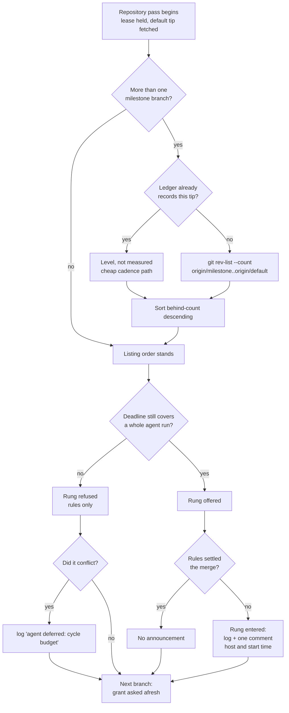

# Milestone sync: agent rung for every behind branch, longest-behind first, announced

## Summary

The Priority 1.72 milestone sync used to latch its conflict-agent rung: the
first branch that held it spent the cycle's only grant, and every other behind
branch was refused a rung the budget could still have covered. This removes the
latch, orders each repository's pass longest-behind first, and makes a running
attempt visible to whoever is watching the milestone. Closes #2309.

Three changes:

1. **No latch.** `grantAgentRun` is asked per branch against the deadline that
   is actually left, so a second conflicting branch is refused only by the
   24-minute floor (`DEFAULT_MIN_MS_PER_CONFLICT_ATTEMPT` plus
   `DEFAULT_CONFLICT_ATTEMPT_OVERHEAD_MS`), never by a latch. A refused branch
   still concludes `agent deferred: cycle budget` rather than a charged failure.
2. **Longest behind first.** Before a repository's branches are synced, each
   one's behind count is measured against the default tip the pass just fetched
   and they are synced behind-count descending. A branch the ledger already
   records against that tip is level by construction and is not measured, so an
   idle cycle pays nothing for an order it will not use. The cross-repo cursor
   (Issue #2215) and the per-repo lease (Issue #2030) are untouched — the order
   is decided within each repository's pass, which is where the fetch and the
   lease already are.
3. **A running attempt says so.** When the rung is genuinely entered — not
   merely offered — the sweep logs one line and posts one comment on the
   milestone's escalation target naming the host and the ISO start time, keyed
   on the ledger's `attemptOpenedAt` so one opened attempt is announced once.

## Evidence

Backend/CLI change with no web interface to screenshot. The evidence is the
test suite: 108 tests across the six milestone-sync suites, and the full
`./quality.sh` gate.

```text
deno test tests/milestone_branch_sync_test.ts tests/milestone_sync_cadence_test.ts \
  tests/milestone_sync_announcement_test.ts tests/milestone_sync_claim_test.ts \
  tests/milestone_gate_repair_prompt_test.ts tests/milestone_behind_count_test.ts \
  tests/milestone_presync_test.ts
ok | 108 passed | 0 failed
```

`./quality.sh` → `Result: PASSED (with skipped checks)` (only `config
integration`, which is skipped in this environment as normal).

How one repository's pass now runs:



## Acceptance Criteria

<!-- vibe-spec-review inputs="diff+issue-body" -->

- **met** — Two behind branches in one cycle both receive the agent rung when
  the deadline covers both; the second is refused only by the floor, never by a
  latch — evidence:
  `worker/deno/tests/milestone_branch_sync_test.ts::syncMilestoneBranches - a deadline covering two runs grants both, and only the conflicting one logs the deferral (Issue #2309)`,
  `::syncMilestoneBranches - the second branch is refused only once the deadline no longer covers a run (Issue #2309)`,
  `worker/deno/tests/milestone_sync_cadence_test.ts::syncMilestoneBranches - both behind branches are offered the agent rung in one cycle (Issue #2309)`
  — reviewer: partial — reason: the reviewer found both positive tests ran with
  no `deadlineEpochMs` at all, so the bounded case the criterion names was never
  exercised; the bounded two-run test above was added in response and the
  criterion is now met.
- **met** — Within a repo, a branch 5 behind is synced before one 1 behind —
  evidence:
  `worker/deno/tests/milestone_branch_sync_test.ts::syncMilestoneBranches - a repository's branches are synced longest behind first (Issue #2309)`
  and the pure
  `::orderMilestonesByBehind - sorts by behind count and keeps the listing order otherwise (Issue #2309)`
  — reviewer: met
- **met** — Exactly one announcement comment per opened attempt, naming host and
  start time; none for a rules-only merge; none twice for the same
  `attemptOpenedAt` — evidence:
  `worker/deno/tests/milestone_branch_sync_test.ts::syncMilestoneBranches - an entered agent rung is announced once, naming host and start time (Issue #2309)`,
  `::syncMilestoneBranches - a merge the rules settle announces nothing (Issue #2309)`,
  `::syncMilestoneBranches - an attempt already announced is not announced again (Issue #2309)`,
  the four tests in `worker/deno/tests/milestone_sync_announcement_test.ts`, and
  `worker/deno/tests/milestone_gate_repair_prompt_test.ts::bindMilestoneConflictAgent - entering the rung announces once, and a repair announces nothing (Issue #2309)`
  — reviewer: met
- **met** — Sibling-host claim skip (`DEFAULT_SYNC_CLAIM_TTL_MS`) unchanged —
  evidence: `worker/deno/tests/milestone_sync_claim_test.ts` is untouched by the
  diff and green (4 tests) — reviewer: met
- **met** — `./quality.sh` passes — evidence: full gate run after the final
  edit, `Result: PASSED (with skipped checks)` — reviewer: met
- **met** — Docs updated (`docs/workflows/milestones.md`; `docs/USAGE.md` only
  if it mentions one rung per cycle) — evidence:
  `docs/workflows/milestones.md:241` (pass order) and the new paragraph under
  "Running beside issue work" — reviewer: met — reason: the reviewer confirmed
  `docs/USAGE.md`'s priority 1.72 entry is a bare mermaid node with no
  one-rung-per-cycle wording, so the conditional bullet does not apply and it is
  correctly left alone.
- **unrequested** — `docs/INTERNALS.md` ladder section rewritten (the
  `agent deferred` table row, "Every behind branch is offered the agent rung",
  "Longest behind first", "A running attempt says so") — reviewer: unrequested —
  reason: the issue's Docs bullet named only `milestones.md` and `USAGE.md`, but
  INTERNALS.md documented the removed latch in three places; leaving it would
  have been documentation drift the repo's own "a code change owes a docs
  change" standard forbids.
- **unrequested** — `docs/audits/lib-sweep-coverage.json` gains
  `milestone_sync_announcement.ts` and `milestone_behind_count.ts` — reviewer:
  unrequested — reason: the repo's completeness check requires every new
  `lib/` module to be listed; the gate fails without it.
- **unrequested** — `orderMilestonesByBehind` and `MeasuredMilestone` exported
  from `milestone_branch_sync.ts`, and `hostFn` / `announceAgentAttemptFn` added
  to `MilestoneBranchSyncDeps` — reviewer: unrequested — reason: injected test
  seams matching the module's existing style; the sort is otherwise a pure
  function with no reachable test, and the announcement would need a live `gh`.
- **unrequested** — `worker/deno/lib/milestone_behind_count.ts` extracted from
  the production wiring — reviewer: unrequested — reason: raised by the
  standards reviewer as untested error paths; the measurement's two failure
  branches are unreachable from a test while they live inside
  `run_core_production_deps.ts`.
- **unrequested** — the measurement is skipped for a branch already recorded
  against the current default tip — reviewer: unrequested — reason: the spec
  reviewer found the measurement made an otherwise idle cycle pay a fetch per
  branch; this restores the issue's own "a 0-behind branch keeps today's cheap
  path".

Two further reviewer findings were assessed and stand, with reasons:

- The measurement costs a `git fetch` as well as the `rev-list` the issue named.
  It stands: Issue #211 established that a narrowed clone never creates
  `origin/<milestone>` from a bare branch fetch, so the count has no ref to read
  without it. It now runs only for branches that are not already at the tip.
- The announcement names `currentHost()` while the sync claim ref names
  `getWorkerUniqueId(config.workerName)`, so the two strings differ. It stands:
  the issue specifies `currentHost()` explicitly ("The host string comes from
  the timings sub-issue's `currentHost()` seam").
- With no `deadlineEpochMs` the pass is unbounded and the removed latch was the
  only cap. It stands: `HandlerExecuteOptions.deadlineEpochMs` is a required
  field and `run_core.ts:2930` always supplies it, so no production path reaches
  the unbounded case.

## Standards Review

<!-- vibe-standards-review inputs="diff+CODING-STANDARDS.md" -->

- **violation** — `milestone_branch_sync.ts` contradicted itself: the WARNING
  said an unmeasurable branch "keeps its place" while the sort demotes it to
  level — evidence: `worker/deno/lib/milestone_branch_sync.ts:505` (and the same
  wording in `docs/INTERNALS.md` and `docs/workflows/milestones.md`) — reason:
  fixed here; all three now say it sorts as level and is still synced, which is
  what the code does.
- **violation** — the two `orderRepoMilestones` failure branches (a failed
  `Result` and a throwing measurement) had no test — evidence:
  `worker/deno/lib/milestone_branch_sync.ts:498-517` — reason: fixed here,
  `::syncMilestoneBranches - a measurement that fails or throws still syncs both branches (Issue #2309)`.
- **violation** — the production behind-count closure's fetch-failure mapping
  had no test and was unreachable from one — evidence:
  `worker/deno/lib/run_core_production_deps.ts:5352-5385` — reason: fixed here by
  extracting `worker/deno/lib/milestone_behind_count.ts`, covered by six tests.
- **violation** — an earlier commit subject on this branch carries no issue
  reference — evidence: commit `0aa73576` — reason: stands; rewriting pushed
  history is the irreversible action the guidelines say to avoid over a
  cosmetic subject line, and the branch's other commits carry it.
- **clean** — Australian English throughout; WARNING reserved for
  degraded-but-continuing conditions and INFO for expected deferrals; no
  swallowed errors (a failed announcement returns `false` so the ledger is not
  marked announced, and the merge continues by design); `Result<T>` and injected
  seams rather than ambient state; module/test pairing and the `lib/` coverage
  manifest; no hidden or credential-shaped paths staged; no source-grepping
  tests, wall-clock sleeps or absolute timing assertions; `announcedAttemptAt`
  is an added optional field, so the ledger contract stays additive.

## Test Plan

Added:

- `worker/deno/tests/milestone_behind_count_test.ts` — 6 tests for the extracted
  measurement: the fetch/count argv and direction, a fetch that could not run, a
  non-zero fetch (with and without stderr), a count git refused, and a level
  branch reporting zero rather than a failure.
- `worker/deno/tests/milestone_sync_announcement_test.ts` — 4 tests: the comment
  wording, the post, a milestone with nowhere to post, and a post that failed.
- `worker/deno/tests/milestone_branch_sync_test.ts` — every-branch-gets-a-rung,
  the bounded two-run deadline, the floor refusal (now asserting the deferral
  line), a clean late merge that must *not* report a deferral, longest-behind
  ordering, the pure sort, the cheap-path measurement skip, a measurement that
  fails or throws, and the three announcement cases.
- `worker/deno/tests/milestone_sync_cadence_test.ts` — both behind branches
  offered the rung in one cycle.
- `worker/deno/tests/milestone_gate_repair_prompt_test.ts` — the rung announces
  once and a gate repair announces nothing; a refused grant binds no rung.

Modified: `milestone_branch_sync_test.ts`'s two Issue #1778 latch tests were
repurposed rather than deleted — they previously asserted the latch's
spend/refund behaviour, which no longer exists. They now assert the behaviour
that replaces it: a merge that failed after the agent ran does not deny the next
branch, and a clean merge leaves the next branch its own rung. This is the
business-logic change the issue asked for, documented here as the standards
require.

Unchanged and green: `worker/deno/tests/milestone_sync_claim_test.ts`.
