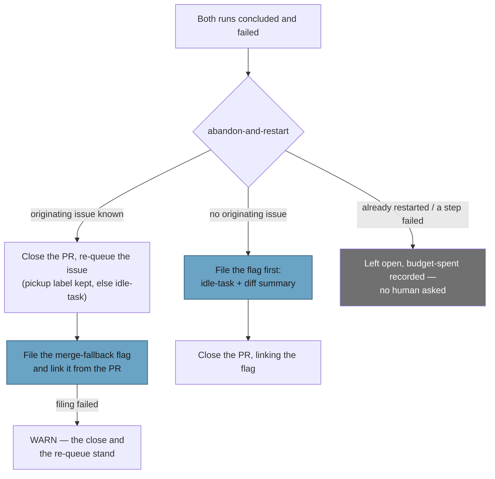

# PR path fallback: file the merge-fallback flag, close without needs-human

## Summary

The merge-conflict **scan**'s spent-budget branch is now fully automatic. It
closes and re-queues as before, files the one `merge-fallback` flag issue that
records why, closes a PR whose originating issue cannot be found instead of
parking it for a human, and applies `needs-human` for no conflict outcome at
all. Closes #2310.

- `worker/deno/lib/pr_merge_conflict_scan.ts` — after a successful abandon,
  `recordConflictFallbackFlag` files the flag with the conflicted files, both
  runs' analyses, each run's stage timings and host, `behind_by` and the
  `merge-conflict` `labeled` event, and what was closed; the flag's number is
  posted back on the PR. `escalateConflictingPr` is gone from this route,
  together with `buildExhaustedEscalationReason` and
  `EXHAUSTED_CONFLICT_NEXT_STEP`. A declined or failed rung records
  `budget-spent` with the route (and the step) at WARN and leaves the PR open.
- `worker/deno/lib/conflict_abandon_restart.ts` — `no-originating-issue` no
  longer declines. The flag is filed **first**, carrying `idle-task` and the PR's
  diff summary, and only then is the PR closed; `AbandonRestartOutcome` carries
  `flagIssueNumber`, and `issueNumber` is that flag, because it is the re-do
  item. A flag that cannot be filed — or whose number cannot be read — leaves
  the PR open naming the new `fallback-flag` step.
- New `worker/deno/lib/conflict_fallback_context.ts` — parses the timings line
  back off a conclusion comment, reads `behind_by` and the label's `labeled`
  event, and reads the diff summary (capped at 200 paths, the excess counted).
  Every reader is best-effort and never silent: a failed read WARNs and the flag
  renders `not recorded` rather than a guessed number.
- The disruption bound is untouched: three attempts cut short before any
  conclusion is a *worker* fault and still escalates, and a hand-applied
  `needs-human` is still honoured as a veto.

## Evidence

Backend only — no web interface to screenshot. The evidence is the test suite
and the quality gate.

- `deno test tests/pr_merge_conflict_scan_test.ts tests/conflict_abandon_restart_test.ts tests/conflict_fallback_context_test.ts tests/merge_fallback_issue_test.ts`
  — 154 tests, 0 failed.
- `./quality.sh < /dev/null` run in the foreground: PASSED (the one skipped
  check is `config integration`, which is environmental and pre-existing).
- The first gate run failed on `deno fmt`, and on the sweep-coverage ledger not
  claiming the new module; both are fixed in the second commit
  (`docs/audits/lib-sweep-coverage.json` plus its written record,
  `docs/audits/security-sweep-2310-conflict-fallback-context.md`).

## Reproduction

- **symptom** — a conflicting PR whose budget was spent ended at `needs-human`
  (or, with no findable originating issue, was left open for a human who never
  came), and the fallback left no durable record of the conflict behind
- **status** — `verified` — `findConflictingPr - an exhausted PR with no
  originating issue is closed and flagged (Issue #2310)` and `... an abandoned PR
  leaves one merge-fallback flag behind (Issue #2310)` were both observed failing
  against the unfixed code (the first asserted the old "not closed, escalated"
  behaviour; the second found no filed flag) and pass after the change
- **regression test** —
  `worker/deno/tests/pr_merge_conflict_scan_test.ts::findConflictingPr - an exhausted PR with no originating issue is closed and flagged (Issue #2310)`,
  plus `assertNoNeedsHumanWrites`, which fails against the old `needs-human`
  route on every budget-spent branch

## Acceptance Criteria

<!-- vibe-spec-review inputs="diff+issue-body" -->

- **partial** — Two concluded failures → PR closed, issue re-queued, one
  `merge-fallback` issue filed and linked from the close comment; no
  `needs-human` in the captured `gh` writes — evidence:
  `worker/deno/lib/pr_merge_conflict_scan.ts::recordConflictFallbackFlag`,
  `worker/deno/tests/pr_merge_conflict_scan_test.ts::findConflictingPr - an abandoned PR leaves one merge-fallback flag behind (Issue #2310)`,
  `::findConflictingPr - a spent budget falls back rather than stalling (Issue #2310)`,
  `assertNoNeedsHumanWrites` — reviewer: partial — reason: done on the scan, but
  the reviewer is right that `pr_merge_conflict_processor.ts` — the path that
  normally *sees* the second concluded failure — still escalates and files no
  flag. The issue names only the scan and the abandon rung as the files to
  change, and scopes the processor's parked-PR behaviour to the next sub-issue
  under #2298, so it is left untouched and the docs now say so explicitly rather
  than claiming the whole path. The link also rides a second comment on the PR
  rather than the abandon comment itself, because that comment is posted *before*
  the close as the cross-host restart claim and cannot carry a number that does
  not exist yet; the no-originating-issue route does put the link in its close
  comment.
- **met** — No originating issue → PR closed; the flag carries the diff summary
  and `idle-task` — evidence:
  `worker/deno/lib/conflict_abandon_restart.ts::abandonWithoutOriginatingIssue`,
  `worker/deno/tests/conflict_abandon_restart_test.ts::abandonAndRestart - no originating issue: the PR is closed and the flag is the re-do item (Issue #2310)`,
  `::... an appended flag is labelled idle-task (Issue #2310)`,
  `worker/deno/tests/pr_merge_conflict_scan_test.ts::findConflictingPr - an exhausted PR with no originating issue is closed and flagged (Issue #2310)`
  — reviewer: met — reason: the reviewer found a real hole here on the first
  commit — an *appended* flag gets no labels from the filer, so a second fallback
  on one PR would have closed it against an unqueued flag — and it is fixed and
  tested in the second commit.
- **partial** — A flag-filer failure is logged at WARN and does not stop the
  close/re-queue — evidence:
  `worker/deno/tests/pr_merge_conflict_scan_test.ts::findConflictingPr - a flag that cannot be filed warns and leaves the abandon standing (Issue #2310)`
  — reviewer: partial — reason: true on the re-queue route, where the close has
  already happened. On the no-originating-issue route it is deliberately
  inverted: the flag *is* the re-do item there, so a filing failure returns
  `fallback-flag` and leaves the PR open. Closing against a record nobody can
  find is the loss the old decline existed to prevent, so that route fails loud
  instead.
- **met** — Regression tests in both files for each branch, including one that
  fails against the old `needs-human` route — evidence: 9 new and 5 rewritten
  tests across `conflict_abandon_restart_test.ts` and
  `pr_merge_conflict_scan_test.ts`; `assertNoNeedsHumanWrites` is the one that
  fails against the old route — reviewer: met
- **met** — `./quality.sh` passes — evidence: full gate run in the foreground
  after the final edit — reviewer: missing — reason: the reviewer ran it against
  the first commit, where `deno fmt` and the sweep-coverage ledger were red; both
  are fixed in the second commit and the gate was re-run green here.
- **unrequested** — `MergeFallbackStageTiming.seconds` widened to `number | null`
  with `unfinished` rendering — reviewer: unrequested — reason: the issue asks for
  "each run's timings line" to reach the flag, and `formatStageTimings` renders a
  stage that never stopped as `unfinished`; without the widening that stage would
  have been silently dropped from the record.
- **unrequested** — `MERGE_CONFLICT_LABEL` moved to `merge_conflict_markers.ts`
  and re-exported — reviewer: unrequested — reason: the issue requires reading
  that label's `labeled` event from a module the scan imports, which is a cycle
  while the constant lives in the scan. No importer's path changed.
- **unrequested** — new module `conflict_fallback_context.ts` and its test file —
  reviewer: unrequested — reason: the issue requires three new reads; putting
  them in either caller would have deepened the cycle the label move avoids.
  Cost: its own sweep-ledger slice, added here.
- **unrequested** — the `SAFE_REF` guard on the compare path — reviewer:
  unrequested — reason: the issue's `gh api …/compare/<base>...<head>` is the
  first place a branch name reaches an API path in this family; validating it is
  the secure-coding standard, not a feature.
- **unrequested** — the `fallback-flag` step and the "unreadable flag number
  leaves the PR open" gate — reviewer: unrequested — reason: the issue removes the
  old "no issue, no abandon" refusal; something has to hold the invariant it was
  protecting, and this is the narrowest form of it.
- **unrequested** — the declined/failed `budget-spent` route now writes nothing to
  GitHub, where it previously wrote one comment, and such a PR re-runs the rung
  each pass rather than being skipped — reviewer: unrequested — reason: the issue
  says to remove the `escalateConflictingPr` call, and that call was both the
  label and the comment. The parked-PR behaviour that replaces the quiet skip is
  explicitly the next sub-issue under #2298.
- **unrequested** — doc edits to `docs/MERGE.md` and `docs/workflows/README.md` —
  reviewer: unrequested — reason: both assert the behaviour this change alters
  ("only then does a human hear about it"), and the standards require the docs to
  follow the code.

## Standards Review

<!-- vibe-standards-review inputs="diff+CODING-STANDARDS.md" -->

- **violation** — `deno fmt --check` red on the committed state — evidence:
  `worker/deno/tests/conflict_abandon_restart_test.ts:737` — reason: fixed in the
  second commit; `deno fmt --check` is clean over all 2,726 files.
- **violation** — the new `lib/` module was claimed by no sweep slice — evidence:
  `worker/deno/lib/conflict_fallback_context.ts:1` — reason: fixed —
  `docs/audits/lib-sweep-coverage.json` gains `top-up-2310`, with its written
  record in `docs/audits/security-sweep-2310-conflict-fallback-context.md`.
- **violation** — no PR summary file — evidence:
  `docs/archive/pr-summaries/pr-summary-2310.md` — reason: this file.
- **violation** — the "no conflict outcome asks a person" claim was overbroad
  while the processor still escalates — evidence:
  `DESIGN-PRINCIPLES.md:274`, `docs/MERGE.md:853`,
  `docs/workflows/merge-conflicts.md:1061` — reason: fixed — every one of those
  claims is now scoped to the scan and names the processor's remaining
  escalation as the next sub-issue under #2298.
- **violation** — fail-loud: an unreadable flag number was swallowed on the
  re-queue route — evidence: `worker/deno/lib/pr_merge_conflict_scan.ts:1079` —
  reason: fixed — it now WARNs naming the URL, and a test asserts the line.
- **violation** — DRY: the filer adapter was duplicated verbatim in both routes —
  evidence: `worker/deno/lib/pr_merge_conflict_scan.ts:1016`,
  `worker/deno/lib/conflict_abandon_restart.ts:1181` — reason: fixed — one
  `createFallbackFlagFiler` in `merge_fallback_issue.ts`, tested.
- **violation** — positional coupling: two filters over the thread paired by
  array index — evidence:
  `worker/deno/lib/conflict_abandon_restart.ts:272` — reason: fixed —
  `summariseFailedAttempts` carries the parsed timings on each attempt and
  `mergeFallbackRunsFromHistory` reads them from there, so the second pass is
  gone.
- **violation** — a seam nothing supplies (`timelineCache`) — evidence:
  `worker/deno/lib/conflict_fallback_context.ts:134` — reason: fixed — removed.
- **violation** — new public functions without their own tests
  (`buildFallbackFlagLinkComment`, `buildNoIssueAbandonPrComment`) — evidence:
  `worker/deno/lib/pr_merge_conflict_scan.ts:1083`,
  `worker/deno/lib/conflict_abandon_restart.ts:1017` — reason: fixed — three
  branches of the link comment and two of the close comment are now tested
  directly.
- **violation** — the designed success path of the no-originating-issue route
  logs at WARN — evidence: `worker/deno/lib/conflict_abandon_restart.ts:1238` —
  reason: stands. It matches the sibling abandon's own WARN a few lines below,
  which this change does not touch; a fallback that closes a PR is not the
  common case, and splitting the pair's levels would make the two halves of one
  rung read differently.
- **violation** — file size: both touched modules grew past 1,500 lines, and the
  added material would sit in its own module — evidence:
  `worker/deno/lib/conflict_abandon_restart.ts`,
  `worker/deno/lib/pr_merge_conflict_scan.ts` — reason: stands. A third new
  module needs its own sweep-ledger slice and record, and
  `recordConflictFallbackFlag` belongs beside the pass that decides to file it;
  the DRY half of the finding is fixed instead by the shared filer.
- **clean** — Australian English throughout; every outbound string sanitised
  through `sanitiseIssueText`; `SAFE_REF` plus the `..` check on the only
  interpolated API path; three anchored, bounded patterns with no nested groups;
  shape-checked JSON with a counted cap; the flag filed strictly before the
  close with that ordering asserted; every test calling real exported functions
  with no source-text greps, sleeps or wall-clock assertions; `deno check`,
  `deno lint` and markdownlint clean; the commit messages carrying the issue
  reference and `Vibe-Coder-Run-Id`; no hidden or credential-shaped path staged.

## Test Plan

Added (`worker/deno/tests/conflict_fallback_context_test.ts`, new — 11 tests):
`parseStageTimingsLine` round-tripping `formatStageTimings`, an `unfinished`
stage, an empty report, a comment with no line; `readPrDivergence` reading
`behind_by` and the label event, leaving a failed read unrecorded and warning,
and refusing a ref that could redirect the compare; `readPrDiffSummary`'s happy
path, its cap and counted remainder, an unparseable response and a `gh` failure.

Added (`conflict_abandon_restart_test.ts`): the no-originating-issue close with
its filing payload, a filing failure and an unreadable number leaving the PR
open, the flag-before-close ordering, the appended flag's `idle-task` label and
its failure, `mergeFallbackRunsFromHistory` with and without a timings line, and
two `buildNoIssueAbandonPrComment` cases.

Added (`pr_merge_conflict_scan_test.ts`): one flag per abandon with its link
comment, the filer payload (runs, timings, host, `behind_by`, no diff summary), a
filing failure warning while the abandon stands, an unreadable flag number, and
`buildFallbackFlagLinkComment`'s three branches.

Added (`merge_fallback_issue_test.ts`): `unfinished` timing rendering, the diff
summary with its omitted count, a diff nobody read rendering no section, a diff
read as empty saying so, and `createFallbackFlagFiler` routing label creation
through the caller's `gh`.

Rewritten, with the behaviour change documented in each test's comment: the five
`pr_merge_conflict_scan_test.ts` tests that asserted a spent budget ends at
`needs-human` (no-originating-issue, the restart bound, a failed abandon step,
the per-step matrix, and the backstop test) now assert the fallback and
`assertNoNeedsHumanWrites`; two of them inject a declining rung so the
`budget-spent` operands stay covered. One
`conflict_abandon_restart_test.ts` test — "no originating issue: nothing is
closed at all" — is replaced by the four tests of the new route, because the
issue reverses exactly the behaviour it pinned.
