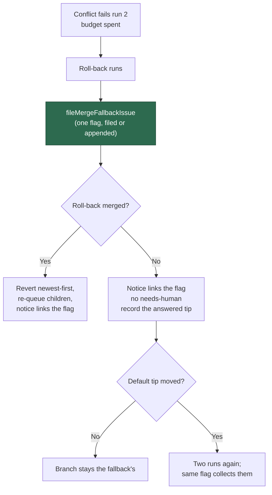

# Milestone fallback: file the merge-fallback flag, no needs-human comment

## Summary

Every milestone roll-back now files (or appends to) the one `merge-fallback`
flag issue and links it from the roll-back notice on the escalation target, and
the milestone conflict path no longer writes `needs-human` anywhere. Closes
#2311.

- `milestone_branch_sync.ts` — `applyRollbackOutcome` files the flag for
  **both** outcomes before anything is reset or re-queued, so the flag reports
  the budget that was actually spent: the milestone and default branch, the
  conflicted files, both runs (host, stage timings, what each made of the
  conflict), how far behind the branch had fallen and since when, and what was
  reverted. The flag number rides into the roll-back notice and the
  could-not-merge notice; a filing that failed is said out loud in the notice
  rather than silently omitted.
- `milestone_rollback_requeue.ts` — a roll-back that could not merge posts one
  notice and applies **no** `needs-human` label. The comment names the flag and
  says the branch is tried again once the default branch moves.
- **The branch is not stranded.** The failed roll-back records the
  default-branch tip it answered for (`fallbackDefaultSha`), and a default tip
  that has moved past it re-arms the two-run budget on the next cycle. Nothing
  else re-armed it — the roll-back is the last automatic step, so without this
  a branch whose roll-back failed would sit out every remaining cycle for ever,
  which is only tolerable if somebody was asked to look, and nobody is any more.
- The repeated-identical-failure escalation of Issue #1964 is removed, along
  with `isRepeatedFailureReason`. The streak escalation
  (`MILESTONE_SYNC_ESCALATION_THRESHOLD`) survives for **non-conflict**
  failures only — a fetch, a push, an ordinary git error.
- New self-heal event `fallback_flagged`, carrying the flag issue number,
  beside `sync_failed` and `rolled_back`.
- Supporting records so the flag has something true to report: the ledger keeps
  every charged run (`failedAttempts`) with its host, timings and per-file
  analysis; a conflict refusal now carries its rendered timings line
  (`MilestoneConflictEscalation.timings`); `parseStageTimings` reads a rendered
  line back beside the formatter that writes it; and
  `MergeFallbackStageTiming.seconds` accepts `null` so an unfinished stage
  renders `unfinished` rather than as a duration.

## Evidence

Backend/worker change with no web interface to screenshot. Evidence is the
test suite: the targeted files below, plus the full milestone/conflict sweep
(`deno test -A tests/*milestone*.ts tests/*merge_fallback*.ts
tests/*conflict*.ts tests/git_pull*.ts`) — **1648 passed, 0 failed**.

## Reproduction

- **symptom** — a milestone conflict that spent its budget ended in a
  `needs-human` label and comment on the escalation target, and the conflict
  itself was recorded nowhere durable
- **status** — `verified` — with `lib/milestone_rollback_requeue.ts` reverted to
  its pre-fix state the four Issue #2311 tests failed on their assertions (the
  comment still read `needs-human`, and no flag was linked); they pass against
  the fixed module. The flag-filing half of the change could only be driven red
  as a module-load failure against the unfixed sync, because the ledger fields
  it reports did not exist there.
- **regression test** —
  `worker/deno/tests/milestone_rollback_requeue_test.ts::escalateRollbackFailure - one notice on the parent, no needs-human, and a second call posts nothing (Issues #1781, #2311)`

## Acceptance Criteria

<!-- vibe-spec-review inputs="diff+issue-body" -->

PLACEHOLDER

## Standards Review

<!-- vibe-standards-review inputs="diff+CODING-STANDARDS.md" -->

PLACEHOLDER

## Test Plan

Added:

- `tests/milestone_branch_sync_test.ts` — the successful roll-back files
  exactly one `merge-fallback` issue, emits `fallback_flagged`, links the flag
  from the notice and writes no `needs-human`; the roll-back that could not
  merge files the flag, writes no `needs-human`, records the answered tip, is
  not retried against an unmoved tip, and **is** retried once the default tip
  moves.
- `tests/milestone_sync_repeat_escalation_test.ts` — rewritten for Issue #2311:
  a conflict repeating over four cycles writes no `needs-human` and posts no
  comment; a persistent fetch failure still escalates once at the threshold and
  only once; a success clears the streak.
- `tests/milestone_sync_streak_test.ts` — every charged run is kept with host,
  timings and analysis; the list is capped at the budget; a success drops the
  spent runs and the fallback tip; both round trip through save/load, dropping
  a malformed row.
- `tests/conflict_stage_timer_test.ts` — `parseStageTimings` reads back every
  stage a rendered line carries (including `unfinished`), and invents nothing
  from an untimed report or unreadable text.
- `tests/merge_fallback_issue_test.ts` — an unfinished stage renders
  `unfinished`, never as a duration.
- `tests/milestone_rollback_requeue_test.ts` — the failed-roll-back comment
  names the flag and carries no `needs-human`; a flag that could not be filed
  is said out loud; the notice links the flag.
- `tests/milestone_sync_conflict_escalation_test.ts` — a conflicting merge's
  captured `gh` writes contain no `needs-human`.

Changed (documented business-logic changes, no test removed to make a suite
green):

- `milestone_rollback_requeue_test.ts` — `buildRollbackFailedComment` and
  `escalateRollbackFailure` previously asserted a `needs-human` body and label;
  both now assert the flag link and the absence of `needs-human`, which is the
  behaviour this issue asks for.
- `milestone_sync_repeat_escalation_test.ts` — the Issue #1964
  second-occurrence escalation it pinned no longer exists, so its tests were
  replaced (including the `isRepeatedFailureReason` unit test, whose function
  was deleted with the trigger).
