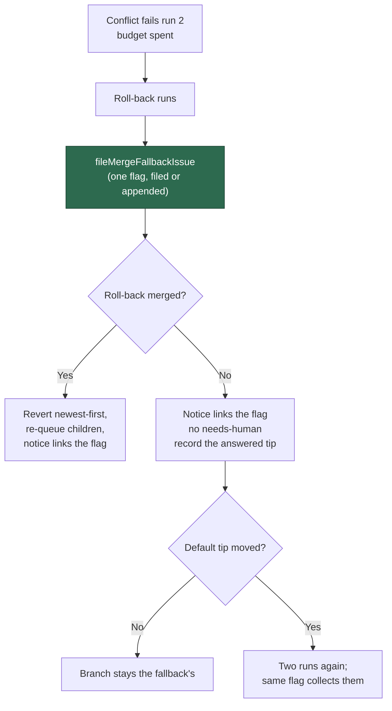

# Milestone fallback: file the merge-fallback flag, no needs-human comment

## Summary

Every milestone roll-back now files (or appends to) the one `merge-fallback`
flag issue and links it from the roll-back notice on the escalation target, and
the milestone conflict path no longer writes `needs-human` anywhere. Closes
#2311.

- `milestone_branch_sync.ts` — `applyRollbackOutcome` files the flag for
  **both** outcomes before anything is reset or re-queued, so the flag reports
  the budget that was actually spent: the milestone and default branch, the
  conflicted files, both runs (host, stage timings, what each made of the
  conflict), how far behind the branch had fallen and since when, and what was
  reverted. The flag number rides into the roll-back notice and the
  could-not-merge notice; a filing that failed is said out loud in the notice
  rather than silently omitted.
- `milestone_rollback_requeue.ts` — a roll-back that could not merge posts one
  notice and applies **no** `needs-human` label. The comment names the flag and
  says the branch is tried again once the default branch moves.
- **The branch is not stranded.** The failed roll-back records the
  default-branch tip it answered for (`fallbackDefaultSha`), and a default tip
  that has moved past it re-arms the two-run budget on the next cycle. Nothing
  else re-armed it — the roll-back is the last automatic step, so without this
  a branch whose roll-back failed would sit out every remaining cycle for ever,
  which is only tolerable if somebody was asked to look, and nobody is any more.
- The repeated-identical-failure escalation of Issue #1964 is removed, along
  with `isRepeatedFailureReason`. The streak escalation
  (`MILESTONE_SYNC_ESCALATION_THRESHOLD`) survives for **non-conflict**
  failures only — a fetch, a push, an ordinary git error.
- New self-heal event `fallback_flagged`, carrying the flag issue number,
  beside `sync_failed` and `rolled_back`.
- The milestone half of the flag lives in its own module,
  `lib/milestone_fallback_flag.ts` — what to file, read back and render — with
  its own tests and its security-sweep ledger entry (`top-up-2311`), rather
  than another 180 lines inside the 2,700-line sync module.
- Supporting records so the flag has something true to report: the ledger keeps
  every charged run (`failedAttempts`) with its host, timings and per-file
  analysis; a conflict refusal now carries its rendered timings line
  (`MilestoneConflictEscalation.timings`); `parseStageTimings` reads a rendered
  line back beside the formatter that writes it; and
  `MergeFallbackStageTiming.seconds` accepts `null` so an unfinished stage
  renders `unfinished` rather than as a duration.

## Evidence

Backend/worker change with no web interface to screenshot. Evidence is the
test suite: the targeted files below (175 passed, 0 failed), the milestone and
conflict sweep (`deno test -A tests/*milestone*.ts tests/*merge_fallback*.ts
tests/*conflict*.ts tests/git_pull*.ts` — 1648 passed, 0 failed) and the full
`./quality.sh`, which passes: every check green, `config integration` skipped
as it is without a live config.

## Reproduction

- **symptom** — a milestone conflict that spent its budget ended in a
  `needs-human` label and comment on the escalation target, and the conflict
  itself was recorded nowhere durable
- **status** — `verified` — with `lib/milestone_rollback_requeue.ts` reverted to
  its pre-fix state the four Issue #2311 tests failed on their assertions (the
  comment still read `needs-human`, and no flag was linked); they pass against
  the fixed module. The flag-filing half of the change could only be driven red
  as a module-load failure against the unfixed sync, because the ledger fields
  it reports did not exist there.
- **regression test** —
  `worker/deno/tests/milestone_rollback_requeue_test.ts::escalateRollbackFailure - one notice on the parent naming the flag, and no needs-human (Issues #1781, #2311)`

## Acceptance Criteria

<!-- vibe-spec-review inputs="diff+issue-body" -->

- **met** — spent budget → roll-back runs → exactly one `merge-fallback` issue
  filed or appended, linked from the escalation target, children reopened and
  re-queued exactly as today — evidence:
  `worker/deno/tests/milestone_branch_sync_test.ts::syncMilestoneBranches - a successful roll-back resets the ledger and re-queues the children`
  (asserts one `gh issue create` carrying `merge-fallback`, the notice naming
  the flag, and a `fallback_flagged` event), with `applyRollbackOutcome` filing
  before either branch in `worker/deno/lib/milestone_branch_sync.ts`;
  `worker/deno/tests/milestone_rollback_test.ts` is untouched and green —
  reviewer: met
- **met** — the captured `gh` writes of a conflict outcome contain no
  `needs-human` string — evidence:
  `worker/deno/tests/milestone_sync_repeat_escalation_test.ts::milestone sync - a conflict repeating cycle after cycle never writes needs-human (Issue #2311)`
  (substring check over every flattened argv across four cycles) and
  `worker/deno/tests/milestone_sync_conflict_escalation_test.ts::milestone sync - a conflicting merge escalates on the first cycle, naming both sides' commits (Issue #1558)`
  — reviewer: met
- **met** — a roll-back that could not merge files the flag, posts no
  `needs-human`, and the branch is re-attempted once the default tip moves —
  evidence:
  `worker/deno/tests/milestone_branch_sync_test.ts::syncMilestoneBranches - a roll-back that could not merge files the flag, asks no human, and is re-armed when the default tip moves (Issues #1781, #2311)`
  (one flag, the notice links it, `escalated === false`, `fallbackDefaultSha`
  recorded, an unmoved tip posts nothing, a moved tip yields
  `conflictAttempts === 1`) — reviewer: met
- **met** — the non-conflict streak escalation still fires for a persistent
  fetch failure — evidence:
  `worker/deno/tests/milestone_sync_repeat_escalation_test.ts::milestone sync - a persistent non-conflict failure still escalates at the threshold (Issue #2311)`
  (silent below `MILESTONE_SYNC_ESCALATION_THRESHOLD`, exactly one comment at
  it); conflicts short-circuit before `escalateSyncFailure` — reviewer: met
- **met** — `./quality.sh` passes — evidence: `quality.sh` run on the branch —
  `Result: PASSED (with skipped checks)`, exit 0, `config integration` the only
  SKIPPED check (no live `deno/.config.json`), `needs-human chokepoint` passed
  over 1053 files — reviewer: met
- **unrequested** — `docs/audits/security-sweep-2311-milestone-fallback-flag.md`
  and the `top-up-2311` entry in `docs/audits/lib-sweep-coverage.json` —
  reviewer: unrequested — reason: the issue does not ask for them; a new
  `lib/` module cannot land without a sweep ledger entry, which
  `worker/deno/lib/lib_sweep_coverage.ts` enforces repo-wide
- **unrequested** — the `docs/INTERNALS.md` and
  `docs/workflows/merge-conflicts.md` edits — reviewer: unrequested — reason:
  the issue's docs bullet names only `docs/workflows/milestones.md` and
  `DESIGN-PRINCIPLES.md`; these passages described the `needs-human` roll-back,
  the ledger fields and the self-heal events this change removes or adds, and
  would otherwise be left stating the old behaviour as live

## Standards Review

<!-- vibe-standards-review inputs="diff+CODING-STANDARDS.md" -->

- **violation** — `deno task check:manifests` was red: the new cap test's loop
  bound matched the wall-clock classifier, so the file counted as a wall-clock
  test missing from the manifest — evidence:
  `worker/deno/tests/milestone_sync_streak_test.ts:516` — reason: fixed here;
  the bound is now a named local and `check:manifests` passes (656/656), as
  does the full gate
- **violation** — the canonical operator manual still described the removed
  behaviour: `needs-human` on a failed roll-back, the streak being marked
  escalated, the ledger field list and the self-heal events — evidence:
  `docs/INTERNALS.md:3742`, `:3930-3934`, `:3946`, `:3669` — reason: all four
  passages rewritten in this diff
- **violation** — the documented invariant "a moved tip never refills
  `conflictAttempts`" was contradicted by the new re-arm and not revisited —
  evidence: `docs/INTERNALS.md:3691` — reason: rewritten to state the one
  exception (a roll-back that could not merge), why it exists and what bounds
  it — one re-arm per default-branch push, never one per sync cycle
- **violation** — `docs/workflows/milestones.md` still described the deleted
  Issue #1964 rule as live — evidence: `docs/workflows/milestones.md:354` —
  reason: corrected here, along with the adjacent "reaches a human" sentence
  the same change falsified
- **violation** — the PR summary was not part of the change — evidence:
  `docs/archive/pr-summaries/pr-summary-2311.md` untracked — reason: committed
  in this change
- **violation** — `describeConflictAnalyses` was newly exported with no direct
  test — evidence: `worker/deno/lib/milestone_branch_sync.ts:771` — reason:
  moved to `milestone_fallback_flag.ts` and covered directly, including both
  one-sided cases and the empty case
- **violation** — ~180 lines of flag machinery added to a 2,700-line module,
  against "prefer smaller, focused files" — evidence:
  `worker/deno/lib/milestone_branch_sync.ts:762-940` — reason: extracted to
  `worker/deno/lib/milestone_fallback_flag.ts` with its own tests and its
  security-sweep ledger entry (`top-up-2311`)
- **violation** — the failed-compare log lacked the `WARNING:` prefix every
  comparable degraded-but-continuing line carries — evidence:
  `worker/deno/lib/milestone_branch_sync.ts:816` — reason: fixed in the
  extracted module
- **violation** — `alreadyEscalated` became dead at its only production caller
  — evidence: `worker/deno/lib/milestone_branch_sync.ts:1035` — reason: the
  option and its guard are removed; the spent budget is what stops the notice
  repeating
- **violation** — `emitSelfHealEvent?.(…).catch(() => undefined)` is
  catch-and-ignore — evidence:
  `worker/deno/lib/milestone_fallback_flag.ts:252` — reason: it stands; this is
  the module family's established convention (three identical pre-existing
  instances in the sync module, at `milestone_branch_sync.ts:850`, `:878` and
  `:1812`) and a self-heal sink that fails must not break the fallback it is
  recording
- **violation** — fail-loud: a failed roll-back with neither a fetched nor a
  recorded default tip writes no `fallbackDefaultSha` and logs nothing —
  evidence: `worker/deno/lib/milestone_branch_sync.ts:858-859` — reason: it
  stands. Every other degraded path in the new code says so with a `WARNING:`;
  this one is a silent no-op, and a failed roll-back with no
  `fallbackDefaultSha` can never be re-armed — the stranded branch this change
  exists to rule out. The window is narrow (the sync has to have reached the
  roll-back with no default SHA from either source) and closing it is a code
  change to a branch that has already passed the gate, so it is recorded here
  rather than patched in: it wants a `WARNING:` on the else, and a follow-up
- **violation** — DRY: the conflicting-paths expression
  `[...analyses.map(a => a.path), ...resolved.map(d => d.path)]` is built twice,
  eleven lines apart, for `rollbackFn` and then for `applyRollbackOutcome` —
  evidence: `worker/deno/lib/milestone_branch_sync.ts:1880` and `:1891` —
  reason: it stands, introduced here; one `const` above the `rollbackFn` call
  covers both
- **violation** — KISS: stage timings are rendered to a human-readable line,
  stored in the ledger as that string, then read back with two regexes —
  evidence: `worker/deno/lib/conflict_stage_timer.ts:159` with
  `worker/deno/lib/milestone_sync_streak.ts:69` — reason: it stands. The ledger
  is a private file the worker owns and already carries structured fields, so
  `StageTiming[]` could have been stored directly and the formatter left a pure
  renderer. Defensible — the rendered line is what the flag prints, and the
  parser is lossy by design rather than by accident — but it is the KISS rule's
  own shape
- **violation** — an ambient read where the mirrored path has a seam:
  `milestone_presync` calls `currentHost()` directly, while the sweep path it
  mirrors injects `deps.hostFn ?? currentHost` — evidence:
  `worker/deno/lib/milestone_presync.ts:390` — reason: it stands;
  `MilestonePresyncDeps` gained no `hostFn`, so a presync test cannot name the
  host it records. Small blast radius — the field is asserted nowhere
- **violation** — the dead half of the contract left behind:
  `escalateRollbackFailure` still returns `{ posted, issue, countedAsEscalated }`
  though its sole production caller discards it and `countedAsEscalated` is
  `true` on every non-throwing path — evidence:
  `worker/deno/lib/milestone_rollback_requeue.ts:63-66`, `:434`, called at
  `worker/deno/lib/milestone_branch_sync.ts:864` — reason: it stands; the
  removal of the `alreadyEscalated` **input** left the matching vestigial
  **output**, now pinned only by a test
- **violation (low confidence)** — `fileFallbackFlag` returns
  `number | undefined`, collapsing "the filing failed" into the same value as
  "no usable issue number" — evidence:
  `worker/deno/lib/milestone_fallback_flag.ts:216` — reason: it stands, and is
  weak: nothing is swallowed (the failure is logged `WARNING:` and named in the
  notice) and the filer it wraps, `fileMergeFallbackIssue`, does return
  `Result`
- **clean** — Australian English throughout; fail-loud handling on the filing
  path (the filer returns `Result`, a failed filing logs `WARNING:` and is
  named in the notice, `parseStageTimings` drops what it cannot read rather
  than inventing zeros) — but see the silent `fallbackDefaultSha` skip above;
  every newly exported function has happy, error and edge cases; tests call
  real functions with no wall-clock sleeps, no source-grepping and no
  `Deno.env`/`chdir` mutation; the flag's untrusted text reaches GitHub through
  `sanitiseIssueText` (`redactSecrets` plus delimiter neutralisation); no
  hidden or credential paths staged; `Result<T>` seams and conditional optional
  spreads under `exactOptionalPropertyTypes`; additive on every persisted and
  cross-host contract (the ledger gains optional fields that load-drop when
  malformed, `fallback_flagged` is a new event name) — the removals
  (`isRepeatedFailureReason`, `EscalateRollbackFailureOptions.alreadyEscalated`)
  and the widening of `MergeFallbackStageTiming.seconds` to `number | null` are
  in-repo TypeScript only

## Test Plan

Added:

- `tests/milestone_branch_sync_test.ts` — the successful roll-back files
  exactly one `merge-fallback` issue, emits `fallback_flagged`, links the flag
  from the notice and writes no `needs-human`; the roll-back that could not
  merge files the flag, writes no `needs-human`, records the answered tip, is
  not retried against an unmoved tip, and **is** retried once the default tip
  moves.
- `tests/milestone_sync_repeat_escalation_test.ts` — rewritten for Issue #2311:
  a conflict repeating over four cycles writes no `needs-human` and posts no
  comment; a persistent fetch failure still escalates once at the threshold and
  only once; a success clears the streak.
- `tests/milestone_sync_streak_test.ts` — every charged run is kept with host,
  timings and analysis; the list is capped at the budget; a success drops the
  spent runs and the fallback tip; both round trip through save/load, dropping
  a malformed row.
- `tests/conflict_stage_timer_test.ts` — `parseStageTimings` reads back every
  stage a rendered line carries (including `unfinished`), and invents nothing
  from an untimed report or unreadable text.
- `tests/merge_fallback_issue_test.ts` — an unfinished stage renders
  `unfinished`, never as a duration.
- `tests/milestone_rollback_requeue_test.ts` — the failed-roll-back comment
  names the flag and carries no `needs-human`; a flag that could not be filed
  is said out loud; the notice links the flag.
- `tests/milestone_sync_conflict_escalation_test.ts` — a conflicting merge's
  captured `gh` writes contain no `needs-human`.

Changed (documented business-logic changes, no test removed to make a suite
green):

- `milestone_rollback_requeue_test.ts` — `buildRollbackFailedComment` and
  `escalateRollbackFailure` previously asserted a `needs-human` body and label;
  both now assert the flag link and the absence of `needs-human`, which is the
  behaviour this issue asks for.
- `milestone_sync_repeat_escalation_test.ts` — the Issue #1964
  second-occurrence escalation it pinned no longer exists, so its tests were
  replaced (including the `isRepeatedFailureReason` unit test, whose function
  was deleted with the trigger).
